# Capítulo II: Requirements Development and Software Solution Design


## 2.1. Competidores

BetterHelp, Headspace y terapIA compiten en diferentes aspectos del bienestar emocional: la atención psicológica online, el autocuidado y el acompañamiento con inteligencia artificial. SafeDiary se plantea como un puente entre la expresión privada, el apoyo comunitario y la atención profesional. Su propuesta reúne estos espacios en una experiencia móvil dirigida a **pacientes jóvenes** y **psicólogos profesionales**, donde cada persona decide cómo expresarse, cuándo buscar ayuda y qué información compartir.


### 2.1.1. Análisis competitivo

**Competitive Analysis Landscape**

**¿Por qué llevar a cabo este análisis?**

El análisis permite comprender cómo las soluciones existentes acompañan a las personas antes, durante y entre sus sesiones psicológicas. Su propósito es identificar qué necesidades ya están cubiertas y qué aspectos puede mejorar SafeDiary: registrar experiencias cuando ocurren, organizar emociones y compartir contexto útil con el psicólogo mediante una decisión explícita del paciente.

#### Logos

| SafeDiary | BetterHelp | Headspace | terapIA |
| :---: | :---: | :---: | :---: |
| 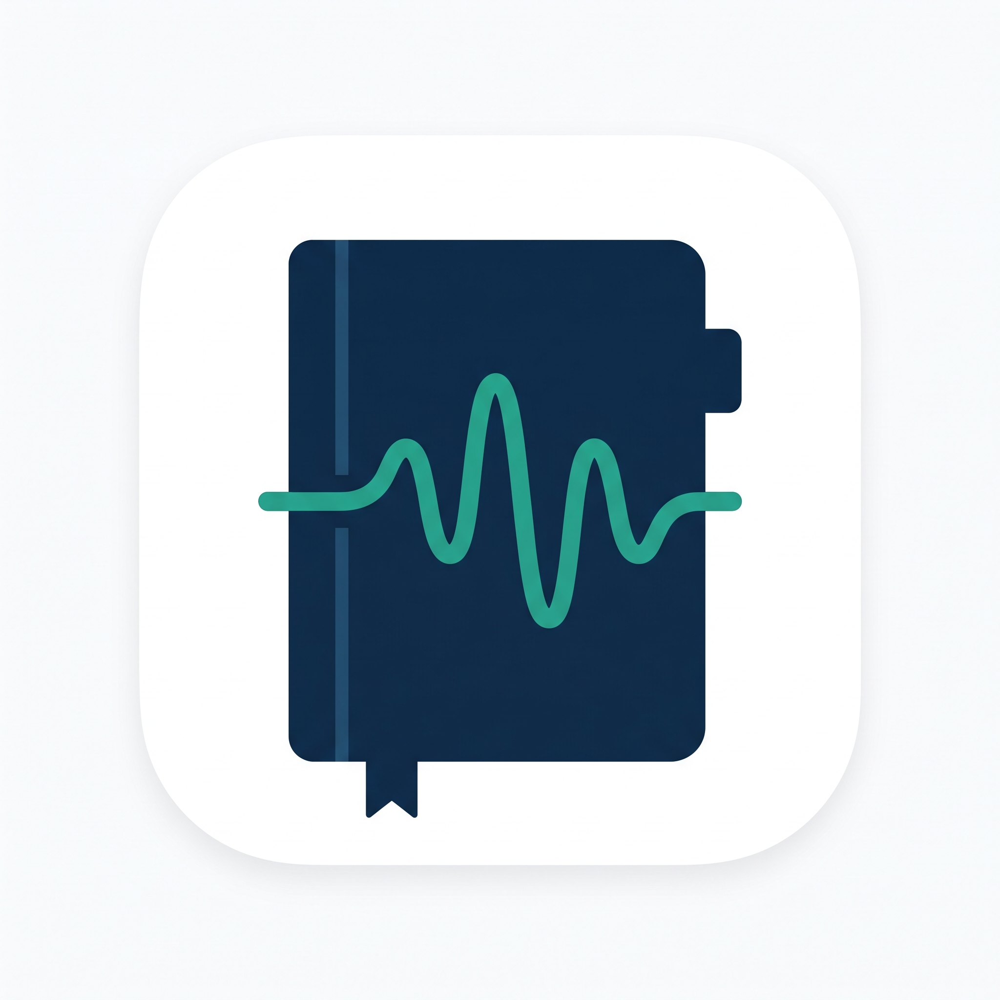 |  |  |  |

#### Perfil

| Criterio | SafeDiary | BetterHelp | Headspace | terapIA |
| --- | --- | --- | --- | --- |
| Overview | Aplicación móvil de bienestar emocional que integra un diario inteligente, una comunidad anónima de apoyo y la conexión con psicólogos verificados. Su propuesta permite expresar pensamientos mediante texto o voz, comprender cambios emocionales y conservar un historial privado. El usuario puede avanzar a su propio ritmo desde la reflexión personal hasta una consulta profesional, compartiendo únicamente la información que autorice. | Plataforma de terapia online con sesiones y mensajería con el terapeuta. | Plataforma de bienestar con meditación, recursos para dormir y Ebb, su acompañante de IA; también ofrece terapia sujeta a elegibilidad. | Aplicación de apoyo emocional en español centrada en Pía, una IA con la que se puede conversar por texto o voz. Integra herramientas de autoconocimiento y bienestar personal. |
| Ventaja competitiva ¿Que valor ofrece a los clientes? | Conecta el registro cotidiano con el acompañamiento humano. Para el paciente, ofrece un espacio donde desahogarse, reconocer patrones y encontrar apoyo sin perder el control de su información. Para el psicólogo, propone resúmenes y registros autorizados que aportan contexto entre consultas. La combinación de diario, comunidad y atención profesional busca dar continuidad al cuidado emocional dentro de una misma aplicación. | Combina atención profesional con herramientas de seguimiento, incluido un diario que puede compartirse con el terapeuta. | Facilita prácticas de autocuidado y reflexión con recomendaciones de meditaciones y actividades mediante Ebb. | Acompañamiento automatizado sin cita y continuidad entre conversaciones, junto con herramientas para reflexionar y organizar metas personales. |


#### Perfil de marketing

| Criterio | SafeDiary | BetterHelp | Headspace | terapIA |
| --- | --- | --- | --- | --- |
| Mercado objetivo | Pacientes jóvenes que desean expresar y comprender sus emociones entre consultas, especialmente cuando el estrés académico o laboral dificulta ordenar lo que sienten. También se dirige a psicólogos profesionales que necesitan información contextual clara para preparar y personalizar la atención. El diseño contempla a usuarios preocupados por el juicio social, la privacidad y la dificultad de pedir apoyo. | Personas que buscan terapia online y comunicación con un terapeuta. | Usuarios interesados en bienestar cotidiano; su servicio de terapia está dirigido a adultos residentes en Estados Unidos y se ofrece en inglés. | Personas de habla hispana que buscan expresarse, conocerse mejor y construir hábitos de bienestar, con o sin experiencia previa de atención psicológica. |
| Estrategias y recursos de marketing | Demostraciones del recorrido completo: registrar una emoción, revisar un resumen y decidir si compartirlo. Contenido educativo en español sobre expresión emocional, privacidad y uso responsable de la IA; difusión de la comunidad como espacio de escucha y apoyo. Pilotos y colaboración con psicólogos para acercar la aplicación a pacientes jóvenes y comunicar su valor con experiencias de uso concretas. | Contenido informativo sobre terapia, explicación de costos y acceso al registro desde sus páginas. | Prueba de suscripción, presentación de Ebb y testimonios de usuarios como recursos de captación. | Presentación de Pía, testimonios, blog y contenidos sobre acompañamiento emocional; promoción de la descarga y del acceso al chat. |

#### Perfil de producto

| Criterio | SafeDiary | BetterHelp | Headspace | terapIA |
| --- | --- | --- | --- | --- |
| Productos y servicios | Diario por texto o voz con transcripción, reflexión asistida, etiquetas emocionales y extracción de palabras clave; historial confidencial, gráficos de evolución y resúmenes por período. Salas de audio anónimas para escuchar o participar. Directorio de psicólogos verificados con especialidad, disponibilidad y tarifa; reserva de citas, videollamadas y pago de sesiones. Sistema de confianza con reseñas y criterios transparentes sobre la actividad profesional. | Sesión semanal, mensajería, grupos de apoyo, herramientas de hábitos y diario. | Meditaciones, recursos de sueño, ejercicios y Ebb; sesiones con profesionales mediante su oferta de terapia. | Chat con Pía, diario con texto, imágenes y notas de voz, cuestionarios de autoexploración, objetivos, hábitos, cartas al futuro y logros. |
| Registro y continuidad entre sesiones | Conserva experiencias cuando ocurren, incluyendo detalles que pueden olvidarse al llegar a consulta. Propone organizar entradas por período y mostrar emociones predominantes, posibles detonantes y variaciones a lo largo del tiempo. El paciente revisa el resumen, elige qué compartir y puede revocar el acceso. El psicólogo recibe contexto complementario para la conversación clínica, mientras la identidad de la comunidad permanece separada de la atención profesional. | Permite escribir y compartir entradas del diario con el terapeuta, además de actualizar objetivos y hábitos. | Conversación y reflexión mediante Ebb. Disponibilidad de un diario por voz con resumen compartible: por confirmar. | Historial de conversaciones y diario para revisar experiencias y avances. Integración de resúmenes autorizados con un psicólogo: por confirmar. |
| Precios y costos | Modelo freemium con una versión gratuita y planes de pago que amplían las funcionalidades disponibles. Se cobrará a los psicólogos una pequeña comisión por las citas gestionadas a través de la plataforma. Como vía adicional de comercialización, se contempla ofrecer convenios y planes institucionales a universidades, colegios, clínicas, empresas y otras organizaciones para facilitar el acceso de sus comunidades a SafeDiary. | En Estados Unidos: **US$70–100 por semana** sin seguro, variable según ubicación y condiciones. No constituye una tarifa para Perú. | Suscripción de autocuidado con Ebb: **US$69.99 al año** después de la prueba. La terapia tiene costos separados según cobertura y ubicación. | Compras dentro de la aplicación. Pía Plus ofrece suscripción mensual o anual; importe vigente por confirmar. |
| Canales de distribución | Distribución prevista mediante App Store para iOS, Google Play Store para Android y acceso web desde el navegador. | Servicio online mediante web y aplicación. | Aplicación Headspace y sitio web de suscripción y acceso a terapia. | Aplicaciones para Android e iOS y acceso web al chat con Pía. |


#### Análisis SWOT (FODA)

| Criterio | SafeDiary | BetterHelp | Headspace | terapIA |
| --- | --- | --- | --- | --- |
| Fortalezas | Propuesta integrada que combina expresión privada, apoyo comunitario y atención profesional. Registro flexible por voz o texto, visualización de patrones y resúmenes orientados a la consulta. El consentimiento explícito y revocable, el cifrado de información sensible y la separación de identidades forman parte del diseño. Su enfoque en pacientes jóvenes y psicólogos permite atender necesidades de ambos lados de la relación terapéutica. | Atención profesional y herramientas de diario y seguimiento dentro de un mismo servicio. | Combina recursos de autocuidado, acompañamiento con IA y una oferta de terapia. | Experiencia en español que reúne IA conversacional y herramientas de reflexión personal, con acceso sin citas. |
| Debilidades | Necesita validar la precisión y utilidad de sus resúmenes, la constancia del registro y la adopción por parte de los psicólogos. Integrar audio, IA, comunidad y consultas exige recursos técnicos y operativos, especialmente para moderación y protección de datos. El valor del directorio depende de contar con profesionales verificados y disponibilidad suficiente. | El costo recurrente puede dificultar la adopción por jóvenes con presupuesto limitado; su costo final para usuarios en Perú está por confirmar. | Su oferta de terapia tiene restricciones de país e idioma que limitan su ajuste al público peruano. | El acompañamiento automatizado no brinda evaluación ni tratamiento clínico; su utilidad depende de la adecuación de las respuestas al contexto personal. |
| Oportunidades | Atender la pérdida de contexto entre consultas y la dispersión de notas y audios personales. Facilitar que pacientes jóvenes del entorno peruano encuentren un espacio de escucha y una ruta clara hacia el profesional. Trabajar con psicólogos para ajustar los resúmenes a sus necesidades y fortalecer la continuidad del registro, el apoyo social y la preparación de las sesiones. | Mejorar la organización del diario para facilitar la revisión de experiencias entre sesiones. | Profundizar la conexión entre reflexión cotidiana y atención profesional en más idiomas y mercados. | Desarrollar formas de conectar la reflexión personal con el apoyo profesional y mejorar la continuidad de los hábitos. |
| Amenazas | Competidores que incorporen funciones similares, abandono del hábito de registro y preferencia por herramientas que el usuario ya conoce. Errores de interpretación de la IA, incidentes de privacidad o interacciones dañinas en la comunidad podrían afectar la confianza. La disponibilidad limitada de psicólogos y los costos de operación pueden dificultar el crecimiento del servicio. | Alternativas locales ajustadas al presupuesto y usuarios que prefieran mantener atención presencial con su psicólogo. | Competencia de recursos gratuitos de autocuidado y herramientas especializadas en continuidad terapéutica. | Otras aplicaciones de bienestar e IA conversacional, pérdida de confianza por respuestas inadecuadas y preferencia por acompañamiento humano. |

**Conclusión del análisis**

SafeDiary orienta su diferenciación a la continuidad del cuidado emocional: expresar lo que ocurre, comprenderlo con ayuda del diario, encontrar escucha en una comunidad y acceder a un psicólogo verificado cuando la persona lo decida. BetterHelp combina terapia con herramientas de seguimiento; Headspace reúne autocuidado, IA y atención profesional; terapIA se centra en el acompañamiento automatizado y la reflexión personal. Frente a estas propuestas, SafeDiary busca ofrecer una experiencia adaptada a pacientes jóvenes y psicólogos del contexto peruano, con registro por voz o texto, apoyo anónimo y contexto compartido bajo control del paciente. Su valor deberá reflejarse en registros fáciles de mantener, resúmenes útiles para la consulta y una transición clara hacia el apoyo humano.

### 2.1.2. Estrategias y tácticas frente a competidores

**Continuidad entre consultas como eje de diferenciación**

Priorizar el recorrido de registro, revisión y envío autorizado. Como táctica, permitir seleccionar un período y revisar un resumen de emociones, situaciones relevantes y entradas elegidas antes de compartirlo. Validar con psicólogos si esa información resulta clara y útil para preparar la consulta.

**Registro breve y flexible para pacientes jóvenes**

Ofrecer texto y voz, indicaciones sencillas y recordatorios opcionales. Evaluar en pruebas de uso el esfuerzo necesario para completar una entrada y observar qué dificultades impiden mantener el hábito. Esta estrategia responde a la dispersión de notas y a la pérdida de detalles mencionadas en la entrevista al paciente.

**Confianza mediante decisiones de privacidad comprensibles**

Mostrar qué información se comparte, quién la recibe y cómo revocar su acceso. Incorporar opciones de eliminación y explicar el uso de los datos emocionales con lenguaje claro. En los pilotos, comprobar que el paciente comprende estas decisiones y puede realizarlas sin ayuda.

**Comunidad anónima como espacio de escucha**

Integrar salas de audio donde el usuario pueda comenzar escuchando y participar cuando se sienta preparado. Utilizar alias, separar la identidad comunitaria de la clínica e incorporar moderación, reporte y bloqueo. Este espacio busca ampliar las posibilidades de apoyo entre consultas y ofrecer contacto humano a quienes necesitan compartir experiencias. El diario y las grabaciones personales permanecen privados y no se publican en la comunidad.

**Acceso a profesionales y confianza para elegir**

Presentar perfiles verificados con especialidad, disponibilidad, tarifa y reseñas; facilitar la reserva, la videollamada y el pago de la sesión en la aplicación. Diseñar un sistema de confianza con criterios transparentes que considere la actividad profesional, la continuidad de atención y las opiniones de los usuarios, evitando equiparar el volumen de consultas con la calidad clínica. El objetivo es que el paciente cuente con información comprensible para elegir y pueda aportar su contexto con consentimiento.

**Adaptación al contexto peruano y colaboración con psicólogos**

Proponer pilotos con pacientes jóvenes y psicólogos profesionales, empleando lenguaje cotidiano en español y situaciones académicas o laborales cercanas a los participantes. Recoger su valoración sobre los resúmenes y ajustar el producto antes de ampliar su difusión. Estos pilotos son acciones propuestas, no alianzas ya establecidas.

**Uso responsable de la IA y validación del valor**

Presentar las reflexiones automáticas como apoyo para organizar lo expresado, permitir que el usuario corrija interpretaciones y mantener la evaluación clínica a cargo del psicólogo. Medir recurrencia del registro, comprensión del consentimiento y utilidad percibida de los resúmenes. La definición de precios se realizará después de contrastar ese valor con los costos de operación y la disposición de pago de ambos segmentos.


## 2.2. Entrevistas
### 2.2.1. Diseño de entrevistas

Para el diseño de entrevistas se plantearon preguntas semiestructuradas orientadas a comprender cómo los potenciales usuarios relacionados al proceso de tratamiento psicológico de los usuarios, qué problemas enfrentan a la hora de registrar sus inseguridades y qué expectativas tendrían frente a una solución como SafeDiary.

#### Segmento objetivo 1: Pacientes jóvenes

#####

1. ¿Cuánto tiempo llevas tomando sesiones psicológicas y porque las tomas?
2. ¿De qué manera sueles registrar tus emociones? Tanto refiriéndome a emociones del día a día como aquellas después de terminar tus sesiones psicológicas
3. ¿Qué tan común son las ocasiones en las que has querido recurrir a tu psicólogo, pero, por algún motivo externo, no has podido? Háblanos de estas ocasiones
4. ¿Qué recursos alternativos a la terapia utilizas para calmar y/o lidiar con tus emociones?
5. ¿Cuál es el efecto que tiene en ti no poder desahogar tus emociones con alguien en el momento que las sientes?
6. Para usted ¿Cuál es elemento más importante de las sesiones psicológicas que toma?
7. ¿Qué dificultades cree que hay en la actualidad en la relación entre paciente y psicólogo?
8. ¿Tiene preocupaciones respecto al manejo de datos personales por parte de los sistemas de inteligencia artificial generativa actuales? Si es así, hableme de ellos
9. ¿Qué opina de un asistente de inteligencia artificial como método alternativo para recibir consejos de salud emocional?
10. Si una aplicación con herramientas de este tipo pudiera detectar y/o registrar tus problemas, ¿qué tipo de respuesta o ayuda específica esperarías recibir de ella?

#### Segmento objetivo 2: Psicólogos profesionales

1. Pensando en sus pacientes de entre 14 y 30 años, ¿qué papel juega la escritura expresiva o el registro de emociones en su tratamiento y qué impacto real suele observar cuando lo practican?
2. Cuando usted asigna tareas de auto-observación o les pide llevar un diario emocional entre sesiones, ¿cuáles son los principales obstáculos o motivos por los que los jóvenes no logran mantener este hábito a diario?
3. ¿De qué manera suelen manejar sus pacientes de esta edad los momentos de angustia, ansiedad o crisis cuando están solos en casa y no tienen una sesión programada con usted?
4. Hoy en día, los jóvenes consumen mucha información y buscan orientación sobre salud mental en internet y redes sociales. ¿Cómo afecta a su proceso terapéutico el que reciban consejos emocionales de fuentes digitales o automatizadas?
5. Cuando un adolescente o adulto joven necesita contención emocional, ¿qué tipo de lenguaje, tono o acercamiento (por ejemplo: directivo, empático, clínico) considera que es el más efectivo para que se abra y no se sienta juzgado?
6. Desde su experiencia clínica, ¿dónde está la línea divisoria entre una herramienta o recurso de autoayuda que es beneficioso para el paciente, y uno que podría interferir negativamente con su terapia formal?
7. Si usted tuviera acceso a los escritos personales de un paciente, ¿cuáles serían las palabras, patrones o señales de alerta específicas que le indicarían que esa persona requiere intervención clínica de emergencia?
8. Si un paciente lograra registrar perfectamente sus cambios de humor y pensamientos todos los días, ¿de qué manera le resultaría a usted más útil revisar esa información en consulta sin que le consuma demasiado tiempo de la sesión?
9. ¿Qué características o garantías debe tener un entorno (ya sea físico o digital) para que un paciente joven se sienta lo suficientemente seguro para ser 100% vulnerable y honesto sobre sus problemas emocionales?
10. Observando cómo interactúan las nuevas generaciones con la tecnología, ¿qué tipo de recurso de apoyo o herramienta complementaria siente usted que hace mucha falta hoy en día para ayudar a los jóvenes a regular sus emociones en su vida diaria?

### 2.2.2. Registro de entrevistas

#### Segmento objetivo 1: Pacientes jóvenes

##### Entrevista 1

**Enlace de la entrevista:** [Ver entrevista al paciente](https://youtu.be/9WebzTJ97Tg)

[](https://youtu.be/9WebzTJ97Tg)

| Campo | Registro |
| --- | --- |
| Entrevistado | Mauricio Pajés, paciente de atención psicológica. |
| Entrevistador | Alexther Kamil Diaz Martinez. |
| Inicia | [0:00](https://www.youtube.com/watch?v=9WebzTJ97Tg&t=0s), inicio de la grabación. |
| Duración del video | 6:06 |
| Nombre completo | Mauricio Pajés Léon |
| Edad | 20 |
| Distrito | La molina |
| Resumen | Mauricio refiere llevar aproximadamente seis meses en terapia por la ansiedad asociada a sus estudios y trabajo. Registra lo que siente en notas del celular o mediante audios a un amigo y utiliza música para desconectarse. Señala que su terapeuta no está disponible cuando necesita apoyo de madrugada y que la frustración afecta su concentración. Valora sentirse escuchado sin juicios y recibir herramientas prácticas. Identifica una pérdida de contexto entre sesiones, pues el relato posterior no conserva todos los detalles ni el tono de voz del momento. Le preocupa que sus audios se filtren o se utilicen para entrenar modelos públicos. Considera útil la IA como complemento del acompañamiento profesional. Esperaría un espacio de audio anónimo y un reporte cifrado que pudiera compartir con su psicólogo únicamente por decisión propia. |

##### Entrevista 2

**Enlace de la entrevista:** [Ver entrevista del paciente](https://youtu.be/cNd4CfIMUJM)

[](https://youtu.be/cNd4CfIMUJM)

| Campo | Registro |
| --- | --- |
| Entrevistado | Piero Taype, paciente de atención psicológica |
| Entrevistador | Marcelo Fabio Cuadros Villanueva |
| Inicia | [0:00](https://www.youtube.com/watch?v=cNd4CfIMUJM&t=0s), inicio de la grabación. |
| Duración del video | 9:42 |
| Nombre completo | Piero Mario Taype Orihuela |
| Edad | 21 |
| Distrito | San Miguel |
| Resumen | Piero refiere llevar entre un año y año y medio en terapia psicológica debido al estrés y al cambio abrupto de ritmo tras mudarse de Ayacucho a Lima para iniciar la universidad. Registra sus emociones mediante notas en el celular, audios de WhatsApp o notas adhesivas, y recurre a la música, los videojuegos y el modelado 3D cuando la carga de exámenes le impide asistir a consulta. Señala que reprimir lo que siente le genera irritabilidad, problemas de concentración y dolor físico por tensión en hombros y cuello. Valora el desahogo guiado con un profesional para gestionar sus miedos y pensamientos negativos, aunque percibe que las sesiones resultan cortas y apresuradas. Asimismo, le preocupa la vulnerabilidad y filtración de sus datos personales y de salud en plataformas tecnológicas. Considera que la inteligencia artificial puede ser un complemento útil y disponible a toda hora sin llegar a sustituir la atención humana, esperando de esta herramientas prácticas que ayuden a identificar problemas concretos para agilizar la labor de su terapeuta. |

#### Segmento objetivo 2: Psicólogos profesionales

##### Entrevista 1

**Enlace de la entrevista:** [Ver entrevista al psicólogo](https://youtu.be/dEfn2xG_mbk)

[](https://youtu.be/dEfn2xG_mbk)

| Campo | Registro |
| --- | --- |
| Entrevistado | Rodrigo Velázquez, presentado como psicólogo especialista. |
| Entrevistador | Alexther Kamil Diaz Martinez. |
| Inicia | [0:00](https://www.youtube.com/watch?v=dEfn2xG_mbk&t=0s), inicio de la grabación. |
| Duración del video | 14:44 |
| Nombre completo | Rodrigo Velázquez |
| Edad | 25 |
| Distrito | San Miguel |
| Resumen | Rodrigo sostiene que escribir ayuda a los jóvenes a ordenar sus pensamientos y procesar emociones. Identifica como barreras el tiempo y esfuerzo percibidos, la preocupación por la privacidad y el perfeccionismo. Describe conductas de evasión ante el malestar y destaca la importancia de contar con estrategias y personas de confianza. Advierte sobre la desinformación, los autodiagnósticos y las promesas de resultados rápidos en redes sociales. Propone un trato empático que dé al paciente libertad para expresarse. Para aprovechar la consulta, prefiere gráficos y resúmenes con emociones predominantes, detonantes y episodios de ansiedad. Considera esenciales el cifrado, el anonimato y la posibilidad de borrar información. Sugiere una herramienta móvil de registro que ofrezca ejercicios de apoyo ante expresiones de malestar y genere contexto útil para personalizar las sesiones. |

##### Entrevista 2
** Enlace de la entrevista: ** https://upcedupe-my.sharepoint.com/:v:/g/personal/u202318609_upc_edu_pe/IQCgMq1wK-e7Sa2HCA_52zEDAcGhACzYzChzn0sMqHF4-aA?nav=eyJyZWZlcnJhbEluZm8iOnsicmVmZXJyYWxBcHAiOiJTdHJlYW1XZWJBcHAiLCJyZWZlcnJhbFZpZXciOiJTaGFyZURpYWxvZy1MaW5rIiwicmVmZXJyYWxBcHBQbGF0Zm9ybSI6IldlYiIsInJlZmVycmFsTW9kZSI6InZpZXcifX0%3D&e=ZGQ1G5


| Campo | Registro |
| --- | --- |
| Entrevistado | Josue Castro |
| Entrevistador | Juan Sung Jau Wang Chen |
| Inicia | 1:13 Primera pregunta |
| Duración del video | 12:17 |
| Nombre completo | Josue Castro Barreta |
| Edad | 23 |
| Distrito | La Perla |
| Resumen | Josué es psicólogo con 2 años de experiencia clínica, también con formación en psiquiatría. Afirma que la escritura expresiva es una herramienta clínica fundamental para pacientes de 14 a 30 años, ya que activa la corteza prefrontal y ayuda a regular la amígdala (centro del miedo y la ansiedad). Observa que los pacientes que escriben llegan a las sesiones con mayor claridad, reducen la rumiación nocturna y disminuyen las somatizaciones (dolores de cabeza o estómago por estrés). Identifica tres barreras principales para mantener un diario emocional: la falta de privacidad (temor a que padres o hermanos revisen sus notas), la trampa del perfeccionismo (creer que deben escribir "bien") y la evitación experiencial (escribir sobre el dolor lo hace sentir más real). Señala que, en momentos de crisis sin sesión programada, los jóvenes recurren a la evasión mediante pantallas (TikTok, Instagram), al aislamiento con música triste, y en casos más graves, a la autolesión o consumo de sustancias. Recomienda un enfoque empático en lugar de clínico o directivo, ya que el tono directo provoca que los adolescentes se pongan a la defensiva y se cierren. Respecto a señales de alerta en los escritos de un paciente, menciona la desesperanza absoluta (ausencia total de visión a futuro), el léxico vacío y las fugas de la realidad como indicadores de intervención de emergencia. Para revisar registros emocionales en consulta sin consumir tiempo excesivo, prefiere gráficos de estado emocional, horas de sueño, etiquetas o palabras clave semanales y que el paciente destaque dos episodios de angustia para analizar en profundidad. Considera que un entorno digital seguro debe ofrecer control total, privacidad absoluta, cero juicios morales y permanencia-disponibilidad. Finalmente, señala que hace falta una herramienta que funcione como un "botiquín emocional" que aprenda del usuario y sirva para aliviar la ansiedad en momentos de crisis, más allá de las apps genéricas de meditación o humor. |

##### Entrevista 3

**Enlace de la entrevista:** [Ver entrevista a la psicologa](https://upcedupe-my.sharepoint.com/:v:/g/personal/u202416706_upc_edu_pe/IQBuKwDz9ReQTJJuVSApcxhgAbn9PDB5lN0eTdrZ1b-hiYM?nav=eyJyZWZlcnJhbEluZm8iOnsicmVmZXJyYWxBcHAiOiJPbmVEcml2ZUZvckJ1c2luZXNzIiwicmVmZXJyYWxBcHBQbGF0Zm9ybSI6IldlYiIsInJlZmVycmFsTW9kZSI6InZpZXciLCJyZWZlcnJhbFZpZXciOiJNeUZpbGVzTGlua0NvcHkifX0&e=B1gmY3)

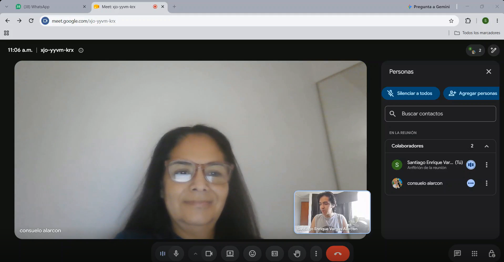

| Campo | Registro |
| --- | --- |
| Entrevistado | Consuelo Alarcón, psicóloga clínica. |
| Entrevistador | Santiago Enrique Vargas Alarcón. |
| Inicia | 0:00, inicio de la grabación. |
| Duración del video | 8:33 |
| Nombre completo | Consuelo Alarcón |
| Edad | 49 |
| Distrito | San Miguel |
| Resumen | Consuelo, con aproximadamente cinco años de experiencia, señala que el registro de emociones sirve como ancla para pacientes de 18 a 35 años, ayudando a disminuir su impulsividad, aunque el principal obstáculo para realizarlo es la pereza y el temor a perder su privacidad. Indica que los jóvenes suelen evadir sus crisis mediante distracciones (redes sociales, videojuegos, salir de fiesta). Destaca que la información de internet desestigmatiza la salud mental, pero genera problemas de autodiagnóstico. Recomienda un trato empático y horizontal, sin poses, para que los pacientes no se sientan juzgados. Considera útiles las herramientas de autoayuda siempre que fomenten independencia y no aíslen al paciente. Identifica como señales de alerta la desesperanza profunda, alteraciones de sueño, autolesiones y desconexión de la realidad. Para optimizar el tiempo en consulta, prefiere revisar resúmenes visuales (gráficos de ánimo, sueño, palabras clave) en lugar de textos largos. Subraya la importancia de garantizar la privacidad y control total de los datos por parte del paciente. Finalmente, concluye que hace falta una herramienta digital interactiva tipo "botiquín de primeros auxilios emocionales" para brindar contención inmediata en momentos de crisis. |

##### Entrevista 4

**Enlace de la entrevista:** [Ver entrevista al psicólogo](https://www.youtube.com/watch?v=I6xrkypbqEw)

[](https://youtu.be/I6xrkypbqEw)

| Campo | Registro |
| --- | --- |
| Entrevistado | Aldo Mauriño |
| Entrevistador | Andrés Rodrigo Torres Lavandera |
| Inicia | [0:00](https://www.youtube.com/watch?v=I6xrkypbqEw&t=0), inicio de la grabación |
| Duración del video | 12:49 |
| Nombre completo | Aldo Sebastian Mauriño Lavandera |
| Edad | 21 |
| Distrito | San Miguel |
| Resumen | Aldo Mauriño es psicólogo clínico con más de 5 años de experiencia trabajando con pacientes particulares. Afirma que la escritura expresiva o el registro de emociones en aplicaciones de notas es una herramienta fundamental para pacientes adolescentes y jóvenes, ya que les permite tomar consciencia sobre la verdadera frecuencia con la que experimentan emociones como la tristeza, la molestia o el estrés en su día a día. Identifica como barreras principales para mantener un diario emocional la dificultad de incorporar nuevos hábitos, la falta de costumbre de usar papel y lápiz, la indisciplina y el simple olvido, sugiriendo el uso de alarmas diarias como solución. Señala que, en momentos de crisis estando solos, los pacientes intentan escribir o llamar a personas cercanas, pero muchas veces se cohíben por vergüenza o miedo a ser una molestia, motivo por el cual les recomienda recurrir a números de emergencia especializados como la Línea 100. Recomienda utilizar un lenguaje asertivo frente a la vulnerabilidad, mostrándose honesto, directo y respetuoso, ya que un tono excesivamente empático puede interpretarse como burla y uno demasiado directo sin tacto como falta de interés. Respecto a las señales de alerta que indican una intervención clínica de emergencia, destaca la pérdida de funcionalidad del paciente, específicamente cuando los problemas se extienden a varias áreas de su vida (personal, social, laboral, familiar) impidiéndole seguir con su día a día, o cuando representa un peligro para sí mismo o para terceros. Para revisar registros emocionales en consulta ahorrando tiempo, valora que la información detalle de forma rigurosa qué días, a qué horas y en qué situaciones exactas (por ejemplo, en el trabajo o con amigos) ocurren los malestares, lo que le permite segmentar rápidamente las técnicas a utilizar. Considera que un entorno seguro para vulnerabilizarse debe garantizar una privacidad total, donde el paciente tenga la absoluta confianza de que su información no será compartida públicamente. Finalmente, señala que hace mucha falta una herramienta digital accesible para cualquier edad que centralice fuentes de información científica fiable, líneas de emergencia y contactos directos de psicólogos especializados en contención de crisis. |

### 2.2.3. Análisis de entrevistas


#### Análisis del segmento objetivo 1: Pacientes jóvenes

El segmento objetivo está compuesto por adultos jóvenes, principalmente estudiantes de educación superior y profesionistas en etapas tempranas o intermedias de formación, que se encuentran bajo regímenes de alta exigencia cognitiva, académica y laboral. Estos individuos asisten de forma activa y voluntaria a psicoterapia para mitigar cuadros de estrés y ansiedad provocados por transiciones vitales complejas o sobrecargas de rendimiento. A pesar de mantener un compromiso regular con sus especialistas clínicos, presentan un patrón común de desregulación emocional inter-sesión, derivado de la discrepancia entre el momento en que se detona la crisis y la disponibilidad real de la atención profesional, lo cual evidencia la necesidad de puentes funcionales entre la vivencia cotidiana y el encuadre psicoterapéutico.

En cuanto a los mecanismos de registro emocional, los pacientes muestran un abandono sistemático de los métodos tradicionales de diario manual debido a su falta de dinamismo e inmediatez. En su lugar, recurren a prácticas asincrónicas y fragmentadas, tales como notas rápidas en dispositivos móviles o mensajes de audio dirigidos a círculos cercanos de confianza en momentos de colapso. Esta conducta fue detallada por el entrevistado Mauricio Pajés, quien explicó que sus mayores picos de ansiedad se concentran durante la madrugada frente a entregas de alta complejidad técnica, recurriendo a notas y audios dispersos que, al final de la semana, no logran transmitir a su terapeuta la fidelidad, el tono de voz ni el contexto exacto del evento crítico, lo que produce una pérdida sensible de información clínica relevante.

La imposibilidad de exteriorizar las afectaciones emocionales en tiempo real genera consecuencias tanto cognitivas como somáticas adversas, traduciéndose en bloqueos del pensamiento, rumiación mental, irritabilidad y tensiones musculares pronunciadas. Esta problemática se agrava debido a los límites estructurales de la consulta convencional, donde la duración habitual de cuarenta a sesenta minutos resulta insuficiente para reconstruir retrospectivamente todos los episodios acumulados. El entrevistado Piero Mario Taipe Orihuela ilustró esta dificultad al señalar que los periodos de alta demanda evaluativa le impiden coordinar citas oportunas, provocando tensiones físicas focalizadas en hombros y cuello, y remarcó que la rigidez temporal de las sesiones genera una sensación de apresuramiento que obliga al paciente a reintegrarse a su entorno sin un procesamiento cabal del conflicto ni una delimitación previa que oriente al terapeuta hacia el núcleo del problema.

Finalmente, el segmento presenta una postura reflexiva y homogénea respecto a la introducción de tecnología e inteligencia artificial en la salud emocional. Por un lado, existe un recelo técnico justificado ante la vulnerabilidad y la retención permanente de información íntima en bases de datos externas, lo que exige modelos con estrictas garantías de anonimato, cifrado y soberanía absoluta del usuario sobre los datos que decide remitir a su especialista. Por otro lado, los usuarios no buscan sustituir la empatía o el criterio diagnóstico del psicólogo humano, sino contar con una herramienta complementaria de contención preliminar y triaje nocturno. Esta disposición sintetiza un segmento que demanda un entorno confidencial donde descargar y estructurar sus afecciones en el instante en que ocurren, facilitando un diagnóstico focalizado y optimizando el tiempo de la intervención clínica presencial.


#### Análisis del segmento objetivo 2: Psicólogos profesionales

El segmento objetivo está constituido por psicólogos clínicos y especialistas en salud mental dedicados a la atención psicoterapéutica de adolescentes y adultos jóvenes en entornos privados o centros de atención clínica multidisciplinaria. Estos profesionales fundamentan su práctica en el rigor ético y la personalización terapéutica, pero enfrentan la constante limitación de contar con ventanas de consulta reducidas frente a la alta complejidad contextual que experimentan sus consultantes fuera del consultorio. A partir del trabajo de campo, se evidencia que los especialistas reconocen el valor diagnóstico y regulatorio del registro inter-sesión para visibilizar afectos desbordantes, aunque tropiezan con una importante brecha de adherencia originada por la fatiga del paciente, los bloqueos por perfeccionismo y, de forma transversal, el profundo temor de los usuarios a la exposición involuntaria de su intimidad. 

Respecto a la optimización del tiempo clínico y el procesamiento de la información, el perfil profesional presenta una marcada resistencia a la sobrecarga de datos desestructurados, demandando instrumentos que sistematicen la experiencia emocional sin absorber los minutos de la intervención formal. En este sentido, el entrevistado Rodrigo Velázquez subrayó que en consultas estrictas de 45 a 50 minutos resulta inviable leer textos extensos redactados por los pacientes, por lo que resulta indispensable disponer de resúmenes visuales, gráficos de picos afectivos y etiquetas temáticas que delimiten los detonantes nucleares antes de iniciar el diálogo clínico. De manera complementaria, el entrevistado Aldo Mauriño señaló que la sistematización rigurosa de variables como horas, días y circunstancias situacionales permite enfocar de inmediato las intervenciones específicas en lugar de dispersar la sesión intentando reconstruir la semana a ciegas, postulado que valida la motivación del segmento por acceder a síntesis estructuradas que agilicen el análisis clínico sin aumentar su carga administrativa.

En lo relativo a la contención emocional fuera de sesión y las dinámicas vinculares, los especialistas coinciden en que la relación terapéutica debe desmarcarse de la rigidez médica tradicional para sostener una postura de acompañamiento empático y respetuoso. Sobre este aspecto, el especialista Josué Castarreta remarcó que las aproximaciones directivas provocan reactividad y cierre en los jóvenes, haciendo indispensable validar la experiencia afectiva y proporcionar herramientas que operen como anclajes de autorregulación mientras se preserva el control del consultante sobre sus propios registros. Asimismo, la psicóloga Consuelo Alarcón enfatizó la necesidad de interactuar desde la empatía horizontal para evitar que el paciente se sienta juzgado o evaluado, argumentando que en los momentos críticos inter-sesión se requiere un soporte de primeros auxilios emocionales en el móvil —un botiquín que ofrezca ejercicios prácticos e inmediatos de anclaje y respiración— que evite la rumiación o el aislamiento, y que a la vez sintetice patrones conductuales observables para acudir directamente a la raíz del conflicto en la cita presencial.

Finalmente, el segmento define con claridad las condiciones éticas, funcionales y de seguridad requeridas para que la tecnología complemente eficazmente la psicoterapia sin reemplazar el criterio humano. Los especialistas advierten sobre el riesgo de la desinformación digital y los autodiagnósticos precipitados, exigiendo que cualquier sistema auxiliar garantice protocolos de confidencialidad inquebrantables, cifrado riguroso y la capacidad de detectar patrones de alarma severos —tales como desesperanza absoluta o pérdida de funcionalidad transversal— para canalizar emergencias clínicas. Esta perspectiva fundamenta un perfil profesional receptivo a la innovación digital, condicionado a que las soluciones actúen como un soporte periférico confiable que respete el consentimiento informado, organice los antecedentes emocionales de forma ejecutiva y preserve la autonomía del juicio clínico del terapeuta.   


## 2.3. Needfinding


### 2.3.1. User Personas


#### User Persona 1: María

**Primer Segmento Objetivo (Pacientes Jovenes)**
*Figura 1: User Persona 1 (María)*
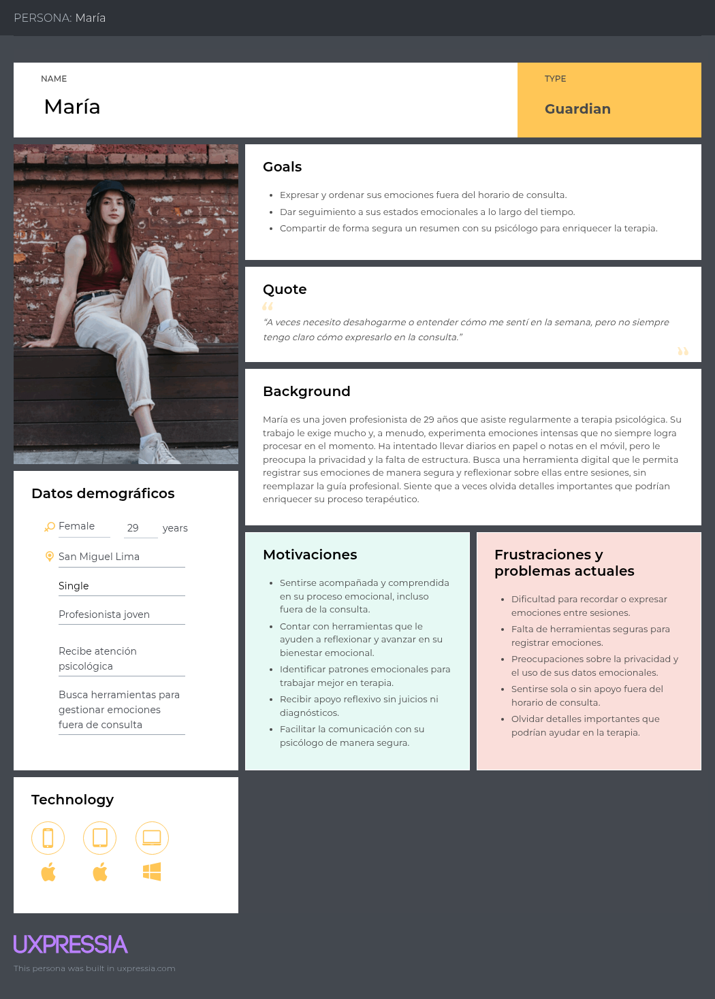

**Segundo Segmento Objetivo (Psicólogos Profesionales)**
*Figura 2: User Persona 2 (Dra. Laura Gómez)*


### 2.3.2. User Task Matrix

La matriz reúne las seis tareas más importantes de cada segmento y las prioriza según su frecuencia estimada e importancia dentro del recorrido principal.

#### User Task Matrix 1: María

**Primer Segmento Objetivo (Pacientes Jóvenes)**

| Tarea prioritaria | Frecuencia | Importancia |
| --- | :---: | :---: |
| Registrar emociones por texto o voz | Alta | Crítica |
| Consultar insights y evolución emocional | Media | Alta |
| Controlar el acceso a su información | Baja | Crítica |
| Participar de forma segura en la comunidad | Media | Alta |
| Acceder a ejercicios y ayuda urgente | Media | Crítica |
| Encontrar y recibir atención profesional | Baja | Crítica |

#### User Task Matrix 2: Dra. Laura Gómez

**Segundo Segmento Objetivo (Psicólogos Profesionales)**

| Tarea prioritaria | Frecuencia | Importancia |
| --- | :---: | :---: |
| Solicitar la verificación profesional | Baja | Crítica |
| Gestionar su perfil y reputación | Media | Alta |
| Administrar disponibilidad y solicitudes de cita | Alta | Crítica |
| Revisar información emocional autorizada | Alta | Crítica |
| Realizar y registrar una atención | Alta | Crítica |
| Consultar pagos e ingresos | Media | Alta |


### 2.3.3. User Journey Mapping

#### User Journey Map 1: Maria

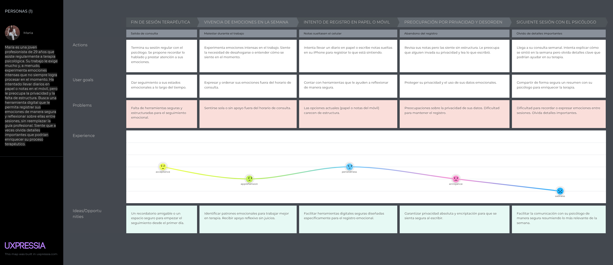

#### User Journey Map 2: Dra. Laura

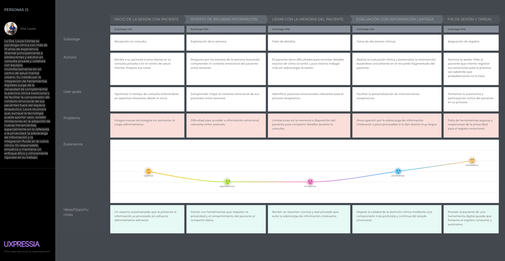

### 2.3.4. Empathy Mapping


#### Empathy Map 1: Maria

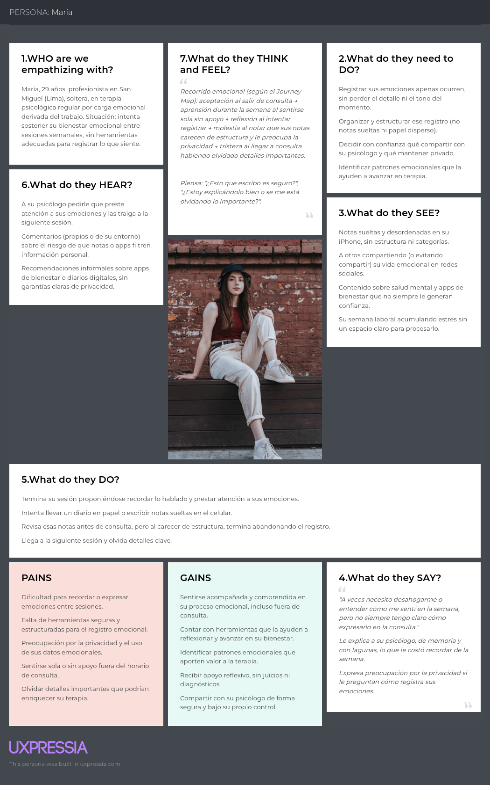

#### Empathy Map 2: Dra. Laura Gómez

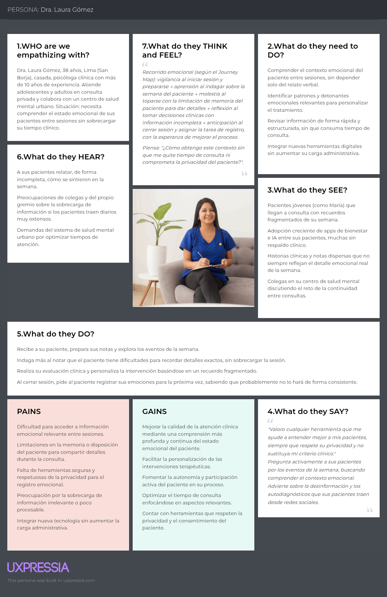

### 2.3.5. Big Picture EventStorming


### 2.3.6. Ubiquitous Language

**Identidad, Privacidad y Consentimiento (Identity, Privacy & Consent)**

* **User (Usuario):** Persona que utiliza SafeDiary para registrar su estado emocional, participar en la comunidad o acceder a atención profesional. Es propietaria de sus entradas y decide qué información comparte.
* **Account (Cuenta):** Identidad interna utilizada para autenticación, preferencias, seguridad y gestión del ciclo de vida de los datos del usuario.
* **Clinical Identity (Identidad Clínica):** Información real necesaria para la relación con un especialista, las citas y los pagos. No se muestra dentro de la comunidad anónima.
* **Community Alias (Alias Comunitario):** Identidad seudónima utilizada en las salas de voz para participar sin revelar la identidad clínica o los datos personales del usuario.
* **Consent (Consentimiento):** Autorización explícita, informada, específica y revocable mediante la cual el usuario permite una finalidad concreta sobre sus datos emocionales.
* **Sharing Permission (Permiso de Compartición):** Alcance concedido por el usuario que define qué entradas puede consultar un especialista, durante qué periodo y dentro de qué relación de atención.
* **Revocation (Revocación):** Acción mediante la cual el usuario retira un permiso vigente. Desde ese momento se bloquean nuevos accesos, sin eliminar los eventos históricos de auditoría.
* **Private Vault (Bóveda Privada):** Espacio protegido mediante un PIN secundario o biometría para entradas especialmente sensibles, excluidas por defecto de vistas y exportaciones generales.
* **Audit Event (Evento de Auditoría):** Registro trazable de una acción sensible, como un acceso, consentimiento, revocación, reserva, pago o moderación, sin copiar innecesariamente el contenido emocional involucrado.

**Diario Emocional e Inteligencia Artificial (Emotional Diary & AI)**

* **Emotional Diary (Diario Emocional):** Espacio privado donde el usuario conserva reflexiones, notas de voz, estados emocionales y contexto personal en orden cronológico.
* **Diary Entry (Entrada de Diario):** Registro individual de texto o audio cuyo propietario es el usuario. Puede incluir etiquetas, factores externos y permisos de compartición propios.
* **Voice Note (Nota de Voz):** Audio privado creado como contenido de una entrada de diario y utilizado, con autorización, como fuente para la transcripción y el análisis.
* **Transcription (Transcripción):** Representación textual generada a partir de una nota de voz. Puede ser revisada por el usuario y no reemplaza el audio original mientras este se conserve.
* **Emotional Check-in (Registro Emocional Rápido):** Selección breve de una emoción actual, asociada con fecha y hora, que no requiere crear una entrada completa.
* **Emotion Tag (Etiqueta Emocional):** Palabra o categoría que ayuda a organizar una entrada. Puede ser elegida por el usuario o sugerida por la IA antes de ser confirmada.
* **AI Analysis (Análisis de IA):** Resultado estructurado asociado a una entrada que contiene señales emocionales, palabras clave, confianza, versión del modelo y banderas de seguridad. No constituye un diagnóstico clínico.
* **AI Reflection (Reflexión de IA):** Respuesta de apoyo que ayuda al usuario a ordenar lo expresado y fomenta la reflexión sin prescribir tratamientos ni afirmar conclusiones clínicas.
* **Insight (Insight Emocional):** Tendencia o resumen derivado del historial autorizado del usuario, presentado con su periodo y contexto para evitar interpretaciones engañosas.
* **Processing State (Estado de Procesamiento):** Etapa técnica de una entrada: draft, uploading, transcribing, analyzing, ready, retryable, failed o deleted.
* **Safety Flag (Bandera de Seguridad):** Indicador interno de que una interacción puede requerir mostrar recursos de ayuda. No equivale a una evaluación clínica ni confirma una situación de emergencia.

**Comunidad Anónima y Moderación (Anonymous Community & Moderation)**

* **Community Room (Sala Comunitaria):** Espacio de audio en tiempo real donde los usuarios interactúan mediante alias y bajo una política de participación y moderación definida.
* **Host (Anfitrión):** Participante responsable de conducir una sala y aplicar acciones básicas de moderación durante su sesión.
* **Listener (Oyente):** Participante conectado con el micrófono silenciado que puede escuchar sin intervenir verbalmente.
* **Speaker (Participante de Voz):** Usuario autorizado a activar su micrófono y hablar dentro de una sala comunitaria.
* **Report (Reporte):** Comunicación confidencial enviada a moderación sobre una conducta que podría incumplir las reglas de la comunidad.
* **Block (Bloqueo):** Restricción personal que impide nuevas interacciones entre dos alias sin revelar a la comunidad la identidad de quien la aplicó.
* **Moderation Action (Acción de Moderación):** Medida trazable como silenciar, expulsar o restringir a un participante para proteger la seguridad de una sala.

**Atención Profesional y Agendamiento (Professional Care & Scheduling)**

* **Verified Specialist (Especialista Verificado):** Psicólogo cuya identidad y credenciales fueron revisadas antes de aparecer como profesional disponible en SafeDiary.
* **Clinician Profile (Perfil Profesional):** Ficha pública autorizada que reúne especialidades, biografía, tarifa, disponibilidad, verificación, reseñas y elementos del puntaje de confianza.
* **Availability Slot (Horario Disponible):** Bloque de fecha, hora y zona horaria publicado por un especialista que puede reservarse una sola vez.
* **Appointment (Cita):** Acuerdo entre un usuario y un especialista para una atención en un horario determinado, con estados requested, held, confirmed, completed, cancelled, expired, no_show o refunded.
* **Video Session (Videollamada):** Canal privado asociado a una cita confirmada al que solo pueden ingresar sus participantes autorizados dentro de la ventana permitida.
* **Care Relationship (Relación de Atención):** Vínculo entre un usuario y un especialista originado por una cita. No concede acceso automático al diario; todo acceso requiere un permiso de compartición explícito.

**Pagos, Reseñas y Confianza (Payments, Reviews & Trust)**

* **Payment (Pago):** Transacción asociada a una cita que se procesa de forma idempotente para evitar cobros duplicados y mantener un estado verificable.
* **Receipt (Comprobante):** Constancia digital emitida después de un pago aprobado y disponible para consulta del usuario.
* **Review (Reseña):** Valoración vinculada a una cita completada que puede incluir una puntuación y un comentario opcional, sin revelar información emocional del paciente.
* **Trust Score (Puntaje de Confianza):** Indicador explicable construido con criterios como horas de atención, continuidad de pacientes y reseñas válidas, evitando premiar únicamente el volumen de consultas.
* **Refund (Reembolso):** Devolución total o parcial de un pago que actualiza de forma trazable el estado financiero de la cita.

## 2.4. Requirements specification

### 2.4.1. User Stories

**Epics**

| Epic ID | Título | Descripción |
| --- | --- | --- |
| EP-01 | Cuenta, seguridad, privacidad y consentimiento | **Como** usuario de SafeDiary,<br>**Quiero** administrar mi identidad, accesos y permisos sobre mis datos,<br>**Para** utilizar la aplicación con seguridad y mantener el control de mi información sensible. |
| EP-02 | Diario emocional, IA, hábitos e insights | **Como** usuario de SafeDiary,<br>**Quiero** registrar mis emociones, recibir apoyo reflexivo y consultar mi evolución,<br>**Para** desarrollar hábitos de autocuidado y comprender mejor mis patrones emocionales. |
| EP-03 | Comunidad segura, autorregulación y ayuda inmediata | **Como** miembro de SafeDiary,<br>**Quiero** participar en espacios comunitarios moderados y acceder a recursos de regulación y crisis,<br>**Para** recibir apoyo manteniendo protegida mi identidad y seguridad. |
| EP-04 | Atención profesional, citas, pagos y confianza | **Como** usuario de SafeDiary,<br>**Quiero** encontrar especialistas verificados y gestionar citas, pagos y sesiones,<br>**Para** acceder a atención profesional confiable desde la aplicación. |
| EP-05 | Landing page, comunicación y adquisición | **Como** visitante,<br>**Quiero** conocer la propuesta, funcionalidades, precios y equipo de SafeDiary,<br>**Para** evaluar el producto antes de registrarme o descargarlo. |

**User Stories**

| Story ID | Título | Descripción | Criterios de aceptación | Relacionado con Epic ID |
| --- | --- | --- | --- | --- |
| US-001 | Registro de cuenta | **Como** nuevo usuario de SafeDiary,<br>**Quiero** registrar una cuenta con mi correo electrónico y una contraseña segura,<br>**Para** acceder a mi espacio personal y comenzar a registrar mi estado emocional. | **Scenario 1: Registro exitoso**<br>**Given** que el usuario se encuentra en la opción de crear una cuenta<br>**When** ingresa un correo no registrado, una contraseña válida y confirma el registro<br>**Then** el sistema crea la cuenta e inicia la sesión<br>**And** muestra la pantalla principal de bienvenida<br><br>**Scenario 2: Datos de registro inválidos**<br>**Given** que el usuario está completando el formulario de registro<br>**When** ingresa un correo con formato incorrecto, un correo ya registrado o una contraseña que no cumple las reglas<br>**Then** el sistema no crea la cuenta<br>**And** muestra el mensaje de validación correspondiente sin borrar los datos válidos | EP-01 |
| US-002 | Exploración del directorio de especialistas | **Como** usuario de SafeDiary,<br>**Quiero** buscar especialistas verificados y filtrarlos por especialidad y disponibilidad,<br>**Para** seleccionar al profesional que mejor se ajuste a mis necesidades. | **Scenario 1: Filtrado con resultados**<br>**Given** que el usuario se encuentra en el directorio de soporte profesional<br>**When** aplica un filtro de especialidad o disponibilidad<br>**Then** el sistema muestra únicamente los especialistas coincidentes<br>**And** cada resultado presenta credenciales, tarifa, calificación y próxima disponibilidad<br><br>**Scenario 2: Búsqueda sin coincidencias**<br>**Given** que el usuario ha aplicado criterios de búsqueda<br>**When** ningún especialista cumple con los filtros seleccionados<br>**Then** el sistema muestra un estado sin resultados<br>**And** ofrece una opción para limpiar los filtros | EP-04 |
| US-003 | Acceso con Google o Apple | **Como** usuario nuevo o recurrente de SafeDiary,<br>**Quiero** registrarme o iniciar sesión con mi cuenta de Google o Apple,<br>**Para** acceder de forma rápida sin administrar una contraseña adicional. | **Scenario 1: Autenticación federada exitosa**<br>**Given** que el usuario se encuentra en la pantalla de autenticación<br>**When** selecciona Google o Apple y autoriza el acceso con el proveedor<br>**Then** el sistema valida la identidad y crea o recupera la cuenta correspondiente<br>**And** redirige al usuario a la pantalla principal con la sesión iniciada<br><br>**Scenario 2: Autenticación cancelada o fallida**<br>**Given** que el usuario inició el flujo de acceso con Google o Apple<br>**When** cancela la autorización o el proveedor devuelve un error<br>**Then** el sistema mantiene al usuario en la pantalla de autenticación<br>**And** muestra un mensaje de error cuando la causa es técnica | EP-01 |
| US-004 | Creación de sala de voz | **Como** usuario de SafeDiary,<br>**Quiero** crear una sala de voz temática con título, etiquetas y modo de participación,<br>**Para** abrir un espacio anónimo y seguro de conversación en tiempo real. | **Scenario 1: Sala creada correctamente**<br>**Given** que el usuario se encuentra en la sección Comunidad<br>**When** completa un título válido, selecciona etiquetas y confirma la creación<br>**Then** el sistema abre la sala y asigna al creador como anfitrión<br>**And** publica la sala en el listado comunitario<br><br>**Scenario 2: Título inválido**<br>**Given** que el usuario tiene abierto el formulario de creación<br>**When** intenta confirmar con un título vacío o menor a la longitud permitida<br>**Then** el sistema no crea la sala<br>**And** indica cómo corregir el campo de título | EP-03 |
| US-005 | Participación en sala de voz | **Como** usuario de SafeDiary,<br>**Quiero** unirme a una sala de voz como oyente o participante,<br>**Para** recibir apoyo o conversar manteniendo protegida mi identidad. | **Scenario 1: Ingreso exitoso como oyente**<br>**Given** que existe una sala activa con capacidad disponible<br>**When** el usuario selecciona la opción de unirse<br>**Then** el sistema conecta el audio con el micrófono silenciado por defecto<br>**And** incrementa el contador de participantes<br><br>**Scenario 2: Sala cerrada o no disponible**<br>**Given** que la sala seleccionada acaba de finalizar o alcanzó su capacidad<br>**When** el usuario intenta ingresar<br>**Then** el sistema rechaza la conexión de forma controlada<br>**And** informa la causa y actualiza el listado de salas | EP-03 |
| US-006 | Edición del perfil personal | **Como** usuario de SafeDiary,<br>**Quiero** actualizar mi nombre y fotografía de perfil,<br>**Para** mantener mis datos personales al día y personalizar mi experiencia. | **Scenario 1: Perfil actualizado**<br>**Given** que el usuario se encuentra en la edición de perfil<br>**When** ingresa un nombre válido, selecciona una imagen admitida y guarda los cambios<br>**Then** el sistema actualiza la información<br>**And** muestra los nuevos datos en la aplicación<br><br>**Scenario 2: Imagen no admitida**<br>**Given** que el usuario intenta cambiar su fotografía<br>**When** selecciona un archivo con formato no permitido o que supera el tamaño máximo<br>**Then** el sistema conserva la imagen anterior<br>**And** muestra el requisito que no se cumplió | EP-01 |
| US-007 | Gestión de rutinas de autocuidado | **Como** usuario de SafeDiary,<br>**Quiero** crear actividades para mis rutinas diarias,<br>**Para** organizar hábitos de calma y autocuidado durante el día. | **Scenario 1: Rutina creada**<br>**Given** que el usuario se encuentra en la sección de rutinas<br>**When** ingresa un nombre, define la duración o el tipo y confirma<br>**Then** el sistema agrega la actividad con estado pendiente<br>**And** la muestra en la lista del día<br><br>**Scenario 2: Rutina sin título**<br>**Given** que el usuario está creando una actividad<br>**When** intenta guardarla sin ingresar un título<br>**Then** el sistema no registra la rutina<br>**And** señala que el nombre es obligatorio | EP-02 |
| US-008 | Registro de entrada de diario | **Como** usuario de SafeDiary,<br>**Quiero** registrar una vivencia mediante texto o una nota de voz,<br>**Para** expresar mis pensamientos con el medio que me resulte más cómodo. | **Scenario 1: Entrada guardada**<br>**Given** que el usuario se encuentra en el diario emocional<br>**When** escribe una reflexión o graba una nota de voz y selecciona guardar<br>**Then** el sistema almacena la entrada cifrada<br>**And** la muestra en el historial en orden cronológico<br><br>**Scenario 2: Entrada vacía**<br>**Given** que el usuario abrió una nueva entrada<br>**When** intenta guardarla sin texto ni audio<br>**Then** el sistema bloquea el guardado<br>**And** solicita añadir contenido antes de continuar | EP-02 |
| US-009 | Consentimiento para compartir historial | **Como** usuario de SafeDiary con una cita profesional,<br>**Quiero** autorizar explícitamente el acceso de un especialista a partes de mi historial emocional,<br>**Para** ofrecer contexto relevante para mi atención sin perder el control de mis datos. | **Scenario 1: Consentimiento otorgado**<br>**Given** que el usuario tiene una cita con un especialista verificado<br>**When** selecciona los datos que desea compartir, activa el consentimiento y confirma<br>**Then** el sistema concede acceso únicamente al especialista y al alcance autorizados<br>**And** registra la fecha y el detalle del consentimiento<br><br>**Scenario 2: Atención sin compartir historial**<br>**Given** que el usuario se encuentra en la pantalla de consentimiento<br>**When** decide continuar sin autorizar el acceso<br>**Then** el sistema mantiene privado el historial<br>**And** permite conservar la cita sin compartir información emocional | EP-01 |
| US-010 | Registro rápido del estado emocional | **Como** usuario de SafeDiary,<br>**Quiero** seleccionar rápidamente mi estado emocional actual desde la pantalla principal,<br>**Para** mantener un registro continuo de mi ánimo sin crear una entrada completa. | **Scenario 1: Estado emocional registrado**<br>**Given** que el usuario se encuentra en la pantalla principal<br>**When** selecciona una emoción disponible<br>**Then** el sistema registra la emoción con fecha y hora<br>**And** actualiza el indicador del estado actual<br><br>**Scenario 2: Registro duplicado inmediato**<br>**Given** que una emoción ya se encuentra activa<br>**When** el usuario selecciona nuevamente la misma emoción sin realizar otro cambio<br>**Then** el sistema mantiene la selección actual<br>**And** evita crear un registro duplicado | EP-02 |
| US-011 | Reflexión guiada por voz con IA | **Como** usuario de SafeDiary,<br>**Quiero** hablar con el asistente de IA y obtener una transcripción, reflexión y etiqueta emocional sugerida,<br>**Para** procesar mis pensamientos de manera guiada y guardarlos en mi diario. | **Scenario 1: Procesamiento de voz exitoso**<br>**Given** que el usuario inicia una grabación en AI Diary<br>**When** habla, detiene la grabación y el procesamiento finaliza correctamente<br>**Then** el sistema muestra la transcripción y una reflexión no diagnóstica<br>**And** permite revisar la etiqueta sugerida antes de guardar<br><br>**Scenario 2: Límite o fallo de transcripción**<br>**Given** que el usuario está grabando una reflexión<br>**When** alcanza el tiempo máximo o la transcripción no puede completarse<br>**Then** el sistema detiene la grabación de forma segura<br>**And** conserva el audio disponible y ofrece reintentar o usar texto | EP-02 |
| US-012 | Consulta de estadísticas emocionales | **Como** usuario de SafeDiary,<br>**Quiero** visualizar estadísticas de mis estados emocionales a lo largo del tiempo,<br>**Para** comprender mis patrones y observar mi progreso personal. | **Scenario 1: Estadísticas disponibles**<br>**Given** que el usuario tiene registros emocionales en el periodo seleccionado<br>**When** abre Insights y elige un rango de tiempo<br>**Then** el sistema calcula y muestra indicadores y gráficos del periodo<br>**And** permite consultar el detalle de cada punto del gráfico<br><br>**Scenario 2: Periodo sin registros**<br>**Given** que no existen datos emocionales en el periodo seleccionado<br>**When** el usuario abre el panel de estadísticas<br>**Then** el sistema muestra un estado vacío sin valores engañosos<br>**And** invita a realizar un primer registro | EP-02 |
| US-013 | Acceso inmediato a ayuda de crisis | **Como** usuario de SafeDiary que necesita ayuda urgente,<br>**Quiero** contactar rápidamente una línea de crisis desde la sección de soporte,<br>**Para** obtener asistencia humana inmediata cuando la necesite. | **Scenario 1: Contacto telefónico disponible**<br>**Given** que el usuario se encuentra en la sección Soporte y el dispositivo permite llamadas<br>**When** selecciona la opción de ayuda inmediata<br>**Then** el sistema abre el marcador con el número de crisis configurado para su ubicación<br>**And** solicita al usuario confirmar el inicio de la llamada<br><br>**Scenario 2: Dispositivo sin llamadas**<br>**Given** que el dispositivo no admite llamadas telefónicas<br>**When** el usuario selecciona la ayuda inmediata<br>**Then** el sistema muestra alternativas disponibles como mensaje, chat o números locales<br>**And** no presenta una acción que el dispositivo no puede ejecutar | EP-03 |
| US-014 | Reserva de videollamada profesional | **Como** usuario de SafeDiary,<br>**Quiero** reservar un horario disponible con un especialista verificado,<br>**Para** programar una consulta profesional según mi disponibilidad. | **Scenario 1: Cita reservada**<br>**Given** que el usuario visualiza un horario disponible de un especialista<br>**When** selecciona el horario y confirma los datos de la cita<br>**Then** el sistema registra la reserva y bloquea el horario<br>**And** muestra la confirmación y programa un recordatorio<br><br>**Scenario 2: Horario ocupado durante la reserva**<br>**Given** que otro usuario reservó el mismo horario antes de la confirmación<br>**When** el usuario intenta finalizar la reserva<br>**Then** el sistema evita la doble asignación<br>**And** informa la indisponibilidad y muestra horarios alternativos | EP-04 |
| US-015 | Desbloqueo biométrico | **Como** usuario recurrente de SafeDiary,<br>**Quiero** habilitar el acceso mediante rostro o huella digital,<br>**Para** entrar de forma rápida y segura sin escribir mi contraseña cada vez. | **Scenario 1: Biometría habilitada**<br>**Given** que el usuario inició sesión previamente y el dispositivo admite biometría<br>**When** activa el desbloqueo biométrico y valida su identidad<br>**Then** el sistema habilita el método para futuros accesos<br>**And** permite ingresar mediante la validación del dispositivo<br><br>**Scenario 2: Validación biométrica fallida**<br>**Given** que el desbloqueo biométrico está habilitado<br>**When** el dispositivo rechaza la identidad después del límite de intentos<br>**Then** el sistema no concede acceso<br>**And** ofrece iniciar sesión con las credenciales de la cuenta | EP-01 |
| US-016 | Recuperación de contraseña | **Como** usuario de SafeDiary que olvidó su contraseña,<br>**Quiero** solicitar un enlace seguro de restablecimiento,<br>**Para** recuperar el acceso sin perder mi historial. | **Scenario 1: Restablecimiento exitoso**<br>**Given** que el usuario solicita recuperar su contraseña<br>**When** ingresa su correo, abre un enlace vigente y define una contraseña válida<br>**Then** el sistema actualiza la credencial<br>**And** permite iniciar sesión conservando los datos de la cuenta<br><br>**Scenario 2: Correo no reconocido o enlace vencido**<br>**Given** que el usuario inicia la recuperación<br>**When** el correo no está registrado o el enlace dejó de ser válido<br>**Then** el sistema no revela la existencia de la cuenta<br>**And** muestra un mensaje seguro y permite solicitar un nuevo enlace | EP-01 |
| US-017 | Presentación de la propuesta de valor | **Como** visitante de la landing page,<br>**Quiero** comprender desde la sección principal qué ofrece SafeDiary,<br>**Para** decidir si la aplicación responde a mis necesidades. | **Scenario 1: Propuesta visible**<br>**Given** que el visitante accede a la landing page<br>**When** la sección principal termina de cargar<br>**Then** el sistema muestra el mensaje de valor, una descripción breve y las acciones de descarga<br>**And** mantiene el contenido principal visible sin desplazamiento en una pantalla compatible<br><br>**Scenario 2: Acceso a descarga**<br>**Given** que el visitante identifica una tienda compatible con su dispositivo<br>**When** selecciona el botón de descarga<br>**Then** el sistema lo dirige a la tienda correspondiente<br>**And** conserva una alternativa informativa si la aplicación aún no está disponible | EP-05 |
| US-018 | Presentación de funcionalidades principales | **Como** visitante de la landing page,<br>**Quiero** consultar las funciones principales de SafeDiary,<br>**Para** conocer el alcance del diario, la IA, la comunidad y el soporte profesional. | **Scenario 1: Funciones visibles**<br>**Given** que el visitante navega a la sección de funcionalidades<br>**When** la sección aparece en pantalla<br>**Then** el sistema presenta bloques con título, descripción e identificación visual<br>**And** incluye las capacidades principales del producto<br><br>**Scenario 2: Navegación desde el menú**<br>**Given** que el visitante se encuentra en otra sección de la landing page<br>**When** selecciona el enlace de funcionalidades<br>**Then** la página lo desplaza a la sección correspondiente<br>**And** mantiene visible el encabezado de la sección | EP-05 |
| US-019 | Consulta de testimonios | **Como** visitante de la landing page,<br>**Quiero** leer experiencias de usuarios de SafeDiary,<br>**Para** evaluar la confianza y utilidad del producto antes de registrarme. | **Scenario 1: Testimonios disponibles**<br>**Given** que el visitante llega a la sección de testimonios<br>**When** el contenido se muestra<br>**Then** el sistema presenta reseñas con alias o nombre autorizado y calificación<br>**And** evita exponer información clínica o emocional identificable<br><br>**Scenario 2: Testimonios no disponibles**<br>**Given** que no existen testimonios aprobados para publicación<br>**When** el visitante abre la sección<br>**Then** el sistema oculta reseñas incompletas o no autorizadas<br>**And** muestra contenido informativo alternativo sin inventar opiniones | EP-05 |
| US-020 | Consulta de planes y precios | **Como** visitante de la landing page,<br>**Quiero** comparar los planes disponibles de SafeDiary,<br>**Para** evaluar qué opción se ajusta a mis necesidades y presupuesto. | **Scenario 1: Comparación de planes**<br>**Given** que el visitante se encuentra en la sección de precios<br>**When** consulta las opciones disponibles<br>**Then** el sistema muestra el precio y las funciones incluidas en cada plan<br>**And** diferencia claramente el plan gratuito del plan premium<br><br>**Scenario 2: Selección de un plan**<br>**Given** que el visitante eligió una opción disponible<br>**When** selecciona su botón de acción<br>**Then** el sistema lo dirige al flujo correspondiente de registro o adquisición<br>**And** mantiene visible el plan seleccionado | EP-05 |
| US-021 | Preguntas frecuentes y contacto | **Como** visitante de la landing page,<br>**Quiero** consultar respuestas frecuentes y enviar una solicitud de contacto,<br>**Para** resolver dudas sobre privacidad, seguridad o funcionamiento. | **Scenario 1: Consulta de preguntas frecuentes**<br>**Given** que el visitante se encuentra en la sección de preguntas frecuentes<br>**When** selecciona una pregunta<br>**Then** la página muestra su respuesta sin recargarse<br>**And** permite cerrar la respuesta nuevamente<br><br>**Scenario 2: Envío del formulario de contacto**<br>**Given** que el visitante completa nombre, correo y mensaje válidos<br>**When** selecciona enviar<br>**Then** el sistema registra la solicitud y confirma su recepción<br>**And** si falta un campo obligatorio, muestra la validación y no envía el formulario | EP-05 |
| US-022 | Presentación de MindCluster | **Como** visitante de la landing page,<br>**Quiero** conocer la misión y el equipo responsable de SafeDiary,<br>**Para** identificar quién respalda el producto y sus valores. | **Scenario 1: Información institucional visible**<br>**Given** que el visitante navega a la sección Sobre nosotros<br>**When** la sección se muestra<br>**Then** el sistema presenta la misión de MindCluster y los valores del equipo<br>**And** muestra únicamente datos personales autorizados de sus integrantes<br><br>**Scenario 2: Acceso mediante navegación**<br>**Given** que el visitante se encuentra al inicio de la landing page<br>**When** selecciona el enlace Sobre nosotros<br>**Then** la página lo dirige a la información institucional<br>**And** mantiene una ruta clara para regresar al contenido principal | EP-05 |
| US-023 | Revocación del acceso al historial | **Como** usuario de SafeDiary,<br>**Quiero** revocar el acceso previamente concedido a un especialista,<br>**Para** mantener el control sobre quién puede consultar mi información emocional. | **Scenario 1: Acceso revocado**<br>**Given** que un especialista tiene autorización vigente sobre parte del historial<br>**When** el usuario desactiva el permiso y confirma la revocación<br>**Then** el sistema retira el acceso del especialista<br>**And** registra la fecha del cambio y muestra una confirmación<br><br>**Scenario 2: Consulta de permisos vigentes**<br>**Given** que el usuario abre la gestión de privacidad<br>**When** revisa los accesos concedidos<br>**Then** el sistema muestra cada especialista, el alcance y la fecha de autorización<br>**And** permite revocar cada permiso por separado | EP-01 |
| US-024 | Recordatorios de registro emocional | **Como** usuario de SafeDiary,<br>**Quiero** configurar recordatorios diarios para registrar mi estado emocional,<br>**Para** mantener el hábito de reflexión. | **Scenario 1: Recordatorio programado**<br>**Given** que el usuario permitió notificaciones para SafeDiary<br>**When** elige una hora y activa el recordatorio diario<br>**Then** el sistema programa la notificación<br>**And** al seleccionarla abre la pantalla de registro emocional<br><br>**Scenario 2: Recordatorio desactivado**<br>**Given** que existe un recordatorio activo<br>**When** el usuario desactiva la opción<br>**Then** el sistema cancela las notificaciones futuras asociadas<br>**And** conserva disponible la configuración para una reactivación posterior | EP-02 |
| US-025 | Protección de entradas en bóveda privada | **Como** usuario de SafeDiary,<br>**Quiero** proteger entradas específicas con un PIN secundario o biometría,<br>**Para** mantener ocultas mis reflexiones más sensibles. | **Scenario 1: Entrada trasladada a la bóveda**<br>**Given** que el usuario visualiza una entrada de su diario<br>**When** selecciona mover a la bóveda y supera la verificación de seguridad<br>**Then** el sistema oculta la entrada del historial general<br>**And** la muestra únicamente dentro de la bóveda privada<br><br>**Scenario 2: Intentos de acceso fallidos**<br>**Given** que el usuario intenta abrir la bóveda<br>**When** supera el límite de intentos de verificación incorrectos<br>**Then** el sistema bloquea temporalmente el acceso<br>**And** informa cuándo podrá intentarlo nuevamente | EP-01 |
| US-026 | Personalización del tono de la IA | **Como** usuario de SafeDiary,<br>**Quiero** elegir el estilo de comunicación del asistente de IA,<br>**Para** recibir reflexiones que se adapten mejor a mis preferencias. | **Scenario 1: Tono actualizado**<br>**Given** que el usuario se encuentra en las preferencias de la IA<br>**When** selecciona un estilo disponible y guarda el cambio<br>**Then** el sistema aplica el tono a las respuestas futuras<br>**And** mantiene el aviso de que la IA brinda apoyo y no diagnóstico<br><br>**Scenario 2: Historial sin alteraciones**<br>**Given** que el usuario cambió el tono del asistente<br>**When** consulta conversaciones anteriores<br>**Then** el sistema conserva los mensajes con su contenido original<br>**And** no regenera respuestas pasadas con el nuevo estilo | EP-02 |
| US-027 | Seguimiento emocional proactivo | **Como** usuario recurrente de SafeDiary,<br>**Quiero** recibir una pregunta de seguimiento sobre una emoción o situación registrada anteriormente,<br>**Para** reflexionar sobre cómo evolucionan mis preocupaciones. | **Scenario 1: Seguimiento relevante**<br>**Given** que el usuario autorizó interacciones proactivas y registró una emoción significativa<br>**When** abre la aplicación dentro del periodo de seguimiento<br>**Then** la IA presenta una pregunta relacionada con el registro previo<br>**And** permite responder, omitir o desactivar futuros seguimientos<br><br>**Scenario 2: Seguimiento desactivado**<br>**Given** que el usuario desactiva las interacciones proactivas<br>**When** vuelve a abrir la aplicación<br>**Then** la IA no inicia conversaciones por cuenta propia<br>**And** responde únicamente cuando el usuario comienza una interacción | EP-02 |
| US-028 | Exportación del progreso en PDF | **Como** usuario de SafeDiary,<br>**Quiero** exportar mis estadísticas y entradas seleccionadas en un archivo PDF,<br>**Para** compartir mi progreso con un profesional externo si así lo decido. | **Scenario 1: PDF generado**<br>**Given** que el usuario tiene información en el periodo seleccionado<br>**When** elige los datos que desea incluir y solicita la exportación<br>**Then** el sistema genera un PDF protegido con las estadísticas y entradas autorizadas<br>**And** permite descargarlo o compartirlo mediante las opciones del dispositivo<br><br>**Scenario 2: Exclusión de datos privados**<br>**Given** que existen entradas dentro de la bóveda privada<br>**When** el sistema prepara la exportación<br>**Then** omite esas entradas de forma predeterminada<br>**And** no las incluye sin una autorización explícita adicional | EP-02 |
| US-029 | Insignias por constancia emocional | **Como** usuario de SafeDiary,<br>**Quiero** recibir insignias por mantener una racha de registros emocionales,<br>**Para** sentirme motivado a sostener el hábito de autocuidado. | **Scenario 1: Insignia desbloqueada**<br>**Given** que el usuario está a un registro de completar una meta de constancia<br>**When** realiza el registro requerido<br>**Then** el sistema concede la insignia correspondiente<br>**And** la muestra en el perfil sin revelar información sensible<br><br>**Scenario 2: Racha interrumpida**<br>**Given** que el usuario deja pasar el periodo definido sin registrar actividad<br>**When** regresa a la aplicación<br>**Then** el sistema reinicia el contador de la racha<br>**And** conserva las insignias obtenidas anteriormente | EP-02 |
| US-030 | Ejercicios rápidos de regulación | **Como** usuario que experimenta ansiedad,<br>**Quiero** acceder a ejercicios breves de respiración y regulación,<br>**Para** reducir la intensidad de mis síntomas antes de continuar con el diario. | **Scenario 1: Sugerencia después de un registro intenso**<br>**Given** que el usuario registra un nivel alto de ansiedad<br>**When** confirma su estado emocional<br>**Then** el sistema ofrece iniciar un ejercicio guiado<br>**And** permite aceptar, omitir o consultar ayuda profesional<br><br>**Scenario 2: Acceso manual**<br>**Given** que el usuario se encuentra en la navegación principal<br>**When** selecciona la opción de ejercicios de regulación<br>**Then** el sistema muestra la biblioteca de ejercicios disponibles<br>**And** permite iniciar uno sin crear previamente una entrada | EP-03 |
| US-031 | Registro de factores externos | **Como** usuario de SafeDiary,<br>**Quiero** asociar factores como sueño, energía o cafeína a mis registros emocionales,<br>**Para** identificar posibles relaciones entre mis hábitos y mi estado de ánimo. | **Scenario 1: Factores vinculados**<br>**Given** que el usuario está completando un registro emocional<br>**When** selecciona uno o más factores de contexto y guarda<br>**Then** el sistema vincula los factores con el registro<br>**And** permite consultarlos posteriormente<br><br>**Scenario 2: Análisis con información suficiente**<br>**Given** que existen registros de varios periodos con factores asociados<br>**When** el usuario abre Insights<br>**Then** el sistema muestra posibles correlaciones como tendencias y no como diagnósticos<br>**And** indica cuando la información disponible es insuficiente | EP-02 |
| US-032 | Recuerdos de evolución emocional | **Como** usuario recurrente de SafeDiary,<br>**Quiero** recibir recordatorios opcionales de cómo me sentía en periodos anteriores,<br>**Para** reconocer cambios y obtener perspectiva sobre mi evolución emocional. | **Scenario 1: Recuerdo mostrado**<br>**Given** que el usuario autorizó los recuerdos y existe una entrada apta del periodo anterior<br>**When** abre la vista general del diario<br>**Then** el sistema presenta una tarjeta retrospectiva<br>**And** permite ocultarla o desactivar futuros recuerdos<br><br>**Scenario 2: Contenido potencialmente sensible**<br>**Given** que una entrada antigua contiene señales de trauma o fue marcada como sensible<br>**When** el sistema selecciona contenido para un recuerdo<br>**Then** omite esa entrada de la recomendación automática<br>**And** elige contenido neutral o no muestra un recuerdo | EP-02 |
| US-033 | Eliminación de cuenta y datos personales | **Como** usuario de SafeDiary,<br>**Quiero** solicitar la eliminación de mi cuenta y de mis datos emocionales,<br>**Para** retirar mi información cuando deje de utilizar el servicio. | **Scenario 1: Solicitud confirmada**<br>**Given** que el usuario se encuentra en la gestión de su cuenta<br>**When** solicita la eliminación, revisa sus consecuencias y valida nuevamente su identidad<br>**Then** el sistema registra la solicitud y cierra las sesiones activas<br>**And** informa el plazo de eliminación y revoca los accesos concedidos<br><br>**Scenario 2: Cancelación antes de confirmar**<br>**Given** que el usuario abrió el flujo de eliminación<br>**When** decide cancelar antes de la confirmación final<br>**Then** el sistema no elimina ni programa la eliminación de datos<br>**And** mantiene la cuenta y sus permisos sin cambios | EP-01 |
| US-034 | Reporte y bloqueo en la comunidad | **Como** participante de una sala de voz,<br>**Quiero** reportar y bloquear a una persona con comportamiento inapropiado,<br>**Para** protegerme sin revelar mi identidad comunitaria. | **Scenario 1: Reporte enviado y usuario bloqueado**<br>**Given** que el usuario participa en una sala de voz<br>**When** selecciona a un participante, elige un motivo y confirma el reporte y bloqueo<br>**Then** el sistema impide nuevas interacciones entre ambas identidades<br>**And** envía el caso a moderación sin revelar la identidad del denunciante<br><br>**Scenario 2: Cancelación del reporte**<br>**Given** que el usuario abrió el formulario de reporte<br>**When** cierra el formulario antes de confirmar<br>**Then** el sistema no registra el reporte<br>**And** mantiene disponible la opción de bloquear por separado | EP-03 |
| US-035 | Moderación de salas de voz | **Como** anfitrión de una sala de voz,<br>**Quiero** silenciar o expulsar a participantes que incumplan las reglas,<br>**Para** mantener una conversación segura para la comunidad. | **Scenario 1: Participante expulsado**<br>**Given** que el anfitrión detecta una conducta que incumple las reglas<br>**When** selecciona expulsar y confirma la acción<br>**Then** el sistema retira al participante de la sala<br>**And** impide que vuelva a ingresar durante esa sesión y registra la acción<br><br>**Scenario 2: Participante silenciado**<br>**Given** que un participante genera ruido o interrumpe la conversación<br>**When** el anfitrión selecciona silenciar<br>**Then** el sistema desactiva el micrófono del participante<br>**And** le informa de forma privada el cambio de estado | EP-03 |
| US-036 | Gestión del perfil profesional y disponibilidad | **Como** especialista verificado en SafeDiary,<br>**Quiero** actualizar mi perfil, especialidades, tarifa y horarios disponibles,<br>**Para** ofrecer información correcta y recibir reservas compatibles con mi agenda. | **Scenario 1: Perfil y disponibilidad actualizados**<br>**Given** que el especialista tiene una verificación vigente<br>**When** modifica datos válidos y publica nuevos horarios<br>**Then** el sistema actualiza su ficha en el directorio<br>**And** habilita los horarios libres para reserva<br><br>**Scenario 2: Conflicto de horario o perfil no verificado**<br>**Given** que existe una cita en el horario seleccionado o la verificación no está vigente<br>**When** el especialista intenta publicar la disponibilidad<br>**Then** el sistema bloquea el cambio incompatible<br>**And** explica la condición que debe resolver | EP-04 |
| US-037 | Pago seguro de una sesión | **Como** usuario con una cita seleccionada,<br>**Quiero** pagar la sesión dentro de SafeDiary y recibir un comprobante,<br>**Para** confirmar mi reserva mediante una transacción trazable. | **Scenario 1: Pago aprobado**<br>**Given** que el usuario seleccionó una cita y un medio de pago válido<br>**When** confirma el cobro y la pasarela aprueba la operación<br>**Then** el sistema registra el pago una sola vez y confirma la cita<br>**And** genera un comprobante consultable por el usuario<br><br>**Scenario 2: Pago rechazado o interrumpido**<br>**Given** que el usuario intenta pagar una sesión<br>**When** la pasarela rechaza la operación o se pierde la conexión<br>**Then** el sistema no marca la cita como pagada ni duplica cargos<br>**And** informa el estado y permite reintentar de forma segura | EP-04 |
| US-038 | Acceso a la videollamada programada | **Como** usuario con una cita confirmada,<br>**Quiero** ingresar a una videollamada segura desde SafeDiary,<br>**Para** recibir atención profesional en el horario reservado. | **Scenario 1: Ingreso a la consulta**<br>**Given** que la cita está confirmada y se encuentra dentro de la ventana de acceso<br>**When** el usuario selecciona unirse a la videollamada<br>**Then** el sistema valida a los participantes y conecta la sesión<br>**And** mantiene privado el historial no autorizado<br><br>**Scenario 2: Fallo de conexión o acceso fuera de horario**<br>**Given** que el usuario intenta entrar sin conexión estable o fuera de la ventana permitida<br>**When** selecciona el enlace de la consulta<br>**Then** el sistema evita un acceso inválido<br>**And** muestra opciones para reintentar o contactar al especialista | EP-04 |
| US-039 | Calificación del especialista | **Como** usuario que completó una sesión,<br>**Quiero** calificar al especialista y escribir una reseña opcional,<br>**Para** compartir mi experiencia y contribuir a una puntuación de confianza transparente. | **Scenario 1: Reseña registrada**<br>**Given** que la cita figura como completada y aún no fue calificada<br>**When** el usuario selecciona una puntuación y confirma su reseña<br>**Then** el sistema vincula la calificación con la cita<br>**And** actualiza el indicador agregado sin revelar datos del paciente<br><br>**Scenario 2: Calificación no permitida**<br>**Given** que la cita no se completó o ya tiene una calificación<br>**When** el usuario intenta enviar otra reseña<br>**Then** el sistema rechaza la duplicación<br>**And** permite editar la reseña existente cuando corresponda | EP-04 |
| US-040 | Escalamiento seguro ante señales de crisis | **Como** usuario cuya interacción contiene posibles señales de peligro inmediato,<br>**Quiero** recibir recursos locales de emergencia y opciones de ayuda humana,<br>**Para** buscar apoyo oportuno sin interpretar la respuesta de la IA como un diagnóstico. | **Scenario 1: Señal de alto riesgo detectada**<br>**Given** que el usuario envía texto o audio con señales configuradas de peligro inmediato<br>**When** el sistema procesa la interacción<br>**Then** muestra un mensaje de apoyo con recursos de emergencia según la ubicación configurada<br>**And** ofrece contactar a una línea de crisis o profesional sin ejecutar la acción automáticamente<br><br>**Scenario 2: Usuario descarta el aviso**<br>**Given** que el sistema presentó opciones de ayuda urgente<br>**When** el usuario decide cerrar el aviso<br>**Then** el sistema permite continuar sin afirmar que monitorea su seguridad<br>**And** mantiene visible una ruta discreta para volver a los recursos de ayuda | EP-03 |
| US-041 | Solicitud de verificación profesional | **Como** psicólogo interesado en ofrecer atención mediante SafeDiary,<br>**Quiero** enviar mis credenciales y consultar el estado de su verificación,<br>**Para** demostrar mi habilitación antes de aparecer en el directorio. | **Scenario 1: Solicitud enviada**<br>**Given** que el psicólogo completó sus datos y adjuntó credenciales válidas<br>**When** confirma la solicitud de verificación<br>**Then** el sistema registra la solicitud con estado pendiente<br>**And** mantiene el perfil fuera del directorio hasta que sea aprobado<br><br>**Scenario 2: Información incompleta o rechazada**<br>**Given** que faltan documentos obligatorios o una credencial no puede validarse<br>**When** se revisa la solicitud<br>**Then** el sistema no habilita el perfil profesional<br>**And** informa qué requisito debe corregirse sin exponer los documentos públicamente | EP-04 |
| US-042 | Transparencia del puntaje de confianza | **Como** especialista verificado,<br>**Quiero** consultar las reseñas y los factores que componen mi puntaje de confianza,<br>**Para** comprender mi posicionamiento y mejorar la calidad de mi atención. | **Scenario 1: Desglose disponible**<br>**Given** que el especialista cuenta con actividad y reseñas válidas<br>**When** abre la sección de confianza de su perfil<br>**Then** el sistema muestra el puntaje y sus componentes de forma comprensible<br>**And** evita revelar la identidad o información emocional de los pacientes<br><br>**Scenario 2: Información insuficiente**<br>**Given** que el especialista todavía no reúne datos suficientes<br>**When** consulta su puntaje de confianza<br>**Then** el sistema muestra un estado informativo sin asignar una valoración engañosa<br>**And** explica qué criterios podrán contribuir cuando exista actividad válida | EP-04 |
| US-043 | Gestión de solicitudes y agenda profesional | **Como** especialista verificado,<br>**Quiero** aceptar, rechazar o proponer un nuevo horario para una solicitud de cita,<br>**Para** mantener mi agenda actualizada y evitar conflictos. | **Scenario 1: Solicitud aceptada**<br>**Given** que existe una solicitud sobre un horario todavía disponible<br>**When** el especialista la acepta<br>**Then** el sistema confirma la cita y bloquea el horario en su agenda<br>**And** notifica al usuario sobre la confirmación<br><br>**Scenario 2: Horario en conflicto**<br>**Given** que el horario solicitado dejó de estar disponible<br>**When** el especialista intenta aceptar o propone una alternativa<br>**Then** el sistema evita una doble asignación<br>**And** permite enviar al usuario un nuevo horario disponible | EP-04 |
| US-044 | Gestión de la atención profesional | **Como** especialista con una cita confirmada,<br>**Quiero** ingresar a la videollamada y registrar el resultado operativo de la cita,<br>**Para** mantener actualizado el historial de atención. | **Scenario 1: Atención completada**<br>**Given** que la cita está confirmada y se encuentra dentro de la ventana de acceso<br>**When** el especialista ingresa, realiza la sesión y la marca como completada<br>**Then** el sistema registra el estado y la hora de finalización<br>**And** habilita la calificación del usuario sin publicar información de la consulta<br><br>**Scenario 2: Cita no realizada**<br>**Given** que la consulta no pudo realizarse por cancelación o inasistencia<br>**When** el especialista selecciona el estado correspondiente<br>**Then** el sistema actualiza la cita de forma auditable<br>**And** aplica únicamente las reglas de pago o reprogramación que correspondan | EP-04 |
| US-045 | Consulta del resumen emocional autorizado | **Como** especialista con una relación de atención vigente,<br>**Quiero** revisar el resumen emocional que el paciente autorizó compartir,<br>**Para** preparar la consulta sin acceder a información excluida de su consentimiento. | **Scenario 1: Resumen autorizado disponible**<br>**Given** que el usuario concedió acceso a un periodo y conjunto de datos específicos<br>**When** el especialista abre la preparación de la cita<br>**Then** el sistema muestra únicamente el resumen y las entradas autorizadas<br>**And** registra el acceso con su fecha, actor y alcance<br><br>**Scenario 2: Sin autorización vigente**<br>**Given** que el usuario no compartió información o revocó el permiso<br>**When** el especialista intenta consultar el resumen<br>**Then** el sistema deniega el acceso<br>**And** permite continuar con la cita sin mostrar datos emocionales privados | EP-01 |
| US-046 | Consulta del alcance del consentimiento | **Como** especialista,<br>**Quiero** visualizar qué información puedo consultar y hasta cuándo permanece vigente el permiso,<br>**Para** respetar el alcance del consentimiento del paciente. | **Scenario 1: Permiso vigente visible**<br>**Given** que el usuario otorgó un consentimiento activo al especialista<br>**When** el especialista consulta los permisos de la relación de atención<br>**Then** el sistema muestra el periodo, las entradas autorizadas y la vigencia<br>**And** diferencia claramente la información que permanece privada<br><br>**Scenario 2: Permiso revocado o vencido**<br>**Given** que el usuario revocó el consentimiento o terminó su vigencia<br>**When** el especialista actualiza o vuelve a abrir la vista<br>**Then** el sistema retira inmediatamente el acceso<br>**And** conserva el evento de revocación o vencimiento en la auditoría | EP-01 |
| US-047 | Consulta de pagos e ingresos profesionales | **Como** especialista verificado,<br>**Quiero** consultar los pagos de mis sesiones, las comisiones aplicadas y los montos pendientes,<br>**Para** llevar un control transparente de mis ingresos. | **Scenario 1: Pago liquidado visible**<br>**Given** que una sesión completada tiene un pago aprobado<br>**When** el especialista abre el detalle financiero<br>**Then** el sistema muestra el importe bruto, la comisión, el importe neto y el estado de liquidación<br>**And** vincula el movimiento con la cita correspondiente sin mostrar datos de pago sensibles<br><br>**Scenario 2: Pago pendiente o reembolsado**<br>**Given** que una transacción todavía está pendiente o fue reembolsada<br>**When** el especialista consulta sus ingresos<br>**Then** el sistema muestra el estado actualizado y el monto afectado<br>**And** evita contabilizarlo como ingreso disponible hasta que corresponda | EP-04 |

**Technical Stories**

| Story ID | Título | Descripción | Criterios de aceptación | Relacionado con Epic ID |
| --- | --- | --- | --- | --- |
| TS-001 | Arquitectura modular y contratos de API | **Como** equipo de desarrollo,<br>**Quiero** organizar el backend por módulos de dominio y documentar sus contratos mediante OpenAPI,<br>**Para** evolucionar las capacidades de SafeDiary sin acoplar datos sensibles ni romper las integraciones móviles. | **Scenario 1: Límites modulares validados**<br>**Given** que existen módulos para identidad y consentimiento, diario, análisis de IA, comunidad, especialistas, citas, pagos, confianza y auditoría<br>**When** se ejecutan las validaciones de arquitectura y los contratos de API<br>**Then** cada módulo accede a otros contextos únicamente mediante interfaces declaradas<br>**And** la documentación expone rutas, esquemas, códigos de respuesta y versiones compatibles<br><br>**Scenario 2: Cambio incompatible**<br>**Given** que una modificación altera un contrato publicado<br>**When** la integración continua compara la nueva especificación con la versión vigente<br>**Then** el proceso de validación falla<br>**And** exige versionar el contrato o mantener compatibilidad | EP-01 |
| TS-002 | Cifrado y gestión segura de secretos | **Como** equipo de seguridad,<br>**Quiero** cifrar la información emocional en tránsito y en reposo y mantener las credenciales fuera del código,<br>**Para** reducir el riesgo de exposición de datos sensibles. | **Scenario 1: Protección de datos sensibles**<br>**Given** que una entrada de diario, audio, transcripción o permiso se almacena o transmite<br>**When** la plataforma procesa la información<br>**Then** utiliza canales cifrados y almacenamiento con claves administradas de forma segura<br>**And** evita registrar contenido emocional, tokens o secretos en logs<br><br>**Scenario 2: Secreto ausente o inválido**<br>**Given** que un servicio no puede recuperar una credencial requerida<br>**When** intenta iniciar o consumir una integración protegida<br>**Then** el servicio rechaza la operación de forma segura<br>**And** genera una alerta técnica sin revelar el valor del secreto | EP-01 |
| TS-003 | Pipeline privado de voz y análisis de IA | **Como** equipo de desarrollo,<br>**Quiero** implementar un pipeline trazable para cargar, transcribir y analizar entradas de voz,<br>**Para** producir reflexiones no diagnósticas sin perder el control sobre el audio y sus resultados. | **Scenario 1: Procesamiento trazable**<br>**Given** que el usuario envía una nota de voz válida<br>**When** el pipeline completa la carga, transcripción y análisis<br>**Then** registra el estado de procesamiento, la versión del modelo, las señales obtenidas y su nivel de confianza<br>**And** vincula el resultado únicamente con la entrada y el propietario autorizados<br><br>**Scenario 2: Procesamiento fallido**<br>**Given** que la transcripción o el análisis no puede completarse<br>**When** el servicio alcanza un error recuperable o definitivo<br>**Then** conserva un estado retryable o failed sin inventar resultados<br>**And** permite reintentar o continuar mediante texto | EP-02 |
| TS-004 | Infraestructura de audio anónimo en tiempo real | **Como** equipo de desarrollo,<br>**Quiero** habilitar comunicación de audio en tiempo real con identidades comunitarias separadas,<br>**Para** soportar salas anónimas sin exponer la identidad clínica ni conservar audio por defecto. | **Scenario 1: Conexión anónima segura**<br>**Given** que un usuario autorizado se une a una sala con capacidad disponible<br>**When** se establece la sesión de audio<br>**Then** la infraestructura utiliza su alias comunitario y activa el micrófono silenciado por defecto<br>**And** no entrega al resto de participantes identificadores clínicos o personales<br><br>**Scenario 2: Finalización de la sala**<br>**Given** que una sala termina o un participante se retira<br>**When** se cierra su conexión en tiempo real<br>**Then** el sistema libera los recursos de sesión<br>**And** no almacena el audio crudo salvo que exista una política y un consentimiento independiente | EP-03 |
| TS-005 | Servicios de moderación y escalamiento seguro | **Como** equipo de confianza y seguridad,<br>**Quiero** centralizar reportes, bloqueos, acciones de moderación y recursos locales de crisis,<br>**Para** responder a incidentes de forma trazable sin prometer monitoreo permanente. | **Scenario 1: Incidente comunitario registrado**<br>**Given** que un usuario reporta o bloquea a otro participante<br>**When** el servicio valida la solicitud<br>**Then** aplica la restricción correspondiente y crea un evento auditable para moderación<br>**And** protege la identidad del denunciante frente a la comunidad<br><br>**Scenario 2: Señal de posible peligro inmediato**<br>**Given** que el análisis detecta una señal configurada de alto riesgo<br>**When** solicita los recursos asociados a la ubicación del usuario<br>**Then** devuelve opciones vigentes de ayuda humana y emergencia<br>**And** no realiza contactos automáticos ni afirma que SafeDiary garantiza la seguridad | EP-03 |
| TS-006 | Orquestación idempotente de citas y pagos | **Como** equipo de desarrollo,<br>**Quiero** coordinar la reserva de horarios, los pagos y la creación de videollamadas mediante operaciones idempotentes,<br>**Para** evitar citas duplicadas, cobros repetidos y accesos inconsistentes. | **Scenario 1: Reserva y pago confirmados**<br>**Given** que existe un horario libre y la pasarela aprueba una transacción válida<br>**When** el sistema procesa la confirmación<br>**Then** registra una sola cita y un solo pago asociados<br>**And** genera el acceso a la videollamada únicamente para sus participantes autorizados<br><br>**Scenario 2: Reintento o fallo parcial**<br>**Given** que se repite un callback o falla una etapa del proceso<br>**When** la orquestación recibe nuevamente la misma clave de idempotencia<br>**Then** no duplica el cargo ni la reserva<br>**And** mantiene un estado recuperable y auditable para completar o compensar la operación | EP-04 |
| TS-007 | Auditoría de accesos y consentimientos | **Como** responsable de privacidad,<br>**Quiero** registrar los accesos a información sensible y los cambios de consentimiento,<br>**Para** demostrar quién consultó qué datos, con qué autorización y durante qué periodo. | **Scenario 1: Acceso autorizado registrado**<br>**Given** que un usuario comparte entradas específicas con un especialista verificado<br>**When** el especialista consulta la información autorizada<br>**Then** el sistema registra actor, alcance, fecha, propósito y referencia del consentimiento<br>**And** evita incluir el contenido emocional completo en el evento de auditoría<br><br>**Scenario 2: Consentimiento revocado**<br>**Given** que el usuario revoca un permiso vigente<br>**When** el especialista intenta acceder nuevamente<br>**Then** el sistema deniega la consulta de inmediato<br>**And** conserva la revocación y el intento denegado en el historial auditable | EP-01 |
| TS-008 | Despliegue, observabilidad y recuperación segura | **Como** equipo de operaciones,<br>**Quiero** automatizar pruebas y despliegues, supervisar la salud de los servicios y verificar respaldos restaurables,<br>**Para** mantener SafeDiary disponible sin comprometer la confidencialidad de sus usuarios. | **Scenario 1: Entrega continua validada**<br>**Given** que se propone un cambio en el repositorio<br>**When** la integración continua ejecuta pruebas, análisis de seguridad y validaciones de contratos<br>**Then** solo permite desplegar una versión que supera los controles definidos<br>**And** conserva una estrategia de reversión hacia la última versión estable<br><br>**Scenario 2: Recuperación ante una falla**<br>**Given** que un servicio crítico deja de responder o se requiere restaurar información<br>**When** se activa el procedimiento de recuperación<br>**Then** las alertas utilizan métricas y metadatos sin contenido emocional sensible<br>**And** el respaldo cifrado puede restaurarse dentro de los objetivos operativos definidos | EP-01 |

### 2.4.2. Impact Mapping

#### Impact Map 1: María

**Primer Segmento Objetivo (Pacientes Jóvenes)**

*Figura: Impact Map de María*

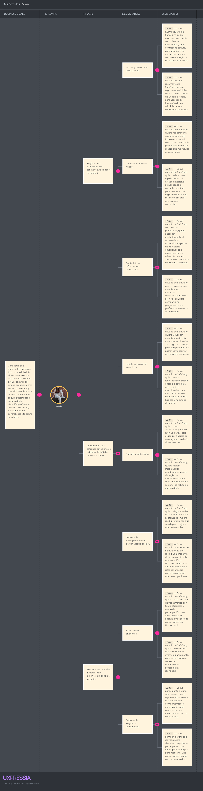

#### Impact Map 2: Dra. Laura Gómez

**Segundo Segmento Objetivo (Psicólogos Profesionales)**

*Figura: Impact Map de la Dra. Laura Gómez*

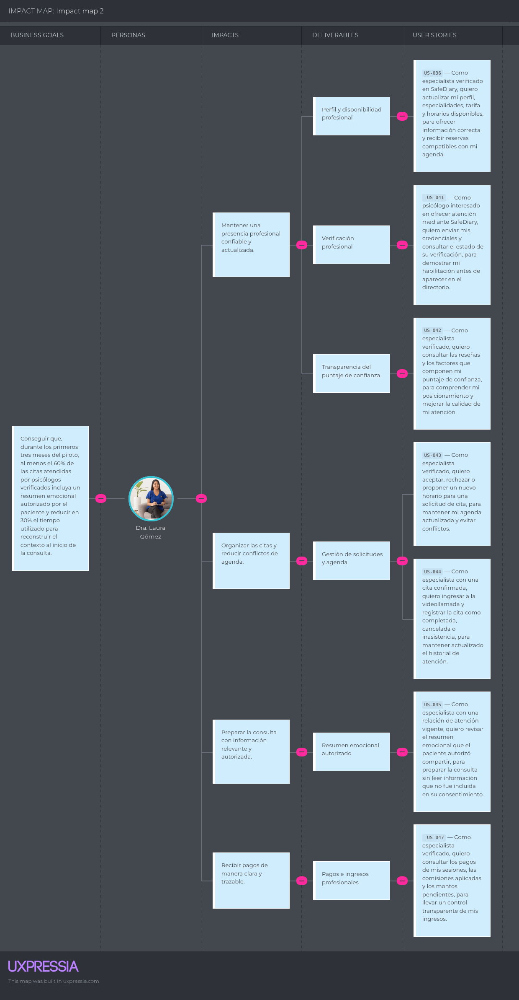


### 2.4.3. Product Backlog

El Product Backlog reúne y prioriza las historias de usuario (US) y las historias técnicas (TS) definidas en la sección 2.4.1, ordenándolas según el valor que aportan al negocio y la complejidad técnica que implica su desarrollo. La priorización combina dos criterios:

* **Valor de negocio por Épica:** siguiendo el Business Problem Statement y el Lean UX Canvas del Capítulo I, EP-01 (cuenta, seguridad, privacidad y consentimiento) y EP-02 (diario emocional, IA e insights) constituyen la base de la propuesta de valor y se priorizan primero, ya que sin identidad segura ni registro emocional no existe producto que ofrecer. EP-04 (atención profesional, citas, pagos y confianza) sigue en prioridad porque sostiene el modelo de ingresos descrito en la sección 2.1 (freemium, comisión por cita y convenios institucionales). EP-03 (comunidad segura y ayuda inmediata) se ubica como complemento de seguridad y contención. EP-05 (landing page) se distribuye en distintos momentos por tratarse de contenido de adquisición de menor complejidad técnica.
* **Estimación de esfuerzo:** cada historia fue estimada mediante Planning Poker utilizando la escala de Fibonacci (1, 2, 3, 5, 8 puntos), reflejando la complejidad técnica, el riesgo y las dependencias identificadas en las historias técnicas (TS) asociadas.

El orden resultante del backlog agrupa primero los elementos de mayor puntaje —correspondientes a la infraestructura crítica de seguridad, IA, pagos y tiempo real— y distribuye el resto según su aporte al MVP. Esta priorización alimenta directamente la planificación de los tres sprints que se detallarán en el Capítulo IV.

Enlace de trello: https://trello.com/invite/b/6aad90c13f858f04fc63f833/ATTI8fd9a76bec0c79fa8a7f8195257de3fcD372B969/product-backlog 

**Tabla 2. Product Backlog de SafeDiary**

| #Orden | Story ID | Título | Story Points (1/2/3/5/8) | Sprint |
| --- | --- | --- | --- | --- |
| 1 | TS-001 | Arquitectura modular y contratos de API | 8 | 1 |
| 2 | TS-002 | Cifrado y gestión segura de secretos | 8 | 1 |
| 3 | TS-003 | Pipeline privado de voz y análisis de IA | 8 | 1 |
| 4 | US-011 | Reflexión guiada por voz con IA | 8 | 1 |
| 5 | TS-004 | Infraestructura de audio anónimo en tiempo real | 8 | 2 |
| 6 | TS-006 | Orquestación idempotente de citas y pagos | 8 | 2 |
| 7 | US-037 | Pago seguro de una sesión | 8 | 2 |
| 8 | US-040 | Escalamiento seguro ante señales de crisis | 8 | 2 |
| 9 | US-002 | Exploración del directorio de especialistas | 5 | 2 |
| 10 | US-009 | Consentimiento para compartir historial | 5 | 2 |
| 11 | US-013 | Acceso inmediato a ayuda de crisis | 5 | 2 |
| 12 | US-014 | Reserva de videollamada profesional | 5 | 2 |
| 13 | US-036 | Gestión del perfil profesional y disponibilidad | 5 | 2 |
| 14 | US-038 | Acceso a la videollamada programada | 5 | 2 |
| 15 | US-039 | Calificación del especialista | 5 | 2 |
| 16 | TS-005 | Servicios de moderación y escalamiento seguro | 5 | 3 |
| 17 | TS-007 | Auditoría de accesos y consentimientos | 5 | 3 |
| 18 | TS-008 | Despliegue, observabilidad y recuperación segura | 5 | 3 |
| 19 | US-012 | Consulta de estadísticas emocionales | 5 | 3 |
| 20 | US-023 | Revocación del acceso al historial | 5 | 3 |
| 21 | US-025 | Protección de entradas en bóveda privada | 5 | 3 |
| 22 | US-033 | Eliminación de cuenta y datos personales | 5 | 3 |
| 23 | US-001 | Registro de cuenta | 3 | 1 |
| 24 | US-003 | Acceso con Google o Apple | 3 | 1 |
| 25 | US-008 | Registro de entrada de diario | 3 | 1 |
| 26 | US-010 | Registro rápido del estado emocional | 3 | 1 |
| 27 | US-015 | Desbloqueo biométrico | 3 | 1 |
| 28 | US-016 | Recuperación de contraseña | 3 | 1 |
| 29 | US-004 | Creación de sala de voz | 3 | 2 |
| 30 | US-005 | Participación en sala de voz | 3 | 2 |
| 31 | US-034 | Reporte y bloqueo en la comunidad | 3 | 2 |
| 32 | US-035 | Moderación de salas de voz | 3 | 2 |
| 33 | US-024 | Recordatorios de registro emocional | 3 | 3 |
| 34 | US-027 | Seguimiento emocional proactivo | 3 | 3 |
| 35 | US-028 | Exportación del progreso en PDF | 3 | 3 |
| 36 | US-031 | Registro de factores externos | 3 | 3 |
| 37 | US-006 | Edición del perfil personal | 2 | 1 |
| 38 | US-021 | Preguntas frecuentes y contacto | 2 | 2 |
| 39 | US-022 | Presentación de MindCluster | 2 | 2 |
| 40 | US-007 | Gestión de rutinas de autocuidado | 2 | 3 |
| 41 | US-026 | Personalización del tono de la IA | 2 | 3 |
| 42 | US-029 | Insignias por constancia emocional | 2 | 3 |
| 43 | US-030 | Ejercicios rápidos de regulación | 2 | 3 |
| 44 | US-032 | Recuerdos de evolución emocional | 2 | 3 |
| 45 | US-017 | Presentación de la propuesta de valor | 1 | 1 |
| 46 | US-018 | Presentación de funcionalidades principales | 1 | 1 |
| 47 | US-019 | Consulta de testimonios | 1 | 1 |
| 48 | US-020 | Consulta de planes y precios | 1 | 1 |


Trelo con el backlog: [Trello SafeDiary](https://trello.com/b/Q2UsNz3t/product-backlog)


## 2.5. Strategic-Level Domain-Driven Design


### 2.5.1. EventStorming


#### 2.5.1.1. Candidate Context Discovery


#### 2.5.1.2. Domain Message Flows Modeling


#### 2.5.1.3. Bounded Context Canvases

En esta sección se detallan los Bounded Context Canvases elaborados para los contextos candidatos del sistema, siguiendo el proceso iterativo recomendado por Domain-Driven Design: Context Overview Definition, Business Rules Distillation & Ubiquitous Language Capture, Capability Analysis, Dependencies Capture y Design Critique.

##### Bounded Context Canvas: AssistantAI

El Bounded Context de **AssistantAI** constituye el núcleo diferenciador e innovador de SafeDiary, proveyendo al usuario un acompañamiento reflexivo mediante modelos de lenguaje, clasificación emocional y mecanismos de seguridad clínica.

**Tabla 3. Bounded Context Canvas de AssistantAI**

| Sección del Canvas | Detalle y Especificación |
| --- | --- |
| **Name** | **AssistantAI** (AI Emotional Companion) |
| **Description** | Proporcionar acompañamiento emocional interactivo mediante inteligencia artificial, clasificando emociones predominantes, detectando distorsiones de pensamiento, activando protocolos de emergencia ante crisis y generando resúmenes estructurados para el soporte profesional. |
| **Strategic Classification** | • **Domain:** Core Domain *(capacidad diferenciadora y estratégica del negocio)*.<br>• **Business Model:** Engagement & Retention *(fomenta la reflexión diaria y la recurrencia)*.<br>• **Evolution:** Custom Built *(desarrollado a medida integrando modelos fundacionales de LLM mediante APIs externas)*. |
| **Domain Roles** | • **Analysis Context:** Analiza el texto y lenguaje natural de las conversaciones para clasificar estados afectivos y distorsiones cognitivas.<br>• **Execution Context:** Genera respuestas empáticas y resúmenes clínicos estructurados. |
| **Inbound Communication** | • **Mobile App (Frontend - 📱):**<br>  - `[Command] IniciarConversacion`<br>  - `[Command] EnviarMensajeTexto`<br>  - `[Command] CambiarPersonalidadIA`<br>• **Diary Context (Bounded Context - ☁️):**<br>  - `[Query] ConsultarEntradasSemanales`<br>• **Gemini LLM API (External System - ⚙️):**<br>  - `[Event] RespuestaIAGenerada` |
| **Ubiquitous Language** | • **AI Companion:** Asistente conversacional automatizado de soporte reflexivo sin emisión de diagnósticos médicos.<br>• **Emotional Reflection:** Mensaje empático y orientador generado por la IA para asistir la autorregulación emocional del paciente.<br>• **Cognitive Distortion:** Patrón de pensamiento desadaptativo detectado en el texto (ej. catastrofismo, sobregeneralización).<br>• **Crisis Protocol:** Flujo de contención y asistencia inmediata activado ante expresiones de riesgo autolesivo o desesperanza crítica.<br>• **Personality Tone:** Parámetro que calibra el estilo y calidez del lenguaje de la IA (empático, reflexivo, analítico).<br>• **Clinical Summary:** Reporte estructurado que compila emociones predominantes y episodios relevantes para la consulta del psicólogo. |
| **Business Decisions & Policies** | 1. **Protocolo de Seguridad en Crisis:** Si la evaluación de riesgo arroja una puntuación crítica de autoagresión o desesperanza total, se suspende la conversación estándar y se activa de inmediato el protocolo de crisis con la línea 988.<br>2. **Límite No Diagnóstico:** La IA tiene estrictamente prohibido prescribir fármacos o emitir diagnósticos clínicos patológicos; su función es únicamente de escucha reflexiva y síntesis de contexto.<br>3. **Adaptabilidad del Tono:** Toda reflexión generada debe apegarse al tono de personalidad seleccionado por el usuario en sus preferencias.<br>4. **Consolidación Semanal:** El resumen clínico se procesa automáticamente al corte de la semana agrupando exclusivamente las entradas autorizadas por el usuario. |
| **Outbound Communication** | • **Crisis Support Context (Bounded Context - ☁️ / Línea 988 - ⚙️):**<br>  - `[Event] ProtocoloDeCrisisActivado`<br>• **Professional Care Context (Bounded Context - ☁️):**<br>  - `[Event] ResumenClinicoSemanalGenerado`<br>• **Diary / Journaling Context (Bounded Context - ☁️):**<br>  - `[Event] ReflexionIAGenerada`<br>• **Gemini API (External System - ⚙️):**<br>  - `[Command] SolicitarAnalisisEmocional`<br>  - `[Command] SolicitarGeneracionTexto` |


### 2.5.2. Context Mapping


### 2.5.3. Software Architecture


#### 2.5.3.1. Software Architecture Context Level Diagrams


#### 2.5.3.2. Software Architecture Container Level Diagrams


#### 2.5.3.3. Software Architecture Deployment Diagrams


## 2.6. Tactical-Level Domain-Driven Design


### 2.6.1. Bounded Context: IAM

**IAM (Identity & Access Management)** es el contexto que sostiene la seguridad y el consentimiento de SafeDiary: administra la cuenta, la autenticación (correo, biometría, Google/Apple), la recuperación y eliminación de cuenta, la bóveda privada y, sobre todo, el consentimiento explícito y revocable que un paciente otorga a un especialista para acceder a su historial (US-001, US-003, US-009, US-015, US-016, US-023, US-025, US-033, US-045, US-046, TS-001, TS-002, TS-007). Ningún otro bounded context almacena credenciales, permisos de compartición o el registro de auditoría: todos consultan a IAM a través de su API para validar identidad o alcance de consentimiento (patrón Open Host Service / Published Language descrito en la futura sección 2.5.2 de Context Mapping).

#### 2.6.1.1. Domain Layer

**Entities y Aggregates**
- **Account (Aggregate Root):** id, email, passwordHash (nulo si el acceso es federado), status (active, suspended, pending_deletion), biometricEnabled, createdAt. La pantalla de acceso (mockup) confirma que `biometricEnabled` habilita dos flujos: el ingreso rápido a la sesión ("FaceID Quick Unlock") y, cuando el usuario abre una entrada protegida, la validación de `PrivateVault.verifyAccess()` ("Instant biometric entry to your vault") — es la misma credencial biométrica del dispositivo, pero IAM la evalúa en dos puntos de control distintos.
- **AuthProvider:** proveedor federado vinculado a una cuenta (Google, Apple) con su identificador externo.
- **Consent (Aggregate Root):** autorización otorgada por un paciente (ownerId) a un especialista (granteeId), con estado (active, revoked, expired) y su vigencia.
- **SharingPermission:** alcance concreto de un Consent (periodo y entradas autorizadas del diario).
- **PrivateVault (Aggregate Root):** espacio protegido por PIN o biometría que referencia entradas sensibles del diario sin almacenar su contenido.
- **AuditEvent (Aggregate Root, append-only):** registro trazable de un acceso, consentimiento, revocación o intento denegado.

**Value Objects**
- **AccountId, ConsentId, AuditEventId:** identificadores únicos del dominio.
- **AccountStatus:** ACTIVE, SUSPENDED, PENDING_DELETION.
- **ConsentStatus:** ACTIVE, REVOKED, EXPIRED.
- **AuditAction:** ACCESS_GRANTED, ACCESS_DENIED, CONSENT_GRANTED, CONSENT_REVOKED, VAULT_UNLOCKED.
- **AuthProviderType:** EMAIL, GOOGLE, APPLE.

**Domain Events**
- AccountRegistered, AccountAuthenticated, BiometricUnlockEnabled, PasswordResetRequested, AccountDeletionRequested, AccountDeleted, ConsentGranted, ConsentRevoked, VaultEntryProtected, AccessAudited.

**Commands**
- RegisterAccountCommand, AuthenticateWithProviderCommand, RequestPasswordResetCommand, ResetPasswordCommand, EnableBiometricUnlockCommand, RequestAccountDeletionCommand, GrantConsentCommand, RevokeConsentCommand, ProtectEntryInVaultCommand.

**Queries**
- GetAccountByIdQuery, GetActiveConsentsByOwnerQuery, GetConsentScopeForSpecialistQuery, GetAuditTrailByOwnerQuery.

**Domain Services (Contratos)**
- AccountAuthenticationService, ConsentAuthorizationService (verifica si una consulta de un especialista cae dentro del alcance vigente; es el contrato que consumen otros bounded contexts), VaultAccessService, AuditLogger.

#### 2.6.1.2. Interface Layer

**Controllers**
- **AccountsController:** registro, autenticación federada, biometría, recuperación de contraseña y eliminación de cuenta (US-001, US-003, US-015, US-016, US-033).
- **ConsentsController:** otorga, lista y revoca permisos de compartición (US-009, US-023).
- **VaultController:** protege y valida el acceso a entradas de la bóveda privada (US-025).
- **AuditController:** expone al especialista el alcance vigente de su consentimiento (US-045, US-046) y permite al paciente auditar sus accesos concedidos.

**Resources (Request/Response DTOs)**
- **Account:** RegisterAccountResource, AuthenticateResource, ResetPasswordResource, DeleteAccountResource.
- **Consent:** GrantConsentResource, RevokeConsentResource, ConsentScopeResource.
- **Vault:** ProtectEntryResource, VerifyVaultAccessResource.
- **Audit:** AuditEventResource, ConsentAuditTrailResource.

#### 2.6.1.3. Application Layer

**Command Handlers**
- **AccountCommandServiceImpl:** RegisterAccountCommand, AuthenticateWithProviderCommand, ResetPasswordCommand, RequestAccountDeletionCommand.
- **ConsentCommandServiceImpl:** GrantConsentCommand, RevokeConsentCommand.
- **VaultCommandServiceImpl:** ProtectEntryInVaultCommand.

**Query Handlers**
- **AccountQueryServiceImpl:** GetAccountByIdQuery.
- **ConsentQueryServiceImpl:** GetActiveConsentsByOwnerQuery, GetConsentScopeForSpecialistQuery (usada por otros contextos para validar acceso).
- **AuditQueryServiceImpl:** GetAuditTrailByOwnerQuery.

#### 2.6.1.4. Infrastructure Layer

**Repositories**
- **AccountRepository:** búsqueda por email y por proveedor federado + id externo; valida unicidad de correo.
- **ConsentRepository:** consultas de consentimientos activos por owner o por grantee; filtra por vigencia.
- **PrivateVaultRepository:** persistencia de la bóveda y sus referencias protegidas.
- **AuditEventRepository:** repositorio append-only, indexado por actor, objetivo y fecha.

**Adaptadores externos**
- **SecretsManagerAdapter:** gestiona claves de cifrado y credenciales fuera del código fuente (TS-002).
- **FederatedAuthAdapter:** integra Google Sign-In y Apple Sign-In.
- **EmailNotificationAdapter:** envía el enlace seguro de recuperación de contraseña (US-016).

#### 2.6.1.5. Bounded Context Software Architecture Component Level Diagrams

El siguiente código en **Structurizr DSL (C4 Model)** puede pegarse en [structurizr.com/dsl](https://structurizr.com/dsl) o en el [Structurizr Lite](https://docs.structurizr.com/lite) para generar el diagrama de componentes de IAM:

```text
workspace "SafeDiary - IAM (Component Diagram)" "C4 Component Diagram del bounded context IAM" {
    model {
        patient    = person "Paciente" "Administra su cuenta, biometría y consentimiento."
        specialist = person "Especialista Verificado" "Consulta el alcance de su consentimiento vigente."

        safeDiary = softwareSystem "SafeDiary" {

            iamApi = container "IAM API" "Gestiona cuentas, consentimiento, bóveda privada y auditoría." "ASP.NET Core / Node.js Web API" {
                accountsController = component "AccountsController" "Registro, login federado, biometría, recuperación y eliminación de cuenta." "REST Controller"
                consentsController = component "ConsentsController" "Otorga, consulta y revoca permisos de compartición." "REST Controller"
                vaultController    = component "VaultController" "Protege y consulta entradas en la bóveda privada." "REST Controller"
                auditController    = component "AuditController" "Expone el alcance vigente del consentimiento." "REST Controller"

                accountCmdService = component "AccountCommandServiceImpl" "Casos de uso de registro, autenticación y baja de cuenta." "Application Service"
                accountQryService = component "AccountQueryServiceImpl"   "Consultas de cuenta."                                   "Application Service"
                consentCmdService = component "ConsentCommandServiceImpl" "Otorga y revoca consentimiento."                        "Application Service"
                consentQryService = component "ConsentQueryServiceImpl"   "Consulta el alcance vigente."                           "Application Service"
                vaultService      = component "VaultCommandServiceImpl"   "Protege entradas sensibles."                            "Application Service"

                accountAggregate   = component "Account Aggregate"          "Invariantes de identidad y credenciales."               "Domain Model (DDD)"
                consentAggregate   = component "Consent Aggregate"          "Invariantes de autorización y revocación."              "Domain Model (DDD)"
                vaultAggregate     = component "PrivateVault Aggregate"     "Invariantes de acceso a la bóveda."                      "Domain Model (DDD)"
                consentAuthService = component "ConsentAuthorizationService" "Valida si un acceso está dentro del alcance autorizado." "Domain Service"
                auditLogger         = component "AuditLogger"               "Registra eventos sensibles sin duplicar contenido emocional." "Domain Service"

                accountRepo = component "AccountRepository"      "Persistencia de cuentas y proveedores federados." "Repository"
                consentRepo = component "ConsentRepository"      "Persistencia de consentimientos y su vigencia."   "Repository"
                vaultRepo   = component "PrivateVaultRepository" "Persistencia de la bóveda privada."               "Repository"
                auditRepo   = component "AuditEventRepository"  "Persistencia append-only de auditoría."           "Repository"

                secretsAdapter = component "SecretsManagerAdapter"    "Gestiona claves y credenciales fuera del código." "Infrastructure Adapter"
                oauthAdapter   = component "FederatedAuthAdapter"     "Integra Google y Apple Sign-In."                  "Infrastructure Adapter"
                mailAdapter    = component "EmailNotificationAdapter" "Envía enlaces de recuperación de contraseña."     "Infrastructure Adapter"
            }

            postgres = container "IAM Database" "Persistencia transaccional de identidad y consentimiento." "PostgreSQL 15"
            eventBus = container "Event Bus"    "Publica ConsentGranted, ConsentRevoked, AccountDeleted."   "RabbitMQ / Kafka"
        }

        profilesContext = softwareSystem "Profiles (Bounded Context externo)" "Valida el AccountId y el consentimiento antes de exponer perfiles y el directorio."

        patient    -> iamApi "Se autentica y administra su consentimiento" "HTTPS/JSON"
        specialist -> iamApi "Consulta el alcance de su consentimiento"    "HTTPS/JSON"

        accountsController -> accountCmdService "Envía comandos"
        accountsController -> accountQryService "Envía queries"
        consentsController -> consentCmdService "Envía comandos"
        consentsController -> consentQryService "Envía queries"
        vaultController    -> vaultService      "Envía comandos"
        auditController     -> consentQryService "Consulta alcance vigente"

        accountCmdService -> accountAggregate   "Orquesta"
        consentCmdService -> consentAggregate   "Orquesta"
        vaultService       -> vaultAggregate     "Orquesta"
        consentQryService  -> consentAuthService "Valida alcance"

        accountCmdService -> secretsAdapter "Cifra credenciales"
        accountCmdService -> oauthAdapter   "Valida identidad federada"
        accountCmdService -> mailAdapter    "Envía enlace de recuperación"

        accountCmdService -> accountRepo "Persiste"
        accountQryService -> accountRepo "Consulta"
        consentCmdService -> consentRepo "Persiste"
        consentQryService -> consentRepo "Consulta"
        vaultService       -> vaultRepo   "Persiste"
        auditLogger         -> auditRepo   "Persiste"

        accountRepo -> postgres "CRUD" "SQL/TCP"
        consentRepo -> postgres "CRUD" "SQL/TCP"
        vaultRepo   -> postgres "CRUD" "SQL/TCP"
        auditRepo   -> postgres "CRUD" "SQL/TCP"

        consentAggregate -> eventBus "Publica ConsentGranted / ConsentRevoked"
        accountAggregate -> eventBus "Publica AccountDeleted"

        profilesContext -> iamApi "Valida AccountId y consentimiento" "HTTPS/JSON"
    }

    views {
        component iamApi "IAM_Components" {
            include *
            autoLayout
        }
        styles {
            element "Person"          { shape Person background #08427b color #ffffff }
            element "Software System" { background #1168bd color #ffffff }
            element "Container"       { background #438dd5 color #ffffff }
            element "Component"       { background #85bbf0 color #000000 }
        }
    }
}
```

#### 2.6.1.6. Bounded Context Software Architecture Code Level Diagrams

##### 2.6.1.6.1. Bounded Context Domain Layer Class Diagrams

Código en **Mermaid** (puede pegarse en [mermaid.live](https://mermaid.live) para visualizarlo):

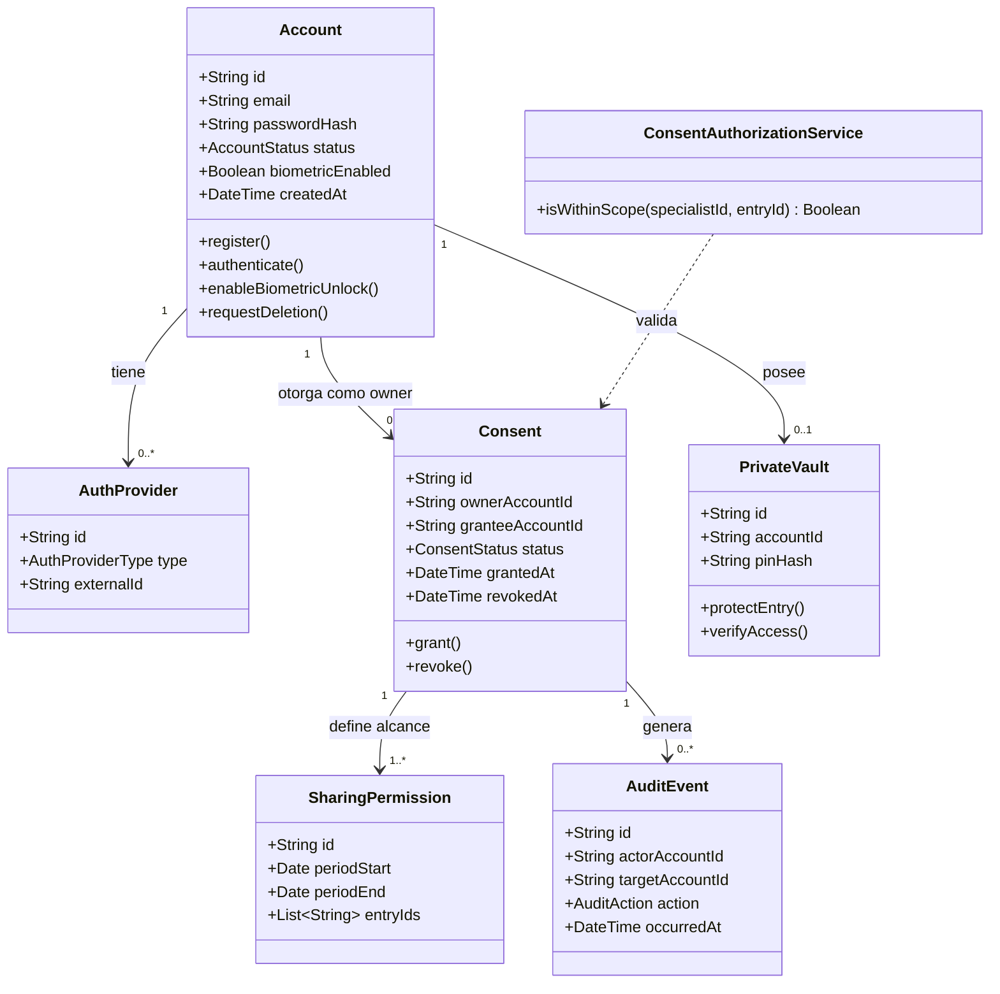

##### 2.6.1.6.2. Bounded Context Database Design Diagram

Código en **Mermaid ER Diagram** (también puede importarse en [dbdiagram.io](https://dbdiagram.io) adaptando la sintaxis):

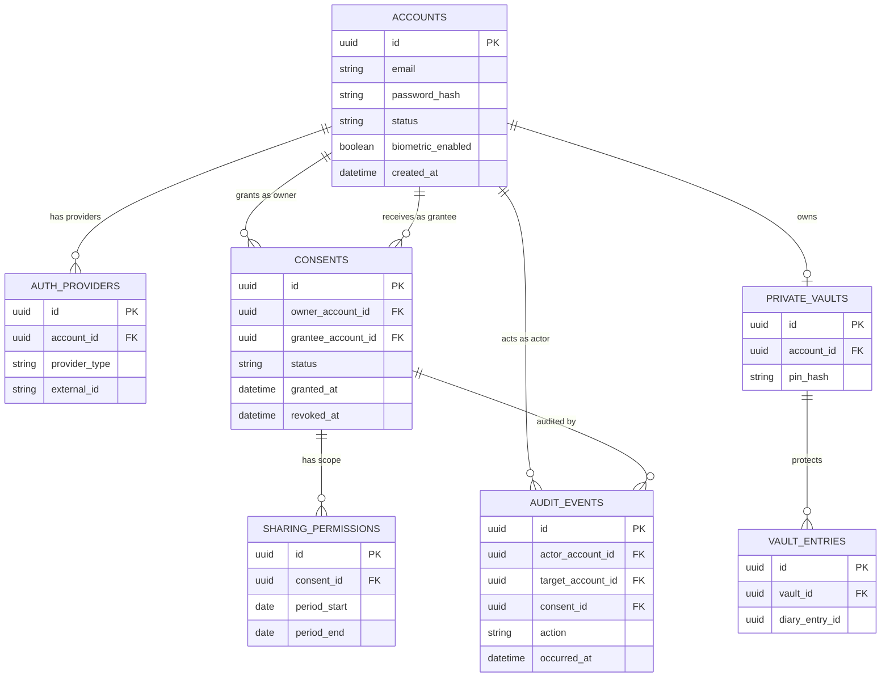


### 2.6.2. Bounded Context: Profiles

**Profiles** administra las distintas "caras" con las que un mismo Account (definido en IAM) se presenta dentro de SafeDiary: el perfil personal del paciente, su alias comunitario anónimo y la ficha profesional del especialista, incluyendo su solicitud de verificación (US-002, US-006, US-036, US-041, US-042). Profiles **no** almacena credenciales ni consentimiento —eso es responsabilidad exclusiva de IAM—; solo referencia el `accountId` y confía en IAM para validar la identidad. De igual forma, Profiles publica los datos de la ficha profesional (especialidades, tarifa, disponibilidad declarada) pero no gestiona la reserva transaccional de una cita, que corresponde a un futuro contexto de agendamiento.

Los mockups de la aplicación confirman y afinan tres detalles del modelo: (1) la pantalla *Home* muestra el `displayName` en el saludo ("Good morning, Elena") y el `avatarUrl` en la cabecera, tal como se modeló en `PersonalProfile`; (2) la pantalla *Support* expone en cada tarjeta de especialista credencial académica, título profesional, años de experiencia, la etiqueta "Accepts Insurance", un resumen de calificación (p. ej. "4.9 (140+)") y un ícono de marcador/favorito, información que **no** estaba en la primera versión del `ClinicianProfile` y que se incorpora a continuación; y (3) la pantalla *Community* indica "Voice Masking Active: Pitch Shift: Soft Whisper", confirmando que el `CommunityAlias` necesita una preferencia de enmascaramiento de voz que Rooms aplicará en tiempo real.

#### 2.6.2.1. Domain Layer

**Entities y Aggregates**
- **PersonalProfile (Aggregate Root):** id, accountId, displayName, avatarUrl, aiTonePreference, proactiveFollowUpEnabled, savedClinicianProfileIds[] (especialistas guardados/marcados desde el directorio — ícono de marcador en *Support*).
- **CommunityAlias (Aggregate Root):** id, accountId, aliasHandle, active, rotatedAt, voiceMaskPreset — identidad seudónima usada en Communities/Rooms, separada de la identidad clínica (ver Ubiquitous Language, sección 2.3.6). El `voiceMaskPreset` (p. ej. "Soft Whisper") es la preferencia que Rooms consulta para aplicar el efecto de voz sin exponer el tono real del usuario.
- **ClinicianProfile (Aggregate Root):** id, accountId, credential, title, specialties[], yearsOfExperience, bio, hourlyRate, currency, sessionDurationMinutes, insuranceAccepted, verificationStatus, publishedInDirectory, ratingAverage, reviewCount. Los dos últimos campos son un **read model** cacheado: Profiles no calcula reseñas ni confianza (eso pertenece a un futuro contexto de Pagos/Reseñas, ver Ubiquitous Language "Payments, Reviews & Trust"), solo los refleja en la ficha para no depender de una llamada síncrona cada vez que se lista el directorio.
- **AvailabilityWindow:** bloque recurrente (día, hora de inicio/fin, zona horaria) que el especialista publica como disponible. La "próxima disponibilidad" que muestra la tarjeta del directorio ("Next available: Today, 4:30 PM") es un valor compuesto a partir de estas ventanas y de los horarios ya reservados en el futuro contexto de agendamiento, no un campo propio de Profiles.
- **ClinicianVerification:** solicitud de verificación con sus documentos de credencial y su estado (PENDING, APPROVED, REJECTED).

**Value Objects**
- **DisplayName, AvatarUrl, AliasHandle:** identificadores de presentación.
- **Specialty, HourlyRate (Money), Timezone:** datos de la ficha profesional.
- **Credential, ProfessionalTitle:** p. ej. "Psy.D.", "LMFT", "MD" y "Licensed Clinical Psychologist" respectivamente.
- **RatingSummary:** ratingAverage + reviewCount, recibido por evento de integración.
- **VoiceMaskPreset:** NONE, SOFT_WHISPER, DEEP_TONE, ROBOTIC.
- **VerificationStatus:** PENDING, APPROVED, REJECTED.

**Domain Events**
- PersonalProfileUpdated, SpecialistSaved, SpecialistUnsaved, CommunityAliasRotated, VoiceMaskPresetUpdated, ClinicianVerificationRequested, ClinicianVerificationApproved, ClinicianVerificationRejected, ClinicianProfilePublished, ClinicianAvailabilityPublished.

**Commands**
- UpdatePersonalProfileCommand, SaveSpecialistCommand, RemoveSavedSpecialistCommand, RotateCommunityAliasCommand, UpdateVoiceMaskPresetCommand, SubmitClinicianVerificationCommand, ReviewClinicianVerificationCommand, UpdateClinicianProfileCommand, PublishAvailabilityWindowsCommand, ApplyClinicianRatingSummaryCommand (interna, disparada al recibir el evento de integración del contexto de Reseñas).

**Queries**
- GetPersonalProfileByAccountIdQuery, GetSavedSpecialistsByAccountIdQuery, GetCommunityAliasByAccountIdQuery, SearchClinicianProfilesQuery (por especialidad, tarifa, seguro y disponibilidad — soporta US-002), GetClinicianProfileByIdQuery, GetClinicianVerificationStatusQuery.

**Domain Services (Contratos)**
- **ClinicianDirectoryPublicationService:** decide si `publishedInDirectory = true` (requiere verificación aprobada y al menos una disponibilidad publicada).
- **AliasGenerationService:** genera y rota alias sin exponer la identidad clínica.

#### 2.6.2.2. Interface Layer

**Controllers**
- **PersonalProfilesController:** edición de nombre, foto y preferencias (US-006, US-026).
- **SpecialistBookmarksController:** guarda y elimina especialistas marcados desde el directorio (ícono de marcador en *Support*).
- **CommunityAliasesController:** genera, rota el alias comunitario y actualiza su preferencia de enmascaramiento de voz (pantalla *Community*).
- **ClinicianProfilesController:** publica y busca fichas profesionales (US-002, US-036, US-042).
- **ClinicianVerificationsController:** recibe y consulta solicitudes de verificación (US-041).

**Resources (Request/Response DTOs)**
- **PersonalProfile:** UpdatePersonalProfileResource, AiTonePreferenceResource.
- **SpecialistBookmark:** SaveSpecialistResource, SavedSpecialistListResource.
- **CommunityAlias:** CommunityAliasResource, VoiceMaskPresetResource.
- **ClinicianProfile:** UpdateClinicianProfileResource, ClinicianSearchResource, ClinicianProfileResource (incluye credential, title, yearsOfExperience, insuranceAccepted, ratingAverage, reviewCount), AvailabilityWindowResource.
- **ClinicianVerification:** SubmitVerificationResource, VerificationStatusResource.

#### 2.6.2.3. Application Layer

**Command Handlers**
- **PersonalProfileCommandServiceImpl:** UpdatePersonalProfileCommand.
- **SpecialistBookmarkCommandServiceImpl:** SaveSpecialistCommand, RemoveSavedSpecialistCommand.
- **CommunityAliasCommandServiceImpl:** RotateCommunityAliasCommand, UpdateVoiceMaskPresetCommand.
- **ClinicianProfileCommandServiceImpl:** UpdateClinicianProfileCommand, PublishAvailabilityWindowsCommand.
- **ClinicianVerificationServiceImpl:** SubmitClinicianVerificationCommand, ReviewClinicianVerificationCommand.
- **ClinicianRatingSyncServiceImpl:** ApplyClinicianRatingSummaryCommand, ejecutado al consumir el evento de integración `ClinicianRatingSummaryUpdated` publicado por el futuro contexto de Reseñas.

**Query Handlers**
- **PersonalProfileQueryServiceImpl:** GetPersonalProfileByAccountIdQuery, GetSavedSpecialistsByAccountIdQuery.
- **ClinicianDirectoryQueryServiceImpl:** SearchClinicianProfilesQuery, GetClinicianProfileByIdQuery, GetClinicianVerificationStatusQuery.

#### 2.6.2.4. Infrastructure Layer

**Repositories**
- **PersonalProfileRepository:** consultas por accountId.
- **SavedSpecialistRepository:** consultas de especialistas guardados por accountId; valida duplicados.
- **CommunityAliasRepository:** consultas por accountId; valida unicidad del alias activo.
- **ClinicianProfileRepository:** búsqueda por especialidad, tarifa, seguro y disponibilidad; filtra solo fichas publicadas para el directorio; ordena por calificación cacheada.
- **ClinicianVerificationRepository:** consultas por estado y por clinicianProfileId.

**Adaptadores externos**
- **DocumentStorageAdapter:** almacena las credenciales de verificación cifradas (bucket privado, acceso restringido a revisión administrativa).
- **ImageStorageAdapter:** almacena fotos de perfil y avatares.
- **ReviewsIntegrationEventListener:** consume `ClinicianRatingSummaryUpdated` desde el Event Bus y actualiza el read model de calificación de `ClinicianProfile` (Profiles solo lee este dato, nunca lo calcula).

#### 2.6.2.5. Bounded Context Software Architecture Component Level Diagrams

Código en **Structurizr DSL (C4 Model)**:

```text
workspace "SafeDiary - Profiles (Component Diagram)" "C4 Component Diagram del bounded context Profiles" {
    model {
        patient    = person "Paciente"    "Personaliza su perfil personal y su alias comunitario."
        specialist = person "Especialista" "Solicita verificación y publica su ficha profesional."
        visitor    = person "Usuario de la app" "Busca especialistas verificados en el directorio."

        safeDiary = softwareSystem "SafeDiary" {

            profilesApi = container "Profiles API" "Gestiona perfiles personales, alias comunitarios y fichas profesionales." "ASP.NET Core / Node.js Web API" {
                personalProfilesController       = component "PersonalProfilesController"       "Edición de nombre, foto y preferencias."         "REST Controller"
                bookmarksController              = component "SpecialistBookmarksController"    "Guarda y elimina especialistas marcados."        "REST Controller"
                communityAliasesController       = component "CommunityAliasesController"        "Genera, rota el alias y su enmascaramiento de voz." "REST Controller"
                clinicianProfilesController      = component "ClinicianProfilesController"       "Publica y busca fichas profesionales."           "REST Controller"
                clinicianVerificationsController = component "ClinicianVerificationsController"  "Recibe solicitudes de verificación."             "REST Controller"

                personalProfileCmdService    = component "PersonalProfileCommandServiceImpl"  "Actualiza el perfil personal."                          "Application Service"
                bookmarkCmdService           = component "SpecialistBookmarkCommandServiceImpl" "Guarda y elimina especialistas marcados."             "Application Service"
                aliasCmdService              = component "CommunityAliasCommandServiceImpl"   "Genera, rota el alias y su voiceMaskPreset."            "Application Service"
                clinicianCmdService          = component "ClinicianProfileCommandServiceImpl" "Actualiza especialidades, tarifa y disponibilidad."     "Application Service"
                verificationCmdService       = component "ClinicianVerificationServiceImpl"   "Procesa solicitudes de verificación."                   "Application Service"
                clinicianDirectoryQryService = component "ClinicianDirectoryQueryServiceImpl" "Busca especialistas por especialidad y disponibilidad." "Application Service"
                ratingSyncService            = component "ClinicianRatingSyncServiceImpl"     "Aplica el read model de calificación recibido por evento." "Application Service"

                personalProfileAggregate = component "PersonalProfile Aggregate" "Invariantes del perfil personal, incluye especialistas guardados." "Domain Model (DDD)"
                aliasAggregate           = component "CommunityAlias Aggregate"  "Invariantes del alias comunitario y su voiceMaskPreset."            "Domain Model (DDD)"
                clinicianAggregate       = component "ClinicianProfile Aggregate" "Invariantes de la ficha profesional."      "Domain Model (DDD)"
                publicationService       = component "ClinicianDirectoryPublicationService" "Determina si la ficha aparece en el directorio." "Domain Service"

                personalProfileRepo = component "PersonalProfileRepository"      "Persistencia de perfiles personales."             "Repository"
                savedSpecialistRepo = component "SavedSpecialistRepository"      "Persistencia de especialistas guardados."         "Repository"
                aliasRepo           = component "CommunityAliasRepository"       "Persistencia de alias comunitarios."              "Repository"
                clinicianRepo       = component "ClinicianProfileRepository"     "Persistencia y búsqueda de fichas profesionales." "Repository"
                verificationRepo    = component "ClinicianVerificationRepository" "Persistencia de solicitudes de verificación."    "Repository"

                docStorageAdapter    = component "DocumentStorageAdapter"          "Almacena credenciales de verificación cifradas." "Infrastructure Adapter"
                imageStorageAdapter  = component "ImageStorageAdapter"             "Almacena fotos de perfil y avatares."            "Infrastructure Adapter"
                reviewsEventListener = component "ReviewsIntegrationEventListener" "Consume ClinicianRatingSummaryUpdated."          "Infrastructure Adapter"
            }

            postgres = container "Profiles Database" "Persistencia de perfiles, alias y fichas profesionales."     "PostgreSQL 15"
            eventBus = container "Event Bus"        "Publica ClinicianVerificationApproved, ClinicianProfilePublished; transporta ClinicianRatingSummaryUpdated." "RabbitMQ / Kafka"
        }

        iamContext     = softwareSystem "IAM (Bounded Context externo)"    "Provee el AccountId autenticado y valida identidad antes de exponer un perfil."
        reviewsContext = softwareSystem "Reviews (Bounded Context futuro)" "Calcula reseñas y puntaje de confianza; publica ClinicianRatingSummaryUpdated."

        patient    -> profilesApi "Edita su perfil y alias"          "HTTPS/JSON"
        specialist -> profilesApi "Gestiona su ficha y verificación" "HTTPS/JSON"
        visitor    -> profilesApi "Busca especialistas verificados"  "HTTPS/JSON"

        personalProfilesController       -> personalProfileCmdService "Envía comandos"
        bookmarksController               -> bookmarkCmdService "Envía comandos"
        communityAliasesController       -> aliasCmdService "Envía comandos"
        clinicianProfilesController      -> clinicianCmdService "Envía comandos"
        clinicianProfilesController      -> clinicianDirectoryQryService "Envía queries"
        clinicianVerificationsController -> verificationCmdService "Envía comandos"

        personalProfileCmdService -> personalProfileAggregate "Orquesta"
        bookmarkCmdService          -> personalProfileAggregate "Agrega/quita especialista guardado"
        aliasCmdService             -> aliasAggregate "Orquesta"
        clinicianCmdService         -> clinicianAggregate "Orquesta"
        verificationCmdService      -> clinicianAggregate "Actualiza estado de verificación"
        clinicianCmdService         -> publicationService "Evalúa publicación"
        ratingSyncService            -> clinicianAggregate "Aplica ratingAverage / reviewCount"

        clinicianCmdService       -> docStorageAdapter "Almacena credenciales"
        personalProfileCmdService -> imageStorageAdapter "Almacena avatar"
        reviewsEventListener      -> ratingSyncService "Despacha ApplyClinicianRatingSummaryCommand"

        personalProfileCmdService    -> personalProfileRepo "Persiste"
        bookmarkCmdService              -> savedSpecialistRepo "Persiste"
        aliasCmdService                -> aliasRepo "Persiste"
        clinicianCmdService            -> clinicianRepo "Persiste"
        verificationCmdService         -> verificationRepo "Persiste"
        clinicianDirectoryQryService   -> clinicianRepo "Consulta"
        ratingSyncService               -> clinicianRepo "Persiste"

        personalProfileRepo -> postgres "CRUD" "SQL/TCP"
        savedSpecialistRepo -> postgres "CRUD" "SQL/TCP"
        aliasRepo           -> postgres "CRUD" "SQL/TCP"
        clinicianRepo       -> postgres "CRUD" "SQL/TCP"
        verificationRepo    -> postgres "CRUD" "SQL/TCP"

        clinicianAggregate -> eventBus "Publica ClinicianVerificationApproved / ClinicianProfilePublished"
        reviewsContext     -> eventBus "Publica ClinicianRatingSummaryUpdated"
        eventBus            -> reviewsEventListener "Entrega ClinicianRatingSummaryUpdated"

        profilesApi -> iamContext "Valida AccountId autenticado" "HTTPS/JSON"
    }

    views {
        component profilesApi "Profiles_Components" {
            include *
            autoLayout
        }
        styles {
            element "Person"          { shape Person background #08427b color #ffffff }
            element "Software System" { background #1168bd color #ffffff }
            element "Container"       { background #438dd5 color #ffffff }
            element "Component"       { background #85bbf0 color #000000 }
        }
    }
}
```

#### 2.6.2.6. Bounded Context Software Architecture Code Level Diagrams

##### 2.6.2.6.1. Bounded Context Domain Layer Class Diagrams

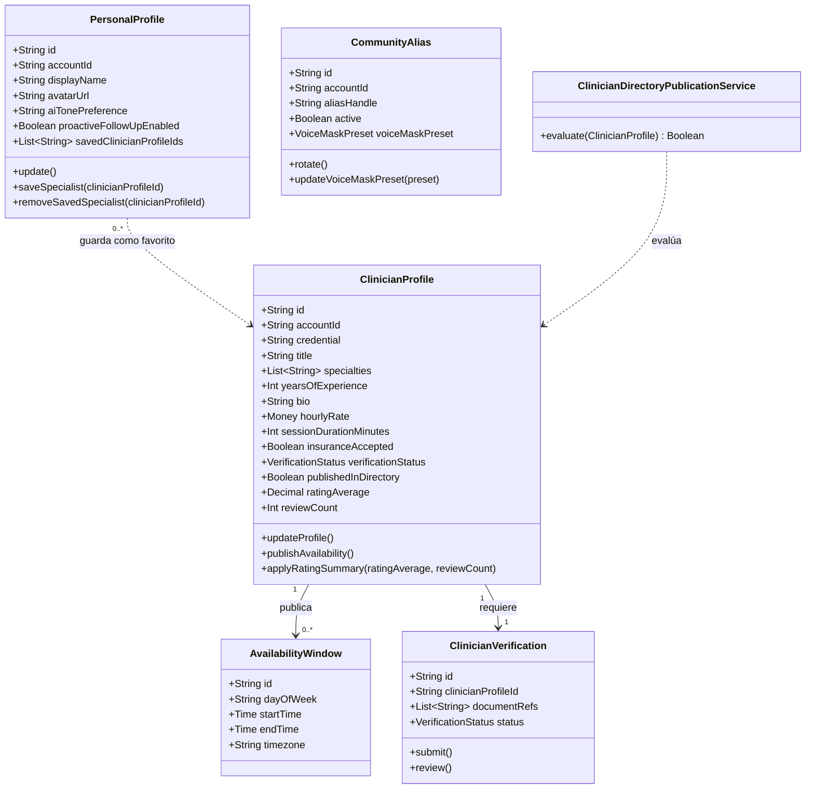

##### 2.6.2.6.2. Bounded Context Database Design Diagram

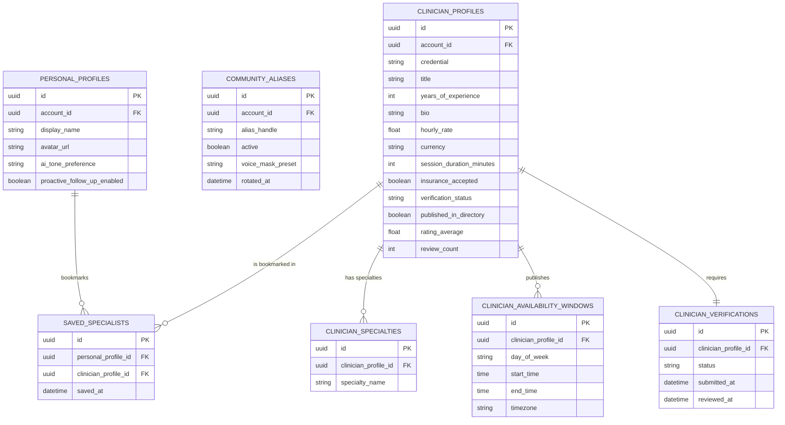


### 2.6.3. Bounded Context: AssistantAI

**AssistantAI** es el contexto nuclear que provee las capacidades de inteligencia artificial emocional de SafeDiary: orquesta sesiones conversacionales reflexivas mediante mensajes de texto, clasifica emociones predominantes alineadas a la rueda de Plutchik, detecta patrones de distorsión cognitiva, evalúa de forma preventiva el riesgo autolesivo para activar protocolos de crisis e integra resúmenes estructurados para enriquecer la atención clínica de los psicólogos (US-011, US-026, US-027, US-040, TS-003).

La interacción con el asistente se realiza **exclusivamente por vía textual**, reconociendo que para personas con ansiedad, depresión o sobrecarga emocional, hablar en voz alta representa una barrera psicológica intimidante; la escritura ofrece un ritmo propio de introspección y desahogo sin presión inmediata. 

AssistantAI actúa estrictamente bajo un principio ético de **no intervención diagnóstica**: la IA no emite juicios patológicos ni formula planes terapéuticos, sino que ofrece una escucha activa estructurada, validación emocional y destilación contextual. Para evitar el acoplamiento directo con proveedores comerciales de LLM, el contexto implementa un **Anti-Corruption Layer (ACL)** que traduce los contratos de OpenAI/Gemini al modelo de dominio de SafeDiary.

#### 2.6.3.1. Domain Layer

**Entities y Aggregates**
- **ConversationSession (Aggregate Root):** id, accountId, startedAt, endedAt, status (ACTIVE, CLOSED, CRISIS_TRIGGERED), currentTone, messages[]. Representa una interacción continua de diálogo reflexivo entre el usuario y el asistente de IA.
- **ConversationMessage:** id, sessionId, sender (USER, AI), content (texto de la reflexión o respuesta), sentAt, emotionTag (etiqueta normalizada según la rueda de Plutchik).
- **CognitiveDistortion:** distorsión de pensamiento detectada en el mensaje del paciente (ej. catastrofismo, pensamiento todo-o-nada, sobregeneralización), con su nivel de certeza y fragmento de evidencia.
- **RiskAssessment (Aggregate Root / Entity de seguridad):** id, sessionId, assessedAt, riskScore, riskLevel (LOW, MODERATE, CRITICAL), triggerKeywords[], crisisProtocolActivated. Registro inmutable de la evaluación de riesgo de la sesión.
- **ClinicalSummary (Aggregate Root):** id, accountId, periodStart, periodEnd, dominantEmotions[], keyTriggers[], synthesisNarrative, highlights[], generatedAt. Síntesis periódica generada para que el psicólogo prepare la sesión sin sobrecarga de lectura.

**Value Objects**
- **SessionId, MessageId, AssessmentId, SummaryId:** identificadores fuertemente tipados.
- **PersonalityTone:** EMPATHIC, REFLECTIVE, ANALYTICAL, CALM (calibra el estilo lingüístico del LLM).
- **RiskLevel:** LOW, MODERATE, CRITICAL.
- **PlutchikEmotionTag:** APPREHENSION, ACCEPTANCE, ANNOYANCE, VIGILANCE, PENSIVENESS, SERENITY, JOY, SADNESS, FEAR.
- **DistortionType:** CATASTROPHIZING, OVERGENERALIZATION, ALL_OR_NOTHING, EMOTIONAL_REASONING, MENTAL_FILTER.
- **SessionStatus:** ACTIVE, CLOSED, CRISIS_TRIGGERED.

**Domain Events**
- ConversationSessionStarted, UserMessageReceived, EmotionClassified, CognitiveDistortionDetected, RiskEvaluated, CrisisProtocolActivated, ReflectionGenerated, ClinicalSummaryGenerated, PersonalityToneUpdated.

**Commands**
- StartConversationCommand, SendTextMessageCommand, EvaluateRiskCommand, ActivateCrisisProtocolCommand, GenerateReflectionCommand, GenerateWeeklyClinicalSummaryCommand, ChangePersonalityToneCommand.

**Queries**
- GetActiveConversationSessionQuery, GetSessionHistoryByAccountQuery, GetWeeklyClinicalSummaryQuery, GetCurrentRiskAssessmentQuery.

**Domain Services (Contratos)**
- **RiskPolicyService:** determina si los indicadores y puntajes de riesgo exigen interrumpir la conversación estándar y disparar la alerta de emergencia (línea 988).
- **EmotionClassifierService:** normaliza los resultados de inferencia afectiva hacia los vectores estandarizados de Plutchik.
- **ClinicalSummarySynthesizerService:** procesa el historial semanal de reflexiones para compilar detonantes y patrones clave sin exponer transcripciones literales no autorizadas.

#### 2.6.3.2. Interface Layer

**Controllers**
- **AiConversationsController:** inicia sesiones de diálogo, recibe mensajes de texto reflexivos, expone las respuestas generadas y el historial de interacción (US-011, US-027).
- **AiPreferencesController:** consulta y actualiza el tono de personalidad y las preferencias del asistente para la cuenta (US-026).
- **CrisisAlertController:** expone el estado de seguridad de la sesión, desencadenando recursos de emergencia y enlaces con líneas de ayuda locales (US-040).
- **ClinicalSummariesController:** expone al psicólogo el resumen emocional autorizado y permite la generación bajo demanda de reportes de periodo (US-045).

**Resources (Request/Response DTOs)**
- **Conversation:** StartSessionResource, SendTextMessageResource, ConversationSessionResource, MessageResource, ReflectionResponseResource.
- **Preferences:** PersonalityToneResource, UpdateAiToneResource.
- **Crisis:** CrisisEvaluationResource, EmergencyHotlineResource.
- **ClinicalSummary:** ClinicalSummaryResource, WeeklyEmotionalOverviewResource.

#### 2.6.3.3. Application Layer

**Command Handlers**
- **ConversationCommandServiceImpl:** StartConversationCommand, SendTextMessageCommand, GenerateReflectionCommand.
- **CrisisCommandServiceImpl:** EvaluateRiskCommand, ActivateCrisisProtocolCommand.
- **ClinicalSummaryCommandServiceImpl:** GenerateWeeklyClinicalSummaryCommand.
- **AiPreferencesCommandServiceImpl:** ChangePersonalityToneCommand.

**Query Handlers**
- **ConversationQueryServiceImpl:** GetActiveConversationSessionQuery, GetSessionHistoryByAccountQuery.
- **ClinicalSummaryQueryServiceImpl:** GetWeeklyClinicalSummaryQuery.
- **CrisisQueryServiceImpl:** GetCurrentRiskAssessmentQuery.

**Event Handlers**
- **CriticalRiskDetectedEventHandler:** reacciona al evento `RiskEvaluated` para activar la política de contención y notificar al bus de eventos.
- **WeeklySummaryTriggerEventHandler:** procesa la tarea programada de cierre semanal para sintetizar las reflexiones del paciente.

#### 2.6.3.4. Infrastructure Layer

**Repositories**
- **ConversationSessionRepository:** persistencia relacional de sesiones y mensajes cronológicos.
- **RiskAssessmentRepository:** persistencia append-only de evaluaciones de riesgo clínico.
- **ClinicalSummaryRepository:** persistencia y consulta indexada por cuenta y rango de fechas de resúmenes clínicos.

**Adaptadores externos**
- **GeminiLlmAdapter (ACL):** Anti-Corruption Layer que encapsula los llamados HTTP/gRPC a Google Gemini API para extracción de entidades, clasificación de emociones y síntesis textual empática.
- **CrisisHotlineAdapter:** directorio de integración con servicios y marcadores de líneas de emergencia (Línea 988 / 113 Minsa en Perú).

#### 2.6.3.5. Bounded Context Software Architecture Component Level Diagrams

Código en **Structurizr DSL (C4 Model)** para el componente de AssistantAI:

```text
workspace "SafeDiary - AssistantAI (Component Diagram)" "C4 Component Diagram del bounded context AssistantAI" {
    model {
        patient = person "Paciente" "Interactúa mediante texto reflexivo con la IA, consulta reflexiones y ajusta el tono."

        safeDiary = softwareSystem "SafeDiary" {
            assistantAiApi = container "AssistantAI API" "Procesa conversaciones por texto, clasifica emociones, evalúa riesgos y genera resúmenes." "ASP.NET Core / Python FastAPI" {
                conversationsController     = component "AiConversationsController" "Endpoints para iniciar chats, enviar mensajes de texto y recibir reflexiones." "REST Controller"
                aiPreferencesController     = component "AiPreferencesController" "Endpoints para consultar y actualizar el tono de personalidad de la IA." "REST Controller"
                clinicalSummariesController = component "ClinicalSummariesController" "Endpoints para generar y consultar resúmenes estructurados para especialistas." "REST Controller"
                crisisAlertController       = component "CrisisAlertController" "Endpoints de consulta de estado de emergencia y líneas de ayuda." "REST Controller"

                conversationCmdService  = component "ConversationCommandServiceImpl" "Orquesta el procesamiento de mensajes de texto y reflexiones." "Application Service"
                conversationQryService  = component "ConversationQueryServiceImpl" "Consultas de historial de interacciones con la IA." "Application Service"
                summaryCmdService       = component "ClinicalSummaryCommandServiceImpl" "Compila y sintetiza resúmenes clínicos periódicos." "Application Service"
                crisisEvaluationService = component "CrisisEvaluationServiceImpl" "Aplica políticas de detección de riesgo y activación de protocolos." "Application Service"

                conversationAggregate    = component "ConversationSession Aggregate" "Invariantes de la sesión de diálogo, mensajes y turnos." "Domain Model (DDD)"
                riskAssessmentEntity     = component "RiskAssessment Entity" "Invariantes de evaluación de riesgo e indicadores críticos." "Domain Model (DDD)"
                clinicalSummaryAggregate = component "ClinicalSummary Aggregate" "Invariantes de la síntesis semanal de emociones y detonantes." "Domain Model (DDD)"
                riskPolicyService        = component "RiskPolicyService" "Valida si el puntaje de riesgo exige activación de protocolo de emergencia." "Domain Service"
                emotionClassifierService = component "EmotionClassifierService" "Normaliza etiquetas emocionales hacia la rueda de Plutchik." "Domain Service"

                conversationRepo    = component "ConversationSessionRepository" "Persistencia de sesiones de conversación y mensajes." "Repository"
                clinicalSummaryRepo = component "ClinicalSummaryRepository" "Persistencia de resúmenes clínicos semanales." "Repository"
                riskAssessmentRepo  = component "RiskAssessmentRepository" "Persistencia de auditoría de evaluaciones de riesgo." "Repository"

                geminiLlmAdapter     = component "GeminiLlmAdapter" "Cliente Anti-Corruption Layer hacia Google Gemini API." "Infrastructure Adapter"
                crisisHotlineAdapter = component "CrisisHotlineAdapter" "Conecta con catálogos y protocolos de líneas de emergencia (988)." "Infrastructure Adapter"
            }

            postgres = container "AssistantAI Database" "Persistencia de conversaciones, evaluaciones de riesgo y resúmenes." "PostgreSQL 15"
            eventBus = container "Event Bus" "Publica CrisisProtocolActivated, ClinicalSummaryGenerated, ReflectionGenerated." "RabbitMQ / Kafka"
        }

        diaryContext    = softwareSystem "Diary (Bounded Context externo)" "Provee entradas de diario y recibe reflexiones generadas."
        clinicalContext = softwareSystem "Professional Care (Bounded Context externo)" "Recibe resúmenes clínicos para la preparación de consultas."
        geminiApi       = softwareSystem "Google Gemini API (External System)" "Modelo fundacional LLM para análisis de lenguaje natural y generación."
        crisisService   = softwareSystem "Línea de Crisis 988 (External System)" "Servicio telefónico y digital de emergencia y contención humana."

        # Interacciones del paciente con controladores
        patient -> conversationsController "Envía mensajes de texto reflexivos" "HTTPS/JSON"
        patient -> aiPreferencesController "Configura tono de personalidad" "HTTPS/JSON"
        patient -> crisisAlertController   "Consulta recursos y líneas de emergencia" "HTTPS/JSON"

        # Controladores a servicios de aplicación
        conversationsController     -> conversationCmdService  "Envía comandos de conversación"
        conversationsController     -> conversationQryService  "Envía queries de historial"
        aiPreferencesController     -> conversationCmdService  "Envía comandos de personalización"
        clinicalSummariesController -> summaryCmdService       "Dispara generación de resumen"
        crisisAlertController       -> crisisEvaluationService "Consulta estado de riesgo"

        # Servicios de aplicación a dominio
        conversationCmdService  -> conversationAggregate    "Orquesta mensajes"
        conversationCmdService  -> riskPolicyService        "Evalúa riesgo de contenido"
        conversationCmdService  -> emotionClassifierService "Clasifica emociones"
        crisisEvaluationService -> riskAssessmentEntity     "Registra evaluación"
        summaryCmdService       -> clinicalSummaryAggregate "Genera resumen"

        # Servicios de aplicación a adaptadores externos
        conversationCmdService  -> geminiLlmAdapter     "Genera reflexión y analiza distorsiones"
        crisisEvaluationService -> crisisHotlineAdapter "Obtiene recursos locales"
        summaryCmdService       -> geminiLlmAdapter     "Sintetiza tendencias semanales"

        # Adaptadores a sistemas externos
        geminiLlmAdapter     -> geminiApi       "Solicita inferencia LLM" "HTTPS/gRPC"
        crisisHotlineAdapter -> crisisService   "Enlaza con protocolo 988" "Tel/HTTPS"

        # Servicios de aplicación a repositorios
        conversationCmdService  -> conversationRepo    "Persiste"
        conversationQryService  -> conversationRepo    "Consulta"
        crisisEvaluationService -> riskAssessmentRepo  "Persiste"
        summaryCmdService       -> clinicalSummaryRepo "Persiste"

        # Repositorios a base de datos
        conversationRepo    -> postgres "CRUD" "SQL/TCP"
        clinicalSummaryRepo -> postgres "CRUD" "SQL/TCP"
        riskAssessmentRepo  -> postgres "CRUD" "SQL/TCP"

        # Eventos al Event Bus
        conversationAggregate    -> eventBus "Publica ReflectionGenerated"
        riskAssessmentEntity     -> eventBus "Publica CrisisProtocolActivated"
        clinicalSummaryAggregate -> eventBus "Publica ClinicalSummaryGenerated"

        # Integraciones entre bounded contexts
        eventBus     -> clinicalContext         "Entrega ClinicalSummaryGenerated"
        eventBus     -> diaryContext            "Entrega ReflectionGenerated"
        diaryContext -> conversationsController "Sincroniza entradas para contexto" "HTTPS/JSON"
    }

    views {
        component assistantAiApi "AssistantAI_Components" {
            include *
            autoLayout
        }

        styles {
            element "Person" {
                shape Person
                background #08427b
                color #ffffff
            }
            element "Software System" {
                background #1168bd
                color #ffffff
            }
            element "Container" {
                background #438dd5
                color #ffffff
            }
            element "Component" {
                background #85bbf0
                color #000000
            }
        }
    }
}
```

#### 2.6.3.6. Bounded Context Software Architecture Code Level Diagrams

##### 2.6.3.6.1. Bounded Context Domain Layer Class Diagrams

Código en **Mermaid Class Diagram**:

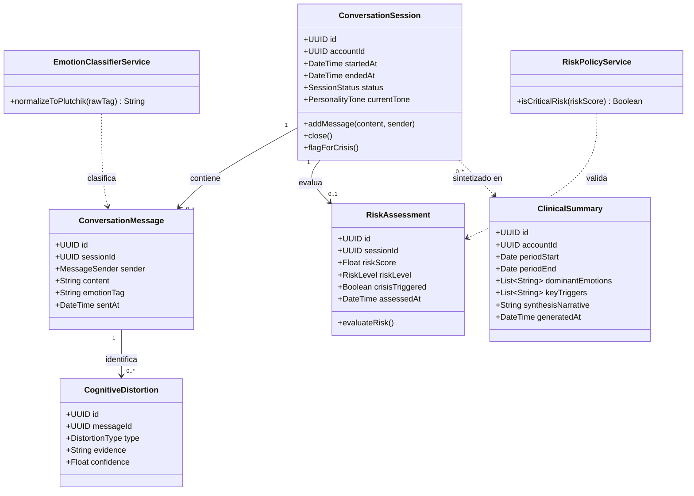

##### 2.6.3.6.2. Bounded Context Database Design Diagram

Código en **Mermaid ER Diagram** para la base de datos relacional de AssistantAI:

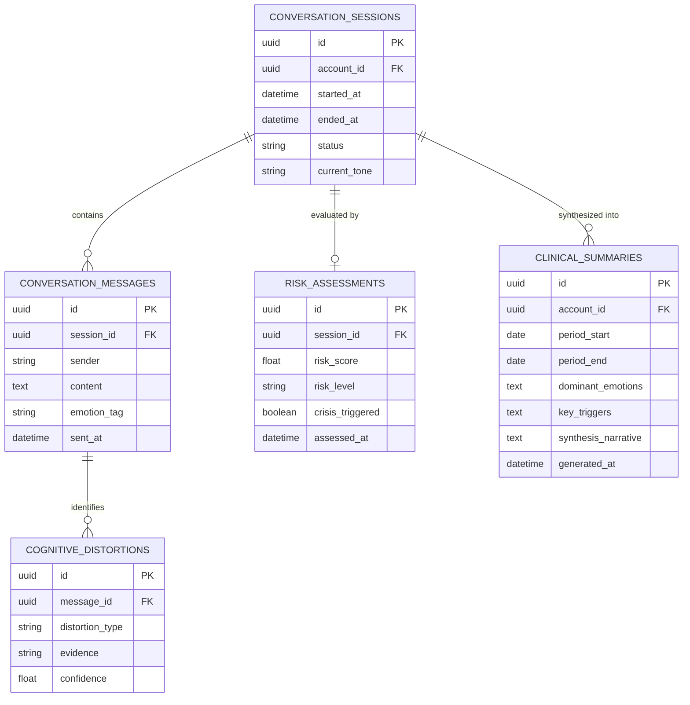


### 2.6.4. Bounded Context: Communities


#### 2.6.4.1. Domain Layer


#### 2.6.4.2. Interface Layer


#### 2.6.4.3. Application Layer


#### 2.6.4.4. Infrastructure Layer


#### 2.6.4.5. Bounded Context Software Architecture Component Level Diagrams


#### 2.6.4.6. Bounded Context Software Architecture Code Level Diagrams


##### 2.6.4.6.1. Bounded Context Domain Layer Class Diagrams


##### 2.6.4.6.2. Bounded Context Database Design Diagram


### 2.6.5. Bounded Context: Rooms


#### 2.6.5.1. Domain Layer


#### 2.6.5.2. Interface Layer


#### 2.6.5.3. Application Layer


#### 2.6.5.4. Infrastructure Layer


#### 2.6.5.5. Bounded Context Software Architecture Component Level Diagrams


#### 2.6.5.6. Bounded Context Software Architecture Code Level Diagrams


##### 2.6.5.6.1. Bounded Context Domain Layer Class Diagrams


##### 2.6.5.6.2. Bounded Context Database Design Diagram


### 2.6.6. Bounded Context: Diary


#### 2.6.6.1. Domain Layer


#### 2.6.6.2. Interface Layer


#### 2.6.6.3. Application Layer


#### 2.6.6.4. Infrastructure Layer


#### 2.6.6.5. Bounded Context Software Architecture Component Level Diagrams


#### 2.6.6.6. Bounded Context Software Architecture Code Level Diagrams


##### 2.6.6.6.1. Bounded Context Domain Layer Class Diagrams


##### 2.6.6.6.2. Bounded Context Database Design Diagram


### 2.6.7. Bounded Context: Rutines


#### 2.6.7.1. Domain Layer


#### 2.6.7.2. Interface Layer


#### 2.6.7.3. Application Layer


#### 2.6.7.4. Infrastructure Layer


#### 2.6.7.5. Bounded Context Software Architecture Component Level Diagrams


#### 2.6.7.6. Bounded Context Software Architecture Code Level Diagrams


##### 2.6.7.6.1. Bounded Context Domain Layer Class Diagrams


##### 2.6.7.6.2. Bounded Context Database Design Diagram