# Capítulo II: Requirements Development and Software Solution Design


## 2.1. Competidores

BetterHelp, Headspace y terapIA compiten en diferentes aspectos del bienestar emocional: la atención psicológica online, el autocuidado y el acompañamiento con inteligencia artificial. SafeDiary se plantea como un puente entre la expresión privada, el apoyo comunitario y la atención profesional. Su propuesta reúne estos espacios en una experiencia móvil dirigida a **pacientes jóvenes** y **psicólogos profesionales**, donde cada persona decide cómo expresarse, cuándo buscar ayuda y qué información compartir.


### 2.1.1. Análisis competitivo

**Competitive Analysis Landscape**

**¿Por qué llevar a cabo este análisis?**

El análisis permite comprender cómo las soluciones existentes acompañan a las personas antes, durante y entre sus sesiones psicológicas. Su propósito es identificar qué necesidades ya están cubiertas y qué aspectos puede mejorar SafeDiary: registrar experiencias cuando ocurren, organizar emociones y compartir contexto útil con el psicólogo mediante una decisión explícita del paciente.

#### Logos

| SafeDiary | BetterHelp | Headspace | terapIA |
| :---: | :---: | :---: | :---: |
| 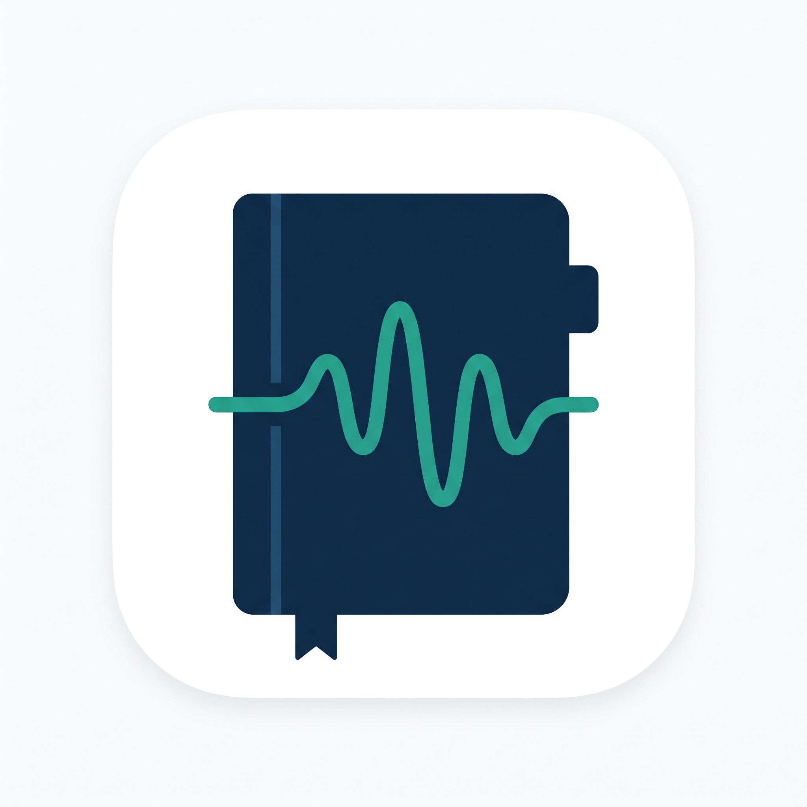 |  |  |  |

#### Perfil

| Criterio | SafeDiary | BetterHelp | Headspace | terapIA |
| --- | --- | --- | --- | --- |
| Overview | Aplicación móvil de bienestar emocional que integra un diario inteligente, la conexión con psicólogos verificados. Su propuesta permite expresar pensamientos mediante texto o voz, comprender cambios emocionales y conservar un historial privado. El usuario puede avanzar a su propio ritmo desde la reflexión personal hasta una consulta profesional, compartiendo únicamente la información que autorice. | Plataforma de terapia online con sesiones y mensajería con el terapeuta. | Plataforma de bienestar con meditación, recursos para dormir y Ebb, su acompañante de IA; también ofrece terapia sujeta a elegibilidad. | Aplicación de apoyo emocional en español centrada en Pía, una IA con la que se puede conversar por texto o voz. Integra herramientas de autoconocimiento y bienestar personal. |
| Ventaja competitiva ¿Que valor ofrece a los clientes? | Conecta el registro cotidiano con el acompañamiento humano. Para el paciente, ofrece un espacio donde desahogarse, reconocer patrones y encontrar apoyo sin perder el control de su información. Para el psicólogo, propone resúmenes y registros autorizados que aportan contexto entre consultas. La combinación de diario, rutinas y atención profesional busca dar continuidad al cuidado emocional dentro de una misma aplicación. | Combina atención profesional con herramientas de seguimiento, incluido un diario que puede compartirse con el terapeuta. | Facilita prácticas de autocuidado y reflexión con recomendaciones de meditaciones y actividades mediante Ebb. | Acompañamiento automatizado sin cita y continuidad entre conversaciones, junto con herramientas para reflexionar y organizar metas personales. |


#### Perfil de marketing

| Criterio | SafeDiary | BetterHelp | Headspace | terapIA |
| --- | --- | --- | --- | --- |
| Mercado objetivo | Pacientes jóvenes que desean expresar y comprender sus emociones entre consultas, especialmente cuando el estrés académico o laboral dificulta ordenar lo que sienten. También se dirige a psicólogos profesionales que necesitan información contextual clara para preparar y personalizar la atención. El diseño contempla a usuarios preocupados por el juicio social, la privacidad y la dificultad de pedir apoyo. | Personas que buscan terapia online y comunicación con un terapeuta. | Usuarios interesados en bienestar cotidiano; su servicio de terapia está dirigido a adultos residentes en Estados Unidos y se ofrece en inglés. | Personas de habla hispana que buscan expresarse, conocerse mejor y construir hábitos de bienestar, con o sin experiencia previa de atención psicológica. |
| Estrategias y recursos de marketing | Demostraciones del recorrido completo: registrar una emoción, revisar un resumen y decidir si compartirlo. Contenido educativo en español sobre expresión emocional, privacidad y uso responsable de la IA; difusión de las rutinas y del directorio profesional. Pilotos y colaboración con psicólogos para acercar la aplicación a pacientes jóvenes y comunicar su valor con experiencias de uso concretas. | Contenido informativo sobre terapia, explicación de costos y acceso al registro desde sus páginas. | Prueba de suscripción, presentación de Ebb y testimonios de usuarios como recursos de captación. | Presentación de Pía, testimonios, blog y contenidos sobre acompañamiento emocional; promoción de la descarga y del acceso al chat. |

#### Perfil de producto

| Criterio | SafeDiary | BetterHelp | Headspace | terapIA |
| --- | --- | --- | --- | --- |
| Productos y servicios | Diario por texto o voz con transcripción, reflexión asistida, etiquetas emocionales y extracción de palabras clave; historial confidencial, gráficos de evolución y resúmenes por período. Directorio de psicólogos verificados con especialidad, disponibilidad y tarifa; reserva de citas, videollamadas y pago de sesiones. Sistema de confianza con reseñas y criterios transparentes sobre la actividad profesional. | Sesión semanal, mensajería, grupos de apoyo, herramientas de hábitos y diario. | Meditaciones, recursos de sueño, ejercicios y Ebb; sesiones con profesionales mediante su oferta de terapia. | Chat con Pía, diario con texto, imágenes y notas de voz, cuestionarios de autoexploración, objetivos, hábitos, cartas al futuro y logros. |
| Registro y continuidad entre sesiones | Conserva experiencias cuando ocurren, incluyendo detalles que pueden olvidarse al llegar a consulta. Propone organizar entradas por período y mostrar emociones predominantes, posibles detonantes y variaciones a lo largo del tiempo. El paciente revisa el resumen, elige qué compartir y puede revocar el acceso. El psicólogo recibe contexto complementario para la conversación clínica, sin exponer el resto del diario. | Permite escribir y compartir entradas del diario con el terapeuta, además de actualizar objetivos y hábitos. | Conversación y reflexión mediante Ebb. Disponibilidad de un diario por voz con resumen compartible: por confirmar. | Historial de conversaciones y diario para revisar experiencias y avances. Integración de resúmenes autorizados con un psicólogo: por confirmar. |
| Precios y costos | Modelo freemium con una versión gratuita y planes de pago que amplían las funcionalidades disponibles. Se cobrará a los psicólogos una pequeña comisión por las citas gestionadas a través de la plataforma. Como vía adicional de comercialización, se contempla ofrecer convenios y planes institucionales a universidades, colegios, clínicas, empresas y otras organizaciones para facilitar el acceso de sus estudiantes y colaboradores a SafeDiary. | En Estados Unidos: **US$70–100 por semana** sin seguro, variable según ubicación y condiciones. No constituye una tarifa para Perú. | Suscripción de autocuidado con Ebb: **US$69.99 al año** después de la prueba. La terapia tiene costos separados según cobertura y ubicación. | Compras dentro de la aplicación. Pía Plus ofrece suscripción mensual o anual; importe vigente por confirmar. |
| Canales de distribución | Distribución prevista mediante App Store para iOS, Google Play Store para Android y acceso web desde el navegador. | Servicio online mediante web y aplicación. | Aplicación Headspace y sitio web de suscripción y acceso a terapia. | Aplicaciones para Android e iOS y acceso web al chat con Pía. |


#### Análisis SWOT (FODA)

| Criterio | SafeDiary | BetterHelp | Headspace | terapIA |
| --- | --- | --- | --- | --- |
| Fortalezas | Propuesta integrada que combina expresión privada, apoyo comunitario y atención profesional. Registro flexible por voz o texto, visualización de patrones y resúmenes orientados a la consulta. El consentimiento explícito y revocable, el cifrado de información sensible y la separación de identidades forman parte del diseño. Su enfoque en pacientes jóvenes y psicólogos permite atender necesidades de ambos lados de la relación terapéutica. | Atención profesional y herramientas de diario y seguimiento dentro de un mismo servicio. | Combina recursos de autocuidado, acompañamiento con IA y una oferta de terapia. | Experiencia en español que reúne IA conversacional y herramientas de reflexión personal, con acceso sin citas. |
| Debilidades | Necesita validar la precisión y utilidad de sus resúmenes, la constancia del registro y la adopción por parte de los psicólogos. Integrar audio, IA y consultas exige recursos técnicos y operativos, especialmente para protección de datos. El valor del directorio depende de contar con profesionales verificados y disponibilidad suficiente. | El costo recurrente puede dificultar la adopción por jóvenes con presupuesto limitado; su costo final para usuarios en Perú está por confirmar. | Su oferta de terapia tiene restricciones de país e idioma que limitan su ajuste al público peruano. | El acompañamiento automatizado no brinda evaluación ni tratamiento clínico; su utilidad depende de la adecuación de las respuestas al contexto personal. |
| Oportunidades | Atender la pérdida de contexto entre consultas y la dispersión de notas y audios personales. Facilitar que pacientes jóvenes del entorno peruano encuentren un espacio de escucha y una ruta clara hacia el profesional. Trabajar con psicólogos para ajustar los resúmenes a sus necesidades y fortalecer la continuidad del registro, el apoyo social y la preparación de las sesiones. | Mejorar la organización del diario para facilitar la revisión de experiencias entre sesiones. | Profundizar la conexión entre reflexión cotidiana y atención profesional en más idiomas y mercados. | Desarrollar formas de conectar la reflexión personal con el apoyo profesional y mejorar la continuidad de los hábitos. |
| Amenazas | Competidores que incorporen funciones similares, abandono del hábito de registro y preferencia por herramientas que el usuario ya conoce. Errores de interpretación de la IA, incidentes de privacidad o fallos en pagos y acceso clínico podrían afectar la confianza. La disponibilidad limitada de psicólogos y los costos de operación pueden dificultar el crecimiento del servicio. | Alternativas locales ajustadas al presupuesto y usuarios que prefieran mantener atención presencial con su psicólogo. | Competencia de recursos gratuitos de autocuidado y herramientas especializadas en continuidad terapéutica. | Otras aplicaciones de bienestar e IA conversacional, pérdida de confianza por respuestas inadecuadas y preferencia por acompañamiento humano. |

**Conclusión del análisis**

SafeDiary orienta su diferenciación a la continuidad del cuidado emocional: expresar lo que ocurre, comprenderlo con ayuda del diario, acceder a un psicólogo verificado cuando la persona lo decida. BetterHelp combina terapia con herramientas de seguimiento; Headspace reúne autocuidado, IA y atención profesional; terapIA se centra en el acompañamiento automatizado y la reflexión personal. Frente a estas propuestas, SafeDiary busca ofrecer una experiencia adaptada a pacientes jóvenes y psicólogos del contexto peruano, con registro por voz o texto, rutinas de autocuidado y contexto compartido bajo control del paciente. Su valor deberá reflejarse en registros fáciles de mantener, resúmenes útiles para la consulta y una transición clara hacia el apoyo humano.

### 2.1.2. Estrategias y tácticas frente a competidores

**Continuidad entre consultas como eje de diferenciación**

Priorizar el recorrido de registro, revisión y envío autorizado. Como táctica, permitir seleccionar un período y revisar un resumen de emociones, situaciones relevantes y entradas elegidas antes de compartirlo. Validar con psicólogos si esa información resulta clara y útil para preparar la consulta.

**Registro breve y flexible para pacientes jóvenes**

Ofrecer texto y voz, indicaciones sencillas y recordatorios opcionales. Evaluar en pruebas de uso el esfuerzo necesario para completar una entrada y observar qué dificultades impiden mantener el hábito. Esta estrategia responde a la dispersión de notas y a la pérdida de detalles mencionadas en la entrevista al paciente.

**Confianza mediante decisiones de privacidad comprensibles**

Mostrar qué información se comparte, quién la recibe y cómo revocar su acceso. Incorporar opciones de eliminación y explicar el uso de los datos emocionales con lenguaje claro. En los pilotos, comprobar que el paciente comprende estas decisiones y puede realizarlas sin ayuda.

**Acceso a profesionales y confianza para elegir**

Presentar perfiles verificados con especialidad, disponibilidad, tarifa y reseñas; facilitar la reserva, la videollamada y el pago de la sesión en la aplicación. Diseñar un sistema de confianza con criterios transparentes que considere la actividad profesional, la continuidad de atención y las opiniones de los usuarios, evitando equiparar el volumen de consultas con la calidad clínica. El objetivo es que el paciente cuente con información comprensible para elegir y pueda aportar su contexto con consentimiento.

**Adaptación al contexto peruano y colaboración con psicólogos**

Proponer pilotos con pacientes jóvenes y psicólogos profesionales, empleando lenguaje cotidiano en español y situaciones académicas o laborales cercanas a los participantes. Recoger su valoración sobre los resúmenes y ajustar el producto antes de ampliar su difusión. Estos pilotos son acciones propuestas, no alianzas ya establecidas.

**Uso responsable de la IA y validación del valor**

Presentar las reflexiones automáticas como apoyo para organizar lo expresado, permitir que el usuario corrija interpretaciones y mantener la evaluación clínica a cargo del psicólogo. Medir recurrencia del registro, comprensión del consentimiento y utilidad percibida de los resúmenes. La definición de precios se realizará después de contrastar ese valor con los costos de operación y la disposición de pago de ambos segmentos.


## 2.2. Entrevistas
### 2.2.1. Diseño de entrevistas

Para el diseño de entrevistas se plantearon preguntas semiestructuradas orientadas a comprender cómo los potenciales usuarios relacionados al proceso de tratamiento psicológico de los usuarios, qué problemas enfrentan a la hora de registrar sus inseguridades y qué expectativas tendrían frente a una solución como SafeDiary.

#### Segmento objetivo 1: Pacientes jóvenes

#####

1. ¿Cuánto tiempo llevas tomando sesiones psicológicas y porque las tomas?
2. ¿De qué manera sueles registrar tus emociones? Tanto refiriéndome a emociones del día a día como aquellas después de terminar tus sesiones psicológicas
3. ¿Qué tan común son las ocasiones en las que has querido recurrir a tu psicólogo, pero, por algún motivo externo, no has podido? Háblanos de estas ocasiones
4. ¿Qué recursos alternativos a la terapia utilizas para calmar y/o lidiar con tus emociones?
5. ¿Cuál es el efecto que tiene en ti no poder desahogar tus emociones con alguien en el momento que las sientes?
6. Para usted ¿Cuál es elemento más importante de las sesiones psicológicas que toma?
7. ¿Qué dificultades cree que hay en la actualidad en la relación entre paciente y psicólogo?
8. ¿Tiene preocupaciones respecto al manejo de datos personales por parte de los sistemas de inteligencia artificial generativa actuales? Si es así, hableme de ellos
9. ¿Qué opina de un asistente de inteligencia artificial como método alternativo para recibir consejos de salud emocional?
10. Si una aplicación con herramientas de este tipo pudiera detectar y/o registrar tus problemas, ¿qué tipo de respuesta o ayuda específica esperarías recibir de ella?

#### Segmento objetivo 2: Psicólogos profesionales

1. Pensando en sus pacientes de entre 14 y 30 años, ¿qué papel juega la escritura expresiva o el registro de emociones en su tratamiento y qué impacto real suele observar cuando lo practican?
2. Cuando usted asigna tareas de auto-observación o les pide llevar un diario emocional entre sesiones, ¿cuáles son los principales obstáculos o motivos por los que los jóvenes no logran mantener este hábito a diario?
3. ¿De qué manera suelen manejar sus pacientes de esta edad los momentos de angustia, ansiedad o crisis cuando están solos en casa y no tienen una sesión programada con usted?
4. Hoy en día, los jóvenes consumen mucha información y buscan orientación sobre salud mental en internet y redes sociales. ¿Cómo afecta a su proceso terapéutico el que reciban consejos emocionales de fuentes digitales o automatizadas?
5. Cuando un adolescente o adulto joven necesita contención emocional, ¿qué tipo de lenguaje, tono o acercamiento (por ejemplo: directivo, empático, clínico) considera que es el más efectivo para que se abra y no se sienta juzgado?
6. Desde su experiencia clínica, ¿dónde está la línea divisoria entre una herramienta o recurso de autoayuda que es beneficioso para el paciente, y uno que podría interferir negativamente con su terapia formal?
7. Si usted tuviera acceso a los escritos personales de un paciente, ¿cuáles serían las palabras, patrones o señales de alerta específicas que le indicarían que esa persona requiere intervención clínica de emergencia?
8. Si un paciente lograra registrar perfectamente sus cambios de humor y pensamientos todos los días, ¿de qué manera le resultaría a usted más útil revisar esa información en consulta sin que le consuma demasiado tiempo de la sesión?
9. ¿Qué características o garantías debe tener un entorno (ya sea físico o digital) para que un paciente joven se sienta lo suficientemente seguro para ser 100% vulnerable y honesto sobre sus problemas emocionales?
10. Observando cómo interactúan las nuevas generaciones con la tecnología, ¿qué tipo de recurso de apoyo o herramienta complementaria siente usted que hace mucha falta hoy en día para ayudar a los jóvenes a regular sus emociones en su vida diaria?

### 2.2.2. Registro de entrevistas

#### Segmento objetivo 1: Pacientes jóvenes

##### Entrevista 1

**Enlace de la entrevista:** [Ver entrevista al paciente](https://youtu.be/9WebzTJ97Tg)

[](https://youtu.be/9WebzTJ97Tg)

| Campo | Registro |
| --- | --- |
| Entrevistado | Mauricio Pajés, paciente de atención psicológica. |
| Entrevistador | Alexther Kamil Diaz Martinez. |
| Inicia | [0:00](https://www.youtube.com/watch?v=9WebzTJ97Tg&t=0s), inicio de la grabación. |
| Duración del video | 6:06 |
| Nombre completo | Mauricio Pajés Léon |
| Edad | 20 |
| Distrito | La molina |
| Resumen | Mauricio refiere llevar aproximadamente seis meses en terapia por la ansiedad asociada a sus estudios y trabajo. Registra lo que siente en notas del celular o mediante audios a un amigo y utiliza música para desconectarse. Señala que su terapeuta no está disponible cuando necesita apoyo de madrugada y que la frustración afecta su concentración. Valora sentirse escuchado sin juicios y recibir herramientas prácticas. Identifica una pérdida de contexto entre sesiones, pues el relato posterior no conserva todos los detalles ni el tono de voz del momento. Le preocupa que sus audios se filtren o se utilicen para entrenar modelos públicos. Considera útil la IA como complemento del acompañamiento profesional. Esperaría un espacio de audio anónimo y un reporte cifrado que pudiera compartir con su psicólogo únicamente por decisión propia. |

##### Entrevista 2

**Enlace de la entrevista:** [Ver entrevista del paciente](https://youtu.be/cNd4CfIMUJM)

[](https://youtu.be/cNd4CfIMUJM)

| Campo | Registro |
| --- | --- |
| Entrevistado | Piero Taype, paciente de atención psicológica |
| Entrevistador | Marcelo Fabio Cuadros Villanueva |
| Inicia | [0:00](https://www.youtube.com/watch?v=cNd4CfIMUJM&t=0s), inicio de la grabación. |
| Duración del video | 9:42 |
| Nombre completo | Piero Mario Taype Orihuela |
| Edad | 21 |
| Distrito | San Miguel |
| Resumen | Piero refiere llevar entre un año y año y medio en terapia psicológica debido al estrés y al cambio abrupto de ritmo tras mudarse de Ayacucho a Lima para iniciar la universidad. Registra sus emociones mediante notas en el celular, audios de WhatsApp o notas adhesivas, y recurre a la música, los videojuegos y el modelado 3D cuando la carga de exámenes le impide asistir a consulta. Señala que reprimir lo que siente le genera irritabilidad, problemas de concentración y dolor físico por tensión en hombros y cuello. Valora el desahogo guiado con un profesional para gestionar sus miedos y pensamientos negativos, aunque percibe que las sesiones resultan cortas y apresuradas. Asimismo, le preocupa la vulnerabilidad y filtración de sus datos personales y de salud en plataformas tecnológicas. Considera que la inteligencia artificial puede ser un complemento útil y disponible a toda hora sin llegar a sustituir la atención humana, esperando de esta herramientas prácticas que ayuden a identificar problemas concretos para agilizar la labor de su terapeuta. |

#### Segmento objetivo 2: Psicólogos profesionales

##### Entrevista 1

**Enlace de la entrevista:** [Ver entrevista al psicólogo](https://youtu.be/dEfn2xG_mbk)

[](https://youtu.be/dEfn2xG_mbk)

| Campo | Registro |
| --- | --- |
| Entrevistado | Rodrigo Velázquez, presentado como psicólogo especialista. |
| Entrevistador | Alexther Kamil Diaz Martinez. |
| Inicia | [0:00](https://www.youtube.com/watch?v=dEfn2xG_mbk&t=0s), inicio de la grabación. |
| Duración del video | 14:44 |
| Nombre completo | Rodrigo Velázquez |
| Edad | 25 |
| Distrito | San Miguel |
| Resumen | Rodrigo sostiene que escribir ayuda a los jóvenes a ordenar sus pensamientos y procesar emociones. Identifica como barreras el tiempo y esfuerzo percibidos, la preocupación por la privacidad y el perfeccionismo. Describe conductas de evasión ante el malestar y destaca la importancia de contar con estrategias y personas de confianza. Advierte sobre la desinformación, los autodiagnósticos y las promesas de resultados rápidos en redes sociales. Propone un trato empático que dé al paciente libertad para expresarse. Para aprovechar la consulta, prefiere gráficos y resúmenes con emociones predominantes, detonantes y episodios de ansiedad. Considera esenciales el cifrado, el anonimato y la posibilidad de borrar información. Sugiere una herramienta móvil de registro que ofrezca ejercicios de apoyo ante expresiones de malestar y genere contexto útil para personalizar las sesiones. |

##### Entrevista 2
** Enlace de la entrevista: ** https://upcedupe-my.sharepoint.com/:v:/g/personal/u202318609_upc_edu_pe/IQCgMq1wK-e7Sa2HCA_52zEDAcGhACzYzChzn0sMqHF4-aA?nav=eyJyZWZlcnJhbEluZm8iOnsicmVmZXJyYWxBcHAiOiJTdHJlYW1XZWJBcHAiLCJyZWZlcnJhbFZpZXciOiJTaGFyZURpYWxvZy1MaW5rIiwicmVmZXJyYWxBcHBQbGF0Zm9ybSI6IldlYiIsInJlZmVycmFsTW9kZSI6InZpZXcifX0%3D&e=ZGQ1G5


| Campo | Registro |
| --- | --- |
| Entrevistado | Josue Castro |
| Entrevistador | Juan Sung Jau Wang Chen |
| Inicia | 1:13 Primera pregunta |
| Duración del video | 12:17 |
| Nombre completo | Josue Castro Barreta |
| Edad | 23 |
| Distrito | La Perla |
| Resumen | Josué es psicólogo con 2 años de experiencia clínica, también con formación en psiquiatría. Afirma que la escritura expresiva es una herramienta clínica fundamental para pacientes de 14 a 30 años, ya que activa la corteza prefrontal y ayuda a regular la amígdala (centro del miedo y la ansiedad). Observa que los pacientes que escriben llegan a las sesiones con mayor claridad, reducen la rumiación nocturna y disminuyen las somatizaciones (dolores de cabeza o estómago por estrés). Identifica tres barreras principales para mantener un diario emocional: la falta de privacidad (temor a que padres o hermanos revisen sus notas), la trampa del perfeccionismo (creer que deben escribir "bien") y la evitación experiencial (escribir sobre el dolor lo hace sentir más real). Señala que, en momentos de crisis sin sesión programada, los jóvenes recurren a la evasión mediante pantallas (TikTok, Instagram), al aislamiento con música triste, y en casos más graves, a la autolesión o consumo de sustancias. Recomienda un enfoque empático en lugar de clínico o directivo, ya que el tono directo provoca que los adolescentes se pongan a la defensiva y se cierren. Respecto a señales de alerta en los escritos de un paciente, menciona la desesperanza absoluta (ausencia total de visión a futuro), el léxico vacío y las fugas de la realidad como indicadores de intervención de emergencia. Para revisar registros emocionales en consulta sin consumir tiempo excesivo, prefiere gráficos de estado emocional, horas de sueño, etiquetas o palabras clave semanales y que el paciente destaque dos episodios de angustia para analizar en profundidad. Considera que un entorno digital seguro debe ofrecer control total, privacidad absoluta, cero juicios morales y permanencia-disponibilidad. Finalmente, señala que hace falta una herramienta que funcione como un "botiquín emocional" que aprenda del usuario y sirva para aliviar la ansiedad en momentos de crisis, más allá de las apps genéricas de meditación o humor. |

##### Entrevista 3

**Enlace de la entrevista:** [Ver entrevista a la psicologa](https://upcedupe-my.sharepoint.com/:v:/g/personal/u202416706_upc_edu_pe/IQBuKwDz9ReQTJJuVSApcxhgAbn9PDB5lN0eTdrZ1b-hiYM?nav=eyJyZWZlcnJhbEluZm8iOnsicmVmZXJyYWxBcHAiOiJPbmVEcml2ZUZvckJ1c2luZXNzIiwicmVmZXJyYWxBcHBQbGF0Zm9ybSI6IldlYiIsInJlZmVycmFsTW9kZSI6InZpZXciLCJyZWZlcnJhbFZpZXciOiJNeUZpbGVzTGlua0NvcHkifX0&e=B1gmY3)

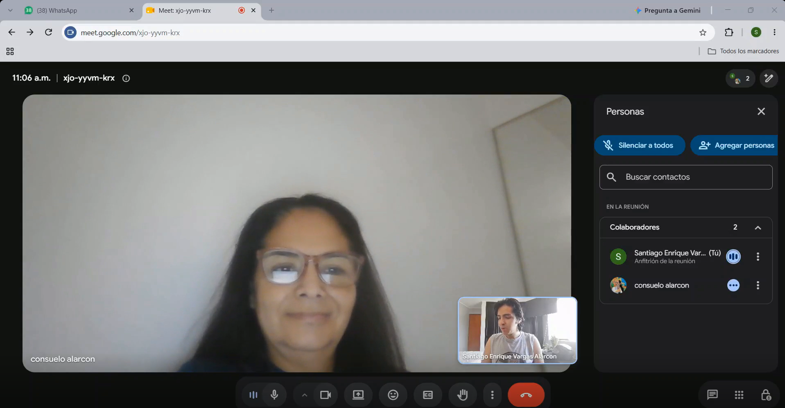

| Campo | Registro |
| --- | --- |
| Entrevistado | Consuelo Alarcón, psicóloga clínica. |
| Entrevistador | Santiago Enrique Vargas Alarcón. |
| Inicia | 0:00, inicio de la grabación. |
| Duración del video | 8:33 |
| Nombre completo | Consuelo Alarcón |
| Edad | 49 |
| Distrito | San Miguel |
| Resumen | Consuelo, con aproximadamente cinco años de experiencia, señala que el registro de emociones sirve como ancla para pacientes de 18 a 35 años, ayudando a disminuir su impulsividad, aunque el principal obstáculo para realizarlo es la pereza y el temor a perder su privacidad. Indica que los jóvenes suelen evadir sus crisis mediante distracciones (redes sociales, videojuegos, salir de fiesta). Destaca que la información de internet desestigmatiza la salud mental, pero genera problemas de autodiagnóstico. Recomienda un trato empático y horizontal, sin poses, para que los pacientes no se sientan juzgados. Considera útiles las herramientas de autoayuda siempre que fomenten independencia y no aíslen al paciente. Identifica como señales de alerta la desesperanza profunda, alteraciones de sueño, autolesiones y desconexión de la realidad. Para optimizar el tiempo en consulta, prefiere revisar resúmenes visuales (gráficos de ánimo, sueño, palabras clave) en lugar de textos largos. Subraya la importancia de garantizar la privacidad y control total de los datos por parte del paciente. Finalmente, concluye que hace falta una herramienta digital interactiva tipo "botiquín de primeros auxilios emocionales" para brindar contención inmediata en momentos de crisis. |

##### Entrevista 4

**Enlace de la entrevista:** [Ver entrevista al psicólogo](https://www.youtube.com/watch?v=I6xrkypbqEw)

[](https://youtu.be/I6xrkypbqEw)

| Campo | Registro |
| --- | --- |
| Entrevistado | Aldo Mauriño |
| Entrevistador | Andrés Rodrigo Torres Lavandera |
| Inicia | [0:00](https://www.youtube.com/watch?v=I6xrkypbqEw&t=0), inicio de la grabación |
| Duración del video | 12:49 |
| Nombre completo | Aldo Sebastian Mauriño Lavandera |
| Edad | 21 |
| Distrito | San Miguel |
| Resumen | Aldo Mauriño es psicólogo clínico con más de 5 años de experiencia trabajando con pacientes particulares. Afirma que la escritura expresiva o el registro de emociones en aplicaciones de notas es una herramienta fundamental para pacientes adolescentes y jóvenes, ya que les permite tomar consciencia sobre la verdadera frecuencia con la que experimentan emociones como la tristeza, la molestia o el estrés en su día a día. Identifica como barreras principales para mantener un diario emocional la dificultad de incorporar nuevos hábitos, la falta de costumbre de usar papel y lápiz, la indisciplina y el simple olvido, sugiriendo el uso de alarmas diarias como solución. Señala que, en momentos de crisis estando solos, los pacientes intentan escribir o llamar a personas cercanas, pero muchas veces se cohíben por vergüenza o miedo a ser una molestia, motivo por el cual les recomienda recurrir a números de emergencia especializados como la Línea 100. Recomienda utilizar un lenguaje asertivo frente a la vulnerabilidad, mostrándose honesto, directo y respetuoso, ya que un tono excesivamente empático puede interpretarse como burla y uno demasiado directo sin tacto como falta de interés. Respecto a las señales de alerta que indican una intervención clínica de emergencia, destaca la pérdida de funcionalidad del paciente, específicamente cuando los problemas se extienden a varias áreas de su vida (personal, social, laboral, familiar) impidiéndole seguir con su día a día, o cuando representa un peligro para sí mismo o para terceros. Para revisar registros emocionales en consulta ahorrando tiempo, valora que la información detalle de forma rigurosa qué días, a qué horas y en qué situaciones exactas (por ejemplo, en el trabajo o con amigos) ocurren los malestares, lo que le permite segmentar rápidamente las técnicas a utilizar. Considera que un entorno seguro para vulnerabilizarse debe garantizar una privacidad total, donde el paciente tenga la absoluta confianza de que su información no será compartida públicamente. Finalmente, señala que hace mucha falta una herramienta digital accesible para cualquier edad que centralice fuentes de información científica fiable, líneas de emergencia y contactos directos de psicólogos especializados en contención de crisis. |

### 2.2.3. Análisis de entrevistas


#### Análisis del segmento objetivo 1: Pacientes jóvenes

El segmento objetivo está compuesto por adultos jóvenes, principalmente estudiantes de educación superior y profesionistas en etapas tempranas o intermedias de formación, que se encuentran bajo regímenes de alta exigencia cognitiva, académica y laboral. Estos individuos asisten de forma activa y voluntaria a psicoterapia para mitigar cuadros de estrés y ansiedad provocados por transiciones vitales complejas o sobrecargas de rendimiento. A pesar de mantener un compromiso regular con sus especialistas clínicos, presentan un patrón común de desregulación emocional inter-sesión, derivado de la discrepancia entre el momento en que se detona la crisis y la disponibilidad real de la atención profesional, lo cual evidencia la necesidad de puentes funcionales entre la vivencia cotidiana y el encuadre psicoterapéutico.

En cuanto a los mecanismos de registro emocional, los pacientes muestran un abandono sistemático de los métodos tradicionales de diario manual debido a su falta de dinamismo e inmediatez. En su lugar, recurren a prácticas asincrónicas y fragmentadas, tales como notas rápidas en dispositivos móviles o mensajes de audio dirigidos a círculos cercanos de confianza en momentos de colapso. Esta conducta fue detallada por el entrevistado Mauricio Pajés, quien explicó que sus mayores picos de ansiedad se concentran durante la madrugada frente a entregas de alta complejidad técnica, recurriendo a notas y audios dispersos que, al final de la semana, no logran transmitir a su terapeuta la fidelidad, el tono de voz ni el contexto exacto del evento crítico, lo que produce una pérdida sensible de información clínica relevante.

La imposibilidad de exteriorizar las afectaciones emocionales en tiempo real genera consecuencias tanto cognitivas como somáticas adversas, traduciéndose en bloqueos del pensamiento, rumiación mental, irritabilidad y tensiones musculares pronunciadas. Esta problemática se agrava debido a los límites estructurales de la consulta convencional, donde la duración habitual de cuarenta a sesenta minutos resulta insuficiente para reconstruir retrospectivamente todos los episodios acumulados. El entrevistado Piero Mario Taipe Orihuela ilustró esta dificultad al señalar que los periodos de alta demanda evaluativa le impiden coordinar citas oportunas, provocando tensiones físicas focalizadas en hombros y cuello, y remarcó que la rigidez temporal de las sesiones genera una sensación de apresuramiento que obliga al paciente a reintegrarse a su entorno sin un procesamiento cabal del conflicto ni una delimitación previa que oriente al terapeuta hacia el núcleo del problema.

Finalmente, el segmento presenta una postura reflexiva y homogénea respecto a la introducción de tecnología e inteligencia artificial en la salud emocional. Por un lado, existe un recelo técnico justificado ante la vulnerabilidad y la retención permanente de información íntima en bases de datos externas, lo que exige modelos con estrictas garantías de anonimato, cifrado y soberanía absoluta del usuario sobre los datos que decide remitir a su especialista. Por otro lado, los usuarios no buscan sustituir la empatía o el criterio diagnóstico del psicólogo humano, sino contar con una herramienta complementaria de contención preliminar y triaje nocturno. Esta disposición sintetiza un segmento que demanda un entorno confidencial donde descargar y estructurar sus afecciones en el instante en que ocurren, facilitando un diagnóstico focalizado y optimizando el tiempo de la intervención clínica presencial.


#### Análisis del segmento objetivo 2: Psicólogos profesionales

El segmento objetivo está constituido por psicólogos clínicos y especialistas en salud mental dedicados a la atención psicoterapéutica de adolescentes y adultos jóvenes en entornos privados o centros de atención clínica multidisciplinaria. Estos profesionales fundamentan su práctica en el rigor ético y la personalización terapéutica, pero enfrentan la constante limitación de contar con ventanas de consulta reducidas frente a la alta complejidad contextual que experimentan sus consultantes fuera del consultorio. A partir del trabajo de campo, se evidencia que los especialistas reconocen el valor diagnóstico y regulatorio del registro inter-sesión para visibilizar afectos desbordantes, aunque tropiezan con una importante brecha de adherencia originada por la fatiga del paciente, los bloqueos por perfeccionismo y, de forma transversal, el profundo temor de los usuarios a la exposición involuntaria de su intimidad. 

Respecto a la optimización del tiempo clínico y el procesamiento de la información, el perfil profesional presenta una marcada resistencia a la sobrecarga de datos desestructurados, demandando instrumentos que sistematicen la experiencia emocional sin absorber los minutos de la intervención formal. En este sentido, el entrevistado Rodrigo Velázquez subrayó que en consultas estrictas de 45 a 50 minutos resulta inviable leer textos extensos redactados por los pacientes, por lo que resulta indispensable disponer de resúmenes visuales, gráficos de picos afectivos y etiquetas temáticas que delimiten los detonantes nucleares antes de iniciar el diálogo clínico. De manera complementaria, el entrevistado Aldo Mauriño señaló que la sistematización rigurosa de variables como horas, días y circunstancias situacionales permite enfocar de inmediato las intervenciones específicas en lugar de dispersar la sesión intentando reconstruir la semana a ciegas, postulado que valida la motivación del segmento por acceder a síntesis estructuradas que agilicen el análisis clínico sin aumentar su carga administrativa.

En lo relativo a la contención emocional fuera de sesión y las dinámicas vinculares, los especialistas coinciden en que la relación terapéutica debe desmarcarse de la rigidez médica tradicional para sostener una postura de acompañamiento empático y respetuoso. Sobre este aspecto, el especialista Josué Castarreta remarcó que las aproximaciones directivas provocan reactividad y cierre en los jóvenes, haciendo indispensable validar la experiencia afectiva y proporcionar herramientas que operen como anclajes de autorregulación mientras se preserva el control del consultante sobre sus propios registros. Asimismo, la psicóloga Consuelo Alarcón enfatizó la necesidad de interactuar desde la empatía horizontal para evitar que el paciente se sienta juzgado o evaluado, argumentando que en los momentos críticos inter-sesión se requiere un soporte de primeros auxilios emocionales en el móvil —un botiquín que ofrezca ejercicios prácticos e inmediatos de anclaje y respiración— que evite la rumiación o el aislamiento, y que a la vez sintetice patrones conductuales observables para acudir directamente a la raíz del conflicto en la cita presencial.

Finalmente, el segmento define con claridad las condiciones éticas, funcionales y de seguridad requeridas para que la tecnología complemente eficazmente la psicoterapia sin reemplazar el criterio humano. Los especialistas advierten sobre el riesgo de la desinformación digital y los autodiagnósticos precipitados, exigiendo que cualquier sistema auxiliar garantice protocolos de confidencialidad inquebrantables, cifrado riguroso y la capacidad de detectar patrones de alarma severos —tales como desesperanza absoluta o pérdida de funcionalidad transversal— para canalizar emergencias clínicas. Esta perspectiva fundamenta un perfil profesional receptivo a la innovación digital, condicionado a que las soluciones actúen como un soporte periférico confiable que respete el consentimiento informado, organice los antecedentes emocionales de forma ejecutiva y preserve la autonomía del juicio clínico del terapeuta.   


## 2.3. Needfinding


### 2.3.1. User Personas


#### User Persona 1: María

**Primer Segmento Objetivo (Pacientes Jovenes)**
*Figura 1: User Persona 1 (María)*
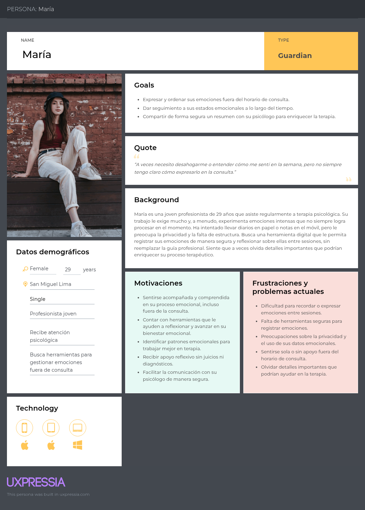

**Segundo Segmento Objetivo (Psicólogos Profesionales)**
*Figura 2: User Persona 2 (Dra. Laura Gómez)*


### 2.3.2. User Task Matrix

La matriz reúne las seis tareas más importantes de cada segmento y las prioriza según su frecuencia estimada e importancia dentro del recorrido principal.

#### User Task Matrix 1: María

**Primer Segmento Objetivo (Pacientes Jóvenes)**

| Tarea prioritaria                        | Frecuencia | Importancia |
|------------------------------------------| :---: | :---: |
| Registrar emociones por texto o voz      | Alta | Crítica |
| Crear Rutinas diarias para alcanzar objetivos     | Media | Alta |
| Controlar el acceso a su información     | Baja | Crítica |
| Visualizar un calendario de citas con profesionales    | Media | Crítica |
| Encontrar y recibir atención profesional | Baja | Crítica |

#### User Task Matrix 2: Dra. Laura Gómez

**Segundo Segmento Objetivo (Psicólogos Profesionales)**

| Tarea prioritaria | Frecuencia | Importancia |
| --- | :---: | :---: |
| Solicitar la verificación profesional | Baja | Crítica |
| Gestionar su perfil y reputación | Media | Alta |
| Administrar disponibilidad y solicitudes de cita | Alta | Crítica |
| Revisar información emocional autorizada | Alta | Crítica |
| Realizar y registrar una atención | Alta | Crítica |
| Consultar pagos e ingresos | Media | Alta |


### 2.3.3. User Journey Mapping

#### User Journey Map 1: Maria

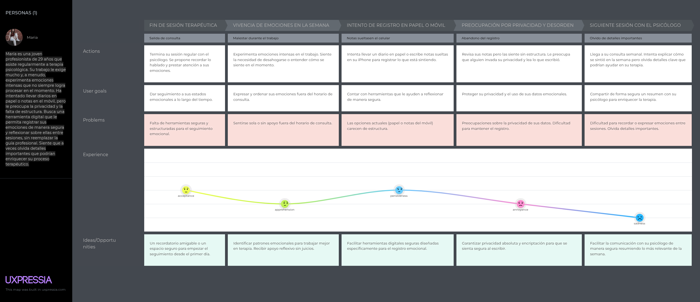

#### User Journey Map 2: Dra. Laura

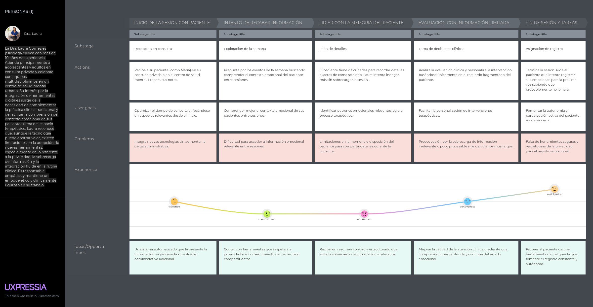

### 2.3.4. Empathy Mapping


#### Empathy Map 1: Maria

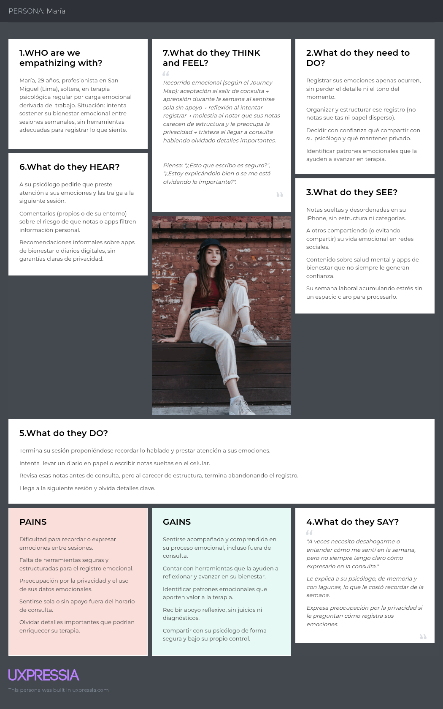

#### Empathy Map 2: Dra. Laura Gómez

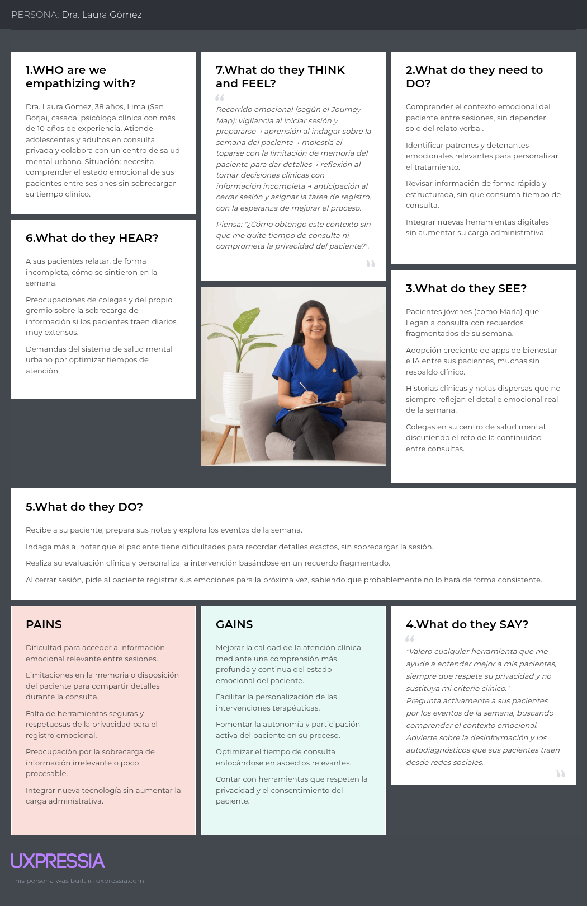

### 2.3.5. Big Picture EventStorming

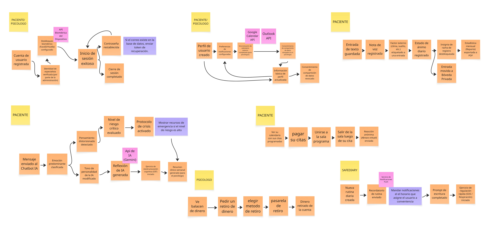


### 2.3.6. Ubiquitous Language

**Identidad, Privacidad y Consentimiento (Identity, Privacy & Consent)**

* **User (Usuario):** Persona que utiliza SafeDiary para registrar su estado emocional, acceder a atención profesional. Es propietaria de sus entradas y decide qué información comparte.
* **Account (Cuenta):** Identidad interna utilizada para autenticación, preferencias, seguridad y gestión del ciclo de vida de los datos del usuario.
* **Clinical Identity (Identidad Clínica):** Información real necesaria para la relación con un especialista, las citas y los pagos.
* **Consent (Consentimiento):** Autorización explícita, informada, específica y revocable mediante la cual el usuario permite una finalidad concreta sobre sus datos emocionales.
* **Sharing Permission (Permiso de Compartición):** Alcance concedido por el usuario que define qué entradas puede consultar un especialista, durante qué periodo y dentro de qué relación de atención.
* **Revocation (Revocación):** Acción mediante la cual el usuario retira un permiso vigente. Desde ese momento se bloquean nuevos accesos, sin eliminar los eventos históricos de auditoría.
* **Private Vault (Bóveda Privada):** Espacio protegido mediante un PIN secundario o biometría para entradas especialmente sensibles, excluidas por defecto de vistas y exportaciones generales.
* **Audit Event (Evento de Auditoría):** Registro trazable de una acción sensible, como un acceso, consentimiento, revocación, reserva o pago, sin copiar innecesariamente el contenido emocional involucrado.

**Diario Emocional e Inteligencia Artificial (Emotional Diary & AI)**

* **Emotional Diary (Diario Emocional):** Espacio privado donde el usuario conserva reflexiones, notas de voz, estados emocionales y contexto personal en orden cronológico.
* **Diary Entry (Entrada de Diario):** Registro individual de texto o audio cuyo propietario es el usuario. Puede incluir etiquetas, factores externos y permisos de compartición propios.
* **Voice Note (Nota de Voz):** Audio privado creado como contenido de una entrada de diario y utilizado, con autorización, como fuente para la transcripción y el análisis.
* **Transcription (Transcripción):** Representación textual generada a partir de una nota de voz. Puede ser revisada por el usuario y no reemplaza el audio original mientras este se conserve.
* **Emotional Check-in (Registro Emocional Rápido):** Selección breve de una emoción actual, asociada con fecha y hora, que no requiere crear una entrada completa.
* **Emotion Tag (Etiqueta Emocional):** Palabra o categoría que ayuda a organizar una entrada. Puede ser elegida por el usuario o sugerida por la IA antes de ser confirmada.
* **AI Analysis (Análisis de IA):** Resultado estructurado asociado a una entrada que contiene señales emocionales, palabras clave, confianza, versión del modelo y banderas de seguridad. No constituye un diagnóstico clínico.
* **AI Reflection (Reflexión de IA):** Respuesta de apoyo que ayuda al usuario a ordenar lo expresado y fomenta la reflexión sin prescribir tratamientos ni afirmar conclusiones clínicas.
* **Insight (Insight Emocional):** Tendencia o resumen derivado del historial autorizado del usuario, presentado con su periodo y contexto para evitar interpretaciones engañosas.
* **Processing State (Estado de Procesamiento):** Etapa técnica de una entrada: draft, uploading, transcribing, analyzing, ready, retryable, failed o deleted.
* **Safety Flag (Bandera de Seguridad):** Indicador interno de que una interacción puede requerir mostrar recursos de ayuda. No equivale a una evaluación clínica ni confirma una situación de emergencia.

**Directorio Profesional (Clinician Directory)**

* **Verified Specialist (Especialista Verificado):** Psicólogo cuya identidad y credenciales fueron revisadas antes de aparecer como profesional disponible en SafeDiary.
* **Clinician Profile (Perfil Profesional):** Ficha pública autorizada que reúne especialidades, biografía, tarifa, verificación y reseñas. La disponibilidad reservable se consulta desde Care Scheduling.
* **Review (Reseña):** Valoración vinculada a una cita completada que puede incluir una puntuación y un comentario opcional, sin revelar información emocional del paciente.
* **Trust Score (Puntaje de Confianza):** Indicador explicable construido con criterios como horas de atención, continuidad de pacientes y reseñas válidas, evitando premiar únicamente el volumen de consultas.

**Coordinación de Atención (Care Scheduling)**

* **Availability Slot (Horario Disponible):** Bloque de fecha, hora y zona horaria que el especialista ofrece y que puede reservarse una sola vez.
* **Temporary Hold (Reserva Temporal):** Retención exclusiva de un horario durante una hora mientras el paciente completa el pago.
* **Appointment (Cita):** Acuerdo entre un usuario y un especialista para una atención en un horario determinado, con estados requested, held, confirmed, completed, cancelled, expired, no_show o refunded.
* **Video Session (Videollamada):** Canal privado asociado a una cita confirmada al que solo pueden ingresar sus participantes autorizados dentro de la ventana permitida.
* **Care Relationship (Relación de Atención):** Vínculo entre un usuario y un especialista originado por una cita. No concede acceso automático al diario; todo acceso requiere un permiso de compartición explícito.

**Pagos y Retiros (Payments & Payouts)**

* **Payment (Pago):** Transacción asociada a una cita o una suscripción; cada propósito se procesa de forma idempotente y conserva su estado verificable.
* **Receipt (Comprobante):** Constancia digital emitida después de un pago aprobado y disponible para consulta del usuario.
* **Subscription (Suscripción):** Derecho temporal al plan Premium que se activa solo tras un pago confirmado y se gestiona por separado del pago de una cita.
* **Payout (Retiro):** Transferencia de saldo profesional disponible hacia el método de retiro verificado del psicólogo.
* **Refund (Reembolso):** Devolución total o parcial de un pago que actualiza de forma trazable el estado financiero de la cita.

## 2.4. Requirements specification

### 2.4.1. User Stories

**Epics**

| Epic ID | Título | Descripción |
| --- | --- | --- |
| EP-01 | Cuenta, seguridad, privacidad y consentimiento | **Como** usuario de SafeDiary,<br>**Quiero** administrar mi identidad, accesos y permisos sobre mis datos,<br>**Para** utilizar la aplicación con seguridad y mantener el control de mi información sensible. |
| EP-02 | Diario emocional, IA, hábitos e insights | **Como** usuario de SafeDiary,<br>**Quiero** registrar mis emociones, recibir apoyo reflexivo y consultar mi evolución,<br>**Para** desarrollar hábitos de autocuidado y comprender mejor mis patrones emocionales. |
| EP-04 | Directorio de psicólogos verificados y reputación | **Como** paciente que busca atención profesional,<br>**Quiero** encontrar fichas verificadas con tarifas y reseñas confiables,<br>**Para** elegir a quién contactar con información transparente. Incluye la verificación y publicación de la ficha por el psicólogo y la revisión de credenciales por administración; no gestiona citas ni cobros. |
| EP-05 | Landing page, comunicación y adquisición | **Como** visitante,<br>**Quiero** conocer la propuesta, funcionalidades, precios y equipo de SafeDiary,<br>**Para** evaluar el producto antes de registrarme o descargarlo. |
| EP-06 | Contacto, agenda y sesiones profesionales | **Como** paciente y psicólogo verificado,<br>**Quiero** coordinar por chat, acordar un horario, retenerlo temporalmente y acceder a la sesión solo tras la confirmación del pago,<br>**Para** evitar conflictos de agenda y realizar la atención de forma segura. Care Scheduling no procesa el cobro. |
| EP-07 | Pagos de sesiones, suscripciones y retiros | **Como** paciente o psicólogo,<br>**Quiero** pagar sesiones o un plan Premium y consultar ingresos o retiros según mi rol,<br>**Para** contar con operaciones trazables, comprobantes y saldos correctos. El pago de sesión y la suscripción son propósitos distintos; Premium no forma parte del saldo retirable del psicólogo. |


**User Stories**

Cada User Story se documenta con la siguiente estructura: identificador, actor (User), prioridad (derivada del orden del Product Backlog, sección 2.4.3) y épica relacionada; seguidos del título, la descripción en formato Como/Quiero/Para y los criterios de aceptación en formato Given/When/Then/And.

<table border="1" cellpadding="8" cellspacing="0" style="width:100%;border-collapse:collapse">
<tr><th>Story ID</th><th>User</th><th>Priority</th><th>Epic</th></tr>
<tr><td style="text-align:center">US-001</td><td style="text-align:center">Nuevo usuario</td><td style="text-align:center">Alta</td><td style="text-align:center">EP-01</td></tr>
<tr><td><strong>Title</strong></td><td colspan="3">Registro de cuenta</td></tr>
<tr><td colspan="4" style="text-align:center"><strong>Description</strong></td></tr>
<tr><td colspan="4"><strong>Como</strong> nuevo usuario de SafeDiary,<br><strong>Quiero</strong> registrar una cuenta con mi correo electrónico y una contraseña segura,<br><strong>Para</strong> acceder a mi espacio personal y comenzar a registrar mi estado emocional.</td></tr>
<tr><td colspan="4" style="text-align:center"><strong>Acceptance Criteria</strong></td></tr>
<tr><td colspan="4"><strong>Scenario 1: Registro exitoso</strong><br><strong>Given</strong> que el usuario se encuentra en la opción de crear una cuenta<br><strong>When</strong> ingresa un correo no registrado, una contraseña válida y confirma el registro<br><strong>Then</strong> el sistema crea la cuenta e inicia la sesión<br><strong>And</strong> muestra la pantalla principal de bienvenida<br><br><strong>Scenario 2: Datos de registro inválidos</strong><br><strong>Given</strong> que el usuario está completando el formulario de registro<br><strong>When</strong> ingresa un correo con formato incorrecto, un correo ya registrado o una contraseña que no cumple las reglas<br><strong>Then</strong> el sistema no crea la cuenta<br><strong>And</strong> muestra el mensaje de validación correspondiente sin borrar los datos válidos</td></tr>
</table>

<table border="1" cellpadding="8" cellspacing="0" style="width:100%;border-collapse:collapse">
<tr><th>Story ID</th><th>User</th><th>Priority</th><th>Epic</th></tr>
<tr><td style="text-align:center">US-002</td><td style="text-align:center">Paciente</td><td style="text-align:center">Media</td><td style="text-align:center">EP-04</td></tr>
<tr><td><strong>Title</strong></td><td colspan="3">Búsqueda y consulta de psicólogos verificados</td></tr>
<tr><td colspan="4" style="text-align:center"><strong>Description</strong></td></tr>
<tr><td colspan="4"><strong>Como</strong> paciente de SafeDiary,<br><strong>Quiero</strong> buscar y filtrar psicólogos verificados y consultar sus fichas y reseñas,<br><strong>Para</strong> elegir a quién solicitar contacto con información suficiente.</td></tr>
<tr><td colspan="4" style="text-align:center"><strong>Acceptance Criteria</strong></td></tr>
<tr><td colspan="4"><strong>Scenario 1: Búsqueda y ficha disponibles</strong><br><strong>Given</strong> que existen fichas verificadas y publicadas<br><strong>When</strong> el paciente busca por nombre o especialidad, filtra y abre una ficha<br><strong>Then</strong> Clinician Directory muestra solo psicólogos elegibles con credenciales, descripción, tarifa y valoración vigente<br><strong>And</strong> presenta la disponibilidad consultada desde Care Scheduling sin tratarla como propiedad del directorio<br><br><strong>Scenario 2: Sin coincidencias o ficha retirada</strong><br><strong>Given</strong> que ningún psicólogo coincide o una ficha perdió su verificación<br><strong>When</strong> el paciente consulta el directorio<br><strong>Then</strong> el sistema no muestra la ficha no elegible y presenta un estado sin resultados cuando corresponda<br><strong>And</strong> permite limpiar filtros o continuar buscando sin crear una solicitud de contacto</td></tr>
</table>

<table border="1" cellpadding="8" cellspacing="0" style="width:100%;border-collapse:collapse">
<tr><th>Story ID</th><th>User</th><th>Priority</th><th>Epic</th></tr>
<tr><td style="text-align:center">US-003</td><td style="text-align:center">Usuario nuevo o recurrente</td><td style="text-align:center">Alta</td><td style="text-align:center">EP-01</td></tr>
<tr><td><strong>Title</strong></td><td colspan="3">Acceso con Google o Apple</td></tr>
<tr><td colspan="4" style="text-align:center"><strong>Description</strong></td></tr>
<tr><td colspan="4"><strong>Como</strong> usuario nuevo o recurrente de SafeDiary,<br><strong>Quiero</strong> registrarme o iniciar sesión con mi cuenta de Google o Apple,<br><strong>Para</strong> acceder de forma rápida sin administrar una contraseña adicional.</td></tr>
<tr><td colspan="4" style="text-align:center"><strong>Acceptance Criteria</strong></td></tr>
<tr><td colspan="4"><strong>Scenario 1: Autenticación federada exitosa</strong><br><strong>Given</strong> que el usuario se encuentra en la pantalla de autenticación<br><strong>When</strong> selecciona Google o Apple y autoriza el acceso con el proveedor<br><strong>Then</strong> el sistema valida la identidad y crea o recupera la cuenta correspondiente<br><strong>And</strong> redirige al usuario a la pantalla principal con la sesión iniciada<br><br><strong>Scenario 2: Autenticación cancelada o fallida</strong><br><strong>Given</strong> que el usuario inició el flujo de acceso con Google o Apple<br><strong>When</strong> cancela la autorización o el proveedor devuelve un error<br><strong>Then</strong> el sistema mantiene al usuario en la pantalla de autenticación<br><strong>And</strong> muestra un mensaje de error cuando la causa es técnica</td></tr>
</table>

<table border="1" cellpadding="8" cellspacing="0" style="width:100%;border-collapse:collapse">
<tr><th>Story ID</th><th>User</th><th>Priority</th><th>Epic</th></tr>
<tr><td style="text-align:center">US-006</td><td style="text-align:center">Usuario</td><td style="text-align:center">Alta</td><td style="text-align:center">EP-01</td></tr>
<tr><td><strong>Title</strong></td><td colspan="3">Edición del perfil personal</td></tr>
<tr><td colspan="4" style="text-align:center"><strong>Description</strong></td></tr>
<tr><td colspan="4"><strong>Como</strong> usuario de SafeDiary,<br><strong>Quiero</strong> actualizar mi nombre y fotografía de perfil,<br><strong>Para</strong> mantener mis datos personales al día y personalizar mi experiencia.</td></tr>
<tr><td colspan="4" style="text-align:center"><strong>Acceptance Criteria</strong></td></tr>
<tr><td colspan="4"><strong>Scenario 1: Perfil actualizado</strong><br><strong>Given</strong> que el usuario se encuentra en la edición de perfil<br><strong>When</strong> ingresa un nombre válido, selecciona una imagen admitida y guarda los cambios<br><strong>Then</strong> el sistema actualiza la información<br><strong>And</strong> muestra los nuevos datos en la aplicación<br><br><strong>Scenario 2: Imagen no admitida</strong><br><strong>Given</strong> que el usuario intenta cambiar su fotografía<br><strong>When</strong> selecciona un archivo con formato no permitido o que supera el tamaño máximo<br><strong>Then</strong> el sistema conserva la imagen anterior<br><strong>And</strong> muestra el requisito que no se cumplió</td></tr>
</table>

<table border="1" cellpadding="8" cellspacing="0" style="width:100%;border-collapse:collapse">
<tr><th>Story ID</th><th>User</th><th>Priority</th><th>Epic</th></tr>
<tr><td style="text-align:center">US-007</td><td style="text-align:center">Usuario</td><td style="text-align:center">Baja</td><td style="text-align:center">EP-02</td></tr>
<tr><td><strong>Title</strong></td><td colspan="3">Gestión de rutinas de autocuidado</td></tr>
<tr><td colspan="4" style="text-align:center"><strong>Description</strong></td></tr>
<tr><td colspan="4"><strong>Como</strong> usuario de SafeDiary,<br><strong>Quiero</strong> crear actividades para mis rutinas diarias,<br><strong>Para</strong> organizar hábitos de calma y autocuidado durante el día.</td></tr>
<tr><td colspan="4" style="text-align:center"><strong>Acceptance Criteria</strong></td></tr>
<tr><td colspan="4"><strong>Scenario 1: Rutina creada</strong><br><strong>Given</strong> que el usuario se encuentra en la sección de rutinas<br><strong>When</strong> ingresa un nombre, define la duración o el tipo y confirma<br><strong>Then</strong> el sistema agrega la actividad con estado pendiente<br><strong>And</strong> la muestra en la lista del día<br><br><strong>Scenario 2: Rutina sin título</strong><br><strong>Given</strong> que el usuario está creando una actividad<br><strong>When</strong> intenta guardarla sin ingresar un título<br><strong>Then</strong> el sistema no registra la rutina<br><strong>And</strong> señala que el nombre es obligatorio</td></tr>
</table>

<table border="1" cellpadding="8" cellspacing="0" style="width:100%;border-collapse:collapse">
<tr><th>Story ID</th><th>User</th><th>Priority</th><th>Epic</th></tr>
<tr><td style="text-align:center">US-008</td><td style="text-align:center">Usuario</td><td style="text-align:center">Alta</td><td style="text-align:center">EP-02</td></tr>
<tr><td><strong>Title</strong></td><td colspan="3">Registro de entrada de diario</td></tr>
<tr><td colspan="4" style="text-align:center"><strong>Description</strong></td></tr>
<tr><td colspan="4"><strong>Como</strong> usuario de SafeDiary,<br><strong>Quiero</strong> registrar una vivencia mediante texto o una nota de voz,<br><strong>Para</strong> expresar mis pensamientos con el medio que me resulte más cómodo.</td></tr>
<tr><td colspan="4" style="text-align:center"><strong>Acceptance Criteria</strong></td></tr>
<tr><td colspan="4"><strong>Scenario 1: Entrada guardada</strong><br><strong>Given</strong> que el usuario se encuentra en el diario emocional<br><strong>When</strong> escribe una reflexión o graba una nota de voz y selecciona guardar<br><strong>Then</strong> el sistema almacena la entrada cifrada<br><strong>And</strong> la muestra en el historial en orden cronológico<br><br><strong>Scenario 2: Entrada vacía</strong><br><strong>Given</strong> que el usuario abrió una nueva entrada<br><strong>When</strong> intenta guardarla sin texto ni audio<br><strong>Then</strong> el sistema bloquea el guardado<br><strong>And</strong> solicita añadir contenido antes de continuar</td></tr>
</table>

<table border="1" cellpadding="8" cellspacing="0" style="width:100%;border-collapse:collapse">
<tr><th>Story ID</th><th>User</th><th>Priority</th><th>Epic</th></tr>
<tr><td style="text-align:center">US-009</td><td style="text-align:center">Usuario con cita profesional</td><td style="text-align:center">Media</td><td style="text-align:center">EP-01</td></tr>
<tr><td><strong>Title</strong></td><td colspan="3">Consentimiento para compartir historial</td></tr>
<tr><td colspan="4" style="text-align:center"><strong>Description</strong></td></tr>
<tr><td colspan="4"><strong>Como</strong> usuario de SafeDiary con una cita profesional,<br><strong>Quiero</strong> autorizar explícitamente el acceso de un especialista a partes de mi historial emocional,<br><strong>Para</strong> ofrecer contexto relevante para mi atención sin perder el control de mis datos.</td></tr>
<tr><td colspan="4" style="text-align:center"><strong>Acceptance Criteria</strong></td></tr>
<tr><td colspan="4"><strong>Scenario 1: Consentimiento otorgado</strong><br><strong>Given</strong> que el usuario tiene una cita con un especialista verificado<br><strong>When</strong> selecciona los datos que desea compartir, activa el consentimiento y confirma<br><strong>Then</strong> el sistema concede acceso únicamente al especialista y al alcance autorizados<br><strong>And</strong> registra la fecha y el detalle del consentimiento<br><br><strong>Scenario 2: Atención sin compartir historial</strong><br><strong>Given</strong> que el usuario se encuentra en la pantalla de consentimiento<br><strong>When</strong> decide continuar sin autorizar el acceso<br><strong>Then</strong> el sistema mantiene privado el historial<br><strong>And</strong> permite conservar la cita sin compartir información emocional</td></tr>
</table>

<table border="1" cellpadding="8" cellspacing="0" style="width:100%;border-collapse:collapse">
<tr><th>Story ID</th><th>User</th><th>Priority</th><th>Epic</th></tr>
<tr><td style="text-align:center">US-010</td><td style="text-align:center">Usuario</td><td style="text-align:center">Alta</td><td style="text-align:center">EP-02</td></tr>
<tr><td><strong>Title</strong></td><td colspan="3">Registro rápido del estado emocional</td></tr>
<tr><td colspan="4" style="text-align:center"><strong>Description</strong></td></tr>
<tr><td colspan="4"><strong>Como</strong> usuario de SafeDiary,<br><strong>Quiero</strong> seleccionar rápidamente mi estado emocional actual desde la pantalla principal,<br><strong>Para</strong> mantener un registro continuo de mi ánimo sin crear una entrada completa.</td></tr>
<tr><td colspan="4" style="text-align:center"><strong>Acceptance Criteria</strong></td></tr>
<tr><td colspan="4"><strong>Scenario 1: Estado emocional registrado</strong><br><strong>Given</strong> que el usuario se encuentra en la pantalla principal<br><strong>When</strong> selecciona una emoción disponible<br><strong>Then</strong> el sistema registra la emoción con fecha y hora<br><strong>And</strong> actualiza el indicador del estado actual<br><br><strong>Scenario 2: Registro duplicado inmediato</strong><br><strong>Given</strong> que una emoción ya se encuentra activa<br><strong>When</strong> el usuario selecciona nuevamente la misma emoción sin realizar otro cambio<br><strong>Then</strong> el sistema mantiene la selección actual<br><strong>And</strong> evita crear un registro duplicado</td></tr>
</table>

<table border="1" cellpadding="8" cellspacing="0" style="width:100%;border-collapse:collapse">
<tr><th>Story ID</th><th>User</th><th>Priority</th><th>Epic</th></tr>
<tr><td style="text-align:center">US-011</td><td style="text-align:center">Usuario</td><td style="text-align:center">Alta</td><td style="text-align:center">EP-02</td></tr>
<tr><td><strong>Title</strong></td><td colspan="3">Reflexión guiada por voz con IA</td></tr>
<tr><td colspan="4" style="text-align:center"><strong>Description</strong></td></tr>
<tr><td colspan="4"><strong>Como</strong> usuario de SafeDiary,<br><strong>Quiero</strong> hablar con el asistente de IA y obtener una transcripción, reflexión y etiqueta emocional sugerida,<br><strong>Para</strong> procesar mis pensamientos de manera guiada y guardarlos en mi diario.</td></tr>
<tr><td colspan="4" style="text-align:center"><strong>Acceptance Criteria</strong></td></tr>
<tr><td colspan="4"><strong>Scenario 1: Procesamiento de voz exitoso</strong><br><strong>Given</strong> que el usuario inicia una grabación en AI Diary<br><strong>When</strong> habla, detiene la grabación y el procesamiento finaliza correctamente<br><strong>Then</strong> el sistema muestra la transcripción y una reflexión no diagnóstica<br><strong>And</strong> permite revisar la etiqueta sugerida antes de guardar<br><br><strong>Scenario 2: Límite o fallo de transcripción</strong><br><strong>Given</strong> que el usuario está grabando una reflexión<br><strong>When</strong> alcanza el tiempo máximo o la transcripción no puede completarse<br><strong>Then</strong> el sistema detiene la grabación de forma segura<br><strong>And</strong> conserva el audio disponible y ofrece reintentar o usar texto</td></tr>
</table>

<table border="1" cellpadding="8" cellspacing="0" style="width:100%;border-collapse:collapse">
<tr><th>Story ID</th><th>User</th><th>Priority</th><th>Epic</th></tr>
<tr><td style="text-align:center">US-012</td><td style="text-align:center">Usuario</td><td style="text-align:center">Baja</td><td style="text-align:center">EP-02</td></tr>
<tr><td><strong>Title</strong></td><td colspan="3">Consulta de estadísticas emocionales</td></tr>
<tr><td colspan="4" style="text-align:center"><strong>Description</strong></td></tr>
<tr><td colspan="4"><strong>Como</strong> usuario de SafeDiary,<br><strong>Quiero</strong> visualizar estadísticas de mis estados emocionales a lo largo del tiempo,<br><strong>Para</strong> comprender mis patrones y observar mi progreso personal.</td></tr>
<tr><td colspan="4" style="text-align:center"><strong>Acceptance Criteria</strong></td></tr>
<tr><td colspan="4"><strong>Scenario 1: Estadísticas disponibles</strong><br><strong>Given</strong> que el usuario tiene registros emocionales en el periodo seleccionado<br><strong>When</strong> abre Insights y elige un rango de tiempo<br><strong>Then</strong> el sistema calcula y muestra indicadores y gráficos del periodo<br><strong>And</strong> permite consultar el detalle de cada punto del gráfico<br><br><strong>Scenario 2: Periodo sin registros</strong><br><strong>Given</strong> que no existen datos emocionales en el periodo seleccionado<br><strong>When</strong> el usuario abre el panel de estadísticas<br><strong>Then</strong> el sistema muestra un estado vacío sin valores engañosos<br><strong>And</strong> invita a realizar un primer registro</td></tr>
</table>

<table border="1" cellpadding="8" cellspacing="0" style="width:100%;border-collapse:collapse">
<tr><th>Story ID</th><th>User</th><th>Priority</th><th>Epic</th></tr>
<tr><td style="text-align:center">US-013</td><td style="text-align:center">Usuario en crisis</td><td style="text-align:center">Media</td><td style="text-align:center">EP-02</td></tr>
<tr><td><strong>Title</strong></td><td colspan="3">Acceso inmediato a ayuda de crisis</td></tr>
<tr><td colspan="4" style="text-align:center"><strong>Description</strong></td></tr>
<tr><td colspan="4"><strong>Como</strong> usuario de SafeDiary que necesita ayuda urgente,<br><strong>Quiero</strong> contactar rápidamente una línea de crisis desde la sección de soporte,<br><strong>Para</strong> obtener asistencia humana inmediata cuando la necesite.</td></tr>
<tr><td colspan="4" style="text-align:center"><strong>Acceptance Criteria</strong></td></tr>
<tr><td colspan="4"><strong>Scenario 1: Contacto telefónico disponible</strong><br><strong>Given</strong> que el usuario se encuentra en la sección Soporte y el dispositivo permite llamadas<br><strong>When</strong> selecciona la opción de ayuda inmediata<br><strong>Then</strong> el sistema abre el marcador con el número de crisis configurado para su ubicación<br><strong>And</strong> solicita al usuario confirmar el inicio de la llamada<br><br><strong>Scenario 2: Dispositivo sin llamadas</strong><br><strong>Given</strong> que el dispositivo no admite llamadas telefónicas<br><strong>When</strong> el usuario selecciona la ayuda inmediata<br><strong>Then</strong> el sistema muestra alternativas disponibles como mensaje, chat o números locales<br><strong>And</strong> no presenta una acción que el dispositivo no puede ejecutar</td></tr>
</table>

<table border="1" cellpadding="8" cellspacing="0" style="width:100%;border-collapse:collapse">
<tr><th>Story ID</th><th>User</th><th>Priority</th><th>Epic</th></tr>
<tr><td style="text-align:center">US-014</td><td style="text-align:center">Paciente</td><td style="text-align:center">Media</td><td style="text-align:center">EP-06</td></tr>
<tr><td><strong>Title</strong></td><td colspan="3">Reserva temporal del horario acordado</td></tr>
<tr><td colspan="4" style="text-align:center"><strong>Description</strong></td></tr>
<tr><td colspan="4"><strong>Como</strong> paciente que aceptó el horario propuesto por un psicólogo verificado,<br><strong>Quiero</strong> que el horario quede reservado temporalmente durante una hora,<br><strong>Para</strong> completar el pago sin perderlo mientras esté vigente.</td></tr>
<tr><td colspan="4" style="text-align:center"><strong>Acceptance Criteria</strong></td></tr>
<tr><td colspan="4"><strong>Scenario 1: Retención creada</strong><br><strong>Given</strong> que el paciente y el psicólogo acordaron un horario y este sigue libre<br><strong>When</strong> el paciente acepta la propuesta<br><strong>Then</strong> Care Scheduling crea una sola reserva temporal con vencimiento en una hora y bloquea ese horario para otras solicitudes<br><strong>And</strong> muestra el tiempo restante y el importe a pagar sin presentar aún la cita como confirmada<br><br><strong>Scenario 2: Horario ocupado o reserva vencida</strong><br><strong>Given</strong> que el horario dejó de estar libre o venció la hora de retención sin pago aprobado<br><strong>When</strong> el paciente intenta continuar<br><strong>Then</strong> el sistema no confirma la cita y libera o conserva libre el horario según corresponda<br><strong>And</strong> informa que debe acordarse un nuevo horario sin crear una segunda reserva</td></tr>
</table>

<table border="1" cellpadding="8" cellspacing="0" style="width:100%;border-collapse:collapse">
<tr><th>Story ID</th><th>User</th><th>Priority</th><th>Epic</th></tr>
<tr><td style="text-align:center">US-015</td><td style="text-align:center">Usuario recurrente</td><td style="text-align:center">Alta</td><td style="text-align:center">EP-01</td></tr>
<tr><td><strong>Title</strong></td><td colspan="3">Desbloqueo biométrico</td></tr>
<tr><td colspan="4" style="text-align:center"><strong>Description</strong></td></tr>
<tr><td colspan="4"><strong>Como</strong> usuario recurrente de SafeDiary,<br><strong>Quiero</strong> habilitar el acceso mediante rostro o huella digital,<br><strong>Para</strong> entrar de forma rápida y segura sin escribir mi contraseña cada vez.</td></tr>
<tr><td colspan="4" style="text-align:center"><strong>Acceptance Criteria</strong></td></tr>
<tr><td colspan="4"><strong>Scenario 1: Biometría habilitada</strong><br><strong>Given</strong> que el usuario inició sesión previamente y el dispositivo admite biometría<br><strong>When</strong> activa el desbloqueo biométrico y valida su identidad<br><strong>Then</strong> el sistema habilita el método para futuros accesos<br><strong>And</strong> permite ingresar mediante la validación del dispositivo<br><br><strong>Scenario 2: Validación biométrica fallida</strong><br><strong>Given</strong> que el desbloqueo biométrico está habilitado<br><strong>When</strong> el dispositivo rechaza la identidad después del límite de intentos<br><strong>Then</strong> el sistema no concede acceso<br><strong>And</strong> ofrece iniciar sesión con las credenciales de la cuenta</td></tr>
</table>

<table border="1" cellpadding="8" cellspacing="0" style="width:100%;border-collapse:collapse">
<tr><th>Story ID</th><th>User</th><th>Priority</th><th>Epic</th></tr>
<tr><td style="text-align:center">US-016</td><td style="text-align:center">Usuario</td><td style="text-align:center">Alta</td><td style="text-align:center">EP-01</td></tr>
<tr><td><strong>Title</strong></td><td colspan="3">Recuperación de contraseña</td></tr>
<tr><td colspan="4" style="text-align:center"><strong>Description</strong></td></tr>
<tr><td colspan="4"><strong>Como</strong> usuario de SafeDiary que olvidó su contraseña,<br><strong>Quiero</strong> solicitar un enlace seguro de restablecimiento,<br><strong>Para</strong> recuperar el acceso sin perder mi historial.</td></tr>
<tr><td colspan="4" style="text-align:center"><strong>Acceptance Criteria</strong></td></tr>
<tr><td colspan="4"><strong>Scenario 1: Restablecimiento exitoso</strong><br><strong>Given</strong> que el usuario solicita recuperar su contraseña<br><strong>When</strong> ingresa su correo, abre un enlace vigente y define una contraseña válida<br><strong>Then</strong> el sistema actualiza la credencial<br><strong>And</strong> permite iniciar sesión conservando los datos de la cuenta<br><br><strong>Scenario 2: Correo no reconocido o enlace vencido</strong><br><strong>Given</strong> que el usuario inicia la recuperación<br><strong>When</strong> el correo no está registrado o el enlace dejó de ser válido<br><strong>Then</strong> el sistema no revela la existencia de la cuenta<br><strong>And</strong> muestra un mensaje seguro y permite solicitar un nuevo enlace</td></tr>
</table>

<table border="1" cellpadding="8" cellspacing="0" style="width:100%;border-collapse:collapse">
<tr><th>Story ID</th><th>User</th><th>Priority</th><th>Epic</th></tr>
<tr><td style="text-align:center">US-017</td><td style="text-align:center">Visitante</td><td style="text-align:center">Alta</td><td style="text-align:center">EP-05</td></tr>
<tr><td><strong>Title</strong></td><td colspan="3">Presentación de la propuesta de valor</td></tr>
<tr><td colspan="4" style="text-align:center"><strong>Description</strong></td></tr>
<tr><td colspan="4"><strong>Como</strong> visitante de la landing page,<br><strong>Quiero</strong> comprender desde la sección principal qué ofrece SafeDiary,<br><strong>Para</strong> decidir si la aplicación responde a mis necesidades.</td></tr>
<tr><td colspan="4" style="text-align:center"><strong>Acceptance Criteria</strong></td></tr>
<tr><td colspan="4"><strong>Scenario 1: Propuesta visible</strong><br><strong>Given</strong> que el visitante accede a la landing page<br><strong>When</strong> la sección principal termina de cargar<br><strong>Then</strong> el sistema muestra el mensaje de valor, una descripción breve y las acciones de descarga<br><strong>And</strong> mantiene el contenido principal visible sin desplazamiento en una pantalla compatible<br><br><strong>Scenario 2: Acceso a descarga</strong><br><strong>Given</strong> que el visitante identifica una tienda compatible con su dispositivo<br><strong>When</strong> selecciona el botón de descarga<br><strong>Then</strong> el sistema lo dirige a la tienda correspondiente<br><strong>And</strong> conserva una alternativa informativa si la aplicación aún no está disponible</td></tr>
</table>

<table border="1" cellpadding="8" cellspacing="0" style="width:100%;border-collapse:collapse">
<tr><th>Story ID</th><th>User</th><th>Priority</th><th>Epic</th></tr>
<tr><td style="text-align:center">US-018</td><td style="text-align:center">Visitante</td><td style="text-align:center">Alta</td><td style="text-align:center">EP-05</td></tr>
<tr><td><strong>Title</strong></td><td colspan="3">Presentación de funcionalidades principales</td></tr>
<tr><td colspan="4" style="text-align:center"><strong>Description</strong></td></tr>
<tr><td colspan="4"><strong>Como</strong> visitante de la landing page,<br><strong>Quiero</strong> consultar las funciones principales de SafeDiary,<br><strong>Para</strong> conocer el alcance del diario, la IA, las rutinas y el soporte profesional.</td></tr>
<tr><td colspan="4" style="text-align:center"><strong>Acceptance Criteria</strong></td></tr>
<tr><td colspan="4"><strong>Scenario 1: Funciones visibles</strong><br><strong>Given</strong> que el visitante navega a la sección de funcionalidades<br><strong>When</strong> la sección aparece en pantalla<br><strong>Then</strong> el sistema presenta bloques con título, descripción e identificación visual<br><strong>And</strong> incluye las capacidades principales del producto<br><br><strong>Scenario 2: Navegación desde el menú</strong><br><strong>Given</strong> que el visitante se encuentra en otra sección de la landing page<br><strong>When</strong> selecciona el enlace de funcionalidades<br><strong>Then</strong> la página lo desplaza a la sección correspondiente<br><strong>And</strong> mantiene visible el encabezado de la sección</td></tr>
</table>

<table border="1" cellpadding="8" cellspacing="0" style="width:100%;border-collapse:collapse">
<tr><th>Story ID</th><th>User</th><th>Priority</th><th>Epic</th></tr>
<tr><td style="text-align:center">US-019</td><td style="text-align:center">Visitante</td><td style="text-align:center">Alta</td><td style="text-align:center">EP-05</td></tr>
<tr><td><strong>Title</strong></td><td colspan="3">Consulta de testimonios</td></tr>
<tr><td colspan="4" style="text-align:center"><strong>Description</strong></td></tr>
<tr><td colspan="4"><strong>Como</strong> visitante de la landing page,<br><strong>Quiero</strong> leer experiencias de usuarios de SafeDiary,<br><strong>Para</strong> evaluar la confianza y utilidad del producto antes de registrarme.</td></tr>
<tr><td colspan="4" style="text-align:center"><strong>Acceptance Criteria</strong></td></tr>
<tr><td colspan="4"><strong>Scenario 1: Testimonios disponibles</strong><br><strong>Given</strong> que el visitante llega a la sección de testimonios<br><strong>When</strong> el contenido se muestra<br><strong>Then</strong> el sistema presenta reseñas con alias o nombre autorizado y calificación<br><strong>And</strong> evita exponer información clínica o emocional identificable<br><br><strong>Scenario 2: Testimonios no disponibles</strong><br><strong>Given</strong> que no existen testimonios aprobados para publicación<br><strong>When</strong> el visitante abre la sección<br><strong>Then</strong> el sistema oculta reseñas incompletas o no autorizadas<br><strong>And</strong> muestra contenido informativo alternativo sin inventar opiniones</td></tr>
</table>

<table border="1" cellpadding="8" cellspacing="0" style="width:100%;border-collapse:collapse">
<tr><th>Story ID</th><th>User</th><th>Priority</th><th>Epic</th></tr>
<tr><td style="text-align:center">US-020</td><td style="text-align:center">Visitante</td><td style="text-align:center">Alta</td><td style="text-align:center">EP-05</td></tr>
<tr><td><strong>Title</strong></td><td colspan="3">Consulta de planes y precios</td></tr>
<tr><td colspan="4" style="text-align:center"><strong>Description</strong></td></tr>
<tr><td colspan="4"><strong>Como</strong> visitante de la landing page,<br><strong>Quiero</strong> comparar los planes disponibles de SafeDiary,<br><strong>Para</strong> evaluar qué opción se ajusta a mis necesidades y presupuesto.</td></tr>
<tr><td colspan="4" style="text-align:center"><strong>Acceptance Criteria</strong></td></tr>
<tr><td colspan="4"><strong>Scenario 1: Comparación de planes</strong><br><strong>Given</strong> que el visitante se encuentra en la sección de precios<br><strong>When</strong> consulta las opciones disponibles<br><strong>Then</strong> el sistema muestra el precio y las funciones incluidas en cada plan<br><strong>And</strong> diferencia claramente el plan gratuito del plan premium<br><br><strong>Scenario 2: Selección de un plan</strong><br><strong>Given</strong> que el visitante eligió una opción disponible<br><strong>When</strong> selecciona su botón de acción<br><strong>Then</strong> el sistema lo dirige al flujo correspondiente de registro o adquisición<br><strong>And</strong> mantiene visible el plan seleccionado</td></tr>
</table>

<table border="1" cellpadding="8" cellspacing="0" style="width:100%;border-collapse:collapse">
<tr><th>Story ID</th><th>User</th><th>Priority</th><th>Epic</th></tr>
<tr><td style="text-align:center">US-021</td><td style="text-align:center">Visitante</td><td style="text-align:center">Media</td><td style="text-align:center">EP-05</td></tr>
<tr><td><strong>Title</strong></td><td colspan="3">Preguntas frecuentes y contacto</td></tr>
<tr><td colspan="4" style="text-align:center"><strong>Description</strong></td></tr>
<tr><td colspan="4"><strong>Como</strong> visitante de la landing page,<br><strong>Quiero</strong> consultar respuestas frecuentes y enviar una solicitud de contacto,<br><strong>Para</strong> resolver dudas sobre privacidad, seguridad o funcionamiento.</td></tr>
<tr><td colspan="4" style="text-align:center"><strong>Acceptance Criteria</strong></td></tr>
<tr><td colspan="4"><strong>Scenario 1: Consulta de preguntas frecuentes</strong><br><strong>Given</strong> que el visitante se encuentra en la sección de preguntas frecuentes<br><strong>When</strong> selecciona una pregunta<br><strong>Then</strong> la página muestra su respuesta sin recargarse<br><strong>And</strong> permite cerrar la respuesta nuevamente<br><br><strong>Scenario 2: Envío del formulario de contacto</strong><br><strong>Given</strong> que el visitante completa nombre, correo y mensaje válidos<br><strong>When</strong> selecciona enviar<br><strong>Then</strong> el sistema registra la solicitud y confirma su recepción<br><strong>And</strong> si falta un campo obligatorio, muestra la validación y no envía el formulario</td></tr>
</table>

<table border="1" cellpadding="8" cellspacing="0" style="width:100%;border-collapse:collapse">
<tr><th>Story ID</th><th>User</th><th>Priority</th><th>Epic</th></tr>
<tr><td style="text-align:center">US-022</td><td style="text-align:center">Visitante</td><td style="text-align:center">Media</td><td style="text-align:center">EP-05</td></tr>
<tr><td><strong>Title</strong></td><td colspan="3">Presentación de MindCluster</td></tr>
<tr><td colspan="4" style="text-align:center"><strong>Description</strong></td></tr>
<tr><td colspan="4"><strong>Como</strong> visitante de la landing page,<br><strong>Quiero</strong> conocer la misión y el equipo responsable de SafeDiary,<br><strong>Para</strong> identificar quién respalda el producto y sus valores.</td></tr>
<tr><td colspan="4" style="text-align:center"><strong>Acceptance Criteria</strong></td></tr>
<tr><td colspan="4"><strong>Scenario 1: Información institucional visible</strong><br><strong>Given</strong> que el visitante navega a la sección Sobre nosotros<br><strong>When</strong> la sección se muestra<br><strong>Then</strong> el sistema presenta la misión de MindCluster y los valores del equipo<br><strong>And</strong> muestra únicamente datos personales autorizados de sus integrantes<br><br><strong>Scenario 2: Acceso mediante navegación</strong><br><strong>Given</strong> que el visitante se encuentra al inicio de la landing page<br><strong>When</strong> selecciona el enlace Sobre nosotros<br><strong>Then</strong> la página lo dirige a la información institucional<br><strong>And</strong> mantiene una ruta clara para regresar al contenido principal</td></tr>
</table>

<table border="1" cellpadding="8" cellspacing="0" style="width:100%;border-collapse:collapse">
<tr><th>Story ID</th><th>User</th><th>Priority</th><th>Epic</th></tr>
<tr><td style="text-align:center">US-023</td><td style="text-align:center">Usuario</td><td style="text-align:center">Baja</td><td style="text-align:center">EP-01</td></tr>
<tr><td><strong>Title</strong></td><td colspan="3">Revocación del acceso al historial</td></tr>
<tr><td colspan="4" style="text-align:center"><strong>Description</strong></td></tr>
<tr><td colspan="4"><strong>Como</strong> usuario de SafeDiary,<br><strong>Quiero</strong> revocar el acceso previamente concedido a un especialista,<br><strong>Para</strong> mantener el control sobre quién puede consultar mi información emocional.</td></tr>
<tr><td colspan="4" style="text-align:center"><strong>Acceptance Criteria</strong></td></tr>
<tr><td colspan="4"><strong>Scenario 1: Acceso revocado</strong><br><strong>Given</strong> que un especialista tiene autorización vigente sobre parte del historial<br><strong>When</strong> el usuario desactiva el permiso y confirma la revocación<br><strong>Then</strong> el sistema retira el acceso del especialista<br><strong>And</strong> registra la fecha del cambio y muestra una confirmación<br><br><strong>Scenario 2: Consulta de permisos vigentes</strong><br><strong>Given</strong> que el usuario abre la gestión de privacidad<br><strong>When</strong> revisa los accesos concedidos<br><strong>Then</strong> el sistema muestra cada especialista, el alcance y la fecha de autorización<br><strong>And</strong> permite revocar cada permiso por separado</td></tr>
</table>

<table border="1" cellpadding="8" cellspacing="0" style="width:100%;border-collapse:collapse">
<tr><th>Story ID</th><th>User</th><th>Priority</th><th>Epic</th></tr>
<tr><td style="text-align:center">US-024</td><td style="text-align:center">Usuario</td><td style="text-align:center">Baja</td><td style="text-align:center">EP-02</td></tr>
<tr><td><strong>Title</strong></td><td colspan="3">Recordatorios de registro emocional</td></tr>
<tr><td colspan="4" style="text-align:center"><strong>Description</strong></td></tr>
<tr><td colspan="4"><strong>Como</strong> usuario de SafeDiary,<br><strong>Quiero</strong> configurar recordatorios diarios para registrar mi estado emocional,<br><strong>Para</strong> mantener el hábito de reflexión.</td></tr>
<tr><td colspan="4" style="text-align:center"><strong>Acceptance Criteria</strong></td></tr>
<tr><td colspan="4"><strong>Scenario 1: Recordatorio programado</strong><br><strong>Given</strong> que el usuario permitió notificaciones para SafeDiary<br><strong>When</strong> elige una hora y activa el recordatorio diario<br><strong>Then</strong> el sistema programa la notificación<br><strong>And</strong> al seleccionarla abre la pantalla de registro emocional<br><br><strong>Scenario 2: Recordatorio desactivado</strong><br><strong>Given</strong> que existe un recordatorio activo<br><strong>When</strong> el usuario desactiva la opción<br><strong>Then</strong> el sistema cancela las notificaciones futuras asociadas<br><strong>And</strong> conserva disponible la configuración para una reactivación posterior</td></tr>
</table>

<table border="1" cellpadding="8" cellspacing="0" style="width:100%;border-collapse:collapse">
<tr><th>Story ID</th><th>User</th><th>Priority</th><th>Epic</th></tr>
<tr><td style="text-align:center">US-025</td><td style="text-align:center">Usuario</td><td style="text-align:center">Baja</td><td style="text-align:center">EP-01</td></tr>
<tr><td><strong>Title</strong></td><td colspan="3">Protección de entradas en bóveda privada</td></tr>
<tr><td colspan="4" style="text-align:center"><strong>Description</strong></td></tr>
<tr><td colspan="4"><strong>Como</strong> usuario de SafeDiary,<br><strong>Quiero</strong> proteger entradas específicas con un PIN secundario o biometría,<br><strong>Para</strong> mantener ocultas mis reflexiones más sensibles.</td></tr>
<tr><td colspan="4" style="text-align:center"><strong>Acceptance Criteria</strong></td></tr>
<tr><td colspan="4"><strong>Scenario 1: Entrada trasladada a la bóveda</strong><br><strong>Given</strong> que el usuario visualiza una entrada de su diario<br><strong>When</strong> selecciona mover a la bóveda y supera la verificación de seguridad<br><strong>Then</strong> el sistema oculta la entrada del historial general<br><strong>And</strong> la muestra únicamente dentro de la bóveda privada<br><br><strong>Scenario 2: Intentos de acceso fallidos</strong><br><strong>Given</strong> que el usuario intenta abrir la bóveda<br><strong>When</strong> supera el límite de intentos de verificación incorrectos<br><strong>Then</strong> el sistema bloquea temporalmente el acceso<br><strong>And</strong> informa cuándo podrá intentarlo nuevamente</td></tr>
</table>

<table border="1" cellpadding="8" cellspacing="0" style="width:100%;border-collapse:collapse">
<tr><th>Story ID</th><th>User</th><th>Priority</th><th>Epic</th></tr>
<tr><td style="text-align:center">US-026</td><td style="text-align:center">Usuario</td><td style="text-align:center">Baja</td><td style="text-align:center">EP-02</td></tr>
<tr><td><strong>Title</strong></td><td colspan="3">Personalización del tono de la IA</td></tr>
<tr><td colspan="4" style="text-align:center"><strong>Description</strong></td></tr>
<tr><td colspan="4"><strong>Como</strong> usuario de SafeDiary,<br><strong>Quiero</strong> elegir el estilo de comunicación del asistente de IA,<br><strong>Para</strong> recibir reflexiones que se adapten mejor a mis preferencias.</td></tr>
<tr><td colspan="4" style="text-align:center"><strong>Acceptance Criteria</strong></td></tr>
<tr><td colspan="4"><strong>Scenario 1: Tono actualizado</strong><br><strong>Given</strong> que el usuario se encuentra en las preferencias de la IA<br><strong>When</strong> selecciona un estilo disponible y guarda el cambio<br><strong>Then</strong> el sistema aplica el tono a las respuestas futuras<br><strong>And</strong> mantiene el aviso de que la IA brinda apoyo y no diagnóstico<br><br><strong>Scenario 2: Historial sin alteraciones</strong><br><strong>Given</strong> que el usuario cambió el tono del asistente<br><strong>When</strong> consulta conversaciones anteriores<br><strong>Then</strong> el sistema conserva los mensajes con su contenido original<br><strong>And</strong> no regenera respuestas pasadas con el nuevo estilo</td></tr>
</table>

<table border="1" cellpadding="8" cellspacing="0" style="width:100%;border-collapse:collapse">
<tr><th>Story ID</th><th>User</th><th>Priority</th><th>Epic</th></tr>
<tr><td style="text-align:center">US-027</td><td style="text-align:center">Usuario recurrente</td><td style="text-align:center">Baja</td><td style="text-align:center">EP-02</td></tr>
<tr><td><strong>Title</strong></td><td colspan="3">Seguimiento emocional proactivo</td></tr>
<tr><td colspan="4" style="text-align:center"><strong>Description</strong></td></tr>
<tr><td colspan="4"><strong>Como</strong> usuario recurrente de SafeDiary,<br><strong>Quiero</strong> recibir una pregunta de seguimiento sobre una emoción o situación registrada anteriormente,<br><strong>Para</strong> reflexionar sobre cómo evolucionan mis preocupaciones.</td></tr>
<tr><td colspan="4" style="text-align:center"><strong>Acceptance Criteria</strong></td></tr>
<tr><td colspan="4"><strong>Scenario 1: Seguimiento relevante</strong><br><strong>Given</strong> que el usuario autorizó interacciones proactivas y registró una emoción significativa<br><strong>When</strong> abre la aplicación dentro del periodo de seguimiento<br><strong>Then</strong> la IA presenta una pregunta relacionada con el registro previo<br><strong>And</strong> permite responder, omitir o desactivar futuros seguimientos<br><br><strong>Scenario 2: Seguimiento desactivado</strong><br><strong>Given</strong> que el usuario desactiva las interacciones proactivas<br><strong>When</strong> vuelve a abrir la aplicación<br><strong>Then</strong> la IA no inicia conversaciones por cuenta propia<br><strong>And</strong> responde únicamente cuando el usuario comienza una interacción</td></tr>
</table>

<table border="1" cellpadding="8" cellspacing="0" style="width:100%;border-collapse:collapse">
<tr><th>Story ID</th><th>User</th><th>Priority</th><th>Epic</th></tr>
<tr><td style="text-align:center">US-028</td><td style="text-align:center">Usuario</td><td style="text-align:center">Baja</td><td style="text-align:center">EP-02</td></tr>
<tr><td><strong>Title</strong></td><td colspan="3">Exportación del progreso en PDF</td></tr>
<tr><td colspan="4" style="text-align:center"><strong>Description</strong></td></tr>
<tr><td colspan="4"><strong>Como</strong> usuario de SafeDiary,<br><strong>Quiero</strong> exportar mis estadísticas y entradas seleccionadas en un archivo PDF,<br><strong>Para</strong> compartir mi progreso con un profesional externo si así lo decido.</td></tr>
<tr><td colspan="4" style="text-align:center"><strong>Acceptance Criteria</strong></td></tr>
<tr><td colspan="4"><strong>Scenario 1: PDF generado</strong><br><strong>Given</strong> que el usuario tiene información en el periodo seleccionado<br><strong>When</strong> elige los datos que desea incluir y solicita la exportación<br><strong>Then</strong> el sistema genera un PDF protegido con las estadísticas y entradas autorizadas<br><strong>And</strong> permite descargarlo o compartirlo mediante las opciones del dispositivo<br><br><strong>Scenario 2: Exclusión de datos privados</strong><br><strong>Given</strong> que existen entradas dentro de la bóveda privada<br><strong>When</strong> el sistema prepara la exportación<br><strong>Then</strong> omite esas entradas de forma predeterminada<br><strong>And</strong> no las incluye sin una autorización explícita adicional</td></tr>
</table>

<table border="1" cellpadding="8" cellspacing="0" style="width:100%;border-collapse:collapse">
<tr><th>Story ID</th><th>User</th><th>Priority</th><th>Epic</th></tr>
<tr><td style="text-align:center">US-029</td><td style="text-align:center">Usuario</td><td style="text-align:center">Baja</td><td style="text-align:center">EP-02</td></tr>
<tr><td><strong>Title</strong></td><td colspan="3">Insignias por constancia emocional</td></tr>
<tr><td colspan="4" style="text-align:center"><strong>Description</strong></td></tr>
<tr><td colspan="4"><strong>Como</strong> usuario de SafeDiary,<br><strong>Quiero</strong> recibir insignias por mantener una racha de registros emocionales,<br><strong>Para</strong> sentirme motivado a sostener el hábito de autocuidado.</td></tr>
<tr><td colspan="4" style="text-align:center"><strong>Acceptance Criteria</strong></td></tr>
<tr><td colspan="4"><strong>Scenario 1: Insignia desbloqueada</strong><br><strong>Given</strong> que el usuario está a un registro de completar una meta de constancia<br><strong>When</strong> realiza el registro requerido<br><strong>Then</strong> el sistema concede la insignia correspondiente<br><strong>And</strong> la muestra en el perfil sin revelar información sensible<br><br><strong>Scenario 2: Racha interrumpida</strong><br><strong>Given</strong> que el usuario deja pasar el periodo definido sin registrar actividad<br><strong>When</strong> regresa a la aplicación<br><strong>Then</strong> el sistema reinicia el contador de la racha<br><strong>And</strong> conserva las insignias obtenidas anteriormente</td></tr>
</table>

<table border="1" cellpadding="8" cellspacing="0" style="width:100%;border-collapse:collapse">
<tr><th>Story ID</th><th>User</th><th>Priority</th><th>Epic</th></tr>
<tr><td style="text-align:center">US-030</td><td style="text-align:center">Usuario</td><td style="text-align:center">Baja</td><td style="text-align:center">EP-02</td></tr>
<tr><td><strong>Title</strong></td><td colspan="3">Ejercicios rápidos de regulación</td></tr>
<tr><td colspan="4" style="text-align:center"><strong>Description</strong></td></tr>
<tr><td colspan="4"><strong>Como</strong> usuario que experimenta ansiedad,<br><strong>Quiero</strong> acceder a ejercicios breves de respiración y regulación,<br><strong>Para</strong> reducir la intensidad de mis síntomas antes de continuar con el diario.</td></tr>
<tr><td colspan="4" style="text-align:center"><strong>Acceptance Criteria</strong></td></tr>
<tr><td colspan="4"><strong>Scenario 1: Sugerencia después de un registro intenso</strong><br><strong>Given</strong> que el usuario registra un nivel alto de ansiedad<br><strong>When</strong> confirma su estado emocional<br><strong>Then</strong> el sistema ofrece iniciar un ejercicio guiado<br><strong>And</strong> permite aceptar, omitir o consultar ayuda profesional<br><br><strong>Scenario 2: Acceso manual</strong><br><strong>Given</strong> que el usuario se encuentra en la navegación principal<br><strong>When</strong> selecciona la opción de ejercicios de regulación<br><strong>Then</strong> el sistema muestra la biblioteca de ejercicios disponibles<br><strong>And</strong> permite iniciar uno sin crear previamente una entrada</td></tr>
</table>

<table border="1" cellpadding="8" cellspacing="0" style="width:100%;border-collapse:collapse">
<tr><th>Story ID</th><th>User</th><th>Priority</th><th>Epic</th></tr>
<tr><td style="text-align:center">US-031</td><td style="text-align:center">Usuario</td><td style="text-align:center">Baja</td><td style="text-align:center">EP-02</td></tr>
<tr><td><strong>Title</strong></td><td colspan="3">Registro de factores externos</td></tr>
<tr><td colspan="4" style="text-align:center"><strong>Description</strong></td></tr>
<tr><td colspan="4"><strong>Como</strong> usuario de SafeDiary,<br><strong>Quiero</strong> asociar factores como sueño, energía o cafeína a mis registros emocionales,<br><strong>Para</strong> identificar posibles relaciones entre mis hábitos y mi estado de ánimo.</td></tr>
<tr><td colspan="4" style="text-align:center"><strong>Acceptance Criteria</strong></td></tr>
<tr><td colspan="4"><strong>Scenario 1: Factores vinculados</strong><br><strong>Given</strong> que el usuario está completando un registro emocional<br><strong>When</strong> selecciona uno o más factores de contexto y guarda<br><strong>Then</strong> el sistema vincula los factores con el registro<br><strong>And</strong> permite consultarlos posteriormente<br><br><strong>Scenario 2: Análisis con información suficiente</strong><br><strong>Given</strong> que existen registros de varios periodos con factores asociados<br><strong>When</strong> el usuario abre Insights<br><strong>Then</strong> el sistema muestra posibles correlaciones como tendencias y no como diagnósticos<br><strong>And</strong> indica cuando la información disponible es insuficiente</td></tr>
</table>

<table border="1" cellpadding="8" cellspacing="0" style="width:100%;border-collapse:collapse">
<tr><th>Story ID</th><th>User</th><th>Priority</th><th>Epic</th></tr>
<tr><td style="text-align:center">US-032</td><td style="text-align:center">Usuario recurrente</td><td style="text-align:center">Baja</td><td style="text-align:center">EP-02</td></tr>
<tr><td><strong>Title</strong></td><td colspan="3">Recuerdos de evolución emocional</td></tr>
<tr><td colspan="4" style="text-align:center"><strong>Description</strong></td></tr>
<tr><td colspan="4"><strong>Como</strong> usuario recurrente de SafeDiary,<br><strong>Quiero</strong> recibir recordatorios opcionales de cómo me sentía en periodos anteriores,<br><strong>Para</strong> reconocer cambios y obtener perspectiva sobre mi evolución emocional.</td></tr>
<tr><td colspan="4" style="text-align:center"><strong>Acceptance Criteria</strong></td></tr>
<tr><td colspan="4"><strong>Scenario 1: Recuerdo mostrado</strong><br><strong>Given</strong> que el usuario autorizó los recuerdos y existe una entrada apta del periodo anterior<br><strong>When</strong> abre la vista general del diario<br><strong>Then</strong> el sistema presenta una tarjeta retrospectiva<br><strong>And</strong> permite ocultarla o desactivar futuros recuerdos<br><br><strong>Scenario 2: Contenido potencialmente sensible</strong><br><strong>Given</strong> que una entrada antigua contiene señales de trauma o fue marcada como sensible<br><strong>When</strong> el sistema selecciona contenido para un recuerdo<br><strong>Then</strong> omite esa entrada de la recomendación automática<br><strong>And</strong> elige contenido neutral o no muestra un recuerdo</td></tr>
</table>

<table border="1" cellpadding="8" cellspacing="0" style="width:100%;border-collapse:collapse">
<tr><th>Story ID</th><th>User</th><th>Priority</th><th>Epic</th></tr>
<tr><td style="text-align:center">US-033</td><td style="text-align:center">Usuario</td><td style="text-align:center">Baja</td><td style="text-align:center">EP-01</td></tr>
<tr><td><strong>Title</strong></td><td colspan="3">Eliminación de cuenta y datos personales</td></tr>
<tr><td colspan="4" style="text-align:center"><strong>Description</strong></td></tr>
<tr><td colspan="4"><strong>Como</strong> usuario de SafeDiary,<br><strong>Quiero</strong> solicitar la eliminación de mi cuenta y de mis datos emocionales,<br><strong>Para</strong> retirar mi información cuando deje de utilizar el servicio.</td></tr>
<tr><td colspan="4" style="text-align:center"><strong>Acceptance Criteria</strong></td></tr>
<tr><td colspan="4"><strong>Scenario 1: Solicitud confirmada</strong><br><strong>Given</strong> que el usuario se encuentra en la gestión de su cuenta<br><strong>When</strong> solicita la eliminación, revisa sus consecuencias y valida nuevamente su identidad<br><strong>Then</strong> el sistema registra la solicitud y cierra las sesiones activas<br><strong>And</strong> informa el plazo de eliminación y revoca los accesos concedidos<br><br><strong>Scenario 2: Cancelación antes de confirmar</strong><br><strong>Given</strong> que el usuario abrió el flujo de eliminación<br><strong>When</strong> decide cancelar antes de la confirmación final<br><strong>Then</strong> el sistema no elimina ni programa la eliminación de datos<br><strong>And</strong> mantiene la cuenta y sus permisos sin cambios</td></tr>
</table>

<table border="1" cellpadding="8" cellspacing="0" style="width:100%;border-collapse:collapse">
<tr><th>Story ID</th><th>User</th><th>Priority</th><th>Epic</th></tr>
<tr><td style="text-align:center">US-036</td><td style="text-align:center">Psicólogo verificado</td><td style="text-align:center">Media</td><td style="text-align:center">EP-04</td></tr>
<tr><td><strong>Title</strong></td><td colspan="3">Publicación y edición de la ficha profesional</td></tr>
<tr><td colspan="4" style="text-align:center"><strong>Description</strong></td></tr>
<tr><td colspan="4"><strong>Como</strong> psicólogo con credenciales aprobadas,<br><strong>Quiero</strong> publicar y editar mi ficha, banner, especialidades, descripción y tarifas,<br><strong>Para</strong> que los pacientes conozcan mi oferta profesional antes de contactarme.</td></tr>
<tr><td colspan="4" style="text-align:center"><strong>Acceptance Criteria</strong></td></tr>
<tr><td colspan="4"><strong>Scenario 1: Ficha publicada o actualizada</strong><br><strong>Given</strong> que la verificación del psicólogo está aprobada<br><strong>When</strong> completa los campos obligatorios y publica o edita su ficha y tarifas<br><strong>Then</strong> Clinician Directory muestra una única ficha pública vigente con los cambios guardados<br><strong>And</strong> no modifica las citas ni los precios ya aceptados para reservas existentes<br><br><strong>Scenario 2: Psicólogo no verificado o datos inválidos</strong><br><strong>Given</strong> que la verificación está pendiente, fue rechazada o faltan campos obligatorios<br><strong>When</strong> intenta publicar la ficha<br><strong>Then</strong> el sistema mantiene la ficha fuera del directorio<br><strong>And</strong> informa qué requisito debe corregirse sin mostrar documentos privados</td></tr>
</table>

<table border="1" cellpadding="8" cellspacing="0" style="width:100%;border-collapse:collapse">
<tr><th>Story ID</th><th>User</th><th>Priority</th><th>Epic</th></tr>
<tr><td style="text-align:center">US-037</td><td style="text-align:center">Paciente</td><td style="text-align:center">Alta</td><td style="text-align:center">EP-07</td></tr>
<tr><td><strong>Title</strong></td><td colspan="3">Pago seguro de una sesión</td></tr>
<tr><td colspan="4" style="text-align:center"><strong>Description</strong></td></tr>
<tr><td colspan="4"><strong>Como</strong> paciente con una reserva temporal vigente,<br><strong>Quiero</strong> pagar la sesión dentro de SafeDiary y recibir un comprobante,<br><strong>Para</strong> confirmar la cita acordada mediante una transacción trazable.</td></tr>
<tr><td colspan="4" style="text-align:center"><strong>Acceptance Criteria</strong></td></tr>
<tr><td colspan="4"><strong>Scenario 1: Cobro aprobado dentro del plazo</strong><br><strong>Given</strong> que la reserva temporal sigue vigente y existe un importe aceptado<br><strong>When</strong> la pasarela confirma un pago aprobado para esa reserva<br><strong>Then</strong> Payments &amp; Payouts registra un solo cobro, emite un comprobante y comunica el resultado a Care Scheduling<br><strong>And</strong> Care Scheduling confirma la cita una sola vez y habilita sus recordatorios y acceso programado<br><br><strong>Scenario 2: Fallo, duplicado o aprobación tardía</strong><br><strong>Given</strong> que el cobro falla, se repite su notificación o vence la reserva antes de confirmarse<br><strong>When</strong> se procesa el resultado<br><strong>Then</strong> el sistema evita cargos y citas duplicados y no confirma una cita sobre un horario liberado<br><strong>And</strong> muestra el estado real; si hubo un cobro aprobado tardíamente, inicia su conciliación o devolución sin prometer una cita inexistente</td></tr>
</table>

<table border="1" cellpadding="8" cellspacing="0" style="width:100%;border-collapse:collapse">
<tr><th>Story ID</th><th>User</th><th>Priority</th><th>Epic</th></tr>
<tr><td style="text-align:center">US-038</td><td style="text-align:center">Paciente</td><td style="text-align:center">Media</td><td style="text-align:center">EP-06</td></tr>
<tr><td><strong>Title</strong></td><td colspan="3">Acceso a la videollamada programada</td></tr>
<tr><td colspan="4" style="text-align:center"><strong>Description</strong></td></tr>
<tr><td colspan="4"><strong>Como</strong> usuario con una cita confirmada,<br><strong>Quiero</strong> ingresar a una videollamada segura desde SafeDiary,<br><strong>Para</strong> recibir atención profesional en el horario reservado.</td></tr>
<tr><td colspan="4" style="text-align:center"><strong>Acceptance Criteria</strong></td></tr>
<tr><td colspan="4"><strong>Scenario 1: Ingreso a la consulta</strong><br><strong>Given</strong> que la cita está confirmada y se encuentra dentro de la ventana de acceso<br><strong>When</strong> el usuario selecciona unirse a la videollamada<br><strong>Then</strong> el sistema valida a los participantes y conecta la sesión<br><strong>And</strong> mantiene privado el historial no autorizado<br><br><strong>Scenario 2: Fallo de conexión o acceso fuera de horario</strong><br><strong>Given</strong> que el usuario intenta entrar sin conexión estable o fuera de la ventana permitida<br><strong>When</strong> selecciona el enlace de la consulta<br><strong>Then</strong> el sistema evita un acceso inválido<br><strong>And</strong> muestra opciones para reintentar o contactar al especialista</td></tr>
</table>

<table border="1" cellpadding="8" cellspacing="0" style="width:100%;border-collapse:collapse">
<tr><th>Story ID</th><th>User</th><th>Priority</th><th>Epic</th></tr>
<tr><td style="text-align:center">US-039</td><td style="text-align:center">Paciente</td><td style="text-align:center">Media</td><td style="text-align:center">EP-04</td></tr>
<tr><td><strong>Title</strong></td><td colspan="3">Calificación del especialista</td></tr>
<tr><td colspan="4" style="text-align:center"><strong>Description</strong></td></tr>
<tr><td colspan="4"><strong>Como</strong> usuario que completó una sesión,<br><strong>Quiero</strong> calificar al especialista y escribir una reseña opcional,<br><strong>Para</strong> compartir mi experiencia y contribuir a una puntuación de confianza transparente.</td></tr>
<tr><td colspan="4" style="text-align:center"><strong>Acceptance Criteria</strong></td></tr>
<tr><td colspan="4"><strong>Scenario 1: Reseña válida publicada</strong><br><strong>Given</strong> que Care Scheduling notificó la sesión completada y el paciente aún no reseñó esa cita<br><strong>When</strong> publica una puntuación y un comentario opcional<br><strong>Then</strong> Clinician Directory vincula una sola reseña a esa cita y recalcula la valoración agregada del psicólogo<br><strong>And</strong> actualiza la ficha pública sin revelar la identidad ni información clínica del paciente<br><br><strong>Scenario 2: Reseña no elegible</strong><br><strong>Given</strong> que la sesión no se completó o ya existe una reseña para la misma cita<br><strong>When</strong> el paciente intenta publicar otra<br><strong>Then</strong> el sistema impide la publicación duplicada<br><strong>And</strong> explica la condición sin exponer detalles de la atención</td></tr>
</table>

<table border="1" cellpadding="8" cellspacing="0" style="width:100%;border-collapse:collapse">
<tr><th>Story ID</th><th>User</th><th>Priority</th><th>Epic</th></tr>
<tr><td style="text-align:center">US-040</td><td style="text-align:center">Usuario</td><td style="text-align:center">Alta</td><td style="text-align:center">EP-02</td></tr>
<tr><td><strong>Title</strong></td><td colspan="3">Escalamiento seguro ante señales de crisis</td></tr>
<tr><td colspan="4" style="text-align:center"><strong>Description</strong></td></tr>
<tr><td colspan="4"><strong>Como</strong> usuario cuya interacción contiene posibles señales de peligro inmediato,<br><strong>Quiero</strong> recibir recursos locales de emergencia y opciones de ayuda humana,<br><strong>Para</strong> buscar apoyo oportuno sin interpretar la respuesta de la IA como un diagnóstico.</td></tr>
<tr><td colspan="4" style="text-align:center"><strong>Acceptance Criteria</strong></td></tr>
<tr><td colspan="4"><strong>Scenario 1: Señal de alto riesgo detectada</strong><br><strong>Given</strong> que el usuario envía texto o audio con señales configuradas de peligro inmediato<br><strong>When</strong> el sistema procesa la interacción<br><strong>Then</strong> muestra un mensaje de apoyo con recursos de emergencia según la ubicación configurada<br><strong>And</strong> ofrece contactar a una línea de crisis o profesional sin ejecutar la acción automáticamente<br><br><strong>Scenario 2: Usuario descarta el aviso</strong><br><strong>Given</strong> que el sistema presentó opciones de ayuda urgente<br><strong>When</strong> el usuario decide cerrar el aviso<br><strong>Then</strong> el sistema permite continuar sin afirmar que monitorea su seguridad<br><strong>And</strong> mantiene visible una ruta discreta para volver a los recursos de ayuda</td></tr>
</table>

<table border="1" cellpadding="8" cellspacing="0" style="width:100%;border-collapse:collapse">
<tr><th>Story ID</th><th>User</th><th>Priority</th><th>Epic</th></tr>
<tr><td style="text-align:center">US-041</td><td style="text-align:center">Psicólogo</td><td style="text-align:center">Alta</td><td style="text-align:center">EP-04</td></tr>
<tr><td><strong>Title</strong></td><td colspan="3">Solicitud de verificación profesional</td></tr>
<tr><td colspan="4" style="text-align:center"><strong>Description</strong></td></tr>
<tr><td colspan="4"><strong>Como</strong> psicólogo interesado en ofrecer atención mediante SafeDiary,<br><strong>Quiero</strong> enviar mis credenciales y consultar el estado de su verificación,<br><strong>Para</strong> demostrar mi habilitación antes de aparecer en el directorio.</td></tr>
<tr><td colspan="4" style="text-align:center"><strong>Acceptance Criteria</strong></td></tr>
<tr><td colspan="4"><strong>Scenario 1: Solicitud enviada</strong><br><strong>Given</strong> que el psicólogo tiene una cuenta y rol válidos en IAM y adjuntó las credenciales exigidas<br><strong>When</strong> confirma la solicitud<br><strong>Then</strong> Clinician Directory registra la verificación como pendiente de revisión<br><strong>And</strong> mantiene la ficha fuera de los resultados públicos hasta la aprobación<br><br><strong>Scenario 2: Solicitud incompleta o resultado rechazado</strong><br><strong>Given</strong> que faltan documentos obligatorios o la revisión rechazó las credenciales<br><strong>When</strong> el psicólogo consulta el estado<br><strong>Then</strong> el sistema no permite publicar la ficha<br><strong>And</strong> explica qué debe corregirse sin hacer públicos sus documentos</td></tr>
</table>

<table border="1" cellpadding="8" cellspacing="0" style="width:100%;border-collapse:collapse">
<tr><th>Story ID</th><th>User</th><th>Priority</th><th>Epic</th></tr>
<tr><td style="text-align:center">US-042</td><td style="text-align:center">Especialista</td><td style="text-align:center">Media</td><td style="text-align:center">EP-04</td></tr>
<tr><td><strong>Title</strong></td><td colspan="3">Transparencia del puntaje de confianza</td></tr>
<tr><td colspan="4" style="text-align:center"><strong>Description</strong></td></tr>
<tr><td colspan="4"><strong>Como</strong> especialista verificado,<br><strong>Quiero</strong> consultar las reseñas y los factores que componen mi puntaje de confianza,<br><strong>Para</strong> comprender mi posicionamiento y mejorar la calidad de mi atención.</td></tr>
<tr><td colspan="4" style="text-align:center"><strong>Acceptance Criteria</strong></td></tr>
<tr><td colspan="4"><strong>Scenario 1: Desglose disponible</strong><br><strong>Given</strong> que el especialista cuenta con actividad y reseñas válidas<br><strong>When</strong> abre la sección de confianza de su perfil<br><strong>Then</strong> el sistema muestra el puntaje y sus componentes de forma comprensible<br><strong>And</strong> evita revelar la identidad o información emocional de los pacientes<br><br><strong>Scenario 2: Información insuficiente</strong><br><strong>Given</strong> que el especialista todavía no reúne datos suficientes<br><strong>When</strong> consulta su puntaje de confianza<br><strong>Then</strong> el sistema muestra un estado informativo sin asignar una valoración engañosa<br><strong>And</strong> explica qué criterios podrán contribuir cuando exista actividad válida</td></tr>
</table>

<table border="1" cellpadding="8" cellspacing="0" style="width:100%;border-collapse:collapse">
<tr><th>Story ID</th><th>User</th><th>Priority</th><th>Epic</th></tr>
<tr><td style="text-align:center">US-043</td><td style="text-align:center">Psicólogo verificado</td><td style="text-align:center">Alta</td><td style="text-align:center">EP-06</td></tr>
<tr><td><strong>Title</strong></td><td colspan="3">Gestión de solicitudes y agenda profesional</td></tr>
<tr><td colspan="4" style="text-align:center"><strong>Description</strong></td></tr>
<tr><td colspan="4"><strong>Como</strong> psicólogo verificado que recibió una solicitud de contacto,<br><strong>Quiero</strong> conversar con el paciente y proponer o rechazar horarios desde mi agenda,<br><strong>Para</strong> acordar una sesión sin conflictos de disponibilidad.</td></tr>
<tr><td colspan="4" style="text-align:center"><strong>Acceptance Criteria</strong></td></tr>
<tr><td colspan="4"><strong>Scenario 1: Horario propuesto</strong><br><strong>Given</strong> que el psicólogo está verificado, recibió la solicitud y su agenda muestra un horario libre<br><strong>When</strong> propone ese horario por el chat privado<br><strong>Then</strong> Care Scheduling registra la propuesta y la muestra al paciente para que la acepte o negocie otra<br><strong>And</strong> no crea todavía una reserva ni confirma una cita<br><br><strong>Scenario 2: Conflicto o rechazo</strong><br><strong>Given</strong> que el horario ya está ocupado o el psicólogo decide rechazar la solicitud<br><strong>When</strong> intenta proponerlo o comunica su decisión<br><strong>Then</strong> el sistema evita el conflicto o cierra la solicitud según corresponda<br><strong>And</strong> informa al paciente sin generar un cobro</td></tr>
</table>

<table border="1" cellpadding="8" cellspacing="0" style="width:100%;border-collapse:collapse">
<tr><th>Story ID</th><th>User</th><th>Priority</th><th>Epic</th></tr>
<tr><td style="text-align:center">US-044</td><td style="text-align:center">Psicólogo</td><td style="text-align:center">Alta</td><td style="text-align:center">EP-06</td></tr>
<tr><td><strong>Title</strong></td><td colspan="3">Gestión de la atención profesional</td></tr>
<tr><td colspan="4" style="text-align:center"><strong>Description</strong></td></tr>
<tr><td colspan="4"><strong>Como</strong> especialista con una cita confirmada,<br><strong>Quiero</strong> ingresar a la videollamada y registrar el resultado operativo de la cita,<br><strong>Para</strong> mantener actualizado el historial de atención.</td></tr>
<tr><td colspan="4" style="text-align:center"><strong>Acceptance Criteria</strong></td></tr>
<tr><td colspan="4"><strong>Scenario 1: Atención completada</strong><br><strong>Given</strong> que la cita fue confirmada tras el pago y se encuentra dentro de la ventana de acceso<br><strong>When</strong> el psicólogo autorizado ingresa, realiza la sesión y la cierra<br><strong>Then</strong> Care Scheduling registra el inicio, la finalización y el estado completado<br><strong>And</strong> notifica a Clinician Directory que la cita puede ser reseñada sin publicar información clínica<br><br><strong>Scenario 2: Cita no realizada</strong><br><strong>Given</strong> que la consulta no pudo realizarse por cancelación o inasistencia<br><strong>When</strong> el psicólogo registra el resultado operativo<br><strong>Then</strong> Care Scheduling actualiza la cita de forma auditable sin marcarla como completada<br><strong>And</strong> comunica a Payments &amp; Payouts solo los datos necesarios para aplicar la política de devolución definida</td></tr>
</table>

<table border="1" cellpadding="8" cellspacing="0" style="width:100%;border-collapse:collapse">
<tr><th>Story ID</th><th>User</th><th>Priority</th><th>Epic</th></tr>
<tr><td style="text-align:center">US-045</td><td style="text-align:center">Especialista</td><td style="text-align:center">Alta</td><td style="text-align:center">EP-01</td></tr>
<tr><td><strong>Title</strong></td><td colspan="3">Consulta del resumen emocional autorizado</td></tr>
<tr><td colspan="4" style="text-align:center"><strong>Description</strong></td></tr>
<tr><td colspan="4"><strong>Como</strong> especialista con una relación de atención vigente,<br><strong>Quiero</strong> revisar el resumen emocional que el paciente autorizó compartir,<br><strong>Para</strong> preparar la consulta sin acceder a información excluida de su consentimiento.</td></tr>
<tr><td colspan="4" style="text-align:center"><strong>Acceptance Criteria</strong></td></tr>
<tr><td colspan="4"><strong>Scenario 1: Resumen autorizado disponible</strong><br><strong>Given</strong> que el usuario concedió acceso a un periodo y conjunto de datos específicos<br><strong>When</strong> el especialista abre la preparación de la cita<br><strong>Then</strong> el sistema muestra únicamente el resumen y las entradas autorizadas<br><strong>And</strong> registra el acceso con su fecha, actor y alcance<br><br><strong>Scenario 2: Sin autorización vigente</strong><br><strong>Given</strong> que el usuario no compartió información o revocó el permiso<br><strong>When</strong> el especialista intenta consultar el resumen<br><strong>Then</strong> el sistema deniega el acceso<br><strong>And</strong> permite continuar con la cita sin mostrar datos emocionales privados</td></tr>
</table>

<table border="1" cellpadding="8" cellspacing="0" style="width:100%;border-collapse:collapse">
<tr><th>Story ID</th><th>User</th><th>Priority</th><th>Epic</th></tr>
<tr><td style="text-align:center">US-046</td><td style="text-align:center">Especialista</td><td style="text-align:center">Media</td><td style="text-align:center">EP-01</td></tr>
<tr><td><strong>Title</strong></td><td colspan="3">Consulta del alcance del consentimiento</td></tr>
<tr><td colspan="4" style="text-align:center"><strong>Description</strong></td></tr>
<tr><td colspan="4"><strong>Como</strong> especialista,<br><strong>Quiero</strong> visualizar qué información puedo consultar y hasta cuándo permanece vigente el permiso,<br><strong>Para</strong> respetar el alcance del consentimiento del paciente.</td></tr>
<tr><td colspan="4" style="text-align:center"><strong>Acceptance Criteria</strong></td></tr>
<tr><td colspan="4"><strong>Scenario 1: Permiso vigente visible</strong><br><strong>Given</strong> que el usuario otorgó un consentimiento activo al especialista<br><strong>When</strong> el especialista consulta los permisos de la relación de atención<br><strong>Then</strong> el sistema muestra el periodo, las entradas autorizadas y la vigencia<br><strong>And</strong> diferencia claramente la información que permanece privada<br><br><strong>Scenario 2: Permiso revocado o vencido</strong><br><strong>Given</strong> que el usuario revocó el consentimiento o terminó su vigencia<br><strong>When</strong> el especialista actualiza o vuelve a abrir la vista<br><strong>Then</strong> el sistema retira inmediatamente el acceso<br><strong>And</strong> conserva el evento de revocación o vencimiento en la auditoría</td></tr>
</table>

<table border="1" cellpadding="8" cellspacing="0" style="width:100%;border-collapse:collapse">
<tr><th>Story ID</th><th>User</th><th>Priority</th><th>Epic</th></tr>
<tr><td style="text-align:center">US-047</td><td style="text-align:center">Psicólogo</td><td style="text-align:center">Media</td><td style="text-align:center">EP-07</td></tr>
<tr><td><strong>Title</strong></td><td colspan="3">Consulta de pagos e ingresos profesionales</td></tr>
<tr><td colspan="4" style="text-align:center"><strong>Description</strong></td></tr>
<tr><td colspan="4"><strong>Como</strong> psicólogo verificado,<br><strong>Quiero</strong> consultar el saldo disponible, los pagos de sesiones, las comisiones y los retiros pendientes,<br><strong>Para</strong> controlar mis ingresos antes de solicitar un retiro.</td></tr>
<tr><td colspan="4" style="text-align:center"><strong>Acceptance Criteria</strong></td></tr>
<tr><td colspan="4"><strong>Scenario 1: Balance y movimientos visibles</strong><br><strong>Given</strong> que existen pagos de sesiones y comisiones registradas<br><strong>When</strong> el psicólogo abre Payments &amp; Payouts<br><strong>Then</strong> el sistema muestra importes brutos, comisiones, netos, saldo disponible y retiros en proceso<br><strong>And</strong> relaciona cada ingreso con su cita sin mostrar datos financieros sensibles del paciente<br><br><strong>Scenario 2: Importe no disponible</strong><br><strong>Given</strong> que un cobro está pendiente, reembolsado o ya comprometido para retiro<br><strong>When</strong> se calcula el balance<br><strong>Then</strong> el sistema excluye ese importe del saldo retirable<br><strong>And</strong> nunca incorpora ingresos de suscripciones Premium de pacientes al balance del psicólogo</td></tr>
</table>

<table border="1" cellpadding="8" cellspacing="0" style="width:100%;border-collapse:collapse">
<tr><th>Story ID</th><th>User</th><th>Priority</th><th>Epic</th></tr>
<tr><td style="text-align:center">US-048</td><td style="text-align:center">Paciente</td><td style="text-align:center">Alta</td><td style="text-align:center">EP-06</td></tr>
<tr><td><strong>Title</strong></td><td colspan="3">Solicitud de contacto y chat de coordinación</td></tr>
<tr><td colspan="4" style="text-align:center"><strong>Description</strong></td></tr>
<tr><td colspan="4"><strong>Como</strong> paciente que encontró una ficha profesional verificada,<br><strong>Quiero</strong> solicitar contacto y conversar de forma privada con el psicólogo,<br><strong>Para</strong> acordar una posible fecha sin crear ni pagar una cita prematuramente.</td></tr>
<tr><td colspan="4" style="text-align:center"><strong>Acceptance Criteria</strong></td></tr>
<tr><td colspan="4"><strong>Scenario 1: Contacto y coordinación</strong><br><strong>Given</strong> que Clinician Directory muestra una ficha publicada y verificada<br><strong>When</strong> el paciente solicita contacto y envía un mensaje<br><strong>Then</strong> Care Scheduling abre una solicitud y un chat accesible solo a ambos participantes<br><strong>And</strong> no crea una cita, un cargo ni acceso al diario del paciente<br><br><strong>Scenario 2: Ficha no elegible o solicitud duplicada</strong><br><strong>Given</strong> que la ficha ya no está verificada o existe una solicitud abierta equivalente<br><strong>When</strong> el paciente intenta contactar de nuevo<br><strong>Then</strong> el sistema impide contactar una ficha no elegible o reutiliza la conversación vigente<br><strong>And</strong> explica el estado sin duplicar solicitudes</td></tr>
</table>

<table border="1" cellpadding="8" cellspacing="0" style="width:100%;border-collapse:collapse">
<tr><th>Story ID</th><th>User</th><th>Priority</th><th>Epic</th></tr>
<tr><td style="text-align:center">US-049</td><td style="text-align:center">Paciente</td><td style="text-align:center">Alta</td><td style="text-align:center">EP-06</td></tr>
<tr><td><strong>Title</strong></td><td colspan="3">Aceptación del horario propuesto</td></tr>
<tr><td colspan="4" style="text-align:center"><strong>Description</strong></td></tr>
<tr><td colspan="4"><strong>Como</strong> paciente que acordó una fecha por chat,<br><strong>Quiero</strong> aceptar expresamente la propuesta del psicólogo,<br><strong>Para</strong> iniciar la retención temporal de ese horario antes de pagar.</td></tr>
<tr><td colspan="4" style="text-align:center"><strong>Acceptance Criteria</strong></td></tr>
<tr><td colspan="4"><strong>Scenario 1: Horario aceptado</strong><br><strong>Given</strong> que el psicólogo envió una propuesta vigente y el horario sigue disponible<br><strong>When</strong> el paciente la acepta<br><strong>Then</strong> Care Scheduling registra el acuerdo e inicia la reserva temporal definida en US-014<br><strong>And</strong> muestra la tarifa acordada, el vencimiento y la indicación de que la cita aún no está confirmada<br><br><strong>Scenario 2: Propuesta vencida o cambiada</strong><br><strong>Given</strong> que la propuesta fue retirada, venció o el horario se ocupó<br><strong>When</strong> el paciente intenta aceptarla<br><strong>Then</strong> el sistema no crea una reserva ni solicita un cobro<br><strong>And</strong> permite continuar la coordinación por chat</td></tr>
</table>

<table border="1" cellpadding="8" cellspacing="0" style="width:100%;border-collapse:collapse">
<tr><th>Story ID</th><th>User</th><th>Priority</th><th>Epic</th></tr>
<tr><td style="text-align:center">US-050</td><td style="text-align:center">Paciente</td><td style="text-align:center">Media</td><td style="text-align:center">EP-06</td></tr>
<tr><td><strong>Title</strong></td><td colspan="3">Cancelación de reserva o cita y liberación del horario</td></tr>
<tr><td colspan="4" style="text-align:center"><strong>Description</strong></td></tr>
<tr><td colspan="4"><strong>Como</strong> paciente con una reserva temporal o cita confirmada,<br><strong>Quiero</strong> cancelar cuando corresponda y conocer el efecto sobre mi pago,<br><strong>Para</strong> liberar el horario y evitar confusiones sobre mi atención.</td></tr>
<tr><td colspan="4" style="text-align:center"><strong>Acceptance Criteria</strong></td></tr>
<tr><td colspan="4"><strong>Scenario 1: Reserva sin pago cancelada o vencida</strong><br><strong>Given</strong> que existe una retención temporal sin pago aprobado<br><strong>When</strong> el paciente cancela o transcurre una hora<br><strong>Then</strong> Care Scheduling libera el horario y marca la reserva cancelada o expirada<br><strong>And</strong> no muestra una cita confirmada ni registra ingresos del psicólogo<br><br><strong>Scenario 2: Cita pagada cancelada</strong><br><strong>Given</strong> que la cita ya está confirmada y tiene un cobro aprobado<br><strong>When</strong> una parte solicita cancelarla<br><strong>Then</strong> Care Scheduling registra el cambio y libera el horario según la política aplicable<br><strong>And</strong> Payments &amp; Payouts refleja el estado del cobro y la devolución que corresponda a esa cancelación</td></tr>
</table>

<table border="1" cellpadding="8" cellspacing="0" style="width:100%;border-collapse:collapse">
<tr><th>Story ID</th><th>User</th><th>Priority</th><th>Epic</th></tr>
<tr><td style="text-align:center">US-051</td><td style="text-align:center">Paciente</td><td style="text-align:center">Media</td><td style="text-align:center">EP-07</td></tr>
<tr><td><strong>Title</strong></td><td colspan="3">Suscripción al plan Premium</td></tr>
<tr><td colspan="4" style="text-align:center"><strong>Description</strong></td></tr>
<tr><td colspan="4"><strong>Como</strong> paciente con plan Básico,<br><strong>Quiero</strong> consultar el precio vigente y contratar Premium dentro de la aplicación,<br><strong>Para</strong> acceder a los beneficios del plan después de un pago aprobado.</td></tr>
<tr><td colspan="4" style="text-align:center"><strong>Acceptance Criteria</strong></td></tr>
<tr><td colspan="4"><strong>Scenario 1: Suscripción aprobada</strong><br><strong>Given</strong> que el paciente eligió Premium y aceptó su precio y condiciones vigentes<br><strong>When</strong> la pasarela confirma el pago de la suscripción<br><strong>Then</strong> Payments &amp; Payouts activa Premium una sola vez y emite un comprobante<br><strong>And</strong> publica el estado del plan a Profiles y AssistantAI sin crear una cita ni ingreso retirable del psicólogo<br><br><strong>Scenario 2: Pago fallido o pendiente</strong><br><strong>Given</strong> que el paciente inició el cambio de plan<br><strong>When</strong> el pago falla, queda pendiente o se recibe una notificación duplicada<br><strong>Then</strong> el sistema conserva el plan anterior hasta confirmar el cobro y evita cargos duplicados<br><strong>And</strong> mantiene disponibles las funciones gratuitas y los recursos de crisis</td></tr>
</table>

<table border="1" cellpadding="8" cellspacing="0" style="width:100%;border-collapse:collapse">
<tr><th>Story ID</th><th>User</th><th>Priority</th><th>Epic</th></tr>
<tr><td style="text-align:center">US-052</td><td style="text-align:center">Psicólogo verificado</td><td style="text-align:center">Media</td><td style="text-align:center">EP-07</td></tr>
<tr><td><strong>Title</strong></td><td colspan="3">Registro del método de retiro</td></tr>
<tr><td colspan="4" style="text-align:center"><strong>Description</strong></td></tr>
<tr><td colspan="4"><strong>Como</strong> psicólogo verificado,<br><strong>Quiero</strong> registrar o actualizar mi método de retiro,<br><strong>Para</strong> recibir mis ingresos profesionales en una cuenta autorizada.</td></tr>
<tr><td colspan="4" style="text-align:center"><strong>Acceptance Criteria</strong></td></tr>
<tr><td colspan="4"><strong>Scenario 1: Método válido registrado</strong><br><strong>Given</strong> que el psicólogo tiene una sesión autenticada y aporta los datos requeridos por la pasarela de retiro<br><strong>When</strong> confirma el método<br><strong>Then</strong> Payments &amp; Payouts conserva únicamente una referencia segura y los datos enmascarados necesarios para mostrarlo<br><strong>And</strong> permite seleccionarlo para futuros retiros tras las validaciones de la pasarela<br><br><strong>Scenario 2: Método inválido</strong><br><strong>Given</strong> que el método está incompleto o la pasarela lo rechaza<br><strong>When</strong> el psicólogo intenta guardarlo<br><strong>Then</strong> el sistema no lo habilita para retiros<br><strong>And</strong> comunica el error sin exponer datos bancarios completos</td></tr>
</table>

<table border="1" cellpadding="8" cellspacing="0" style="width:100%;border-collapse:collapse">
<tr><th>Story ID</th><th>User</th><th>Priority</th><th>Epic</th></tr>
<tr><td style="text-align:center">US-053</td><td style="text-align:center">Psicólogo verificado</td><td style="text-align:center">Media</td><td style="text-align:center">EP-07</td></tr>
<tr><td><strong>Title</strong></td><td colspan="3">Solicitud y seguimiento de retiro</td></tr>
<tr><td colspan="4" style="text-align:center"><strong>Description</strong></td></tr>
<tr><td colspan="4"><strong>Como</strong> psicólogo con saldo disponible,<br><strong>Quiero</strong> solicitar un retiro y consultar su resultado,<br><strong>Para</strong> transferir mis ingresos sin exceder el balance retirable.</td></tr>
<tr><td colspan="4" style="text-align:center"><strong>Acceptance Criteria</strong></td></tr>
<tr><td colspan="4"><strong>Scenario 1: Retiro solicitado y completado</strong><br><strong>Given</strong> que existe un método válido y el importe solicitado no supera el saldo disponible<br><strong>When</strong> el psicólogo confirma el retiro y la pasarela confirma su ejecución<br><strong>Then</strong> Payments &amp; Payouts registra primero la solicitud y después el resultado completado<br><strong>And</strong> descuenta el importe una sola vez y muestra el movimiento en el balance<br><br><strong>Scenario 2: Retiro rechazado o saldo insuficiente</strong><br><strong>Given</strong> que no hay saldo suficiente o la pasarela rechaza el retiro<br><strong>When</strong> se procesa la solicitud o su resultado<br><strong>Then</strong> el sistema impide un saldo negativo y registra el estado rechazado cuando corresponda<br><strong>And</strong> libera cualquier importe retenido sin duplicar movimientos</td></tr>
</table>

<table border="1" cellpadding="8" cellspacing="0" style="width:100%;border-collapse:collapse">
<tr><th>Story ID</th><th>User</th><th>Priority</th><th>Epic</th></tr>
<tr><td style="text-align:center">US-054</td><td style="text-align:center">Administrador de verificación</td><td style="text-align:center">Alta</td><td style="text-align:center">EP-04</td></tr>
<tr><td><strong>Title</strong></td><td colspan="3">Revisión de credenciales del psicólogo</td></tr>
<tr><td colspan="4" style="text-align:center"><strong>Description</strong></td></tr>
<tr><td colspan="4"><strong>Como</strong> administrador autorizado,<br><strong>Quiero</strong> revisar las credenciales presentadas por un psicólogo,<br><strong>Para</strong> aprobar o rechazar su verificación antes de publicar su ficha.</td></tr>
<tr><td colspan="4" style="text-align:center"><strong>Acceptance Criteria</strong></td></tr>
<tr><td colspan="4"><strong>Scenario 1: Credenciales aprobadas</strong><br><strong>Given</strong> que existe una solicitud pendiente con documentos accesibles solo al personal autorizado<br><strong>When</strong> el administrador valida las credenciales y aprueba la solicitud<br><strong>Then</strong> Clinician Directory registra el resultado, el revisor y la fecha, y marca al psicólogo como verificado<br><strong>And</strong> habilita la publicación de su ficha sin publicar los documentos<br><br><strong>Scenario 2: Credenciales rechazadas</strong><br><strong>Given</strong> que la solicitud tiene documentos inválidos o incompletos<br><strong>When</strong> el administrador la rechaza con un motivo<br><strong>Then</strong> Clinician Directory mantiene la ficha fuera del directorio y notifica la corrección necesaria<br><strong>And</strong> conserva una traza auditable sin exponer documentación privada</td></tr>
</table>

**Technical Stories**

| Story ID | Título | Descripción | Criterios de aceptación | Relacionado con Epic ID |
| --- | --- | --- | --- | --- |
| TS-001 | Arquitectura modular y contratos de API | **Como** equipo de desarrollo,<br>**Quiero** organizar el backend por módulos de dominio y documentar sus contratos mediante OpenAPI,<br>**Para** evolucionar las capacidades de SafeDiary sin acoplar datos sensibles ni romper las integraciones móviles. | **Scenario 1: Límites modulares validados**<br>**Given** que existen módulos para identidad y consentimiento, diario, análisis de IA, especialistas, citas, pagos, confianza y auditoría<br>**When** se ejecutan las validaciones de arquitectura y los contratos de API<br>**Then** cada módulo accede a otros contextos únicamente mediante interfaces declaradas<br>**And** la documentación expone rutas, esquemas, códigos de respuesta y versiones compatibles<br><br>**Scenario 2: Cambio incompatible**<br>**Given** que una modificación altera un contrato publicado<br>**When** la integración continua compara la nueva especificación con la versión vigente<br>**Then** el proceso de validación falla<br>**And** exige versionar el contrato o mantener compatibilidad | EP-01 |
| TS-002 | Cifrado y gestión segura de secretos | **Como** equipo de seguridad,<br>**Quiero** cifrar la información emocional en tránsito y en reposo y mantener las credenciales fuera del código,<br>**Para** reducir el riesgo de exposición de datos sensibles. | **Scenario 1: Protección de datos sensibles**<br>**Given** que una entrada de diario, audio, transcripción o permiso se almacena o transmite<br>**When** la plataforma procesa la información<br>**Then** utiliza canales cifrados y almacenamiento con claves administradas de forma segura<br>**And** evita registrar contenido emocional, tokens o secretos en logs<br><br>**Scenario 2: Secreto ausente o inválido**<br>**Given** que un servicio no puede recuperar una credencial requerida<br>**When** intenta iniciar o consumir una integración protegida<br>**Then** el servicio rechaza la operación de forma segura<br>**And** genera una alerta técnica sin revelar el valor del secreto | EP-01 |
| TS-003 | Pipeline privado de voz y análisis de IA | **Como** equipo de desarrollo,<br>**Quiero** implementar un pipeline trazable para cargar, transcribir y analizar entradas de voz,<br>**Para** producir reflexiones no diagnósticas sin perder el control sobre el audio y sus resultados. | **Scenario 1: Procesamiento trazable**<br>**Given** que el usuario envía una nota de voz válida<br>**When** el pipeline completa la carga, transcripción y análisis<br>**Then** registra el estado de procesamiento, la versión del modelo, las señales obtenidas y su nivel de confianza<br>**And** vincula el resultado únicamente con la entrada y el propietario autorizados<br><br>**Scenario 2: Procesamiento fallido**<br>**Given** que la transcripción o el análisis no puede completarse<br>**When** el servicio alcanza un error recuperable o definitivo<br>**Then** conserva un estado retryable o failed sin inventar resultados<br>**And** permite reintentar o continuar mediante texto | EP-02 |
| TS-005 | Recursos de crisis y escalamiento seguro | **Como** equipo de seguridad,<br>**Quiero** mantener recursos locales de ayuda humana y emergencia para señales de alto riesgo,<br>**Para** orientar al usuario sin prometer monitoreo permanente. | **Scenario 1: Señal de riesgo**<br>**Given** que AssistantAI detecta una señal configurada de peligro inmediato<br>**When** solicita recursos para la ubicación del usuario<br>**Then** devuelve opciones de ayuda humana vigentes<br>**And** no realiza contactos automáticos ni afirma que SafeDiary garantiza la seguridad | EP-02 |
| TS-006 | Orquestación idempotente de reservas y cobros | **Como** equipo de desarrollo,<br>**Quiero** integrar Care Scheduling y Payments &amp; Payouts mediante identificadores de reserva y operaciones idempotentes,<br>**Para** evitar citas o cargos duplicados y resolver pagos aprobados después de vencer una retención. | **Scenario 1: Cobro dentro de la retención**<br>**Given** que el horario acordado está retenido por una hora y la pasarela confirma un pago válido antes de su vencimiento<br>**When** Care Scheduling recibe el resultado verificado<br>**Then** confirma una sola cita vinculada a un solo cobro<br>**And** habilita el acceso programado únicamente para sus participantes<br><br>**Scenario 2: Reintento o aprobación tardía**<br>**Given** que se repite una notificación, ocurre un fallo parcial o la retención ya expiró<br>**When** los contextos concilian el resultado<br>**Then** no duplican cargos ni reservas ni confirman una cita sobre un horario liberado<br>**And** registran un estado auditable y gestionan la devolución si hubo cobro tardío | EP-06 / EP-07 |
| TS-007 | Auditoría de accesos y consentimientos | **Como** responsable de privacidad,<br>**Quiero** registrar los accesos a información sensible y los cambios de consentimiento,<br>**Para** demostrar quién consultó qué datos, con qué autorización y durante qué periodo. | **Scenario 1: Acceso autorizado registrado**<br>**Given** que un usuario comparte entradas específicas con un especialista verificado<br>**When** el especialista consulta la información autorizada<br>**Then** el sistema registra actor, alcance, fecha, propósito y referencia del consentimiento<br>**And** evita incluir el contenido emocional completo en el evento de auditoría<br><br>**Scenario 2: Consentimiento revocado**<br>**Given** que el usuario revoca un permiso vigente<br>**When** el especialista intenta acceder nuevamente<br>**Then** el sistema deniega la consulta de inmediato<br>**And** conserva la revocación y el intento denegado en el historial auditable | EP-01 |
| TS-008 | Despliegue, observabilidad y recuperación segura | **Como** equipo de operaciones,<br>**Quiero** automatizar pruebas y despliegues, supervisar la salud de los servicios y verificar respaldos restaurables,<br>**Para** mantener SafeDiary disponible sin comprometer la confidencialidad de sus usuarios. | **Scenario 1: Entrega continua validada**<br>**Given** que se propone un cambio en el repositorio<br>**When** la integración continua ejecuta pruebas, análisis de seguridad y validaciones de contratos<br>**Then** solo permite desplegar una versión que supera los controles definidos<br>**And** conserva una estrategia de reversión hacia la última versión estable<br><br>**Scenario 2: Recuperación ante una falla**<br>**Given** que un servicio crítico deja de responder o se requiere restaurar información<br>**When** se activa el procedimiento de recuperación<br>**Then** las alertas utilizan métricas y metadatos sin contenido emocional sensible<br>**And** el respaldo cifrado puede restaurarse dentro de los objetivos operativos definidos | EP-01 |

### 2.4.2. Impact Mapping

#### Impact Map 1: María

**Primer Segmento Objetivo (Pacientes Jóvenes)**

*Figura: Impact Map de María*

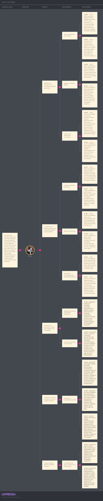

#### Impact Map 2: Dra. Laura Gómez

**Segundo Segmento Objetivo (Psicólogos Profesionales)**

*Figura: Impact Map de la Dra. Laura Gómez*

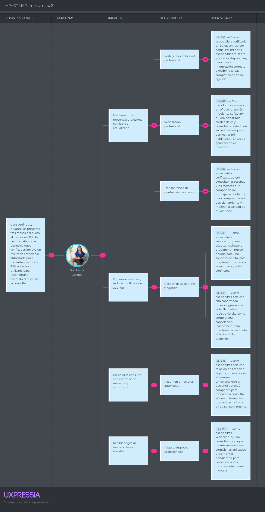


### 2.4.3. Product Backlog

El Product Backlog reúne y prioriza las historias de usuario (US) y las historias técnicas (TS) definidas en la sección 2.4.1, ordenándolas según el valor que aportan al negocio y la complejidad técnica que implica su desarrollo. La priorización combina dos criterios:

* **Valor de negocio por Épica:** EP-01 (identidad y privacidad) y EP-02 (diario, IA y autocuidado) constituyen la base del producto. EP-04 (directorio verificado), EP-06 (contacto, agenda y sesiones) y EP-07 (cobros, Premium y retiros) forman el recorrido de atención profesional y monetización. EP-05 (landing page) apoya la adquisición.
* **Estimación de esfuerzo:** los Story Points siguen la escala de Fibonacci (1, 2, 3, 5, 8) y reflejan complejidad, riesgo y dependencias.

El orden de la tabla sigue las dependencias de registro, directorio, contacto, propuesta, reserva, pago y sesión.

Enlace de trello: https://trello.com/invite/b/6aad90c13f858f04fc63f833/ATTI8fd9a76bec0c79fa8a7f8195257de3fcD372B969/product-backlog 

**Tabla 2. Product Backlog de SafeDiary**

| #Orden | Story ID | Épica | Título | Story Points | Sprint |
| --- | --- | --- | --- | --- | --- |
| 1 | TS-001 | EP-01 | Arquitectura modular y contratos de API | 8 | 1 |
| 2 | TS-002 | EP-01 | Cifrado y gestión segura de secretos | 8 | 1 |
| 3 | US-001 | EP-01 | Registro de cuenta | 3 | 1 |
| 4 | US-003 | EP-01 | Acceso con Google o Apple | 3 | 1 |
| 5 | US-006 | EP-01 | Edición del perfil personal | 2 | 1 |
| 6 | US-015 | EP-01 | Desbloqueo biométrico | 3 | 1 |
| 7 | US-016 | EP-01 | Recuperación de contraseña | 3 | 1 |
| 8 | US-008 | EP-02 | Registro de entrada de diario | 3 | 1 |
| 9 | US-010 | EP-02 | Registro rápido del estado emocional | 3 | 1 |
| 10 | TS-003 | EP-02 | Pipeline privado de voz y análisis de IA | 8 | 1 |
| 11 | US-011 | EP-02 | Reflexión guiada por voz con IA | 8 | 1 |
| 12 | US-017 | EP-05 | Presentación de la propuesta de valor | 1 | 1 |
| 13 | US-018 | EP-05 | Presentación de funcionalidades principales | 1 | 1 |
| 14 | US-019 | EP-05 | Consulta de testimonios | 1 | 1 |
| 15 | US-020 | EP-05 | Consulta de planes y precios | 1 | 1 |
| 16 | US-041 | EP-04 | Solicitud de verificación profesional | 5 | 2 |
| 17 | US-054 | EP-04 | Revisión de credenciales del psicólogo | 5 | 2 |
| 18 | US-036 | EP-04 | Publicación y edición de la ficha profesional | 5 | 2 |
| 19 | US-002 | EP-04 | Búsqueda y consulta de psicólogos verificados | 5 | 2 |
| 20 | US-048 | EP-06 | Solicitud de contacto y chat de coordinación | 8 | 2 |
| 21 | US-043 | EP-06 | Gestión de solicitudes y agenda profesional | 5 | 2 |
| 22 | US-049 | EP-06 | Aceptación del horario propuesto | 3 | 2 |
| 23 | US-014 | EP-06 | Reserva temporal del horario acordado | 5 | 2 |
| 24 | TS-006 | EP-06 / EP-07 | Orquestación idempotente de reservas y cobros | 8 | 2 |
| 25 | US-037 | EP-07 | Pago seguro de una sesión | 8 | 2 |
| 26 | TS-007 | EP-01 | Auditoría de accesos y consentimientos | 5 | 2 |
| 27 | US-009 | EP-01 | Consentimiento para compartir historial | 5 | 2 |
| 28 | US-023 | EP-01 | Revocación del acceso al historial | 5 | 2 |
| 29 | TS-005 | EP-02 | Recursos de crisis y escalamiento seguro | 5 | 2 |
| 30 | US-040 | EP-02 | Escalamiento seguro ante señales de crisis | 8 | 2 |
| 31 | US-013 | EP-02 | Acceso inmediato a ayuda de crisis | 5 | 2 |
| 32 | US-021 | EP-05 | Preguntas frecuentes y contacto | 2 | 2 |
| 33 | US-022 | EP-05 | Presentación de MindCluster | 2 | 2 |
| 34 | US-038 | EP-06 | Acceso a la videollamada programada | 5 | 3 |
| 35 | US-044 | EP-06 | Gestión de la atención profesional | 5 | 3 |
| 36 | US-039 | EP-04 | Calificación del especialista | 5 | 3 |
| 37 | US-042 | EP-04 | Transparencia del puntaje de confianza | 3 | 3 |
| 38 | US-045 | EP-01 | Consulta del resumen emocional autorizado | 5 | 3 |
| 39 | US-046 | EP-01 | Consulta del alcance del consentimiento | 3 | 3 |
| 40 | US-050 | EP-06 | Cancelación de reserva o cita y liberación del horario | 5 | 3 |
| 41 | US-047 | EP-07 | Consulta de pagos e ingresos profesionales | 3 | 3 |
| 42 | US-052 | EP-07 | Registro del método de retiro | 3 | 3 |
| 43 | US-053 | EP-07 | Solicitud y seguimiento de retiro | 5 | 3 |
| 44 | US-051 | EP-07 | Suscripción al plan Premium | 5 | 3 |
| 45 | TS-008 | EP-01 | Despliegue, observabilidad y recuperación segura | 5 | 3 |
| 46 | US-012 | EP-02 | Consulta de estadísticas emocionales | 5 | 3 |
| 47 | US-025 | EP-01 | Protección de entradas en bóveda privada | 5 | 3 |
| 48 | US-033 | EP-01 | Eliminación de cuenta y datos personales | 5 | 3 |
| 49 | US-024 | EP-02 | Recordatorios de registro emocional | 3 | 3 |
| 50 | US-027 | EP-02 | Seguimiento emocional proactivo | 3 | 3 |
| 51 | US-028 | EP-02 | Exportación del progreso en PDF | 3 | 3 |
| 52 | US-031 | EP-02 | Registro de factores externos | 3 | 3 |
| 53 | US-007 | EP-02 | Gestión de rutinas de autocuidado | 2 | 3 |
| 54 | US-026 | EP-02 | Personalización del tono de la IA | 2 | 3 |
| 55 | US-029 | EP-02 | Insignias por constancia emocional | 2 | 3 |
| 56 | US-030 | EP-02 | Ejercicios rápidos de regulación | 2 | 3 |
| 57 | US-032 | EP-02 | Recuerdos de evolución emocional | 2 | 3 |


Trelo con el backlog: [Trello SafeDiary](https://trello.com/b/Q2UsNz3t/product-backlog)


## 2.5. Strategic-Level Domain-Driven Design


### 2.5.1. EventStorming


#### 2.5.1.1. Candidate Context Discovery

La Candidate Context Discovery es el proceso colaborativo mediante el cual identificamos las fronteras de los bounded contexts del dominio de SafeDiary. El Big Picture EventStorming y los tableros de fase 1 identifican **ocho contextos**: IAM, Profiles, Diary, AssistantAI, Rutines, Clinician Directory, Care Scheduling y Payments & Payouts. La ficha pública, verificación, reseñas y tarifas profesionales pertenecen a Clinician Directory; la cita y el horario reservado pertenecen a Care Scheduling; el cobro, la suscripción, la comisión y el retiro pertenecen a Payments & Payouts.

##### IAM (Identity & Access Management)

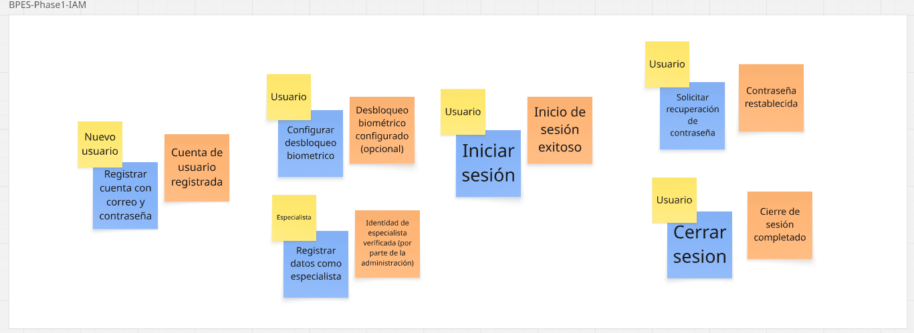

Define el límite de seguridad, identidad y gobernanza del consentimiento. El flujo muestra al Paciente y al Especialista autenticándose mediante credenciales o biometría segura, culminando en la generación de tokens de acceso. Asimismo, delimita la frontera crítica donde el paciente otorga o revoca el consentimiento de acceso a su historial clínico para especialistas autorizados mediante el evento pivotal **Consentimiento Otorgado a Especialista**.

##### Profiles

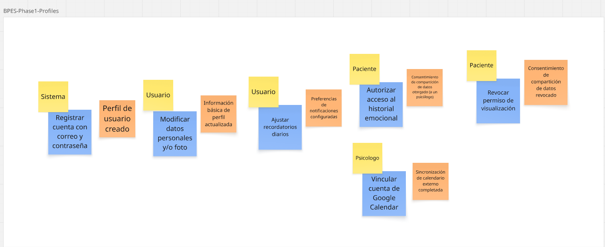

Delimita los datos personales y preferencias de presentación de cada usuario dentro de la plataforma. Muestra al paciente configurando su información y preferencias. La verificación de credenciales, la ficha pública, el banner y las tarifas del psicólogo se trasladan a **Clinician Directory**, para evitar dos fuentes de verdad.

##### Clinician Directory

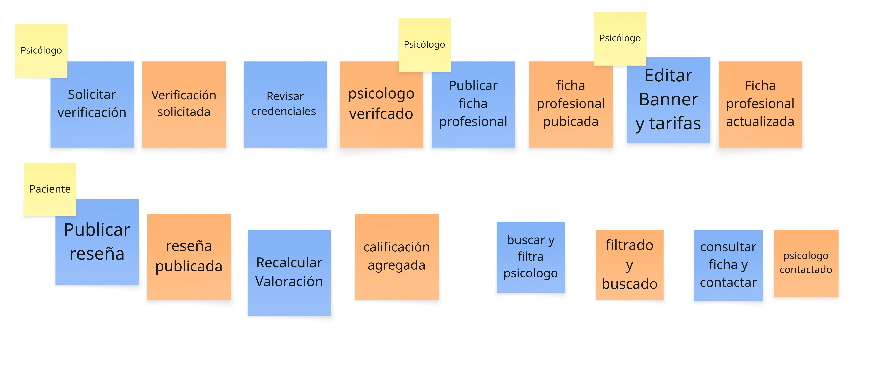

Gestiona la solicitud y revisión de credenciales del psicólogo, su ficha profesional pública, el banner y las tarifas; permite buscar y filtrar especialistas, consultar su ficha y publicar reseñas. La solicitud de contacto inicia un flujo de **Care Scheduling**, no una reserva dentro del directorio. La elegibilidad de una reseña debe verificarse contra una sesión completada, sin exponer datos clínicos.

##### Care Scheduling

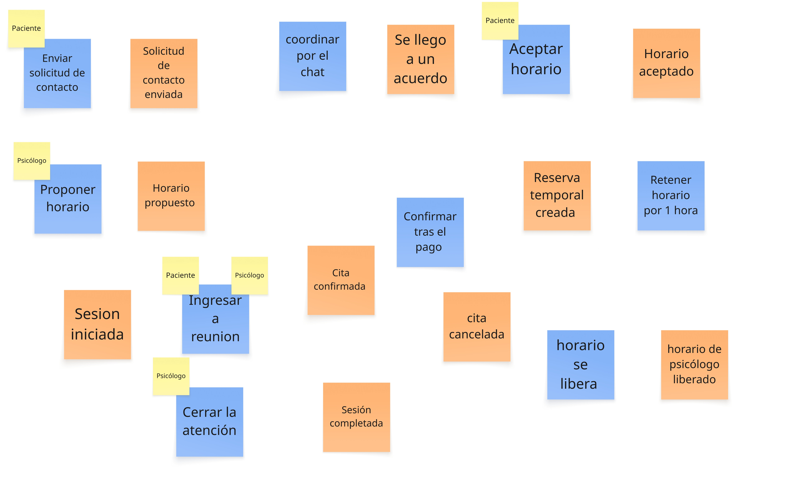

Coordina la solicitud de contacto, la conversación para acordar el horario, la propuesta y aceptación del psicólogo y el paciente, la retención temporal de una hora, la cita, el acceso de sus participantes a la reunión y el cierre de la sesión. Es dueño de la disponibilidad reservable y libera el horario al cancelarse o expirar la reserva. Solo confirma la cita al recibir de **Payments & Payouts** un pago aprobado para esa reserva. El chat de coordinación no concede acceso al diario.

##### Payments & Payouts

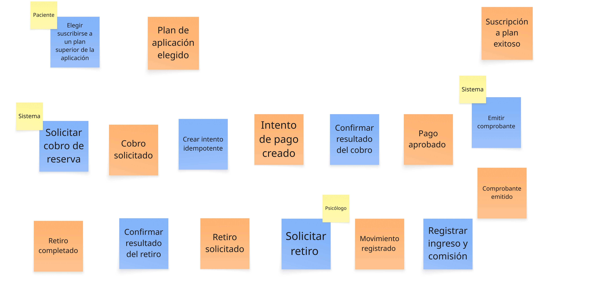

Gestiona dos cobros distintos: la sesión profesional y la suscripción de la aplicación (Básico a Premium). Crea intentos de pago idempotentes, registra el resultado confirmado por la pasarela y emite comprobantes. Tras el cobro de una sesión registra el ingreso profesional y la comisión de la plataforma; el psicólogo puede solicitar un retiro sujeto al saldo disponible y a la confirmación de la pasarela de retiro. Una suscripción Premium se activa únicamente después de confirmarse su pago y no aumenta el saldo retirable del psicólogo. El contexto no almacena contenido del diario ni datos completos de tarjetas.

##### Diary

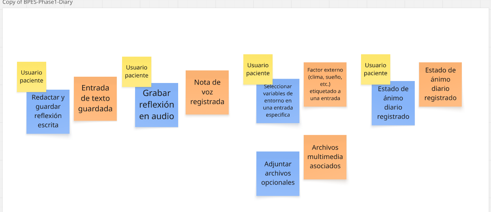

Representa el núcleo transaccional confidencial de SafeDiary. Modela al Paciente redactando entradas íntimas de texto o registrando notas de voz en su dispositivo móvil, asociando factores de contexto (sueño, energía, estrés) y registrando su estado anímico diario en un solo toque, desencadenando el evento pivotal de negocio **Entrada de Diario Guardada** y la actualización automática de su racha de constancia.

##### AssistantAI

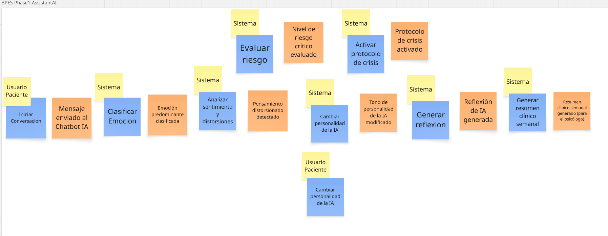

Aísla el motor de soporte reflexivo y procesamiento cognitivo 100% en texto asistido por IA. El flujo detalla la interacción dialógica del Paciente con el asistente, la detección de distorsiones de pensamiento y la evaluación preventiva de riesgo. El evento pivotal en este contexto es **Riesgo Crítico Autolítico Detectado**, el cual actúa como detonante automático para activar protocolos de emergencia y derivación inmediata a líneas de crisis.

##### Rutines

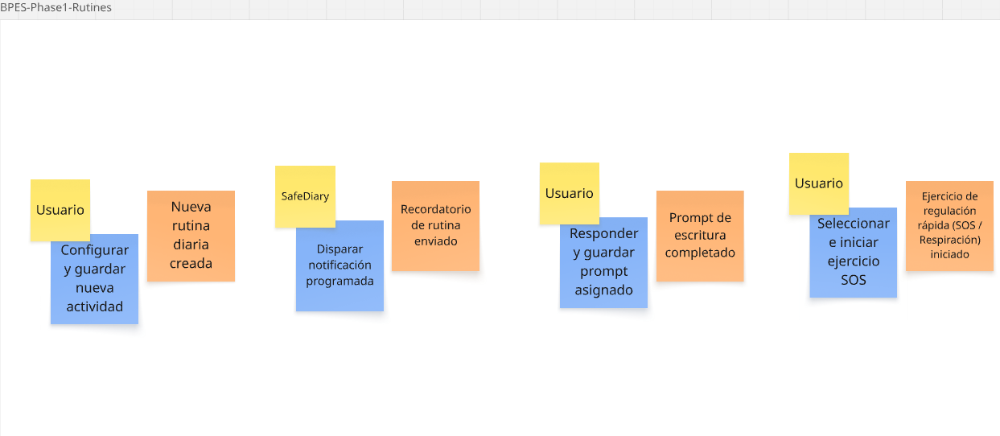

Enmarca el módulo de bienestar proactivo y hábitos saludables. Muestra al Paciente explorando el catálogo de ejercicios de respiración guiada, programando recordatorios de autocuidado y completando micro-desafíos emocionales, lo que produce el evento de dominio **Micro-Hábito de Bienestar Completado** para el seguimiento de progreso.

#### 2.5.1.2. Domain Message Flows Modeling

El Domain Message Flows Modeling mapea cómo los mensajes (eventos de integración y comandos) fluyen entre los diferentes bounded contexts identificados para resolver los casos de uso esenciales del negocio. Este modelado es crucial para entender las dependencias dinámicas, los límites de consistencia eventual y los patrones de comunicación asíncrona del sistema.

##### Flujo 1: Registro en Diario y Generación de Reflexión Asistida por IA (Diary ⇄ AssistantAI)

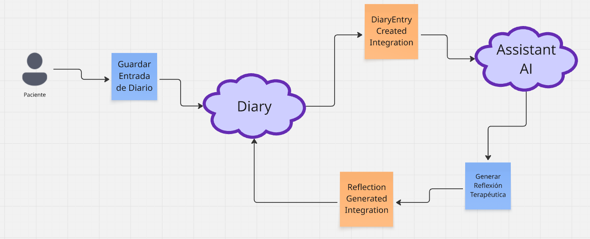

Este diagrama ilustra el flujo de análisis emocional y reflexión asistida. Comienza cuando el **Paciente** ejecuta el comando síncrono **Guardar Entrada de Diario** dentro del contexto **Diary**. La persistencia de la vivencia detona el evento asíncrono **DiaryEntryCreated Integration**, el cual viaja a través del Message Broker hacia el contexto **AssistantAI**. Este último procesa el contenido textual mediante el comando **Generar Reflexión Terapéutica** utilizando modelos de lenguaje natural, culminando con la emisión del evento **ReflectionGenerated Integration** que retorna hacia **Diary** para vincular la retroalimentación empática al historial del usuario sin mutar su redacción original.

##### Flujo 2: Detección Preventiva de Crisis y Activación de Protocolo de Emergencia (AssistantAI ⇄ IAM / Línea de Emergencia)

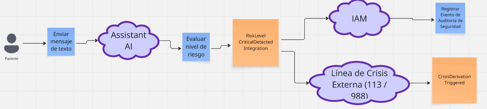

Muestra el protocolo de contención y seguridad ante emergencias psicológicas. Se inicia cuando el **Paciente** interactúa mediante el comando **Enviar Mensaje de Texto** dentro de **AssistantAI**. El motor cognitivo ejecuta internamente el comando **Evaluar Nivel de Riesgo** identificando indicadores autolíticos severos, lo que dispara el evento pivotal **RiskLevelCriticalDetected Integration**. Este evento es consumido de forma concurrente por **IAM** para asentar una traza inmutable en auditoría y por la pasarela de **Línea de Crisis Externa**, activando el evento **CrisisDerivationTriggered** para desplegar en el frontend móvil la derivación telefónica inmediata hacia la Línea 113 Minsa / 988.

##### Flujo 3: Compartición Terapéutica bajo Consentimiento Explícito (IAM ⇄ Profiles ⇄ Diary)

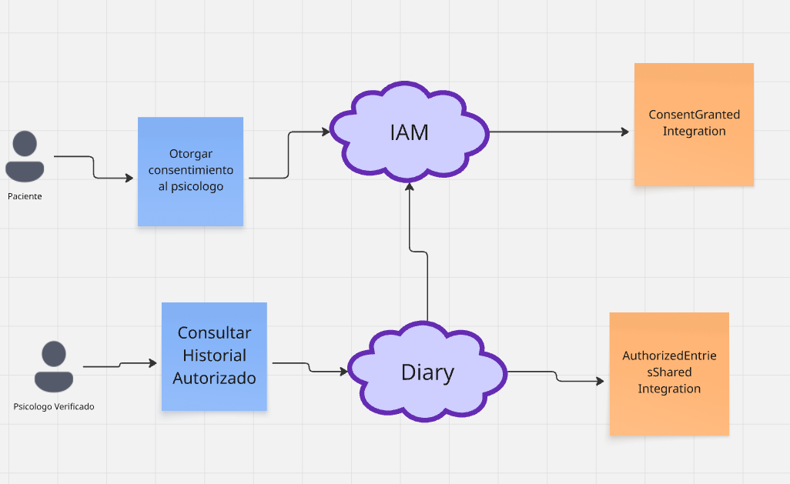

Modela el mecanismo de interoperabilidad y gobierno de la privacidad de SafeDiary. El **Paciente** emite el comando **Otorgar Consentimiento a Psicólogo** en **IAM**, definiendo un alcance temporal explícito y generando el evento **ConsentGranted Integration**. Posteriormente, cuando el **Psicólogo Verificado** ejecuta **Consultar Historial Autorizado** en **Diary**, este último valida síncronamente los permisos con **IAM**. Al confirmar la vigencia del contrato, se despacha el evento **AuthorizedEntriesShared Integration**, proporcionando exclusivamente las vivencias aprobadas y garantizando que las notas alojadas en la Bóveda Privada permanezcan estrictamente inaccesibles.

##### Flujo 4: Directorio, reserva, pago y preparación de atención profesional (Clinician Directory ⇄ Care Scheduling ⇄ Payments & Payouts)

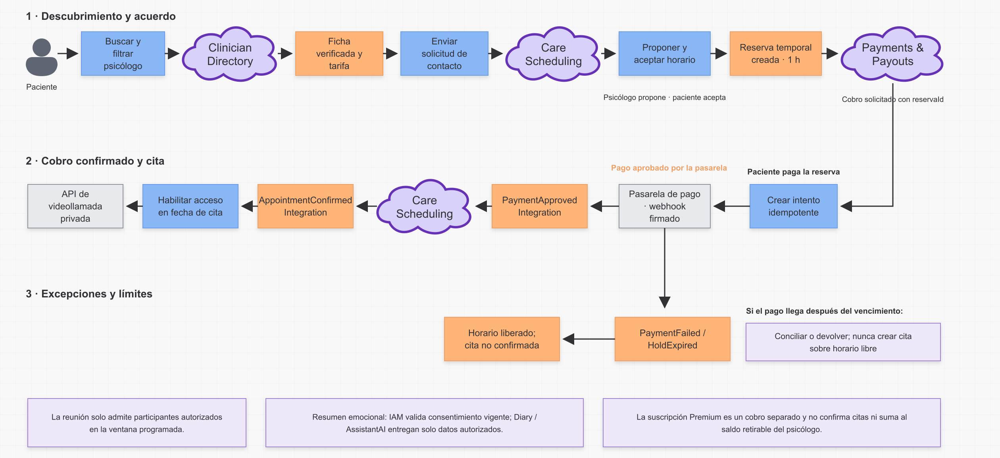

El **Paciente** encuentra un **Psicólogo Verificado** en Clinician Directory y solicita contacto. En Care Scheduling ambas partes acuerdan un horario; el sistema crea una reserva temporal de una hora y solicita a Payments & Payouts el cobro identificado por esa reserva. Solo una aprobación de pago confirmada permite a Care Scheduling emitir **AppointmentConfirmed** y habilitar el acceso temporal de los participantes a la reunión. Si el pago falla o la reserva vence, el horario se libera; reintentos y notificaciones duplicadas no deben generar cargos ni citas dobles. Antes de compartir cualquier resumen emocional, se valida en IAM el consentimiento vigente y se solicita a Diary o AssistantAI únicamente la información autorizada.

#### 2.5.1.3. Bounded Context Canvases

##### Bounded Context Canvas: AssistantAI

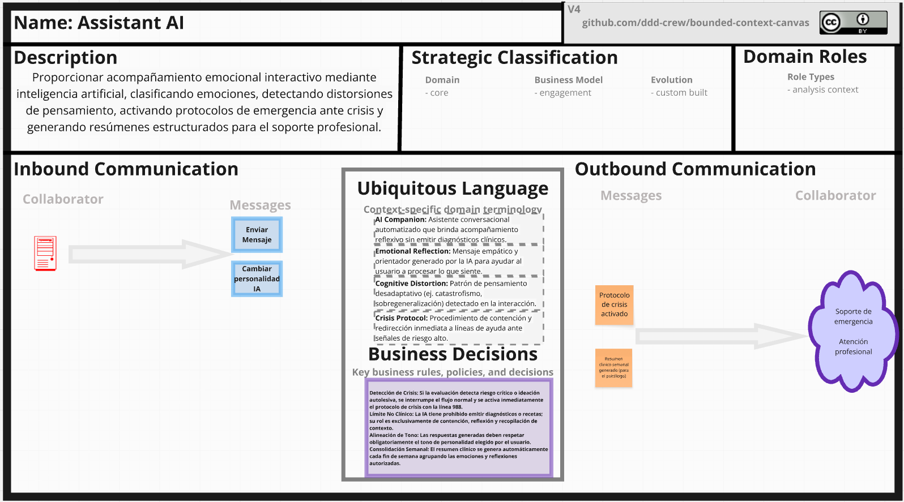

AssistantAI procesa la conversación reflexiva, identifica emociones y señales de riesgo, y genera respuestas y resúmenes emocionales. No administra entradas del diario ni concede acceso a información clínica.

##### Bounded Context Canvas: Diary

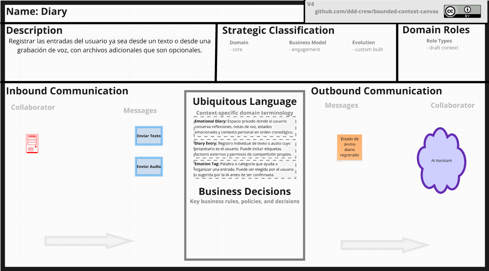

Diary conserva las entradas escritas o de voz, los estados de ánimo y la evolución emocional del paciente. Antes de compartir información con un psicólogo, valida en IAM el consentimiento y su alcance vigente.

##### Bounded Context Canvas: Rutines

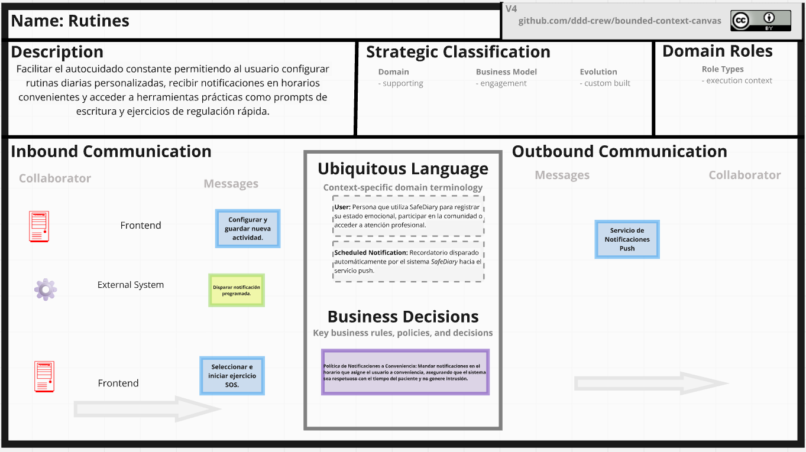

Rutines gestiona las actividades de autocuidado, los ejercicios breves y sus recordatorios. Registra el cumplimiento de hábitos sin acceder al contenido privado del diario.

##### Bounded Context Canvas: Clinician Directory

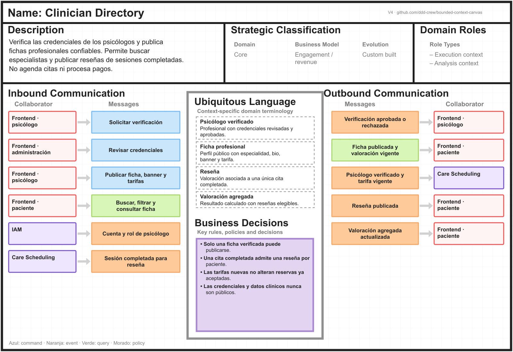

Clinician Directory verifica credenciales y administra las fichas públicas, especialidades, tarifas y reseñas de los psicólogos. Permite buscarlos y consultarlos, pero no reserva citas.

##### Bounded Context Canvas: Care Scheduling

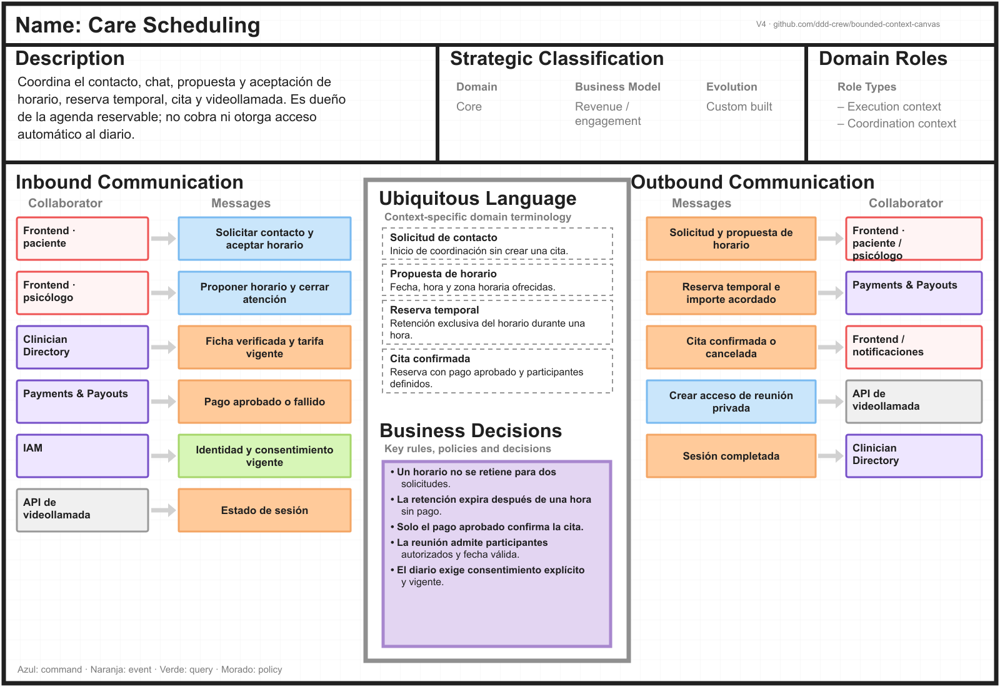

Care Scheduling coordina el contacto, el acuerdo de horario, la reserva temporal y la atención por videollamada. Controla la agenda reservable y confirma la cita únicamente tras recibir el pago aprobado.

##### Bounded Context Canvas: Payments & Payouts

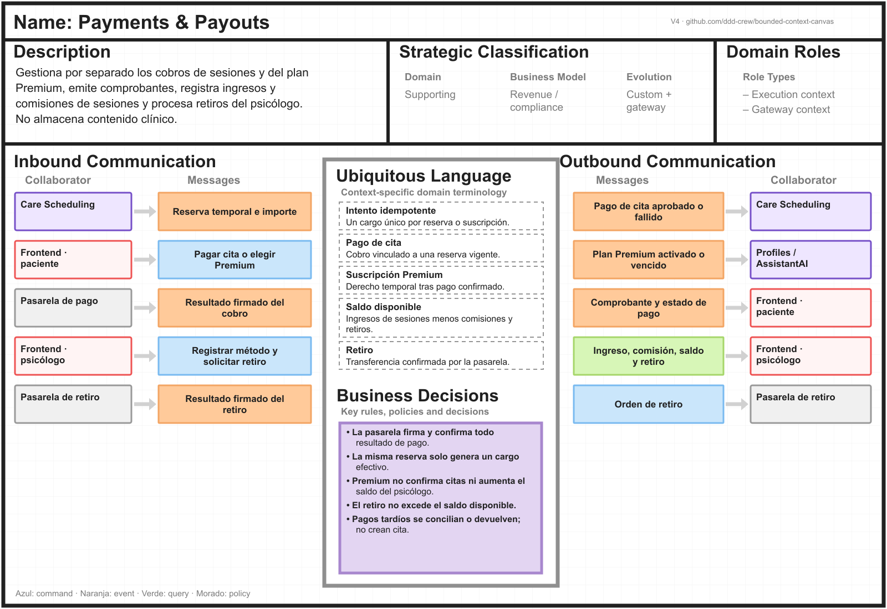

Payments & Payouts procesa por separado los pagos de citas y suscripciones Premium, emite comprobantes y registra ingresos y comisiones. También administra el saldo y los retiros del psicólogo sin mezclar los ingresos por suscripciones.

### 2.5.2. Context Mapping

#### Resumen del Proceso

El Context Mapping reúne la información del Ubiquitous Language (2.3.6), las User Stories (2.4.1), el EventStorming (2.5.1) y los límites de cada Bounded Context Canvas para comparar diseños de integración. El análisis comprende ocho bounded contexts: IAM, Profiles, AssistantAI, Diary, Rutines, Clinician Directory, Care Scheduling y Payments & Payouts. Clinician Directory es dueño de la verificación y la ficha pública; Care Scheduling, del contacto, la agenda reservable y la cita; Payments & Payouts, del cobro, la suscripción y los retiros. El acceso del psicólogo a información emocional depende del consentimiento vigente administrado por IAM.

Se elaboraron dos mapas: un candidato inicial que concentra responsabilidades y acopla modelos de identidad, y un mapa final que delimita las relaciones mediante Open Host Service, Published Language, Anticorruption Layer, Customer/Supplier, Partnership y Separate Ways.

#### Análisis de Alternativas (Exploración de Diseño)

1. **¿Qué pasaría si trasladamos la ficha profesional de Clinician Directory a Profiles?** Profiles ya contiene los datos personales y preferencias de presentación, pero la verificación de credenciales, la publicación de tarifas y las reseñas obedecen reglas propias del directorio. **Decisión:** la ficha profesional pública y su estado de verificación permanecen en Clinician Directory; Profiles conserva los datos personales y las preferencias del usuario. Ambos referencian el `accountId` emitido por IAM, sin compartir un modelo de persistencia.

2. **¿Qué pasaría si unificamos la disponibilidad publicada con la reserva de una cita?** La tarifa y la ficha del psicólogo son datos de consulta, mientras que la agenda reservable exige controlar conflictos, expiración y aceptación del horario. **Decisión:** Clinician Directory publica la identidad profesional, la ficha y la tarifa vigente; Care Scheduling es dueño del horario disponible, la retención temporal de una hora y la cita. La reserva guarda el importe acordado para que un cambio posterior de tarifa no modifique su cobro.

3. **¿Qué pasaría si fusionamos Clinician Directory, Care Scheduling y Payments & Payouts?** La búsqueda y las reseñas, la concurrencia de reservas y la conciliación financiera requieren reglas y ciclos de cambio diferentes. Una sola frontera haría que la publicación de una ficha dependiera de operaciones de agenda o de pasarela. **Decisión:** mantener los tres bounded contexts separados. La solicitud de contacto inicia el flujo de Care Scheduling; la reserva temporal solicita el cobro a Payments & Payouts; únicamente el pago aprobado confirma la cita.

4. **¿Qué pasaría si movemos el cobro de la cita a Care Scheduling?** El agendamiento conocería intentos de pago, comprobantes, comisiones y retiros, además de sus propias reglas de disponibilidad. **Decisión:** Payments & Payouts es dueño de los intentos idempotentes y del resultado de la pasarela. Care Scheduling solo conserva la referencia de la reserva y el estado necesario para confirmar o liberar el horario. El cobro Premium constituye otra operación y no confirma citas ni incrementa el saldo retirable del psicólogo.

5. **¿Qué pasaría si duplicamos información para reducir dependencias?** Una copia local del consentimiento en Diary o Care Scheduling permitiría lecturas posteriores a una revocación. En cambio, una proyección del estado Básico/Premium en Profiles o AssistantAI puede actualizarse por evento, pues el pago y la vigencia siguen siendo propiedad de Payments & Payouts. **Decisión:** no duplicar el consentimiento como fuente de autorización; validar su vigencia en IAM antes de compartir información sensible. Distribuir el estado de plan solo como proyección de lectura, sin conceder beneficios hasta la confirmación del cobro.

6. **¿Qué pasaría si usamos un servicio compartido para las notificaciones?** Rutines envía recordatorios, Care Scheduling informa cambios de cita y AssistantAI presenta avisos vinculados con sus flujos. Replicar la integración de envío en cada contexto duplicaría infraestructura. **Decisión:** utilizar un servicio genérico de notificaciones: cada bounded context decide cuándo emitir su aviso y el servicio únicamente lo entrega. Las decisiones de negocio no pasan al servicio compartido.

7. **¿Qué pasaría si trasladamos la preparación clínica a Care Scheduling?** Ese contexto necesita mostrar al psicólogo un resumen emocional, pero no debe almacenar el diario completo ni asumir el modelo conversacional de AssistantAI. **Decisión:** Diary y AssistantAI conservan sus datos y generan únicamente información autorizada. Care Scheduling consume una vista mínima para la cita después de validar en IAM el consentimiento vigente y utiliza una Anticorruption Layer para traducirla a su propio lenguaje.

8. **¿Qué pasaría si creamos un Shared Kernel entre IAM y Profiles?** Ambos utilizan `accountId`, pero IAM administra credenciales, sesiones y consentimiento, mientras Profiles administra datos de presentación. Compartir entidades internas acoplaría cambios de perfil con reglas de seguridad. **Decisión:** rechazar el Shared Kernel. IAM expone identidad y autorización mediante contratos estables; Profiles y los demás contextos solo consumen esos contratos.

#### Patrones de Relación y Mapa de Contextos

Las consultas de identidad y consentimiento son síncronas cuando una decisión de acceso requiere el estado vigente. Los hechos de negocio que no requieren esa validación inmediata se intercambian mediante eventos de integración publicados con contratos explícitos.

**A. IAM (upstream) → Profiles, Clinician Directory, Care Scheduling, Payments & Payouts, AssistantAI y Rutines (downstream).** Patrón: **Open Host Service / Published Language**. IAM publica `accountId`, rol y estado de sesión mediante un contrato de identidad; ningún consumidor accede a credenciales ni reproduce su modelo interno. Clinician Directory verifica las credenciales profesionales como regla propia, distinta de la autenticación de IAM.

**B. IAM (upstream) → Diary, AssistantAI y Care Scheduling (downstream).** Patrón: **Open Host Service + Anticorruption Layer** en los consumidores. Ante una consulta de un psicólogo, cada consumidor traduce la respuesta de autorización de IAM a su caso de uso y respeta el alcance y la vigencia del consentimiento. Un evento de revocación puede actualizar proyecciones, pero no sustituye la validación vigente antes de entregar datos sensibles.

**C. Diary ↔ AssistantAI.** Patrón: **Partnership / Published Language**. Diary publica la entrada autorizada para análisis y AssistantAI devuelve la reflexión generada. Cada uno conserva su modelo y ambos coordinan la evolución del contrato de integración.

**D. Clinician Directory (upstream) → Care Scheduling (downstream).** Patrón: **Customer/Supplier / Published Language**. El directorio provee identificador del psicólogo, verificación, ficha y tarifa; Care Scheduling consume esos datos para iniciar una solicitud y fijar el importe de la reserva. El directorio no decide si el horario está libre.

**E. Care Scheduling (upstream) → Clinician Directory (downstream).** Patrón: **Published Language**. El evento de sesión completada habilita al directorio para comprobar la elegibilidad de una reseña, limitada a una por cita y paciente. No se publica contenido de la sesión.

**F. Care Scheduling ↔ Payments & Payouts.** Patrón: **Customer/Supplier / Published Language** con contratos en ambos sentidos. Care Scheduling envía la referencia, el importe y el vencimiento de la reserva; Payments & Payouts gestiona un único intento de cobro por clave idempotente y publica su resultado. Care Scheduling confirma la cita solo ante un pago aprobado para una reserva vigente; si falla o expira, libera el horario. Un pago tardío se concilia o devuelve sin recrear una cita sobre un horario liberado.

**G. Payments & Payouts (upstream) → Profiles y AssistantAI (downstream).** Patrón: **Published Language**. El evento de suscripción confirmada actualiza las proyecciones de plan en ambos consumidores. La pasarela, el comprobante y la vigencia de Premium permanecen en Payments & Payouts; la suscripción no forma parte del flujo de confirmación de citas.

**H. AssistantAI (upstream) → Care Scheduling (downstream).** Patrón: **Customer/Supplier + Anticorruption Layer**. Care Scheduling consume solo el resumen emocional necesario para la preparación de una atención, después de comprobar el consentimiento con IAM; no recibe la conversación completa ni modifica el modelo de AssistantAI.

**I. Diary — Rutines.** Patrón: **Separate Ways**. Los hábitos y ejercicios se administran sin leer ni modificar entradas privadas del diario. Cada contexto mantiene su propio historial y sus reglas.

#### Mapa de Contextos (diagramas)

**Candidato inicial (descartado).** Agrupa las funciones profesionales en un solo contexto, comparte el modelo interno de IAM con Profiles y hace que los consumidores adopten directamente su lenguaje de identidad. Esta alternativa mezcla reglas de publicación, reserva y finanzas y amplía el acoplamiento de los datos sensibles.

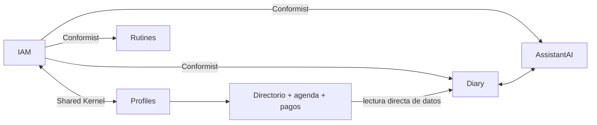
```mermaid
flowchart LR
    IAM0["IAM"] <-->|"Shared Kernel"| Profiles0["Profiles"]
    IAM0 -->|"Conformist"| Diary0["Diary"]
    IAM0 -->|"Conformist"| AI0["AssistantAI"]
    IAM0 -->|"Conformist"| Rutines0["Rutines"]
    Profiles0 --> Professional0["Directorio + agenda + pagos"]
    Diary0 <--> AI0
    Professional0 -->|"lectura directa de datos"| Diary0
```

**Mapa final aprobado.** Distingue identidad, datos emocionales, directorio, agenda y pagos. Las flechas etiquetan el contrato o patrón que cruza cada frontera; la línea discontinua indica ausencia deliberada de integración entre Diary y Rutines.

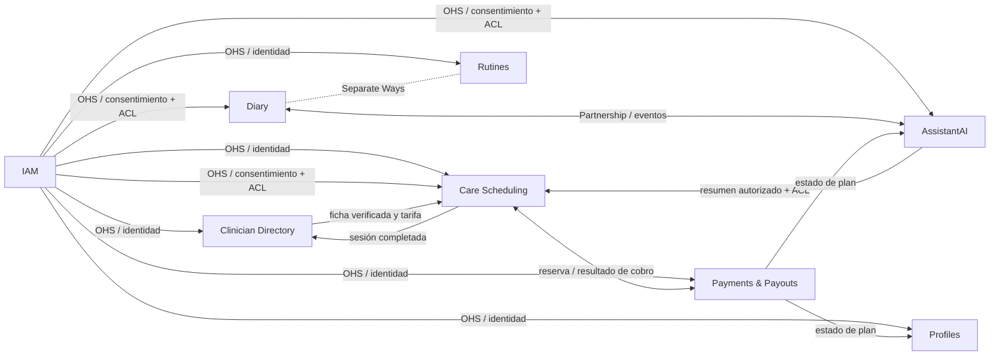
```mermaid
flowchart LR
    IAM["IAM"] -->|"OHS / identidad"| Profiles["Profiles"]
    IAM -->|"OHS / identidad"| Directory["Clinician Directory"]
    IAM -->|"OHS / identidad"| Care["Care Scheduling"]
    IAM -->|"OHS / identidad"| Payments["Payments & Payouts"]
    IAM -->|"OHS / identidad"| Rutines["Rutines"]
    IAM -->|"OHS / consentimiento + ACL"| Diary["Diary"]
    IAM -->|"OHS / consentimiento + ACL"| AI["AssistantAI"]
    IAM -->|"OHS / consentimiento + ACL"| Care
    Diary <-->|"Partnership / eventos"| AI
    Directory -->|"ficha verificada y tarifa"| Care
    Care -->|"sesión completada"| Directory
    Care <-->|"reserva / resultado de cobro"| Payments
    AI -->|"resumen autorizado + ACL"| Care
    Payments -->|"estado de plan"| Profiles
    Payments -->|"estado de plan"| AI
    Diary -.-|"Separate Ways"| Rutines
```

#### Discusión de Alternativas y Conclusión

La comparación descarta el Shared Kernel entre IAM y Profiles, la fusión de directorio, agenda y pagos, y la duplicación del consentimiento. El mapa final mantiene a IAM como autoridad de identidad y acceso; a Diary y AssistantAI como propietarios de la información emocional; a Clinician Directory como dueño de la ficha, verificación y reseñas; a Care Scheduling como dueño de la disponibilidad reservable y la cita; y a Payments & Payouts como dueño de pagos, suscripciones e ingresos profesionales. Los contratos de integración permiten completar el recorrido desde la búsqueda del psicólogo hasta la atención pagada sin transferir contenido clínico o responsabilidad financiera a contextos que no los gobiernan.

### 2.5.3. Software Architecture

La arquitectura de software de **SafeDiary** se estructura siguiendo las directrices del **C4 Model** (Context, Containers, Components, Code), propuesto por Simon Brown. Este modelo arquitectónico proporciona una abstracción jerárquica y coherente del sistema, permitiendo visualizar desde las fronteras organizacionales y las interacciones con actores y sistemas externos (Nivel 1: Contexto), hasta la descomposición en unidades de ejecución y tecnologías de persistencia (Nivel 2: Contenedores), la estructura modular interna de cada servicio (Nivel 3: Componentes) y los modelos de clases y esquemas relacionales (Nivel 4: Código).

La solución sigue una **arquitectura de servicios desacoplados** alineada con los ocho bounded contexts vigentes: IAM, Profiles, AssistantAI, Diary, Rutines, Clinician Directory, Care Scheduling y Payments & Payouts. La aplicación móvil se comunica con sus servicios mediante un API Gateway; las consultas que requieren identidad o consentimiento vigente son síncronas y los cambios de estado se publican mediante un bus de eventos.

#### 2.5.3.1. Software Architecture Context Level Diagrams

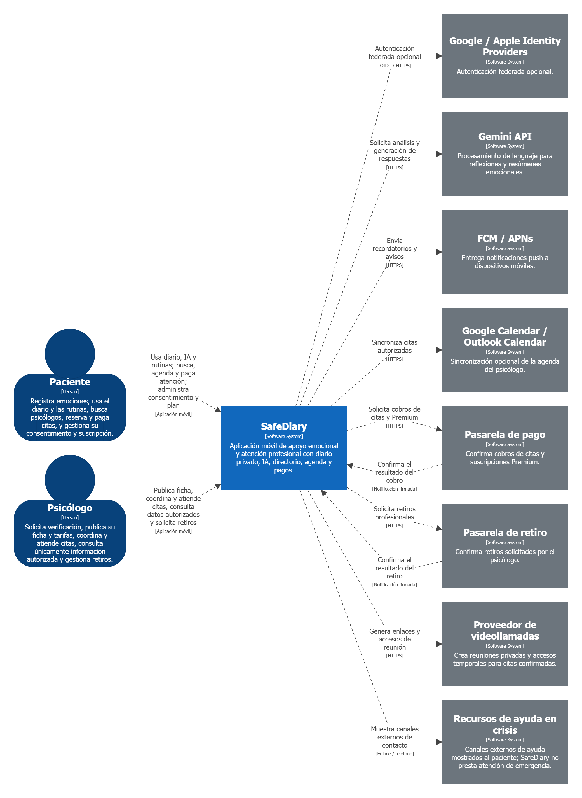

Código en **Structurizr DSL (C4 Model)**:

```text
workspace "SafeDiary - System Context" "C4 System Context de SafeDiary" {

    model {
        patient = person "Paciente" "Registra emociones, usa el diario y las rutinas, busca psicólogos, reserva y paga citas, y gestiona su consentimiento y suscripción."
        psychologist = person "Psicólogo" "Solicita verificación, publica su ficha y tarifas, coordina y atiende citas, consulta únicamente información autorizada y gestiona retiros."

        safeDiary = softwareSystem "SafeDiary" "Aplicación móvil de apoyo emocional y atención profesional con diario privado, IA, directorio, agenda y pagos."

        identityProvider = softwareSystem "Google / Apple Identity Providers" "Autenticación federada opcional." "External System"
        gemini = softwareSystem "Gemini API" "Procesamiento de lenguaje para reflexiones y resúmenes emocionales." "External System"
        notifications = softwareSystem "FCM / APNs" "Entrega notificaciones push a dispositivos móviles." "External System"
        calendars = softwareSystem "Google Calendar / Outlook Calendar" "Sincronización opcional de la agenda del psicólogo." "External System"
        paymentGateway = softwareSystem "Pasarela de pago" "Confirma cobros de citas y suscripciones Premium." "External System"
        payoutGateway = softwareSystem "Pasarela de retiro" "Confirma retiros solicitados por el psicólogo." "External System"
        videoProvider = softwareSystem "Proveedor de videollamadas" "Crea reuniones privadas y accesos temporales para citas confirmadas." "External System"
        crisisResources = softwareSystem "Recursos de ayuda en crisis" "Canales externos de ayuda mostrados al paciente; SafeDiary no presta atención de emergencia." "External System"

        patient -> safeDiary "Usa diario, IA y rutinas; busca, agenda y paga atención; administra consentimiento y plan" "Aplicación móvil"
        psychologist -> safeDiary "Publica ficha, coordina y atiende citas, consulta datos autorizados y solicita retiros" "Aplicación móvil"

        safeDiary -> identityProvider "Autenticación federada opcional" "OIDC / HTTPS"
        safeDiary -> gemini "Solicita análisis y generación de respuestas" "HTTPS"
        safeDiary -> notifications "Envía recordatorios y avisos" "HTTPS"
        safeDiary -> calendars "Sincroniza citas autorizadas" "HTTPS"
        safeDiary -> paymentGateway "Solicita cobros de citas y Premium" "HTTPS"
        paymentGateway -> safeDiary "Confirma el resultado del cobro" "Notificación firmada"
        safeDiary -> payoutGateway "Solicita retiros profesionales" "HTTPS"
        payoutGateway -> safeDiary "Confirma el resultado del retiro" "Notificación firmada"
        safeDiary -> videoProvider "Genera enlaces y accesos de reunión" "HTTPS"
        safeDiary -> crisisResources "Muestra canales externos de contacto" "Enlace / teléfono"
    }

    views {
        systemContext safeDiary "SystemContext" {
            include *
            autoLayout
        }

        styles {
            element "Person" {
                shape Person
                background #08427b
                color #ffffff
            }
            element "Software System" {
                background #1168bd
                color #ffffff
            }
            element "External System" {
                background #6c757d
                color #ffffff
            }
        }
    }
}
```

#### 2.5.3.2. Software Architecture Container Level Diagrams

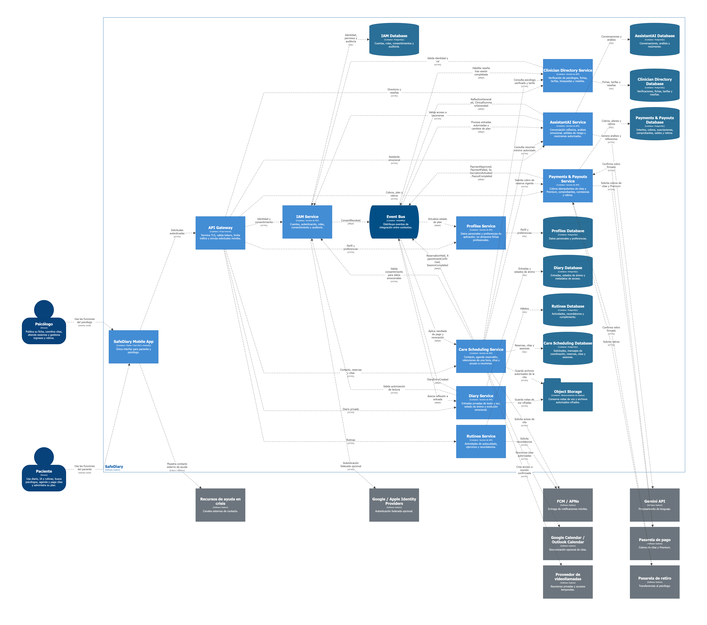

Código en **Structurizr DSL (C4 Model)**:

```text
workspace "SafeDiary - Containers" "C4 Container Diagram de SafeDiary" {

    model {
        patient = person "Paciente" "Usa diario, IA y rutinas; busca psicólogos, agenda y paga citas y administra su plan."
        psychologist = person "Psicólogo" "Publica su ficha, coordina citas, atiende sesiones y gestiona ingresos y retiros."

        safeDiary = softwareSystem "SafeDiary" {

            mobileApp = container "SafeDiary Mobile App" "Única interfaz para paciente y psicólogo." "Flutter / Dart (iOS y Android)"
            apiGateway = container "API Gateway" "Termina TLS, valida tokens, limita tráfico y enruta solicitudes móviles." "Proxy inverso"

            iamApi = container "IAM Service" "Cuentas, autenticación, roles, consentimiento y auditoría." "Servicio de API"
            profilesApi = container "Profiles Service" "Datos personales y preferencias de aplicación; no almacena fichas profesionales." "Servicio de API"
            assistantAiApi = container "AssistantAI Service" "Conversación reflexiva, análisis emocional, señales de riesgo y resúmenes autorizados." "Servicio de API"
            diaryApi = container "Diary Service" "Entradas privadas de texto y voz, estado de ánimo y evolución emocional." "Servicio de API"
            rutinesApi = container "Rutines Service" "Actividades de autocuidado, ejercicios y recordatorios." "Servicio de API"
            directoryApi = container "Clinician Directory Service" "Verificación de psicólogos, fichas, tarifas, búsquedas y reseñas." "Servicio de API"
            schedulingApi = container "Care Scheduling Service" "Contacto, agenda reservable, retenciones de una hora, citas y acceso a reuniones." "Servicio de API"
            paymentsApi = container "Payments & Payouts Service" "Cobros idempotentes de citas y Premium, comprobantes, comisiones y retiros." "Servicio de API"

            iamDb = container "IAM Database" "Cuentas, roles, consentimientos y auditoría." "PostgreSQL" "Database"
            profilesDb = container "Profiles Database" "Datos personales y preferencias." "PostgreSQL" "Database"
            assistantAiDb = container "AssistantAI Database" "Conversaciones, análisis y resúmenes." "PostgreSQL" "Database"
            diaryDb = container "Diary Database" "Entradas, estados de ánimo y metadatos de acceso." "PostgreSQL" "Database"
            rutinesDb = container "Rutines Database" "Actividades, recordatorios y cumplimiento." "PostgreSQL" "Database"
            directoryDb = container "Clinician Directory Database" "Verificaciones, fichas, tarifas y reseñas." "PostgreSQL" "Database"
            schedulingDb = container "Care Scheduling Database" "Solicitudes, mensajes de coordinación, reservas, citas y sesiones." "PostgreSQL" "Database"
            paymentsDb = container "Payments & Payouts Database" "Intentos, cobros, suscripciones, comprobantes, saldos y retiros." "PostgreSQL" "Database"

            eventBus = container "Event Bus" "Distribuye eventos de integración entre contextos." "RabbitMQ" "Queue"
            objectStorage = container "Object Storage" "Conserva notas de voz y archivos autorizados cifrados." "Almacenamiento de objetos" "Storage"
        }

        identityProvider = softwareSystem "Google / Apple Identity Providers" "Autenticación federada opcional." "External System"
        gemini = softwareSystem "Gemini API" "Procesamiento de lenguaje." "External System"
        notifications = softwareSystem "FCM / APNs" "Entrega de notificaciones móviles." "External System"
        calendars = softwareSystem "Google Calendar / Outlook Calendar" "Sincronización opcional de citas." "External System"
        paymentGateway = softwareSystem "Pasarela de pago" "Cobros de citas y Premium." "External System"
        payoutGateway = softwareSystem "Pasarela de retiro" "Transferencias al psicólogo." "External System"
        videoProvider = softwareSystem "Proveedor de videollamadas" "Reuniones privadas y accesos temporales." "External System"
        crisisResources = softwareSystem "Recursos de ayuda en crisis" "Canales externos de contacto." "External System"

        patient -> mobileApp "Usa las funciones del paciente" "Interfaz móvil"
        psychologist -> mobileApp "Usa las funciones del psicólogo" "Interfaz móvil"
        mobileApp -> apiGateway "Solicitudes autenticadas" "HTTPS"

        apiGateway -> iamApi "Identidad y consentimiento" "HTTPS"
        apiGateway -> profilesApi "Perfil y preferencias" "HTTPS"
        apiGateway -> assistantAiApi "Asistente emocional" "HTTPS"
        apiGateway -> diaryApi "Diario privado" "HTTPS"
        apiGateway -> rutinesApi "Rutinas" "HTTPS"
        apiGateway -> directoryApi "Directorio y reseñas" "HTTPS"
        apiGateway -> schedulingApi "Contacto, reservas y citas" "HTTPS"
        apiGateway -> paymentsApi "Cobros, plan y retiros" "HTTPS"

        iamApi -> iamDb "Identidad, permisos y auditoría" "SQL"
        profilesApi -> profilesDb "Perfil y preferencias" "SQL"
        assistantAiApi -> assistantAiDb "Conversaciones y análisis" "SQL"
        diaryApi -> diaryDb "Entradas y estados de ánimo" "SQL"
        rutinesApi -> rutinesDb "Hábitos" "SQL"
        directoryApi -> directoryDb "Fichas, tarifas y reseñas" "SQL"
        schedulingApi -> schedulingDb "Reservas, citas y sesiones" "SQL"
        paymentsApi -> paymentsDb "Cobros, planes y retiros" "SQL"

        directoryApi -> iamApi "Valida identidad y rol" "HTTPS"
        schedulingApi -> directoryApi "Consulta psicólogo verificado y tarifa" "HTTPS"
        schedulingApi -> iamApi "Valida consentimiento para datos emocionales" "HTTPS"
        diaryApi -> iamApi "Valida autorización de lectura" "HTTPS"
        assistantAiApi -> iamApi "Valida acceso a resúmenes" "HTTPS"
        schedulingApi -> paymentsApi "Solicita cobro de reserva vigente" "HTTPS"
        schedulingApi -> assistantAiApi "Consulta resumen mínimo autorizado" "HTTPS"

        diaryApi -> eventBus "DiaryEntryCreated" "AMQP"
        assistantAiApi -> eventBus "ReflectionGenerated, ClinicalSummaryGenerated" "AMQP"
        iamApi -> eventBus "ConsentRevoked" "AMQP"
        schedulingApi -> eventBus "ReservationHeld, AppointmentConfirmed, SessionCompleted" "AMQP"
        paymentsApi -> eventBus "PaymentApproved, PaymentFailed, SubscriptionActivated, PayoutCompleted" "AMQP"
        eventBus -> assistantAiApi "Procesa entradas autorizadas y cambios de plan" "AMQP"
        eventBus -> diaryApi "Asocia reflexión a entrada" "AMQP"
        eventBus -> schedulingApi "Aplica resultado de pago y revocación" "AMQP"
        eventBus -> directoryApi "Habilita reseña tras sesión completada" "AMQP"
        eventBus -> profilesApi "Actualiza estado de plan" "AMQP"

        iamApi -> identityProvider "Autenticación federada opcional" "HTTPS"
        assistantAiApi -> gemini "Genera análisis y reflexiones" "HTTPS"
        mobileApp -> crisisResources "Muestra contacto externo de ayuda" "Enlace / teléfono"
        rutinesApi -> notifications "Solicita recordatorios" "HTTPS"
        schedulingApi -> notifications "Solicita avisos de cita" "HTTPS"
        schedulingApi -> calendars "Sincroniza citas autorizadas" "HTTPS"
        schedulingApi -> videoProvider "Crea acceso a reunión confirmada" "HTTPS"
        paymentsApi -> paymentGateway "Solicita cobros de citas y Premium" "HTTPS"
        paymentGateway -> paymentsApi "Confirma cobro firmado" "HTTPS"
        paymentsApi -> payoutGateway "Solicita retiros" "HTTPS"
        payoutGateway -> paymentsApi "Confirma retiro firmado" "HTTPS"
        diaryApi -> objectStorage "Guarda notas de voz cifradas" "HTTPS"
        schedulingApi -> objectStorage "Guarda archivos autorizados de la cita" "HTTPS"
    }

    views {
        container safeDiary "Containers" {
            include *
            autoLayout
        }

        styles {
            element "Person" {
                shape Person
                background #08427b
                color #ffffff
            }
            element "Software System" {
                background #1168bd
                color #ffffff
            }
            element "Container" {
                background #438dd5
                color #ffffff
            }
            element "Database" {
                shape Cylinder
                background #2a6f97
                color #ffffff
            }
            element "Queue" {
                shape Pipe
                background #014f86
                color #ffffff
            }
            element "Storage" {
                shape Folder
                background #2a6f97
                color #ffffff
            }
            element "External System" {
                background #6c757d
                color #ffffff
            }
        }
    }
}
```

---

#### 2.5.3.3. Software Architecture Deployment Diagrams

El diagrama de despliegue ubica la aplicación móvil, los ocho servicios de dominio, sus almacenes de datos y las integraciones externas en un entorno de producción. Paciente y Psicólogo acceden mediante la misma aplicación móvil, con funciones diferenciadas por rol.

**Descripción del Deployment Diagram**

El sistema SafeDiary separa el dispositivo móvil, los servicios de aplicación, la persistencia y los proveedores externos:

**Client Tier (Clientes):**

* **Mobile Device:** dispositivo Android o iOS donde Paciente y Psicólogo utilizan SafeDiary Mobile App (Flutter). El rol determina las funciones disponibles dentro de la misma aplicación.

**Cloud Tier (Infraestructura en la Nube):**

* **Backend Layer:**
  * **API Gateway Node:** termina TLS, valida el token de acceso, limita el tráfico y enruta las solicitudes de la aplicación móvil.
  * **Application Server:** ejecuta los ocho servicios IAM, Profiles, AssistantAI, Diary, Rutines, Clinician Directory, Care Scheduling y Payments & Payouts, cada uno con su responsabilidad de dominio.
* **Data Layer:**
  * **Managed PostgreSQL:** ocho bases lógicamente aisladas, una por bounded context, con respaldos y controles de acceso independientes.
  * **Event Bus:** transporta eventos de integración entre servicios sin compartir sus bases de datos.
  * **Object Storage:** conserva notas de voz y archivos autorizados cifrados, separados de las tablas transaccionales.

**External Services Tier (Servicios Externos):**

* **Google / Apple Identity Providers:** autenticación federada opcional.
* **Gemini API:** inferencia para respuestas reflexivas y resúmenes emocionales.
* **FCM / APNs:** entrega de notificaciones móviles.
* **Google Calendar / Outlook Calendar:** sincronización opcional de citas del psicólogo.
* **Pasarela de pago:** cobros de citas y suscripciones Premium, con confirmación firmada; SafeDiary no almacena datos completos de tarjeta.
* **Pasarela de retiro:** transferencias y confirmación de retiros profesionales.
* **Proveedor de videollamadas:** reuniones privadas y accesos temporales de participantes autorizados.
* **Recursos de ayuda en crisis:** canales externos de contacto mostrados en la aplicación, sin asumir atención de emergencia dentro de SafeDiary.


Código en **Structurizr DSL (C4 Model)**:

```text
workspace "SafeDiary - Deployment" "C4 Deployment Diagram de SafeDiary" {

    model {
        patient = person "Paciente" "Usa SafeDiary desde su dispositivo móvil."
        psychologist = person "Psicólogo" "Usa SafeDiary desde su dispositivo móvil."

        safeDiary = softwareSystem "SafeDiary" {
            mobileApp = container "SafeDiary Mobile App" "Única interfaz móvil para paciente y psicólogo." "Flutter / Dart"
            apiGateway = container "API Gateway" "TLS, validación inicial de tokens y enrutamiento." "Proxy inverso"

            iamApi = container "IAM Service" "Identidad, roles, consentimiento y auditoría." "Servicio de API"
            profilesApi = container "Profiles Service" "Datos personales y preferencias." "Servicio de API"
            assistantAiApi = container "AssistantAI Service" "Conversación, análisis y resúmenes emocionales." "Servicio de API"
            diaryApi = container "Diary Service" "Diario privado y estados de ánimo." "Servicio de API"
            rutinesApi = container "Rutines Service" "Rutinas y recordatorios." "Servicio de API"
            directoryApi = container "Clinician Directory Service" "Verificación, fichas, tarifas y reseñas." "Servicio de API"
            schedulingApi = container "Care Scheduling Service" "Contacto, agenda, reservas y sesiones." "Servicio de API"
            paymentsApi = container "Payments & Payouts Service" "Cobros, Premium, comisiones y retiros." "Servicio de API"

            iamDb = container "IAM Database" "Identidad, consentimiento y auditoría." "PostgreSQL" "Database"
            profilesDb = container "Profiles Database" "Perfiles y preferencias." "PostgreSQL" "Database"
            assistantAiDb = container "AssistantAI Database" "Conversaciones y análisis." "PostgreSQL" "Database"
            diaryDb = container "Diary Database" "Entradas y estados de ánimo." "PostgreSQL" "Database"
            rutinesDb = container "Rutines Database" "Actividades y cumplimiento." "PostgreSQL" "Database"
            directoryDb = container "Clinician Directory Database" "Fichas, verificación y reseñas." "PostgreSQL" "Database"
            schedulingDb = container "Care Scheduling Database" "Solicitudes, reservas y citas." "PostgreSQL" "Database"
            paymentsDb = container "Payments & Payouts Database" "Pagos, suscripciones y retiros." "PostgreSQL" "Database"

            eventBus = container "Event Bus" "Eventos de integración." "RabbitMQ" "Queue"
            objectStorage = container "Object Storage" "Notas de voz y archivos autorizados cifrados." "Almacenamiento de objetos" "Storage"
        }

        identityProvider = softwareSystem "Google / Apple Identity Providers" "Autenticación federada opcional." "External System"
        gemini = softwareSystem "Gemini API" "Procesamiento de lenguaje." "External System"
        notifications = softwareSystem "FCM / APNs" "Notificaciones móviles." "External System"
        calendars = softwareSystem "Google Calendar / Outlook Calendar" "Sincronización opcional de citas." "External System"
        paymentGateway = softwareSystem "Pasarela de pago" "Cobros de citas y Premium." "External System"
        payoutGateway = softwareSystem "Pasarela de retiro" "Retiros profesionales." "External System"
        videoProvider = softwareSystem "Proveedor de videollamadas" "Reuniones privadas." "External System"
        crisisResources = softwareSystem "Recursos de ayuda en crisis" "Canales externos de contacto." "External System"

        patient -> mobileApp "Usa la aplicación móvil" "Interfaz móvil"
        psychologist -> mobileApp "Usa la aplicación móvil" "Interfaz móvil"
        mobileApp -> apiGateway "Solicitudes autenticadas" "HTTPS"
        apiGateway -> iamApi "Identidad y consentimiento" "HTTPS"
        apiGateway -> profilesApi "Perfiles" "HTTPS"
        apiGateway -> assistantAiApi "IA" "HTTPS"
        apiGateway -> diaryApi "Diario" "HTTPS"
        apiGateway -> rutinesApi "Rutinas" "HTTPS"
        apiGateway -> directoryApi "Directorio" "HTTPS"
        apiGateway -> schedulingApi "Agenda y citas" "HTTPS"
        apiGateway -> paymentsApi "Pagos y retiros" "HTTPS"

        iamApi -> iamDb "Datos de identidad" "SQL"
        profilesApi -> profilesDb "Datos personales" "SQL"
        assistantAiApi -> assistantAiDb "Análisis y conversaciones" "SQL"
        diaryApi -> diaryDb "Entradas" "SQL"
        rutinesApi -> rutinesDb "Hábitos" "SQL"
        directoryApi -> directoryDb "Fichas y reseñas" "SQL"
        schedulingApi -> schedulingDb "Citas" "SQL"
        paymentsApi -> paymentsDb "Cobros y retiros" "SQL"

        directoryApi -> iamApi "Valida rol" "HTTPS"
        schedulingApi -> directoryApi "Consulta ficha verificada y tarifa" "HTTPS"
        diaryApi -> iamApi "Valida consentimiento" "HTTPS"
        assistantAiApi -> iamApi "Valida acceso a resumen" "HTTPS"
        schedulingApi -> iamApi "Valida consentimiento" "HTTPS"
        schedulingApi -> paymentsApi "Solicita cobro de reserva" "HTTPS"
        schedulingApi -> assistantAiApi "Consulta resumen autorizado" "HTTPS"

        diaryApi -> eventBus "DiaryEntryCreated" "AMQP"
        assistantAiApi -> eventBus "ReflectionGenerated" "AMQP"
        iamApi -> eventBus "ConsentRevoked" "AMQP"
        schedulingApi -> eventBus "ReservationHeld, SessionCompleted" "AMQP"
        paymentsApi -> eventBus "PaymentApproved, PaymentFailed, SubscriptionActivated" "AMQP"
        eventBus -> assistantAiApi "Entrada y estado de plan" "AMQP"
        eventBus -> diaryApi "Reflexión generada" "AMQP"
        eventBus -> schedulingApi "Resultado de pago" "AMQP"
        eventBus -> directoryApi "Sesión completada" "AMQP"
        eventBus -> profilesApi "Estado Premium" "AMQP"

        iamApi -> identityProvider "Autenticación federada" "HTTPS"
        assistantAiApi -> gemini "Análisis y reflexión" "HTTPS"
        mobileApp -> crisisResources "Enlace de ayuda externa" "Teléfono"
        rutinesApi -> notifications "Recordatorios" "HTTPS"
        schedulingApi -> notifications "Avisos de cita" "HTTPS"
        schedulingApi -> calendars "Sincroniza citas" "HTTPS"
        schedulingApi -> videoProvider "Crea reunión privada" "HTTPS"
        paymentsApi -> paymentGateway "Solicita cobros" "HTTPS"
        paymentGateway -> paymentsApi "Confirma cobros" "HTTPS"
        paymentsApi -> payoutGateway "Solicita retiros" "HTTPS"
        payoutGateway -> paymentsApi "Confirma retiros" "HTTPS"
        diaryApi -> objectStorage "Notas de voz cifradas" "HTTPS"
        schedulingApi -> objectStorage "Archivos de cita autorizados" "HTTPS"

        production = deploymentEnvironment "Production" {
            deploymentNode "Dispositivos móviles" "Teléfonos de Paciente y Psicólogo" {
                deploymentNode "Mobile Device" "Dispositivo Android o iOS" "Android / iOS" {
                    containerInstance mobileApp
                }
            }

            deploymentNode "Infraestructura de SafeDiary" "Entorno de producción administrado" "Nube" {
                deploymentNode "Servicios de aplicación" "Contenedores aislados por servicio" "Contenedores" {
                    deploymentNode "API Gateway Node" "Entrada de solicitudes móviles" "Proxy inverso" {
                        containerInstance apiGateway
                    }
                    deploymentNode "Domain Services Node" "Ocho servicios de dominio" "Contenedores" {
                        containerInstance iamApi
                        containerInstance profilesApi
                        containerInstance assistantAiApi
                        containerInstance diaryApi
                        containerInstance rutinesApi
                        containerInstance directoryApi
                        containerInstance schedulingApi
                        containerInstance paymentsApi
                    }
                }

                deploymentNode "Persistencia" "Datos aislados por contexto y mensajería" "Servicios administrados" {
                    deploymentNode "Managed PostgreSQL" "Ocho bases lógicamente aisladas" "PostgreSQL" {
                        containerInstance iamDb
                        containerInstance profilesDb
                        containerInstance assistantAiDb
                        containerInstance diaryDb
                        containerInstance rutinesDb
                        containerInstance directoryDb
                        containerInstance schedulingDb
                        containerInstance paymentsDb
                    }
                    deploymentNode "Message Broker" "Entrega de eventos de integración" "RabbitMQ" {
                        containerInstance eventBus
                    }
                    deploymentNode "Object Storage Node" "Archivos cifrados" "Almacenamiento de objetos" {
                        containerInstance objectStorage
                    }
                }
            }

            deploymentNode "Servicios externos" "Proveedores integrados a SafeDiary" {
                deploymentNode "Identity Provider Node" "Autenticación federada" {
                    softwareSystemInstance identityProvider
                }
                deploymentNode "AI Provider Node" "Inferencia de lenguaje" {
                    softwareSystemInstance gemini
                }
                deploymentNode "Push Provider Node" "Entrega de notificaciones" {
                    softwareSystemInstance notifications
                }
                deploymentNode "Calendar Provider Node" "Sincronización de agenda" {
                    softwareSystemInstance calendars
                }
                deploymentNode "Payment Gateway Node" "Cobros de citas y Premium" {
                    softwareSystemInstance paymentGateway
                }
                deploymentNode "Payout Gateway Node" "Retiros profesionales" {
                    softwareSystemInstance payoutGateway
                }
                deploymentNode "Video Provider Node" "Videollamadas privadas" {
                    softwareSystemInstance videoProvider
                }
                deploymentNode "Crisis Resource Node" "Canales externos de ayuda" {
                    softwareSystemInstance crisisResources
                }
            }
        }
    }

    views {
        deployment safeDiary "Production" "SafeDiaryDeployment" "Diagrama de despliegue en entorno de producción de SafeDiary" {
            include *
            autoLayout
        }

        styles {
            element "Person" {
                shape Person
                background #08427b
                color #ffffff
            }
            element "Software System" {
                background #1168bd
                color #ffffff
            }
            element "Container" {
                background #438dd5
                color #ffffff
            }
            element "Database" {
                shape Cylinder
                background #2a6f97
                color #ffffff
            }
            element "Queue" {
                shape Pipe
                background #014f86
                color #ffffff
            }
            element "Storage" {
                shape Folder
                background #2a6f97
                color #ffffff
            }
            element "External System" {
                background #6c757d
                color #ffffff
            }
        }
    }
}
```

---

## 2.6. Tactical-Level Domain-Driven Design

El diseño a nivel táctico de Domain-Driven Design (DDD) traduce las decisiones estratégicas y los flujos de mensajería en modelos de software. Cada contexto se describe mediante sus elementos de dominio, interfaces, aplicación, infraestructura y diagramas de arquitectura.

A nivel de diseño e implementación, cada Bounded Context se desarrolla de manera uniforme bajo los siguientes seis apartados:

1. **Domain Layer:** Núcleo puro del dominio, completamente agnóstico de frameworks y tecnologías de persistencia. Define las Raíces de Agregado (`Aggregate Roots`), Entidades (`Entities`), Objetos de Valor inmutables (`Value Objects`), Eventos de Dominio (`Domain Events`), Comandos (`Commands`), Consultas (`Queries`) y Contratos de Servicios de Dominio (`Domain Services`).
2. **Interface Layer:** Capa perimetral de exposición y comunicación. Contiene los Controladores (`Controllers`) HTTP/REST y canales WebSocket para la interacción con el cliente móvil y el API Gateway, así como los Recursos de Transferencia (`Resources / DTOs`) para modelar payloads de solicitud y respuesta.
3. **Application Layer:** Orquestador de la lógica de aplicación y coordinación de casos de uso. Implementa los manejadores de comandos (`Command Handlers`), manejadores de consultas (`Query Handlers`) y manejadores de eventos (`Event Handlers`), asegurando la integridad transaccional y la propagación de eventos hacia el bus de mensajería.
4. **Infrastructure Layer:** Adaptadores tecnológicos hacia recursos externos. Implementa los Repositorios (`Repositories`) de persistencia relacional o en memoria mediante mapeadores objeto-relacional (ORM), además de adaptadores especializados hacia proveedores en la nube, storage de objetos, mensajería push y APIs externas.
5. **Bounded Context Software Architecture Component Level Diagrams (C4 Nivel 3):** Representación arquitectónica modular que detalla la organización interna de los componentes del servicio.
6. **Bounded Context Software Architecture Code Level Diagrams (C4 Nivel 4):** Modelos detallados de clases del dominio (`Domain Layer Class Diagrams`) en notación Mermaid y modelos de bases de datos relacionales (`Database Design Diagrams`).

A continuación, se detalla la especificación táctica de los ocho bounded contexts de SafeDiary: IAM, Profiles, AssistantAI, Diary, Rutines, Clinician Directory, Care Scheduling y Payments & Payouts.

---

### 2.6.1. Bounded Context: IAM

**IAM (Identity & Access Management)** es el contexto que sostiene la seguridad y el consentimiento de SafeDiary: administra la cuenta, la autenticación (correo, biometría, Google/Apple), la recuperación y eliminación de cuenta, la bóveda privada y, sobre todo, el consentimiento explícito y revocable que un paciente otorga a un psicólogo para acceder a su historial (US-001, US-003, US-009, US-015, US-016, US-023, US-025, US-033, US-045, US-046, TS-001, TS-002, TS-007). Ningún otro bounded context almacena credenciales, permisos de compartición o el registro de auditoría: todos consultan a IAM a través de su API para validar identidad o alcance de consentimiento (Open Host Service / Published Language, sección 2.5.2).

#### 2.6.1.1. Domain Layer

**Entities y Aggregates**
- **Account (Aggregate Root):** id, email, passwordHash (nulo si el acceso es federado), status (active, suspended, pending_deletion), biometricEnabled, createdAt. La pantalla de acceso (mockup) confirma que `biometricEnabled` habilita dos flujos: el ingreso rápido a la sesión ("FaceID Quick Unlock") y, cuando el usuario abre una entrada protegida, la validación de `PrivateVault.verifyAccess()` ("Instant biometric entry to your vault") — es la misma credencial biométrica del dispositivo, pero IAM la evalúa en dos puntos de control distintos.
- **AuthProvider:** proveedor federado vinculado a una cuenta (Google, Apple) con su identificador externo.
- **Consent (Aggregate Root):** autorización otorgada por un paciente (ownerId) a un especialista (granteeId), con estado (active, revoked, expired) y su vigencia.
- **SharingPermission:** alcance concreto de un Consent (periodo y entradas autorizadas del diario).
- **PrivateVault (Aggregate Root):** espacio protegido por PIN o biometría que referencia entradas sensibles del diario sin almacenar su contenido.
- **AuditEvent (Aggregate Root, append-only):** registro trazable de un acceso, consentimiento, revocación o intento denegado.

**Value Objects**
- **AccountId, ConsentId, AuditEventId:** identificadores únicos del dominio.
- **AccountStatus:** ACTIVE, SUSPENDED, PENDING_DELETION.
- **ConsentStatus:** ACTIVE, REVOKED, EXPIRED.
- **AuditAction:** ACCESS_GRANTED, ACCESS_DENIED, CONSENT_GRANTED, CONSENT_REVOKED, VAULT_UNLOCKED.
- **AuthProviderType:** EMAIL, GOOGLE, APPLE.

**Domain Events**
- AccountRegistered, AccountAuthenticated, BiometricUnlockEnabled, PasswordResetRequested, AccountDeletionRequested, AccountDeleted, ConsentGranted, ConsentRevoked, VaultEntryProtected, AccessAudited.

**Commands**
- RegisterAccountCommand, AuthenticateWithProviderCommand, RequestPasswordResetCommand, ResetPasswordCommand, EnableBiometricUnlockCommand, RequestAccountDeletionCommand, GrantConsentCommand, RevokeConsentCommand, ProtectEntryInVaultCommand.

**Queries**
- GetAccountByIdQuery, GetActiveConsentsByOwnerQuery, GetConsentScopeForSpecialistQuery, GetAuditTrailByOwnerQuery.

**Domain Services (Contratos)**
- AccountAuthenticationService, ConsentAuthorizationService (verifica si una consulta de un especialista cae dentro del alcance vigente; es el contrato que consumen otros bounded contexts), VaultAccessService, AuditLogger.

#### 2.6.1.2. Interface Layer

**Controllers**
- **AccountsController:** registro, autenticación federada, biometría, recuperación de contraseña y eliminación de cuenta (US-001, US-003, US-015, US-016, US-033).
- **ConsentsController:** otorga, lista y revoca permisos de compartición (US-009, US-023).
- **VaultController:** protege y valida el acceso a entradas de la bóveda privada (US-025).
- **AuditController:** expone al especialista el alcance vigente de su consentimiento (US-045, US-046) y permite al paciente auditar sus accesos concedidos.

**Resources (Request/Response DTOs)**
- **Account:** RegisterAccountResource, AuthenticateResource, ResetPasswordResource, DeleteAccountResource.
- **Consent:** GrantConsentResource, RevokeConsentResource, ConsentScopeResource.
- **Vault:** ProtectEntryResource, VerifyVaultAccessResource.
- **Audit:** AuditEventResource, ConsentAuditTrailResource.

#### 2.6.1.3. Application Layer

**Command Handlers**
- **AccountCommandServiceImpl:** RegisterAccountCommand, AuthenticateWithProviderCommand, ResetPasswordCommand, RequestAccountDeletionCommand.
- **ConsentCommandServiceImpl:** GrantConsentCommand, RevokeConsentCommand.
- **VaultCommandServiceImpl:** ProtectEntryInVaultCommand.

**Query Handlers**
- **AccountQueryServiceImpl:** GetAccountByIdQuery.
- **ConsentQueryServiceImpl:** GetActiveConsentsByOwnerQuery, GetConsentScopeForSpecialistQuery (usada por otros contextos para validar acceso).
- **AuditQueryServiceImpl:** GetAuditTrailByOwnerQuery.

#### 2.6.1.4. Infrastructure Layer

**Repositories**
- **AccountRepository:** búsqueda por email y por proveedor federado + id externo; valida unicidad de correo.
- **ConsentRepository:** consultas de consentimientos activos por owner o por grantee; filtra por vigencia.
- **PrivateVaultRepository:** persistencia de la bóveda y sus referencias protegidas.
- **AuditEventRepository:** repositorio append-only, indexado por actor, objetivo y fecha.

**Adaptadores externos**
- **SecretsManagerAdapter:** gestiona claves de cifrado y credenciales fuera del código fuente (TS-002).
- **FederatedAuthAdapter:** integra Google Sign-In y Apple Sign-In.
- **EmailNotificationAdapter:** envía el enlace seguro de recuperación de contraseña (US-016).

#### 2.6.1.5. Bounded Context Software Architecture Component Level Diagrams

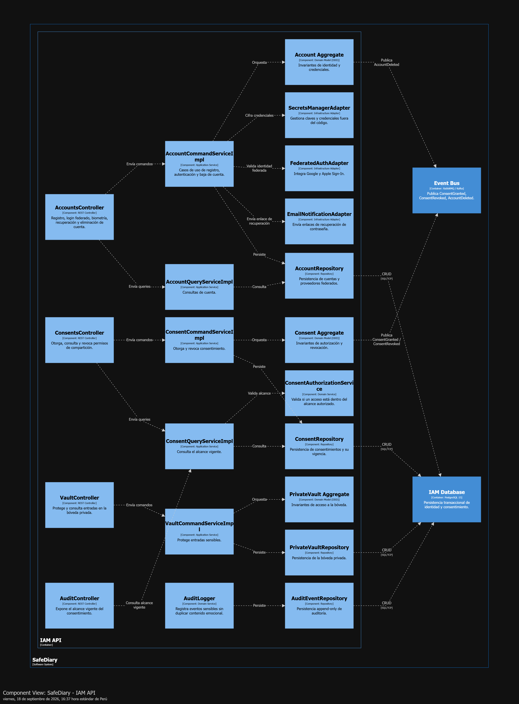

#### 2.6.1.6. Bounded Context Software Architecture Code Level Diagrams

##### 2.6.1.6.1. Bounded Context Domain Layer Class Diagrams

Código en **Mermaid** (puede pegarse en [mermaid.live](https://mermaid.live) para visualizarlo):

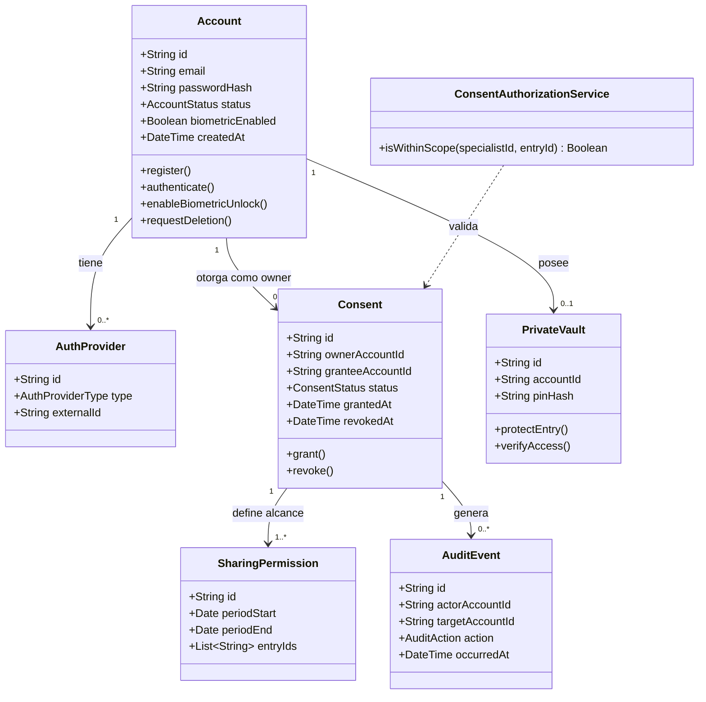
```mermaid
classDiagram
    class Account {
        +String id
        +String email
        +String passwordHash
        +AccountStatus status
        +Boolean biometricEnabled
        +DateTime createdAt
        +register()
        +authenticate()
        +enableBiometricUnlock()
        +requestDeletion()
    }
    class AuthProvider {
        +String id
        +AuthProviderType type
        +String externalId
    }
    class Consent {
        +String id
        +String ownerAccountId
        +String granteeAccountId
        +ConsentStatus status
        +DateTime grantedAt
        +DateTime revokedAt
        +grant()
        +revoke()
    }
    class SharingPermission {
        +String id
        +Date periodStart
        +Date periodEnd
        +List~String~ entryIds
    }
    class PrivateVault {
        +String id
        +String accountId
        +String pinHash
        +protectEntry()
        +verifyAccess()
    }
    class AuditEvent {
        +String id
        +String actorAccountId
        +String targetAccountId
        +AuditAction action
        +DateTime occurredAt
    }
    class ConsentAuthorizationService {
        +isWithinScope(specialistId, entryId) Boolean
    }

    Account "1" --> "0..*" AuthProvider : tiene
    Account "1" --> "0..*" Consent : otorga como owner
    Consent "1" --> "1..*" SharingPermission : define alcance
    Account "1" --> "0..1" PrivateVault : posee
    Consent "1" --> "0..*" AuditEvent : genera
    ConsentAuthorizationService ..> Consent : valida
```

##### 2.6.1.6.2. Bounded Context Database Design Diagram

Código en **Mermaid ER Diagram** (también puede importarse en [dbdiagram.io](https://dbdiagram.io) adaptando la sintaxis):

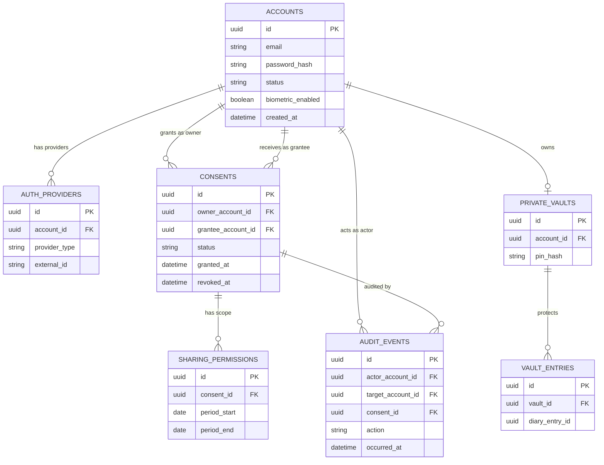
```mermaid
erDiagram
    ACCOUNTS {
        uuid id PK
        string email
        string password_hash
        string status
        boolean biometric_enabled
        datetime created_at
    }
    AUTH_PROVIDERS {
        uuid id PK
        uuid account_id FK
        string provider_type
        string external_id
    }
    CONSENTS {
        uuid id PK
        uuid owner_account_id FK
        uuid grantee_account_id FK
        string status
        datetime granted_at
        datetime revoked_at
    }
    SHARING_PERMISSIONS {
        uuid id PK
        uuid consent_id FK
        date period_start
        date period_end
    }
    PRIVATE_VAULTS {
        uuid id PK
        uuid account_id FK
        string pin_hash
    }
    VAULT_ENTRIES {
        uuid id PK
        uuid vault_id FK
        uuid diary_entry_id
    }
    AUDIT_EVENTS {
        uuid id PK
        uuid actor_account_id FK
        uuid target_account_id FK
        uuid consent_id FK
        string action
        datetime occurred_at
    }

    ACCOUNTS ||--o{ AUTH_PROVIDERS : "has providers"
    ACCOUNTS ||--o{ CONSENTS : "grants as owner"
    ACCOUNTS ||--o{ CONSENTS : "receives as grantee"
    CONSENTS ||--o{ SHARING_PERMISSIONS : "has scope"
    ACCOUNTS ||--o| PRIVATE_VAULTS : "owns"
    PRIVATE_VAULTS ||--o{ VAULT_ENTRIES : "protects"
    ACCOUNTS ||--o{ AUDIT_EVENTS : "acts as actor"
    CONSENTS ||--o{ AUDIT_EVENTS : "audited by"
```


### 2.6.2. Bounded Context: Profiles

**Profiles** administra los datos personales, la foto y las preferencias de la aplicación para Paciente y Psicólogo. Identifica a cada titular mediante el accountId de IAM y muestra el estado Básico/Premium recibido desde Payments & Payouts; no autentica, decide consentimientos, verifica credenciales profesionales ni publica fichas o tarifas. Estas últimas pertenecen a Clinician Directory.

#### 2.6.2.1. Domain Layer

**Entities y Aggregates**

* **PersonalProfile (Aggregate Root):** id, accountId, displayName, avatarRef, locale, timezone y preferencias de presentación. Mantiene referencias a psicólogos guardados, sin duplicar sus fichas.
* **AppPreferences (Value Object):** configuración de notificaciones, recordatorios y tono del asistente.
* **PlanStatusProjection (Read Model):** plan Básico/Premium y fecha de actualización recibidos por evento de Payments & Payouts; no constituye la fuente de verdad de la suscripción.

**Domain Events**

* PersonalProfileCreated, PersonalProfileUpdated, AppPreferencesUpdated, ClinicianBookmarked, ClinicianUnbookmarked.

**Commands y Queries**

* UpdatePersonalProfileCommand, UpdateAppPreferencesCommand, BookmarkClinicianCommand, RemoveClinicianBookmarkCommand.
* GetPersonalProfileQuery, GetAppPreferencesQuery, GetBookmarkedCliniciansQuery, GetPlanStatusQuery.

**Business Decisions**

* El accountId debe pertenecer al usuario autenticado en IAM.
* Una referencia a un psicólogo guardado no concede acceso a su agenda ni a datos clínicos.
* Profiles no activa Premium: solo actualiza su proyección tras SubscriptionActivated.

#### 2.6.2.2. Interface Layer

* **PersonalProfilesController:** consulta y modifica nombre, avatar y zona horaria.
* **AppPreferencesController:** modifica preferencias personales y de notificación.
* **ClinicianBookmarksController:** guarda o quita referencias a fichas del directorio.
* **PlanStatusController:** devuelve la proyección de plan para la aplicación móvil.
* **Resources:** PersonalProfileResource, UpdateProfileResource, AppPreferencesResource, BookmarkedClinicianResource, PlanStatusResource.

#### 2.6.2.3. Application Layer

* **UpdatePersonalProfileHandler:** valida titularidad, guarda cambios y emite PersonalProfileUpdated.
* **UpdatePreferencesHandler:** aplica las preferencias configuradas por el titular.
* **BookmarkClinicianHandler:** registra una referencia única al psicólogo; consulta su identificador público en Clinician Directory.
* **SubscriptionActivatedHandler:** actualiza idempotentemente PlanStatusProjection a partir del evento publicado por Payments & Payouts.
* **ProfileQueryService:** entrega perfil, preferencias, referencias guardadas y estado de plan.

#### 2.6.2.4. Infrastructure Layer

* **PersonalProfileRepository, PreferencesRepository y PlanProjectionRepository:** persistencia exclusiva de Profiles.
* **IamIdentityClient:** valida identidad y rol sin acceder a credenciales.
* **DirectoryReferenceClient:** comprueba que la ficha referenciada existe y está publicada.
* **SubscriptionEventConsumer:** consume el cambio de plan; evita aplicar dos veces el mismo evento.
* **AvatarStorageAdapter:** guarda la imagen del titular en almacenamiento privado.

#### 2.6.2.5. Bounded Context Software Architecture Component Level Diagrams

**Diagrama C4 de componentes en Structurizr DSL:**

```text
workspace "SafeDiary - Profiles" "C4 Component Diagram del bounded context Profiles" {
    model {
        patient = person "Paciente" "Actualiza sus datos personales, preferencias y psicólogos guardados."
        psychologist = person "Psicólogo" "Actualiza sus datos personales y preferencias de la aplicación."

        safeDiary = softwareSystem "SafeDiary" {
            profilesApi = container "Profiles Service" "Administra perfiles personales, preferencias, favoritos y la proyección del plan." "Servicio de API" {
                profilesController = component "PersonalProfilesController" "Consulta y actualiza los datos personales del titular." "Interface"
                preferencesController = component "AppPreferencesController" "Consulta y actualiza preferencias personales y de notificación." "Interface"
                bookmarksController = component "ClinicianBookmarksController" "Guarda o elimina referencias a psicólogos del directorio." "Interface"
                planController = component "PlanStatusController" "Expone el estado Básico o Premium recibido desde Payments & Payouts." "Interface"
                profileService = component "PersonalProfileApplicationService" "Orquesta consulta y actualización del perfil." "Application"
                preferencesService = component "PreferencesApplicationService" "Orquesta la actualización de preferencias." "Application"
                bookmarksService = component "ClinicianBookmarkApplicationService" "Orquesta el guardado de referencias a fichas publicadas." "Application"
                planProjectionHandler = component "SubscriptionEventHandler" "Actualiza la proyección al recibir SubscriptionActivated." "Application"
                identityClient = component "IamIdentityClient" "Valida identidad y rol sin gestionar credenciales." "ACL"
                directoryClient = component "DirectoryReferenceClient" "Comprueba que la ficha profesional existe y está publicada." "ACL"
                profileRepository = component "PersonalProfileRepository" "Persiste datos personales y referencias del titular." "Repository"
                preferencesRepository = component "PreferencesRepository" "Persiste preferencias de la aplicación." "Repository"
                planRepository = component "PlanProjectionRepository" "Persiste el estado de plan como modelo de lectura." "Repository"
                avatarAdapter = component "AvatarStorageAdapter" "Almacena la imagen de perfil en almacenamiento privado." "Infrastructure"
            }
            profilesDb = container "Profiles Database" "Perfiles personales, preferencias, favoritos y proyección del plan." "PostgreSQL" "Database"
            eventBus = container "Event Bus" "Eventos de integración entre bounded contexts." "RabbitMQ" "Queue"
        }
        iam = softwareSystem "IAM" "Provee identidad autenticada y rol del titular." "External System"
        directory = softwareSystem "Clinician Directory" "Provee referencias de fichas profesionales publicadas." "External System"
        payments = softwareSystem "Payments & Payouts" "Publica cambios confirmados de suscripción." "External System"
        objectStorage = softwareSystem "Object Storage" "Almacena imágenes de perfil de forma privada." "External System"

        patient -> profilesController "Consulta y actualiza su perfil" "HTTPS"
        patient -> preferencesController "Gestiona preferencias" "HTTPS"
        patient -> bookmarksController "Guarda o elimina psicólogos" "HTTPS"
        patient -> planController "Consulta su plan" "HTTPS"
        psychologist -> profilesController "Consulta y actualiza su perfil" "HTTPS"
        psychologist -> preferencesController "Gestiona preferencias" "HTTPS"

        profilesController -> profileService
        preferencesController -> preferencesService
        bookmarksController -> bookmarksService
        planController -> planRepository
        profileService -> identityClient
        preferencesService -> identityClient
        bookmarksService -> identityClient
        bookmarksService -> directoryClient
        profileService -> profileRepository
        preferencesService -> preferencesRepository
        bookmarksService -> profileRepository
        profileService -> avatarAdapter
        planProjectionHandler -> planRepository

        identityClient -> iam "Valida identidad y rol" "HTTPS"
        directoryClient -> directory "Valida ficha publicada" "HTTPS"
        payments -> eventBus "Publica SubscriptionActivated" "AMQP"
        eventBus -> planProjectionHandler "Entrega eventos de suscripción" "AMQP"
        avatarAdapter -> objectStorage "Guarda y recupera avatar privado" "HTTPS"
        profileRepository -> profilesDb "Lee y escribe" "SQL"
        preferencesRepository -> profilesDb "Lee y escribe" "SQL"
        planRepository -> profilesDb "Lee y escribe" "SQL"
    }
    views {
        component profilesApi "ProfilesComponents" {
            include *
            autoLayout
        }
        styles {
            element "Person" {
                shape Person
                background #08427b
                color #ffffff
            }
            element "Software System" {
                background #1168bd
                color #ffffff
            }
            element "Container" {
                background #438dd5
                color #ffffff
            }
            element "Component" {
                background #85bbf0
                color #000000
            }
            element "Database" {
                shape Cylinder
                background #2e7d32
                color #ffffff
            }
            element "Queue" {
                shape Pipe
                background #6a1b9a
                color #ffffff
            }
        }
    }
}
```

#### 2.6.2.6. Bounded Context Software Architecture Code Level Diagrams

##### 2.6.2.6.1. Bounded Context Domain Layer Class Diagrams

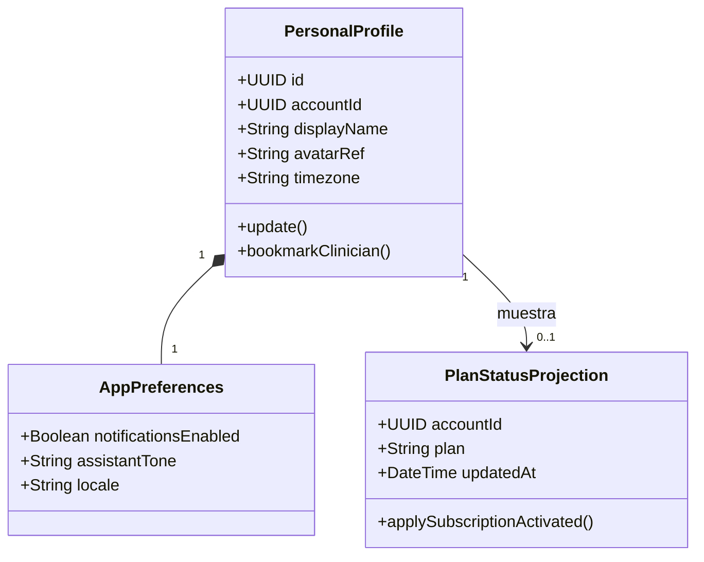
```mermaid
classDiagram
    class PersonalProfile {
        +UUID id
        +UUID accountId
        +String displayName
        +String avatarRef
        +String timezone
        +update()
        +bookmarkClinician()
    }
    class AppPreferences {
        +Boolean notificationsEnabled
        +String assistantTone
        +String locale
    }
    class PlanStatusProjection {
        +UUID accountId
        +String plan
        +DateTime updatedAt
        +applySubscriptionActivated()
    }
    PersonalProfile "1" *-- "1" AppPreferences
    PersonalProfile "1" --> "0..1" PlanStatusProjection : muestra
```

##### 2.6.2.6.2. Bounded Context Database Design Diagram

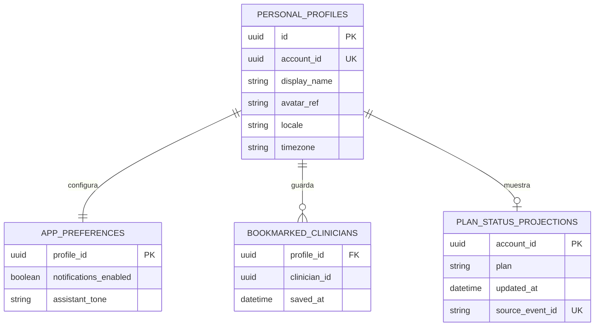
```mermaid
erDiagram
    PERSONAL_PROFILES {
        uuid id PK
        uuid account_id UK
        string display_name
        string avatar_ref
        string locale
        string timezone
    }
    APP_PREFERENCES {
        uuid profile_id PK
        boolean notifications_enabled
        string assistant_tone
    }
    BOOKMARKED_CLINICIANS {
        uuid profile_id FK
        uuid clinician_id
        datetime saved_at
    }
    PLAN_STATUS_PROJECTIONS {
        uuid account_id PK
        string plan
        datetime updated_at
        string source_event_id UK
    }
    PERSONAL_PROFILES ||--|| APP_PREFERENCES : configura
    PERSONAL_PROFILES ||--o{ BOOKMARKED_CLINICIANS : guarda
    PERSONAL_PROFILES ||--o| PLAN_STATUS_PROJECTIONS : muestra
```


### 2.6.3. Bounded Context: AssistantAI

**AssistantAI** es el contexto nuclear que provee las capacidades de inteligencia artificial emocional de SafeDiary: orquesta sesiones conversacionales reflexivas mediante mensajes de texto, clasifica emociones predominantes alineadas a la rueda de Plutchik, detecta patrones de distorsión cognitiva, evalúa de forma preventiva el riesgo autolesivo para activar protocolos de crisis e integra resúmenes estructurados para enriquecer la atención clínica de los psicólogos (US-011, US-026, US-027, US-040, TS-003).

La interacción con el asistente se realiza **exclusivamente por vía textual**, reconociendo que para personas con ansiedad, depresión o sobrecarga emocional, hablar en voz alta representa una barrera psicológica intimidante; la escritura ofrece un ritmo propio de introspección y desahogo sin presión inmediata. 

AssistantAI actúa estrictamente bajo un principio ético de **no intervención diagnóstica**: la IA no emite juicios patológicos ni formula planes terapéuticos, sino que ofrece una escucha activa estructurada, validación emocional y destilación contextual. Para evitar el acoplamiento directo con proveedores comerciales de LLM, el contexto implementa un **Anti-Corruption Layer (ACL)** que traduce los contratos de OpenAI/Gemini al modelo de dominio de SafeDiary.

#### 2.6.3.1. Domain Layer

**Entities y Aggregates**
- **ConversationSession (Aggregate Root):** id, accountId, startedAt, endedAt, status (ACTIVE, CLOSED, CRISIS_TRIGGERED), currentTone, messages[]. Representa una interacción continua de diálogo reflexivo entre el usuario y el asistente de IA.
- **ConversationMessage:** id, sessionId, sender (USER, AI), content (texto de la reflexión o respuesta), sentAt, emotionTag (etiqueta normalizada según la rueda de Plutchik).
- **CognitiveDistortion:** distorsión de pensamiento detectada en el mensaje del paciente (ej. catastrofismo, pensamiento todo-o-nada, sobregeneralización), con su nivel de certeza y fragmento de evidencia.
- **RiskAssessment (Aggregate Root / Entity de seguridad):** id, sessionId, assessedAt, riskScore, riskLevel (LOW, MODERATE, CRITICAL), triggerKeywords[], crisisProtocolActivated. Registro inmutable de la evaluación de riesgo de la sesión.
- **ClinicalSummary (Aggregate Root):** id, accountId, periodStart, periodEnd, dominantEmotions[], keyTriggers[], synthesisNarrative, highlights[], generatedAt. Síntesis periódica generada para que el psicólogo prepare la sesión sin sobrecarga de lectura.

**Value Objects**
- **SessionId, MessageId, AssessmentId, SummaryId:** identificadores fuertemente tipados.
- **PersonalityTone:** EMPATHIC, REFLECTIVE, ANALYTICAL, CALM (calibra el estilo lingüístico del LLM).
- **RiskLevel:** LOW, MODERATE, CRITICAL.
- **PlutchikEmotionTag:** APPREHENSION, ACCEPTANCE, ANNOYANCE, VIGILANCE, PENSIVENESS, SERENITY, JOY, SADNESS, FEAR.
- **DistortionType:** CATASTROPHIZING, OVERGENERALIZATION, ALL_OR_NOTHING, EMOTIONAL_REASONING, MENTAL_FILTER.
- **SessionStatus:** ACTIVE, CLOSED, CRISIS_TRIGGERED.

**Domain Events**
- ConversationSessionStarted, UserMessageReceived, EmotionClassified, CognitiveDistortionDetected, RiskEvaluated, CrisisProtocolActivated, ReflectionGenerated, ClinicalSummaryGenerated, PersonalityToneUpdated.

**Commands**
- StartConversationCommand, SendTextMessageCommand, EvaluateRiskCommand, ActivateCrisisProtocolCommand, GenerateReflectionCommand, GenerateWeeklyClinicalSummaryCommand, ChangePersonalityToneCommand.

**Queries**
- GetActiveConversationSessionQuery, GetSessionHistoryByAccountQuery, GetWeeklyClinicalSummaryQuery, GetCurrentRiskAssessmentQuery.

**Domain Services (Contratos)**
- **RiskPolicyService:** determina si los indicadores y puntajes de riesgo exigen interrumpir la conversación estándar y disparar la alerta de emergencia (línea 988).
- **EmotionClassifierService:** normaliza los resultados de inferencia afectiva hacia los vectores estandarizados de Plutchik.
- **ClinicalSummarySynthesizerService:** procesa el historial semanal de reflexiones para compilar detonantes y patrones clave sin exponer transcripciones literales no autorizadas.

#### 2.6.3.2. Interface Layer

**Controllers**
- **AiConversationsController:** inicia sesiones de diálogo, recibe mensajes de texto reflexivos, expone las respuestas generadas y el historial de interacción (US-011, US-027).
- **AiPreferencesController:** consulta y actualiza el tono de personalidad y las preferencias del asistente para la cuenta (US-026).
- **CrisisAlertController:** expone el estado de seguridad de la sesión, desencadenando recursos de emergencia y enlaces con líneas de ayuda locales (US-040).
- **ClinicalSummariesController:** expone al psicólogo el resumen emocional autorizado y permite la generación bajo demanda de reportes de periodo (US-045).

**Resources (Request/Response DTOs)**
- **Conversation:** StartSessionResource, SendTextMessageResource, ConversationSessionResource, MessageResource, ReflectionResponseResource.
- **Preferences:** PersonalityToneResource, UpdateAiToneResource.
- **Crisis:** CrisisEvaluationResource, EmergencyHotlineResource.
- **ClinicalSummary:** ClinicalSummaryResource, WeeklyEmotionalOverviewResource.

#### 2.6.3.3. Application Layer

**Command Handlers**
- **ConversationCommandServiceImpl:** StartConversationCommand, SendTextMessageCommand, GenerateReflectionCommand.
- **CrisisCommandServiceImpl:** EvaluateRiskCommand, ActivateCrisisProtocolCommand.
- **ClinicalSummaryCommandServiceImpl:** GenerateWeeklyClinicalSummaryCommand.
- **AiPreferencesCommandServiceImpl:** ChangePersonalityToneCommand.

**Query Handlers**
- **ConversationQueryServiceImpl:** GetActiveConversationSessionQuery, GetSessionHistoryByAccountQuery.
- **ClinicalSummaryQueryServiceImpl:** GetWeeklyClinicalSummaryQuery.
- **CrisisQueryServiceImpl:** GetCurrentRiskAssessmentQuery.

**Event Handlers**
- **CriticalRiskDetectedEventHandler:** reacciona al evento `RiskEvaluated` para activar la política de contención y notificar al bus de eventos.
- **WeeklySummaryTriggerEventHandler:** procesa la tarea programada de cierre semanal para sintetizar las reflexiones del paciente.

#### 2.6.3.4. Infrastructure Layer

**Repositories**
- **ConversationSessionRepository:** persistencia relacional de sesiones y mensajes cronológicos.
- **RiskAssessmentRepository:** persistencia append-only de evaluaciones de riesgo clínico.
- **ClinicalSummaryRepository:** persistencia y consulta indexada por cuenta y rango de fechas de resúmenes clínicos.

**Adaptadores externos**
- **GeminiLlmAdapter (ACL):** Anti-Corruption Layer que encapsula los llamados HTTP/gRPC a Google Gemini API para extracción de entidades, clasificación de emociones y síntesis textual empática.
- **CrisisHotlineAdapter:** directorio de integración con servicios y marcadores de líneas de emergencia (Línea 988 / 113 Minsa en Perú).

#### 2.6.3.5. Bounded Context Software Architecture Component Level Diagrams

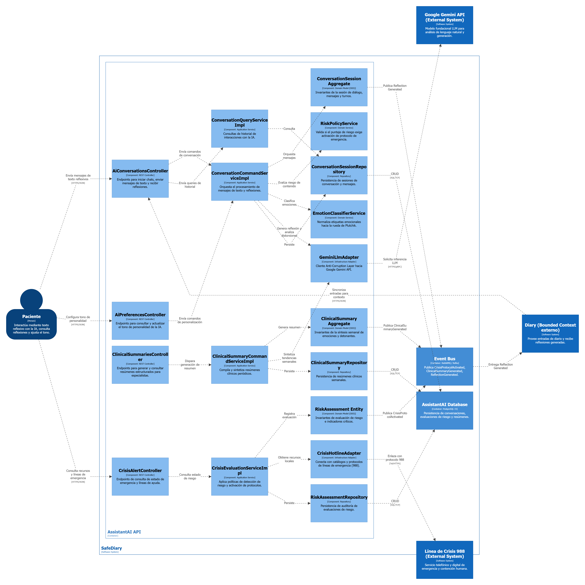

Código en **Structurizr DSL (C4 Model)** para el componente de AssistantAI:
```text
workspace "SafeDiary - AssistantAI (Component Diagram)" "C4 Component Diagram del bounded context AssistantAI" {
    model {
        patient = person "Paciente" "Interactúa mediante texto reflexivo con la IA, consulta reflexiones y ajusta el tono."

        safeDiary = softwareSystem "SafeDiary" {
            assistantAiApi = container "AssistantAI API" "Procesa conversaciones por texto, clasifica emociones, evalúa riesgos y genera resúmenes." "ASP.NET Core / Python FastAPI" {
                conversationsController     = component "AiConversationsController" "Endpoints para iniciar chats, enviar mensajes de texto y recibir reflexiones." "REST Controller"
                aiPreferencesController     = component "AiPreferencesController" "Endpoints para consultar y actualizar el tono de personalidad de la IA." "REST Controller"
                clinicalSummariesController = component "ClinicalSummariesController" "Endpoints para generar y consultar resúmenes estructurados para especialistas." "REST Controller"
                crisisAlertController       = component "CrisisAlertController" "Endpoints de consulta de estado de emergencia y líneas de ayuda." "REST Controller"

                conversationCmdService  = component "ConversationCommandServiceImpl" "Orquesta el procesamiento de mensajes de texto y reflexiones." "Application Service"
                conversationQryService  = component "ConversationQueryServiceImpl" "Consultas de historial de interacciones con la IA." "Application Service"
                summaryCmdService       = component "ClinicalSummaryCommandServiceImpl" "Compila y sintetiza resúmenes clínicos periódicos." "Application Service"
                crisisEvaluationService = component "CrisisEvaluationServiceImpl" "Aplica políticas de detección de riesgo y activación de protocolos." "Application Service"

                conversationAggregate    = component "ConversationSession Aggregate" "Invariantes de la sesión de diálogo, mensajes y turnos." "Domain Model (DDD)"
                riskAssessmentEntity     = component "RiskAssessment Entity" "Invariantes de evaluación de riesgo e indicadores críticos." "Domain Model (DDD)"
                clinicalSummaryAggregate = component "ClinicalSummary Aggregate" "Invariantes de la síntesis semanal de emociones y detonantes." "Domain Model (DDD)"
                riskPolicyService        = component "RiskPolicyService" "Valida si el puntaje de riesgo exige activación de protocolo de emergencia." "Domain Service"
                emotionClassifierService = component "EmotionClassifierService" "Normaliza etiquetas emocionales hacia la rueda de Plutchik." "Domain Service"

                conversationRepo    = component "ConversationSessionRepository" "Persistencia de sesiones de conversación y mensajes." "Repository"
                clinicalSummaryRepo = component "ClinicalSummaryRepository" "Persistencia de resúmenes clínicos semanales." "Repository"
                riskAssessmentRepo  = component "RiskAssessmentRepository" "Persistencia de auditoría de evaluaciones de riesgo." "Repository"

                geminiLlmAdapter     = component "GeminiLlmAdapter" "Cliente Anti-Corruption Layer hacia Google Gemini API." "Infrastructure Adapter"
                crisisHotlineAdapter = component "CrisisHotlineAdapter" "Conecta con catálogos y protocolos de líneas de emergencia (988)." "Infrastructure Adapter"
            }

            postgres = container "AssistantAI Database" "Persistencia de conversaciones, evaluaciones de riesgo y resúmenes." "PostgreSQL 15"
            eventBus = container "Event Bus" "Publica CrisisProtocolActivated, ClinicalSummaryGenerated, ReflectionGenerated." "RabbitMQ / Kafka"
        }

        diaryContext    = softwareSystem "Diary (Bounded Context externo)" "Provee entradas de diario y recibe reflexiones generadas."
        careContext     = softwareSystem "Care Scheduling (Bounded Context externo)" "Consulta resúmenes emocionales mínimos después de validar el consentimiento en IAM."
        geminiApi       = softwareSystem "Google Gemini API (External System)" "Modelo fundacional LLM para análisis de lenguaje natural y generación."
        crisisService   = softwareSystem "Línea de Crisis 988 (External System)" "Servicio telefónico y digital de emergencia y contención humana."

        # Interacciones del paciente con controladores
        patient -> conversationsController "Envía mensajes de texto reflexivos" "HTTPS/JSON"
        patient -> aiPreferencesController "Configura tono de personalidad" "HTTPS/JSON"
        patient -> crisisAlertController   "Consulta recursos y líneas de emergencia" "HTTPS/JSON"

        # Controladores a servicios de aplicación
        conversationsController     -> conversationCmdService  "Envía comandos de conversación"
        conversationsController     -> conversationQryService  "Envía queries de historial"
        aiPreferencesController     -> conversationCmdService  "Envía comandos de personalización"
        clinicalSummariesController -> summaryCmdService       "Dispara generación de resumen"
        crisisAlertController       -> crisisEvaluationService "Consulta estado de riesgo"

        # Servicios de aplicación a dominio
        conversationCmdService  -> conversationAggregate    "Orquesta mensajes"
        conversationCmdService  -> riskPolicyService        "Evalúa riesgo de contenido"
        conversationCmdService  -> emotionClassifierService "Clasifica emociones"
        crisisEvaluationService -> riskAssessmentEntity     "Registra evaluación"
        summaryCmdService       -> clinicalSummaryAggregate "Genera resumen"

        # Servicios de aplicación a adaptadores externos
        conversationCmdService  -> geminiLlmAdapter     "Genera reflexión y analiza distorsiones"
        crisisEvaluationService -> crisisHotlineAdapter "Obtiene recursos locales"
        summaryCmdService       -> geminiLlmAdapter     "Sintetiza tendencias semanales"

        # Adaptadores a sistemas externos
        geminiLlmAdapter     -> geminiApi       "Solicita inferencia LLM" "HTTPS/gRPC"
        crisisHotlineAdapter -> crisisService   "Enlaza con protocolo 988" "Tel/HTTPS"

        # Servicios de aplicación a repositorios
        conversationCmdService  -> conversationRepo    "Persiste"
        conversationQryService  -> conversationRepo    "Consulta"
        crisisEvaluationService -> riskAssessmentRepo  "Persiste"
        summaryCmdService       -> clinicalSummaryRepo "Persiste"

        # Repositorios a base de datos
        conversationRepo    -> postgres "CRUD" "SQL/TCP"
        clinicalSummaryRepo -> postgres "CRUD" "SQL/TCP"
        riskAssessmentRepo  -> postgres "CRUD" "SQL/TCP"

        # Eventos al Event Bus
        conversationAggregate    -> eventBus "Publica ReflectionGenerated"
        riskAssessmentEntity     -> eventBus "Publica CrisisProtocolActivated"
        clinicalSummaryAggregate -> eventBus "Publica ClinicalSummaryGenerated"

        # Integraciones entre bounded contexts
        eventBus     -> careContext             "Entrega ClinicalSummaryGenerated"
        eventBus     -> diaryContext            "Entrega ReflectionGenerated"
        diaryContext -> conversationsController "Sincroniza entradas para contexto" "HTTPS/JSON"
    }

    views {
        component assistantAiApi "AssistantAI_Components" {
            include *
            autoLayout
        }

        styles {
            element "Person" {
                shape Person
                background #08427b
                color #ffffff
            }
            element "Software System" {
                background #1168bd
                color #ffffff
            }
            element "Container" {
                background #438dd5
                color #ffffff
            }
            element "Component" {
                background #85bbf0
                color #000000
            }
        }
    }
}
```

#### 2.6.3.6. Bounded Context Software Architecture Code Level Diagrams

##### 2.6.3.6.1. Bounded Context Domain Layer Class Diagrams

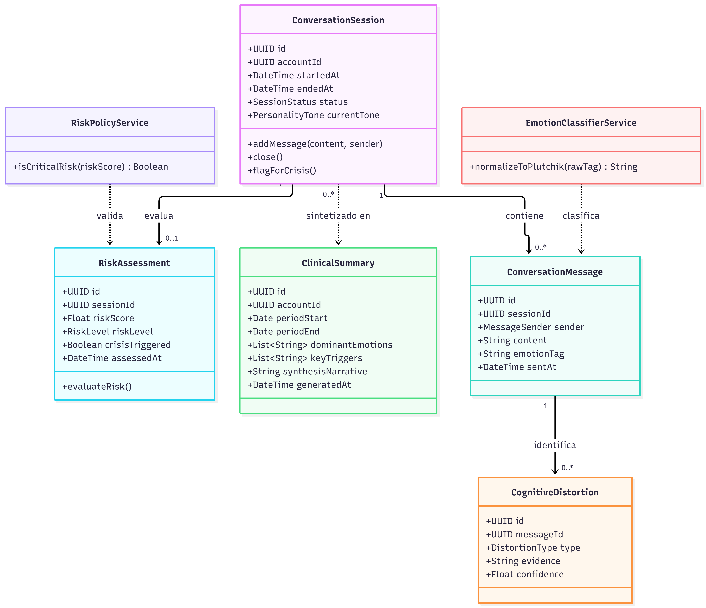

Código en **Mermaid Class Diagram**:

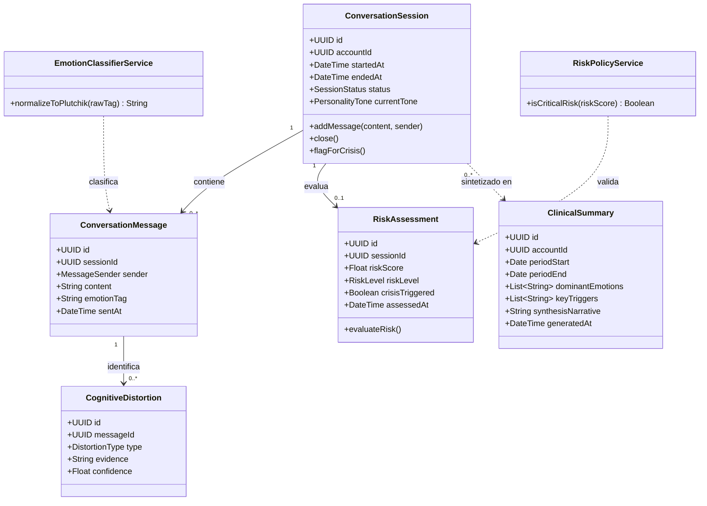
```mermaid
classDiagram
    class ConversationSession {
        +UUID id
        +UUID accountId
        +DateTime startedAt
        +DateTime endedAt
        +SessionStatus status
        +PersonalityTone currentTone
        +addMessage(content, sender)
        +close()
        +flagForCrisis()
    }
    class ConversationMessage {
        +UUID id
        +UUID sessionId
        +MessageSender sender
        +String content
        +String emotionTag
        +DateTime sentAt
    }
    class CognitiveDistortion {
        +UUID id
        +UUID messageId
        +DistortionType type
        +String evidence
        +Float confidence
    }
    class RiskAssessment {
        +UUID id
        +UUID sessionId
        +Float riskScore
        +RiskLevel riskLevel
        +Boolean crisisTriggered
        +DateTime assessedAt
        +evaluateRisk()
    }
    class ClinicalSummary {
        +UUID id
        +UUID accountId
        +Date periodStart
        +Date periodEnd
        +List~String~ dominantEmotions
        +List~String~ keyTriggers
        +String synthesisNarrative
        +DateTime generatedAt
    }
    class RiskPolicyService {
        +isCriticalRisk(riskScore) Boolean
    }
    class EmotionClassifierService {
        +normalizeToPlutchik(rawTag) String
    }

    ConversationSession "1" --> "0..*" ConversationMessage : contiene
    ConversationMessage "1" --> "0..*" CognitiveDistortion : identifica
    ConversationSession "1" --> "0..1" RiskAssessment : evalua
    ConversationSession "0..*" ..> ClinicalSummary : sintetizado en
    RiskPolicyService ..> RiskAssessment : valida
    EmotionClassifierService ..> ConversationMessage : clasifica
```

##### 2.6.3.6.2. Bounded Context Database Design Diagram

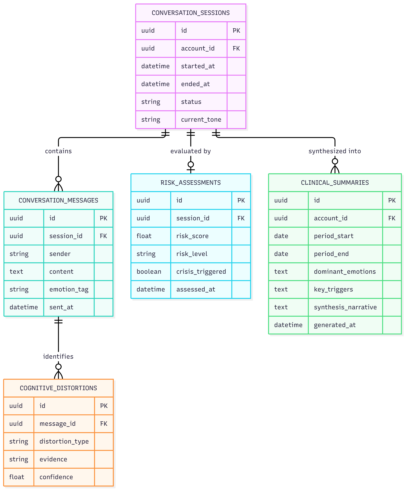

Código en **Mermaid ER Diagram** para la base de datos relacional de AssistantAI:

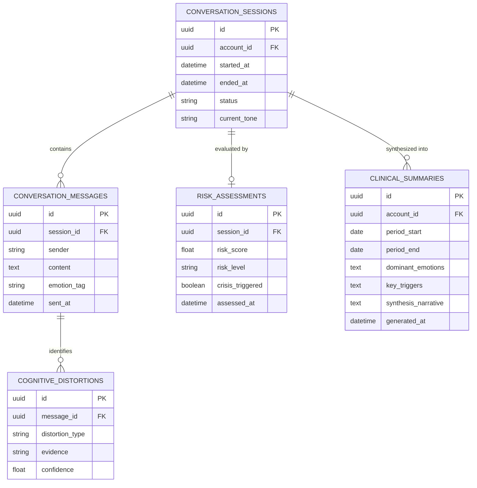
```mermaid
erDiagram
    CONVERSATION_SESSIONS {
        uuid id PK
        uuid account_id FK
        datetime started_at
        datetime ended_at
        string status
        string current_tone
    }
    CONVERSATION_MESSAGES {
        uuid id PK
        uuid session_id FK
        string sender
        text content
        string emotion_tag
        datetime sent_at
    }
    COGNITIVE_DISTORTIONS {
        uuid id PK
        uuid message_id FK
        string distortion_type
        string evidence
        float confidence
    }
    RISK_ASSESSMENTS {
        uuid id PK
        uuid session_id FK
        float risk_score
        string risk_level
        boolean crisis_triggered
        datetime assessed_at
    }
    CLINICAL_SUMMARIES {
        uuid id PK
        uuid account_id FK
        date period_start
        date period_end
        text dominant_emotions
        text key_triggers
        text synthesis_narrative
        datetime generated_at
    }

    CONVERSATION_SESSIONS ||--o{ CONVERSATION_MESSAGES : "contains"
    CONVERSATION_MESSAGES ||--o{ COGNITIVE_DISTORTIONS : "identifies"
    CONVERSATION_SESSIONS ||--o| RISK_ASSESSMENTS : "evaluated by"
    CONVERSATION_SESSIONS ||--o{ CLINICAL_SUMMARIES : "synthesized into"
```


### 2.6.4. Bounded Context: Diary

**Diary (Diario Emocional)** es el contexto nuclear (*core domain*) que administra el registro personal, confidencial y cronológico de los pacientes en SafeDiary. Modela la experiencia clásica de un diario íntimo enriquecida para el entorno móvil, permitiendo al usuario capturar sus vivencias cotidianas mediante **texto libre o notas de voz** grabadas directamente desde el frontend (US-008). Asimismo, gobierna el registro rápido del estado anímico (*Mood Check-In*, US-010), la asociación de factores contextuales externos como sueño, energía y estrés (US-031), la configuración de recordatorios de escritura (US-024), el cálculo de rachas e insignias por constancia emocional (US-029), la selección de recuerdos retrospectivos (US-032) y la exportación estructurada del historial a formato PDF (US-028).

Para salvaguardar la intimidad del paciente y mantener una separación de responsabilidades estricta, Diary opera bajo los siguientes límites arquitectónicos:
1. **Identidad y Bóveda Privada:** Diary no gestiona credenciales ni evalúa biometría; referencia el `accountId` provisto por IAM. Las entradas que el usuario traslada a su "Bóveda Privada" (US-025) son marcadas como protegidas (`isVaulted = true`), excluyéndose automáticamente de las consultas y vistas ordinarias del historial; la autorización de apertura y el PIN secundario residen exclusivamente en IAM.
2. **Consentimiento para Especialistas:** Cuando un psicólogo verificado consulta las entradas autorizadas de un paciente (US-045, US-046), Diary no evalúa reglas de acceso por sí mismo, sino que valida el alcance vigente a través del contrato `ConsentAuthorizationService` provisto por IAM.
3. **Audio e Inteligencia Artificial:** Diary recibe y almacena las referencias al archivo de audio crudo (`audioUrl`, duración, formato) generado desde el dispositivo móvil. Sin embargo, **no** realiza la transcripción fonética, ni el análisis de sentimientos, ni la generación de reflexiones terapéuticas asistidas; cuando una entrada de voz o texto se crea, Diary publica el evento `DiaryEntryCreated`, el cual es consumido de forma asíncrona por el contexto **AssistantAI** para procesar la transcripción y sugerir etiquetas emocionales sin bloquear la persistencia del diario clásico.
4. **Coherencia con los Mockups Móviles:** La interfaz de SafeDiary refleja este modelo en tres componentes clave: la pantalla *Home* (selector rápido de emociones de 1 toque con escala de valencia), la pantalla *Diary* (línea de tiempo cronológica, filtros por etiquetas, reproductor embebido de notas de voz y botón flotante de grabación), y la ventana modal de *Exportación* (que permite seleccionar rangos temporales y excluye por defecto entradas sensibles).

#### 2.6.4.1. Domain Layer

**Entities y Aggregates**
- **DiaryEntry (Aggregate Root):** id, accountId, title, content (cuerpo textual o transcripción final), entryType (TEXT, AUDIO, HYBRID), audioMetadata (referencia al archivo de voz grabado en el dispositivo), primaryEmotion, emotionalIntensity (escala 1-5), tags[], externalFactors, status (DRAFT, PUBLISHED, ARCHIVED), isSensitive, isVaulted, createdAt, updatedAt. Invariantes del agregado: una entrada debe contener obligatoriamente texto significativo o una referencia de audio válida (US-008); las entradas marcadas como `isVaulted = true` solo son legibles si la consulta incluye un token de autorización emitido por IAM.
- **MoodCheckIn (Aggregate Root):** id, accountId, emotion, valenceScore (-2 a +2), energyScore (1 a 5), loggedAt. Permite el registro rápido de un toque desde el *Home* sin exigir la redacción de una entrada completa (US-010).
- **DiaryReminder (Aggregate Root):** id, accountId, reminderTime (Time), daysOfWeek (arreglo de días activos), isEnabled, lastTriggeredAt. Modela las alarmas programadas para cultivar el hábito de registro diario (US-024).
- **DiaryStreak (Aggregate Root):** id, accountId, currentStreakDays, longestStreakDays, lastLogDate, freezeTokensAvailable. Mantiene la trazabilidad de la constancia del usuario; se actualiza de forma idempotente con cada entrada o check-in realizado en el día (US-029).

**Value Objects**
- **EntryId, MoodCheckInId, ReminderId, StreakId:** identificadores únicos fuertemente tipados.
- **EntryType:** TEXT, AUDIO, HYBRID.
- **EmotionType:** JOY, SADNESS, ANXIETY, ANGER, CALM, FEAR, SURPRISE, DISGUST (alineado con la rueda de Plutchik).
- **AudioMetadata:** audioUrl, durationSeconds, format (m4a/aac/wav), fileSizeBytes.
- **ExternalFactors:** sleepHours, energyLevel (LOW, MEDIUM, HIGH), stressLevel (LOW, MEDIUM, HIGH), caffeineIntake (NONE, MODERATE, HIGH) (US-031).
- **DateRange:** startDate, endDate.
- **EntryStatus:** DRAFT, PUBLISHED, ARCHIVED.

**Domain Events**
- **DiaryEntryCreated:** publicado cuando el usuario guarda una entrada (notifica a AssistantAI para transcripción/análisis y a Rutines/Streaks para registrar avance).
- **DiaryEntryUpdated:** publicado tras editar título, cuerpo o etiquetas de una entrada.
- **DiaryEntryDeleted:** publicado al descartar un registro.
- **DiaryEntryVaulted / DiaryEntryUnvaulted:** publicado cuando una entrada se traslada hacia o desde la bóveda privada.
- **MoodCheckInLogged:** emitido al marcar el estado anímico rápido en la pantalla principal.
- **DiaryStreakIncremented:** emitido cuando la racha de días consecutivos de registro aumenta.
- **DiaryStreakReset:** emitido cuando transcurre más de un día calendario sin actividad.

**Commands**
- CreateTextDiaryEntryCommand, CreateVoiceDiaryEntryCommand, UpdateDiaryEntryCommand, DeleteDiaryEntryCommand, ToggleEntryVaultStatusCommand, LogMoodCheckInCommand, ConfigureDiaryReminderCommand, ExportDiaryToPdfCommand.

**Queries**
- GetDiaryEntryByIdQuery, GetDiaryEntriesByAccountQuery (soporta filtros por rango de fechas, emoción predominante y etiquetas), GetMoodCheckInsByRangeQuery, GetDiaryStreakByAccountQuery, GetDiaryRemindersByAccountQuery, GetAuthorizedDiaryEntriesForSpecialistQuery (valida permisos de IAM), GetRetrospectiveMemoryQuery (US-032).

**Domain Services (Contratos)**
- **StreakCalculationService:** evalúa las fechas de los registros diarios del usuario; si la fecha corresponde al día siguiente de `lastLogDate`, incrementa `currentStreakDays`; si corresponde al mismo día, no altera la racha; si hay una brecha mayor a 24 horas y no hay fichas de congelamiento, reinicia el contador.
- **RetrospectiveMemoryService:** recupera entradas pasadas significativas (p. ej. de hace 30, 90 o 365 días) garantizando que ninguna entrada marcada como `isSensitive` o `isVaulted` sea expuesta en recordatorios automáticos (US-032).
- **DiaryExportPreparationService:** filtra, sanitiza y compila las entradas seleccionadas por el paciente para generar el informe PDF, excluyendo rigurosamente el material protegido en bóveda (US-028).

#### 2.6.4.2. Interface Layer

**Controllers**
- **DiaryEntriesController:** expone los endpoints REST para registrar entradas de texto y notas de voz (`multipart/form-data` o URL de blob pre-cargado), listar el historial cronológico con filtros paginados, actualizar y eliminar entradas (US-008, US-025).
- **MoodCheckInsController:** endpoint optimizado y de baja latencia para capturar el estado emocional rápido desde la pantalla de inicio (US-010).
- **DiaryRemindersController:** administración de horarios y días de recordatorios locales/push (US-024).
- **DiaryStreaksController:** consulta de la racha actual, récord histórico e insignias obtenidas (US-029).
- **DiaryExportsController:** solicita la generación y descarga segura del reporte en PDF con el resumen gráfico y cronológico (US-028).
- **SpecialistSharedDiaryController:** endpoint especializado que permite a un terapeuta con sesión activa consultar las entradas que el paciente le autorizó explícitamente compartir (US-045, US-046).

**Resources (Request/Response DTOs)**
- **DiaryEntry:** CreateTextDiaryEntryResource, CreateVoiceDiaryEntryResource, UpdateDiaryEntryResource, DiaryEntryResource, DiaryEntrySummaryResource (optimizado para feeds móviles).
- **MoodCheckIn:** LogMoodCheckInResource, MoodCheckInResource, MoodTimelineResource.
- **DiaryReminder:** ConfigureReminderResource, DiaryReminderResource.
- **DiaryStreak:** DiaryStreakResource.
- **DiaryExport:** RequestPdfExportResource, ExportStatusResource, ExportDownloadResource.
- **SpecialistShared:** SharedEntryResource, SharedHistoryScopeResource.

#### 2.6.4.3. Application Layer

**Command Handlers**
- **DiaryEntryCommandServiceImpl:** orquesta `CreateTextDiaryEntryCommand`, `CreateVoiceDiaryEntryCommand`, `UpdateDiaryEntryCommand`, `DeleteDiaryEntryCommand` y `ToggleEntryVaultStatusCommand`. Valida la no vacuidad del contenido, gestiona la subida de audio al repositorio de infraestructura y despacha `DiaryEntryCreated`.
- **MoodCheckInCommandServiceImpl:** maneja `LogMoodCheckInCommand`, persiste el check-in e invoca la actualización de racha.
- **DiaryReminderCommandServiceImpl:** gestiona `ConfigureDiaryReminderCommand` y sincroniza las reglas con el planificador de notificaciones.
- **DiaryExportCommandServiceImpl:** orquesta `ExportDiaryToPdfCommand`, consume `DiaryExportPreparationService` y delega la renderización visual al adaptador de PDF.
- **DiaryStreakCommandServiceImpl:** procesa la actualización de rachas en base al consumo de eventos internos.

**Query Handlers**
- **DiaryEntryQueryServiceImpl:** resuelve `GetDiaryEntryByIdQuery`, `GetDiaryEntriesByAccountQuery` y `GetRetrospectiveMemoryQuery`.
- **MoodCheckInQueryServiceImpl:** resuelve `GetMoodCheckInsByRangeQuery`.
- **DiaryStreakQueryServiceImpl:** resuelve `GetDiaryStreakByAccountQuery`.
- **SpecialistSharedDiaryQueryServiceImpl:** resuelve `GetAuthorizedDiaryEntriesForSpecialistQuery`, invocando previamente al adaptador de IAM para corroborar que el especialista solicitante cuenta con un `Consent` vigente.

#### 2.6.4.4. Infrastructure Layer

**Repositories**
- **DiaryEntryRepository:** implementación en PostgreSQL / EF Core o TypeORM. Indexado por `account_id` y `created_at` descendente; soporte de búsquedas por texto completo y etiquetas (`JSONB` o tabla relacional indexada).
- **MoodCheckInRepository:** persistencia optimizada para series temporales de estados de ánimo y agregaciones por semana/mes.
- **DiaryReminderRepository:** persistencia relacional de horarios y banderas de activación.
- **DiaryStreakRepository:** persistencia del estado de rachas e historial de días completados.

**Adaptadores externos**
- **AudioStorageAdapter:** almacena los audios crudos en un bucket privado de objetos (AWS S3 o Google Cloud Storage) mediante URLs presignadas y cifrado en reposo AES-256 (TS-002).
- **PdfGeneratorAdapter:** compila las entradas seleccionadas, gráficos de evolución y factores externos en un documento PDF protegido y visualmente profesional (US-028).
- **NotificationSchedulingAdapter:** se comunica con el servicio de mensajería push móvil (Firebase Cloud Messaging / Apple APNs) para despachar recordatorios configurados (US-024).
- **IamConsentClientAdapter:** cliente HTTP/gRPC que consulta la API de IAM para validar si una solicitud de especialista cumple las condiciones de `SharingPermission` (US-045, US-046).

#### 2.6.4.5. Bounded Context Software Architecture Component Level Diagrams

El siguiente código en **Structurizr DSL (C4 Model)** puede pegarse en [structurizr.com/dsl](https://structurizr.com/dsl) o en el [Structurizr Lite](https://docs.structurizr.com/lite) para generar el diagrama de componentes de Diary:

```text
workspace "SafeDiary - Diary (Component Diagram)" "C4 Component Diagram del bounded context Diary" {
    model {
        patient    = person "Paciente" "Registra vivencias por texto/voz, mood check-in y consulta su diario."
        specialist = person "Especialista Verificado" "Consulta las entradas autorizadas del diario de su consultante."

        safeDiary = softwareSystem "SafeDiary" {

            diaryApi = container "Diary API" "Gestiona entradas de texto/voz, check-in emocional, rachas y exportación." "ASP.NET Core / Node.js Web API" {
                entriesController     = component "DiaryEntriesController"          "Registro y gestión de entradas de texto y voz."       "REST Controller"
                moodController        = component "MoodCheckInsController"          "Captura rápida de estado de ánimo en 1 toque."       "REST Controller"
                remindersController   = component "DiaryRemindersController"        "Configura recordatorios de escritura."                "REST Controller"
                streaksController     = component "DiaryStreaksController"          "Consulta racha y constancia de registro."             "REST Controller"
                exportsController     = component "DiaryExportsController"          "Genera reportes descargables en PDF."                 "REST Controller"
                sharedController      = component "SpecialistSharedDiaryController" "Expone entradas autorizadas a especialistas."         "REST Controller"

                entryCmdService       = component "DiaryEntryCommandServiceImpl"     "Casos de uso de creación y edición de entradas."     "Application Service"
                entryQryService       = component "DiaryEntryQueryServiceImpl"       "Consultas del historial y recuerdos retrospectivos."  "Application Service"
                moodCmdService        = component "MoodCheckInCommandServiceImpl"    "Casos de uso de registro de humor."                   "Application Service"
                moodQryService        = component "MoodCheckInQueryServiceImpl"      "Consultas de serie temporal de humor."                "Application Service"
                reminderCmdService    = component "DiaryReminderCommandServiceImpl"  "Casos de uso de recordatorios."                       "Application Service"
                streakCmdService      = component "DiaryStreakCommandServiceImpl"    "Orquestación y actualización de rachas."              "Application Service"
                streakQryService      = component "DiaryStreakQueryServiceImpl"      "Consulta de días consecutivos de actividad."          "Application Service"
                exportCmdService      = component "DiaryExportCommandServiceImpl"    "Orquesta la compilación y renderizado de PDF."        "Application Service"
                sharedQryService      = component "SpecialistSharedDiaryQueryService" "Consulta entradas autorizadas validando consentimiento." "Application Service"

                entryAggregate        = component "DiaryEntry Aggregate"            "Invariantes de contenido, audio, emoción y bóveda."   "Domain Model (DDD)"
                moodAggregate         = component "MoodCheckIn Aggregate"           "Invariantes del check-in rápido."                     "Domain Model (DDD)"
                streakAggregate       = component "DiaryStreak Aggregate"           "Invariantes de racha y constancia."                   "Domain Model (DDD)"
                reminderAggregate     = component "DiaryReminder Aggregate"         "Invariantes de alarmas y frecuencias."                "Domain Model (DDD)"
                streakDomainService   = component "StreakCalculationService"        "Calcula avance o reseteo de rachas diarias."          "Domain Service"
                memoryDomainService   = component "RetrospectiveMemoryService"      "Selecciona vivencias pasadas no sensibles."           "Domain Service"
                exportDomainService   = component "DiaryExportPreparationService"   "Filtra y sanea datos para exportación."               "Domain Service"

                entryRepo             = component "DiaryEntryRepository"            "Persistencia y filtrado de entradas del diario."      "Repository"
                moodRepo              = component "MoodCheckInRepository"           "Persistencia de check-ins anímicos."                  "Repository"
                streakRepo            = component "DiaryStreakRepository"           "Persistencia de rachas de constancia."                "Repository"
                reminderRepo          = component "DiaryReminderRepository"         "Persistencia de recordatorios."                       "Repository"

                audioAdapter          = component "AudioStorageAdapter"             "Sube notas de voz con URLs presignadas (S3/GCS)."     "Infrastructure Adapter"
                pdfAdapter            = component "PdfGeneratorAdapter"             "Renderiza el historial seleccionado en PDF."          "Infrastructure Adapter"
                pushAdapter           = component "NotificationSchedulingAdapter"   "Programa avisos locales y notificaciones push."       "Infrastructure Adapter"
                iamClientAdapter      = component "IamConsentClientAdapter"         "Consulta contratos de consentimiento a IAM."          "Infrastructure Adapter"
            }

            postgres = container "Diary Database" "Persistencia relacional de entradas, estados y rachas." "PostgreSQL 15"
            eventBus = container "Event Bus"      "Publica DiaryEntryCreated, MoodCheckInLogged, DiaryStreakUpdated." "RabbitMQ / Kafka"
            storage  = container "Object Storage" "Almacenamiento cifrado de notas de voz en audio." "AWS S3 / GCS"
        }

        iamContext         = softwareSystem "IAM (Bounded Context externo)"         "Valida AccountId y autorizaciones de consentimiento de especialistas."
        assistantAiContext = softwareSystem "AssistantAI (Bounded Context externo)" "Consume DiaryEntryCreated para transcribir y generar reflexiones terapéuticas."

        patient    -> diaryApi "Registra pensamientos, notas de voz y estado de ánimo" "HTTPS/JSON & Audio Stream"
        specialist -> diaryApi "Consulta entradas autorizadas de sus consultantes"      "HTTPS/JSON"

        entriesController   -> entryCmdService     "Envía comandos"
        entriesController   -> entryQryService     "Envía queries"
        moodController      -> moodCmdService      "Envía comandos"
        moodController      -> moodQryService      "Envía queries"
        remindersController -> reminderCmdService  "Envía comandos"
        streaksController   -> streakQryService    "Envía queries"
        exportsController   -> exportCmdService    "Envía comandos"
        sharedController    -> sharedQryService    "Envía queries"

        entryCmdService   -> entryAggregate       "Orquesta"
        entryCmdService   -> audioAdapter         "Almacena nota de voz"
        entryCmdService   -> streakCmdService     "Notifica actividad de registro"
        entryQryService   -> memoryDomainService  "Aplica filtros retrospectivos"
        moodCmdService    -> moodAggregate        "Orquesta"
        moodCmdService    -> streakCmdService     "Notifica actividad de registro"
        streakCmdService  -> streakDomainService  "Calcula racha"
        streakCmdService  -> streakAggregate      "Actualiza racha"
        exportCmdService  -> exportDomainService  "Prepara datos"
        exportCmdService  -> pdfAdapter           "Genera documento"
        reminderCmdService-> pushAdapter          "Programa notificación"
        sharedQryService  -> iamClientAdapter     "Verifica alcance de Consent"

        entryCmdService   -> entryRepo            "Persiste"
        entryQryService   -> entryRepo            "Consulta"
        moodCmdService    -> moodRepo             "Persiste"
        moodQryService    -> moodRepo             "Consulta"
        streakCmdService  -> streakRepo           "Persiste"
        streakQryService  -> streakRepo           "Consulta"
        reminderCmdService-> reminderRepo         "Persiste"

        entryRepo    -> postgres "CRUD" "SQL/TCP"
        moodRepo     -> postgres "CRUD" "SQL/TCP"
        streakRepo   -> postgres "CRUD" "SQL/TCP"
        reminderRepo -> postgres "CRUD" "SQL/TCP"
        audioAdapter -> storage  "Guarda audio cifrado" "HTTPS/S3 API"

        entryAggregate  -> eventBus "Publica DiaryEntryCreated"
        moodAggregate   -> eventBus "Publica MoodCheckInLogged"
        streakAggregate -> eventBus "Publica DiaryStreakIncremented"

        eventBus         -> assistantAiContext "Entrega DiaryEntryCreated para transcripción e inferencia"
        iamClientAdapter -> iamContext         "Consulta ConsentScope" "HTTPS/JSON"
    }

    views {
        component diaryApi "Diary_Components" {
            include *
            autoLayout
        }
        styles {
            element "Person"          { shape Person background #08427b color #ffffff }
            element "Software System" { background #1168bd color #ffffff }
            element "Container"       { background #438dd5 color #ffffff }
            element "Component"       { background #85bbf0 color #000000 }
        }
    }
}
```

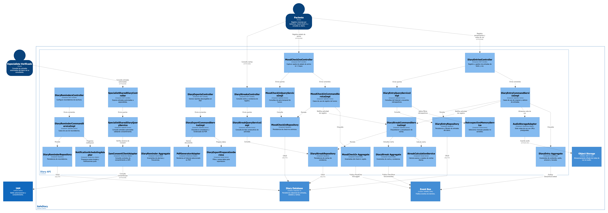

#### 2.6.4.6. Bounded Context Software Architecture Code Level Diagrams

##### 2.6.4.6.1. Bounded Context Domain Layer Class Diagrams

Código en **Mermaid** (puede pegarse en [mermaid.live](https://mermaid.live) para visualizarlo):

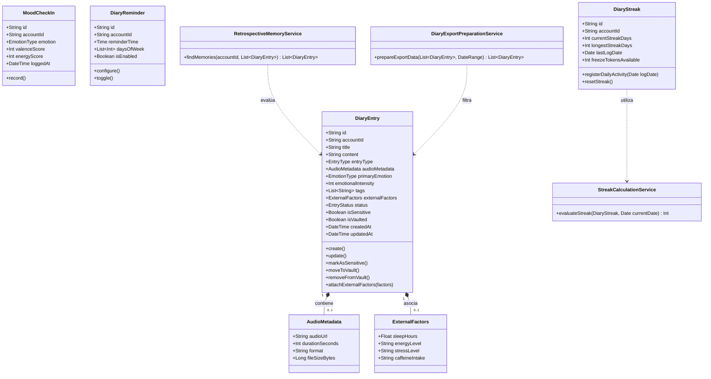
```mermaid
classDiagram
    class DiaryEntry {
        +String id
        +String accountId
        +String title
        +String content
        +EntryType entryType
        +AudioMetadata audioMetadata
        +EmotionType primaryEmotion
        +Int emotionalIntensity
        +List~String~ tags
        +ExternalFactors externalFactors
        +EntryStatus status
        +Boolean isSensitive
        +Boolean isVaulted
        +DateTime createdAt
        +DateTime updatedAt
        +create()
        +update()
        +markAsSensitive()
        +moveToVault()
        +removeFromVault()
        +attachExternalFactors(factors)
    }
    class AudioMetadata {
        +String audioUrl
        +Int durationSeconds
        +String format
        +Long fileSizeBytes
    }
    class ExternalFactors {
        +Float sleepHours
        +String energyLevel
        +String stressLevel
        +String caffeineIntake
    }
    class MoodCheckIn {
        +String id
        +String accountId
        +EmotionType emotion
        +Int valenceScore
        +Int energyScore
        +DateTime loggedAt
        +record()
    }
    class DiaryReminder {
        +String id
        +String accountId
        +Time reminderTime
        +List~Int~ daysOfWeek
        +Boolean isEnabled
        +configure()
        +toggle()
    }
    class DiaryStreak {
        +String id
        +String accountId
        +Int currentStreakDays
        +Int longestStreakDays
        +Date lastLogDate
        +Int freezeTokensAvailable
        +registerDailyActivity(Date logDate)
        +resetStreak()
    }
    class StreakCalculationService {
        +evaluateStreak(DiaryStreak, Date currentDate) Int
    }
    class RetrospectiveMemoryService {
        +findMemories(accountId, List~DiaryEntry~) List~DiaryEntry~
    }
    class DiaryExportPreparationService {
        +prepareExportData(List~DiaryEntry~, DateRange) List~DiaryEntry~
    }

    DiaryEntry "1" *-- "0..1" AudioMetadata : contiene
    DiaryEntry "1" *-- "0..1" ExternalFactors : asocia
    DiaryStreak ..> StreakCalculationService : utiliza
    RetrospectiveMemoryService ..> DiaryEntry : evalúa
    DiaryExportPreparationService ..> DiaryEntry : filtra
```

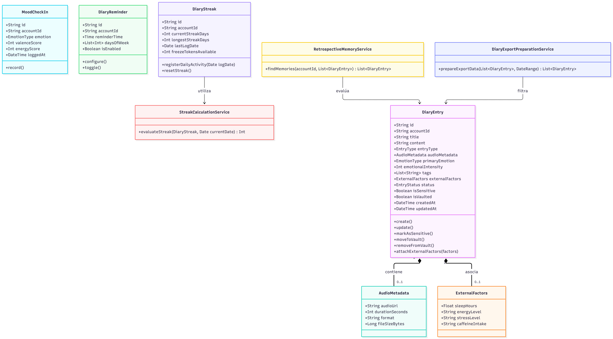

##### 2.6.4.6.2. Bounded Context Database Design Diagram

Código en **Mermaid ER Diagram** (también puede importarse en [dbdiagram.io](https://dbdiagram.io) adaptando la sintaxis):

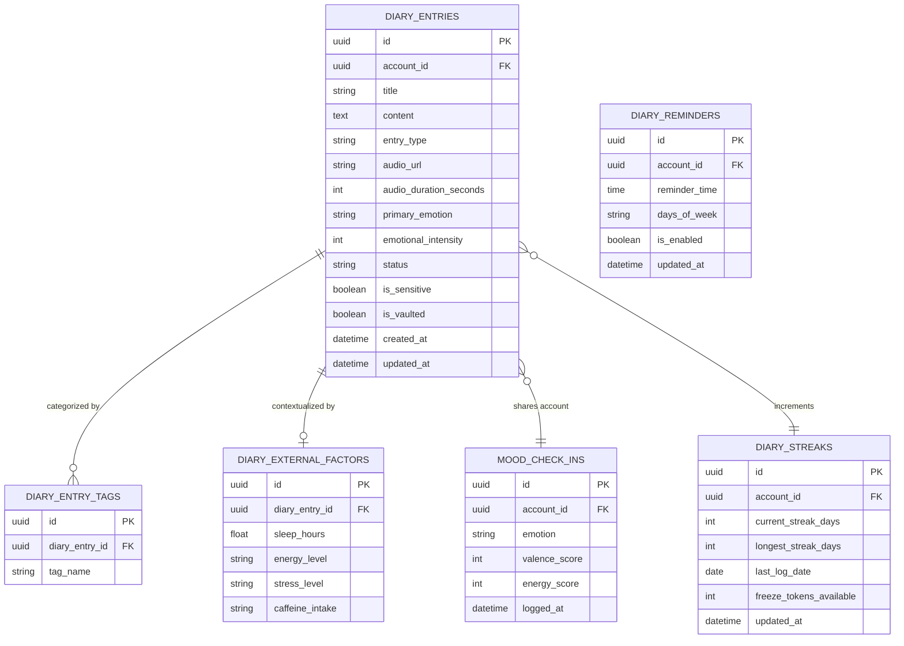
```mermaid
erDiagram
    DIARY_ENTRIES {
        uuid id PK
        uuid account_id FK
        string title
        text content
        string entry_type
        string audio_url
        int audio_duration_seconds
        string primary_emotion
        int emotional_intensity
        string status
        boolean is_sensitive
        boolean is_vaulted
        datetime created_at
        datetime updated_at
    }
    DIARY_ENTRY_TAGS {
        uuid id PK
        uuid diary_entry_id FK
        string tag_name
    }
    DIARY_EXTERNAL_FACTORS {
        uuid id PK
        uuid diary_entry_id FK
        float sleep_hours
        string energy_level
        string stress_level
        string caffeine_intake
    }
    MOOD_CHECK_INS {
        uuid id PK
        uuid account_id FK
        string emotion
        int valence_score
        int energy_score
        datetime logged_at
    }
    DIARY_REMINDERS {
        uuid id PK
        uuid account_id FK
        time reminder_time
        string days_of_week
        boolean is_enabled
        datetime updated_at
    }
    DIARY_STREAKS {
        uuid id PK
        uuid account_id FK
        int current_streak_days
        int longest_streak_days
        date last_log_date
        int freeze_tokens_available
        datetime updated_at
    }

    DIARY_ENTRIES ||--o{ DIARY_ENTRY_TAGS : "categorized by"
    DIARY_ENTRIES ||--o| DIARY_EXTERNAL_FACTORS : "contextualized by"
    DIARY_ENTRIES }o--|| MOOD_CHECK_INS : "shares account"
    DIARY_ENTRIES }o--|| DIARY_STREAKS : "increments"
```

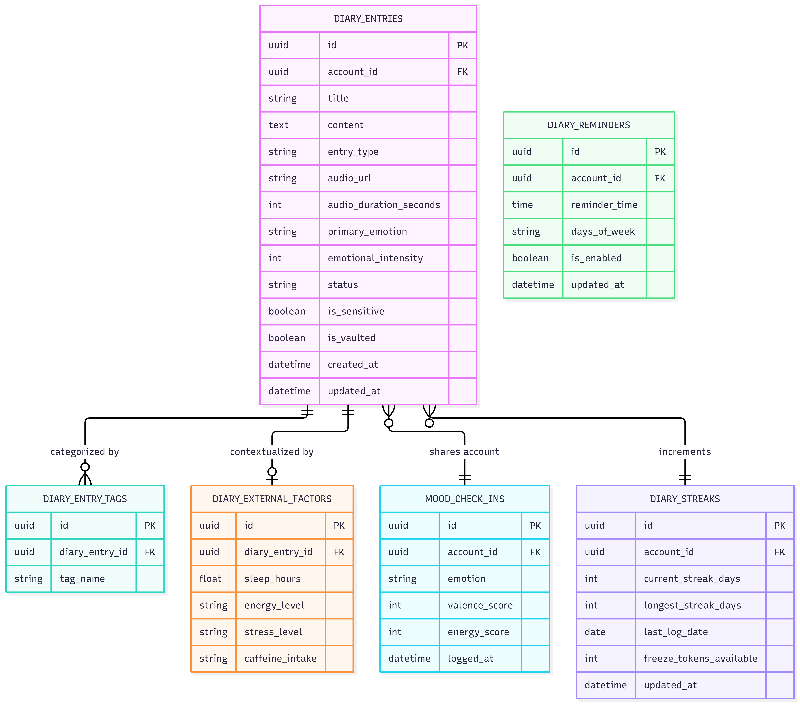


### 2.6.5. Bounded Context: Rutines

**Rutines** es el contexto que apoya el bienestar constante del paciente: administra rutinas diarias personalizadas, prompts de escritura reflexiva, ejercicios de regulación rápida (SOS / respiración) y recordatorios. Gestiona hábitos de autocuidado sin almacenar el contenido privado del diario.

La frontera del contexto separa la gestión de hábitos diarios del historial clínico estructurado o del diario emocional principal. Un ejercicio SOS o un prompt completado pertenecen al ámbito del cuidado diario, y su orquestación es en gran medida autónoma a través de un *Scheduler* interno.

La máquina de estados de una notificación programada es `PENDING` -> `SENT` o `FAILED`. La máquina de estados de un prompt de escritura es `ASSIGNED` -> `COMPLETED`. Si una notificación falla por problemas de red externos, el sistema registra el fallo sin corromper la rutina base, la cual sigue activa para el día siguiente.

#### 2.6.5.1. Domain Layer

**Entities y Aggregates**

* **RoutineSettings (Aggregate Root):** accountId, devicePushTokenRef, preferredTimezone. Conserva únicamente la configuración necesaria para programar hábitos; IAM sigue siendo dueño de la cuenta.
* **DailyRoutine (Aggregate Root):** id, userId, title, targetTime, isActive, createdAt. Representa el hábito o actividad programada. Protege las invariantes de creación y expone los comportamientos `updateTargetTime()`, `deactivate()` y `generateNextNotification()`.
* **ScheduledNotification (Entity):** id, routineId, scheduledFor, status (PENDING, SENT, FAILED), sentAt. Es la instancia transaccional individual del recordatorio que se disparará.
* **WritingPrompt (Aggregate Root):** id, userId, question, answerText, status (ASSIGNED, COMPLETED), assignedAt, answeredAt. Ejercicio guiado asignado al usuario que este debe responder y guardar en el sistema.
* **SosExercise (Aggregate Root):** id, userId, exerciseType (BREATHING, GROUNDING), durationSeconds, initiatedAt. Registro inmutable (log) de la herramienta de contención inmediata seleccionada y ejecutada de forma voluntaria.

**Value Objects**

* **RoutineId, NotificationId, PromptId, ExerciseId:** identificadores únicos del dominio.
* **TargetTime:** hora local sin fecha estricta (LocalTime) configurada para la rutina.
* **NotificationStatus:** PENDING, SENT, FAILED.
* **PromptStatus:** ASSIGNED, COMPLETED.
* **ExerciseType:** BREATHING, GROUNDING.

**Domain Events**

* DailyRoutineCreated, RoutineReminderSent, WritingPromptCompleted, SosExerciseInitiated.

**Commands**

* ConfigureDailyRoutineCommand, TriggerScheduledNotificationCommand, AnswerWritingPromptCommand, InitiateSosExerciseCommand.

**Queries**

* GetActiveRoutinesByUserQuery, GetPendingPromptsQuery, GetUserExerciseHistoryQuery.

**Domain Services (Contratos)**

* **UserConvenienceSchedulePolicy:** valida y determina el momento exacto (`DateTime`) del envío de notificaciones evaluando la hora objetivo (`targetTime`) contra la zona horaria del usuario (`preferredTimezone`), garantizando que los recordatorios se programen a conveniencia y no generen intrusión.

#### 2.6.5.2. Interface Layer

**Controllers**

* **RoutineManagementController:** expone endpoints para configurar, guardar, pausar y consultar nuevas actividades o rutinas diarias.
* **WritingPromptController:** expone los prompts pendientes asignados al usuario y permite enviar y guardar el texto de respuesta.
* **SosExerciseController:** permite seleccionar e iniciar un ejercicio de regulación rápida (SOS / Respiración), registrando la duración y el tipo de intervención.

**Resources (Request/Response DTOs)**

* **Routines:** ConfigureRoutineResource, DailyRoutineResource.
* **Prompts:** AnswerPromptResource, WritingPromptResource.
* **Exercises:** InitiateExerciseResource, SosExerciseLogResource.

#### 2.6.5.3. Application Layer

**Command Handlers**

* **RoutineCommandServiceImpl:** ConfigureDailyRoutineCommand.
* **NotificationTriggerServiceImpl:** TriggerScheduledNotificationCommand (comando interno invocado de forma autónoma por el Scheduler).
* **PromptCommandServiceImpl:** AnswerWritingPromptCommand.
* **SosExerciseCommandServiceImpl:** InitiateSosExerciseCommand.

**Query Handlers**

* **RoutineQueryServiceImpl:** GetActiveRoutinesByUserQuery.
* **PromptQueryServiceImpl:** GetPendingPromptsQuery.
* **ExerciseQueryServiceImpl:** GetUserExerciseHistoryQuery.

**Event Handlers**

* **RoutineCreatedEventHandler:** reacciona a la creación de una nueva rutina para calcular e insertar en la base de datos la primera instancia de `ScheduledNotification` utilizando la política de husos horarios.
* **NotificationTriggeredEventHandler:** solicita al adaptador de infraestructura el formateo y despacho del payload hacia el dispositivo móvil del usuario.

#### 2.6.5.4. Infrastructure Layer

**Repositories**

* **RoutineRepository:** persistencia relacional de rutinas configuradas, la preferencia de huso horario y el calendario de notificaciones (`ScheduledNotification`).
* **DailyActivityRepository:** persistencia append-friendly de prompts completados y registros de auditoría de los ejercicios SOS ejecutados.


**Adaptadores externos**

* **BackgroundSchedulerAdapter:** representa al actor autónomo interno ("SafeDiary Scheduler", construido sobre herramientas como Hangfire, Quartz o Node Cron). Se encarga de evaluar constantemente los registros `PENDING` en base al reloj del sistema y despachar los comandos de trigger correspondientes.
* **PushNotificationAdapter (ACL):** adaptador para formatear y enviar payloads al "Servicio de Notificaciones Push" externo (ej. Firebase Cloud Messaging - FCM o APNs). Traduce las respuestas técnicas, gestiona reintentos en caso de indisponibilidad temporal del proveedor y actualiza el estado de la notificación a `FAILED` si los tokens del dispositivo ya no son válidos.


#### 2.6.5.5. Bounded Context Software Architecture Component Level Diagrams

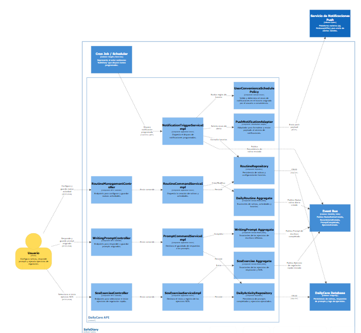

#### 2.6.5.6. Bounded Context Software Architecture Code Level Diagrams


##### 2.6.5.6.1. Bounded Context Domain Layer Class Diagrams

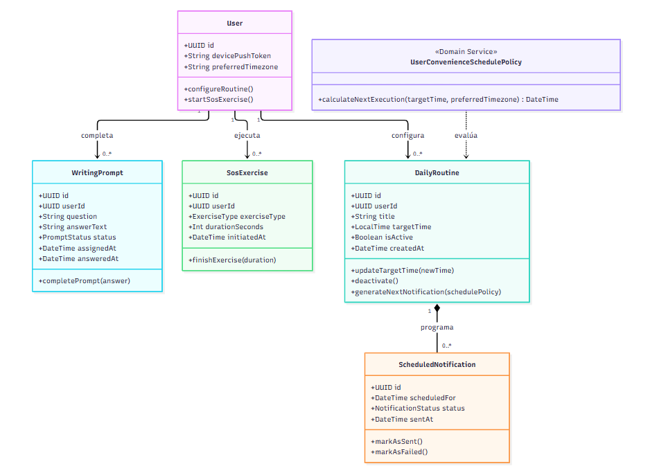

##### 2.6.5.6.2. Bounded Context Database Design Diagram

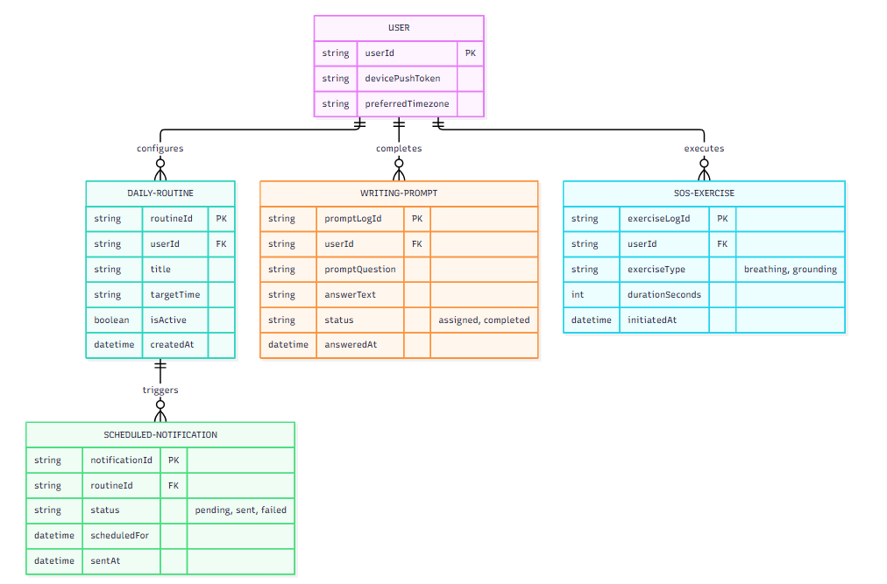

### 2.6.6. Bounded Context: Clinician Directory

**Clinician Directory** es dueño de la verificación profesional, la ficha pública, el banner, las especialidades, las tarifas, las reseñas y el puntaje de confianza de psicólogos (EP-04; US-002, US-036, US-039, US-041, US-042 y US-054). Recibe la identidad y el rol de IAM, pero no almacena credenciales de inicio de sesión. Care Scheduling consulta la ficha verificada y la tarifa; el directorio no reserva horarios ni procesa pagos.

#### 2.6.6.1. Domain Layer

**Entities y Aggregates**

* **ClinicianProfile (Aggregate Root):** clinicianId, accountId, especialidades, descripción, banner, tarifas, verificationStatus y publicationStatus.
* **VerificationRequest (Aggregate Root):** solicitud, referencias privadas a documentos, fecha y resultado de la revisión.
* **Review (Aggregate Root):** cita completada, paciente, psicólogo, calificación y texto; una sola reseña por cita y paciente.
* **RatingSummary (Read Model):** promedio y número de reseñas elegibles, calculados dentro de Clinician Directory.
* **TrustScore (Read Model):** puntaje y desglose de factores verificables, como reseñas y atención completada, sin exponer la identidad ni información emocional de pacientes.

**Value Objects**

* **ProfessionalCredential:** identificación profesional y especialidad sometidas a verificación.
* **ConsultationRate:** importe, moneda y duración; la reserva conserva una copia del importe acordado.
* **VerificationStatus:** PENDING, APPROVED o REJECTED.
* **PublicationStatus:** DRAFT, PUBLISHED o HIDDEN.

**Domain Events**

* VerificationRequested, ClinicianVerified, VerificationRejected, ProfessionalProfilePublished, ProfessionalProfileUpdated, ReviewPublished, RatingRecalculated, TrustScoreRecalculated.

**Commands y Queries**

* RequestVerificationCommand, ReviewCredentialsCommand, PublishProfileCommand, UpdateBannerAndRatesCommand, PublishReviewCommand.
* SearchCliniciansQuery, GetClinicianProfileQuery, GetVerificationStatusQuery, GetRatingSummaryQuery, GetTrustScoreBreakdownQuery.

**Business Decisions**

* Solo una ficha con verificación aprobada puede publicarse y aparecer en búsquedas.
* Publicar una tarifa nueva no modifica el importe de reservas ya aceptadas.
* Una reseña exige el evento SessionCompleted de Care Scheduling para esa cita y paciente; no revela datos clínicos.
* El puntaje explica sus componentes y muestra un estado sin valoración cuando no hay actividad suficiente; no recompensa solo el volumen de citas.
* Los documentos de verificación permanecen privados y no forman parte de la ficha pública.

#### 2.6.6.2. Interface Layer

* **VerificationController:** recibe solicitudes y expone su estado al psicólogo.
* **ProfessionalProfileController:** publica y edita ficha, banner y tarifas.
* **ClinicianSearchController:** busca, filtra y consulta fichas verificadas.
* **ReviewsController:** recibe reseñas elegibles y muestra calificación agregada.
* **TrustScoreController:** expone al psicólogo el puntaje y el desglose de factores, o el estado de información insuficiente.
* **Resources:** VerificationRequestResource, ProfessionalProfileResource, ConsultationRateResource, ClinicianSearchResource, ReviewResource, RatingSummaryResource y TrustScoreResource.

#### 2.6.6.3. Application Layer

* **RequestVerificationHandler:** asocia la solicitud al accountId autenticado y almacena referencias privadas a documentos.
* **ReviewCredentialsHandler:** aplica el resultado de la revisión de credenciales y emite ClinicianVerified o VerificationRejected.
* **PublishProfessionalProfileHandler:** comprueba verificación aprobada antes de publicar.
* **UpdateBannerAndRatesHandler:** versiona los importes publicados.
* **PublishReviewHandler:** valida elegibilidad contra una sesión completada y unicidad por cita, publica la reseña y recalcula RatingSummary y TrustScore.
* **SessionCompletedHandler:** registra la elegibilidad y actualiza factores agregados del puntaje sin importar contenido de la sesión.

#### 2.6.6.4. Infrastructure Layer

* **ClinicianProfileRepository, VerificationRequestRepository, ReviewRepository, RatingSummaryRepository y TrustScoreRepository:** persistencia propia del directorio.
* **IamRoleClient:** consulta identidad y rol, sin acceso a contraseñas.
* **CareSessionEventConsumer:** consume SessionCompleted de Care Scheduling.
* **CredentialStorageAdapter y BannerStorageAdapter:** separan documentos privados de material público.
* **DirectoryEventPublisher:** publica verificación, ficha y tarifa vigentes para consumidores autorizados.

#### 2.6.6.5. Bounded Context Software Architecture Component Level Diagrams

**Diagrama C4 de componentes en Structurizr DSL:**

```text
workspace "SafeDiary - Clinician Directory" "C4 Component Diagram del bounded context Clinician Directory" {
    model {
        patient = person "Paciente" "Busca psicólogos, consulta fichas y publica reseñas tras una sesión completada."
        psychologist = person "Psicólogo" "Solicita verificación, administra su ficha y consulta su puntaje de confianza."

        safeDiary = softwareSystem "SafeDiary" {
            directoryApi = container "Clinician Directory Service" "Verificación, fichas, tarifas, reseñas y puntaje de confianza." "Servicio de API" {
                verificationController = component "VerificationController" "Recibe solicitud de verificación y devuelve su estado." "Interface"
                profileController = component "ProfessionalProfileController" "Publica y edita ficha, banner y tarifas." "Interface"
                searchController = component "ClinicianSearchController" "Busca y consulta psicólogos verificados." "Interface"
                reviewController = component "ReviewsController" "Publica reseñas elegibles y consulta valoraciones." "Interface"
                trustController = component "TrustScoreController" "Consulta puntaje y desglose de confianza." "Interface"
                verificationService = component "VerificationApplicationService" "Gestiona envío y revisión de credenciales." "Application"
                profileService = component "ProfessionalProfileApplicationService" "Gestiona publicación y cambios de perfil." "Application"
                reviewService = component "ReviewApplicationService" "Valida sesión completada, unicidad y publicación de reseña." "Application"
                trustService = component "TrustScoreApplicationService" "Recalcula y explica los factores de confianza." "Application"
                publicationPolicy = component "DirectoryPublicationPolicy" "Solo permite publicar perfiles con verificación aprobada." "Domain"
                verificationRepo = component "VerificationRequestRepository" "Persiste solicitudes y estado de verificación." "Repository"
                profileRepo = component "ClinicianProfileRepository" "Persiste fichas y tarifas versionadas." "Repository"
                reviewRepo = component "ReviewRepository" "Persiste reseñas y aplica unicidad por cita y paciente." "Repository"
                trustRepo = component "TrustScoreRepository" "Persiste agregados de valoración y confianza." "Repository"
                iamClient = component "IamRoleClient" "Valida identidad y rol del titular." "ACL"
                sessionConsumer = component "SessionCompletedConsumer" "Consume eventos de Care Scheduling para elegibilidad de reseñas." "Integration"
                eventPublisher = component "DirectoryEventPublisher" "Publica verificación, ficha, tarifa y valoración vigentes." "Integration"
                credentialStorage = component "CredentialStorageAdapter" "Guarda documentos de verificación en espacio privado." "Infrastructure"
                bannerStorage = component "BannerStorageAdapter" "Guarda recursos públicos de ficha." "Infrastructure"
            }
            directoryDb = container "Clinician Directory Database" "Fichas, verificaciones, tarifas, reseñas y agregados." "PostgreSQL" "Database"
            eventBus = container "Event Bus" "Eventos de integración." "RabbitMQ" "Queue"
        }
        iam = softwareSystem "IAM" "Provee identidad autenticada y rol." "External System"
        care = softwareSystem "Care Scheduling" "Publica el evento SessionCompleted para habilitar reseñas." "External System"
        privateStorage = softwareSystem "Private Document Storage" "Almacena documentos de credenciales con acceso restringido." "External System"

        patient -> searchController "Busca y consulta fichas" "HTTPS"
        patient -> reviewController "Publica reseña elegible" "HTTPS"
        psychologist -> verificationController "Solicita verificación" "HTTPS"
        psychologist -> profileController "Edita ficha y tarifas" "HTTPS"
        psychologist -> trustController "Consulta el desglose de confianza" "HTTPS"
        verificationController -> verificationService
        profileController -> profileService
        searchController -> profileRepo
        reviewController -> reviewService
        trustController -> trustService
        verificationService -> iamClient
        profileService -> publicationPolicy
        profileService -> profileRepo
        verificationService -> verificationRepo
        verificationService -> credentialStorage
        profileService -> bannerStorage
        reviewService -> reviewRepo
        reviewService -> trustService
        trustService -> trustRepo
        iamClient -> iam "Valida identidad y rol" "HTTPS"
        care -> eventBus "Publica SessionCompleted" "AMQP"
        eventBus -> sessionConsumer "Entrega SessionCompleted" "AMQP"
        sessionConsumer -> reviewService
        eventPublisher -> eventBus "Publica eventos del directorio" "AMQP"
        verificationRepo -> directoryDb "Lee y escribe" "SQL"
        profileRepo -> directoryDb "Lee y escribe" "SQL"
        reviewRepo -> directoryDb "Lee y escribe" "SQL"
        trustRepo -> directoryDb "Lee y escribe" "SQL"
        credentialStorage -> privateStorage "Guarda documentos cifrados" "HTTPS"
    }
    views {
        component directoryApi "ClinicianDirectoryComponents" {
            include *
            autoLayout
        }
        styles {
            element "Person" {
                shape Person
                background #08427b
                color #ffffff
            }
            element "Software System" {
                background #1168bd
                color #ffffff
            }
            element "Container" {
                background #438dd5
                color #ffffff
            }
            element "Component" {
                background #85bbf0
                color #000000
            }
            element "Database" {
                shape Cylinder
                background #2a6f97
                color #ffffff
            }
            element "Queue" {
                shape Pipe
                background #014f86
                color #ffffff
            }
            element "External System" {
                background #6c757d
                color #ffffff
            }
        }
    }
}
```

#### 2.6.6.6. Bounded Context Software Architecture Code Level Diagrams

##### 2.6.6.6.1. Bounded Context Domain Layer Class Diagrams

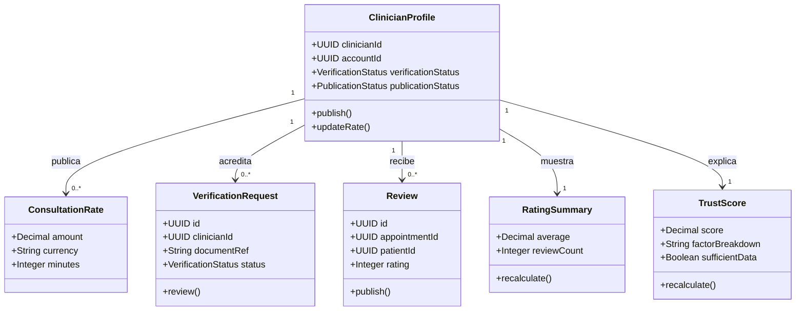
```mermaid
classDiagram
    class ClinicianProfile {
        +UUID clinicianId
        +UUID accountId
        +VerificationStatus verificationStatus
        +PublicationStatus publicationStatus
        +publish()
        +updateRate()
    }
    class VerificationRequest {
        +UUID id
        +UUID clinicianId
        +String documentRef
        +VerificationStatus status
        +review()
    }
    class ConsultationRate {
        +Decimal amount
        +String currency
        +Integer minutes
    }
    class Review {
        +UUID id
        +UUID appointmentId
        +UUID patientId
        +Integer rating
        +publish()
    }
    class RatingSummary {
        +Decimal average
        +Integer reviewCount
        +recalculate()
    }
    class TrustScore {
        +Decimal score
        +String factorBreakdown
        +Boolean sufficientData
        +recalculate()
    }
    ClinicianProfile "1" --> "0..*" ConsultationRate : publica
    ClinicianProfile "1" --> "0..*" VerificationRequest : acredita
    ClinicianProfile "1" --> "0..*" Review : recibe
    ClinicianProfile "1" --> "1" RatingSummary : muestra
    ClinicianProfile "1" --> "1" TrustScore : explica
```

##### 2.6.6.6.2. Bounded Context Database Design Diagram

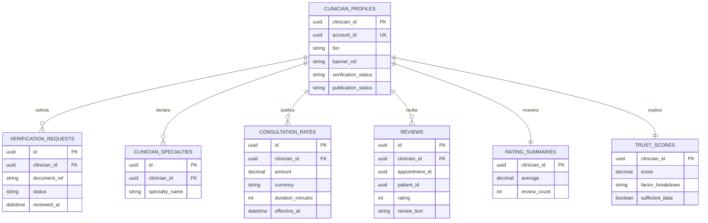
```mermaid
erDiagram
    CLINICIAN_PROFILES {
        uuid clinician_id PK
        uuid account_id UK
        string bio
        string banner_ref
        string verification_status
        string publication_status
    }
    CLINICIAN_SPECIALTIES {
        uuid id PK
        uuid clinician_id FK
        string specialty_name
    }
    VERIFICATION_REQUESTS {
        uuid id PK
        uuid clinician_id FK
        string document_ref
        string status
        datetime reviewed_at
    }
    CONSULTATION_RATES {
        uuid id PK
        uuid clinician_id FK
        decimal amount
        string currency
        int duration_minutes
        datetime effective_at
    }
    REVIEWS {
        uuid id PK
        uuid clinician_id FK
        uuid appointment_id
        uuid patient_id
        int rating
        string review_text
    }
    RATING_SUMMARIES {
        uuid clinician_id PK
        decimal average
        int review_count
    }
    TRUST_SCORES {
        uuid clinician_id PK
        decimal score
        string factor_breakdown
        boolean sufficient_data
    }
    CLINICIAN_PROFILES ||--o{ VERIFICATION_REQUESTS : solicita
    CLINICIAN_PROFILES ||--o{ CLINICIAN_SPECIALTIES : declara
    CLINICIAN_PROFILES ||--o{ CONSULTATION_RATES : publica
    CLINICIAN_PROFILES ||--o{ REVIEWS : recibe
    CLINICIAN_PROFILES ||--|| RATING_SUMMARIES : muestra
    CLINICIAN_PROFILES ||--|| TRUST_SCORES : explica
```

### 2.6.7. Bounded Context: Care Scheduling

**Care Scheduling** coordina la solicitud de contacto, el chat para acordar una fecha, la propuesta y aceptación del horario, la retención de una hora, la cita y la sesión por videollamada (EP-06; US-038, US-043, US-044, US-048, US-049 y US-050). Es dueño de la disponibilidad reservable. Consulta en Clinician Directory la ficha y la tarifa vigentes; solicita el cobro a Payments & Payouts, pero no crea intentos de pago ni contabiliza ingresos. El acceso a datos emocionales se valida en IAM y se limita a lo autorizado por el paciente.

#### 2.6.7.1. Domain Layer

**Entities y Aggregates**

* **ContactRequest (Aggregate Root):** paciente, psicólogo, estado y mensajes de coordinación. El contacto no constituye una cita ni autoriza acceso al diario.
* **Appointment (Aggregate Root):** paciente, psicólogo, horario acordado, importe fijado, estado, holdId y paymentReference.
* **SlotHold (Entity):** intervalo bloqueado temporalmente, creado tras aceptar ambas partes el horario y con expiración de una hora.
* **ClinicalSession (Aggregate Root):** referencia a cita confirmada, participantes autorizados, inicio, fin y resultado operativo.
* **AuthorizedSummaryAccess (Audit Record):** referencia a consentimiento, alcance y momento de consulta, sin copiar el diario completo.

**Value Objects**

* **AppointmentSlot:** inicio, fin y zona horaria.
* **AppointmentStatus:** REQUESTED, HELD, CONFIRMED, CANCELLED, EXPIRED o COMPLETED.
* **AgreedAmount:** importe y moneda capturados al aceptar el horario.
* **MeetingAccessWindow:** ventana en la que paciente y psicólogo pueden entrar a la reunión.

**Domain Events**

* ContactRequestSent, ScheduleProposed, ScheduleAccepted, SlotHeld, HoldExpired, AppointmentConfirmed, AppointmentCancelled, SessionStarted, SessionCompleted.

**Commands y Queries**

* SendContactRequestCommand, SendCoordinationMessageCommand, ProposeScheduleCommand, AcceptScheduleCommand, HoldSlotCommand, ConfirmAfterPaymentCommand, CancelAppointmentCommand, JoinSessionCommand, CompleteSessionCommand.
* GetClinicianAgendaQuery, GetPatientAppointmentsQuery, GetContactRequestQuery, GetBookableSlotsQuery, GetSessionDetailsQuery.

**Business Decisions**

* Solo una reserva activa puede ocupar el mismo horario de un psicólogo.
* El hold vence una hora después de su creación. Solo PaymentApproved para esa reserva vigente confirma la cita; la duplicación del evento no confirma otra cita.
* El pago tardío no reabre un horario liberado: se informa a Payments & Payouts para conciliación o devolución.
* Solo los dos participantes autenticados entran a la reunión durante su ventana autorizada.
* El resumen o las entradas autorizadas se consultan después de validar el consentimiento vigente en IAM.

#### 2.6.7.2. Interface Layer

* **ContactRequestsController:** solicitud y mensajes de coordinación entre paciente y psicólogo.
* **ScheduleController:** propuestas, aceptación, disponibilidad reservable y agenda profesional.
* **AppointmentsController:** reserva, consulta, cancelación y estado de pago recibido.
* **SessionsController:** acceso temporal, cierre de atención y archivos autorizados.
* **AuthorizedSummaryController:** solicitud de resumen con alcance de consentimiento validado.
* **Resources:** ContactRequestResource, CoordinationMessageResource, ScheduleProposalResource, SlotHoldResource, AppointmentResource, SessionAccessResource y AuthorizedSummaryResource.

#### 2.6.7.3. Application Layer

* **ContactRequestHandler:** crea la solicitud y notifica al psicólogo sin trasladar datos del diario.
* **ScheduleAgreementHandler:** registra propuesta y aceptación; captura la tarifa del directorio en AgreedAmount.
* **HoldSlotHandler:** comprueba conflictos y crea un hold de una hora de manera idempotente.
* **PaymentResultHandler:** verifica reservaId, importe y estado; confirma la cita tras PaymentApproved o libera el hold al fallar o vencer.
* **ExpireHoldHandler:** expira reservas sin pago y libera el horario.
* **SessionHandler:** obtiene acceso temporal del proveedor de videollamadas, registra inicio y cierre.
* **AuthorizedSummaryHandler:** valida identidad y consentimiento en IAM antes de solicitar el resumen mínimo a AssistantAI o entradas autorizadas a Diary.
* **SessionCompletedPublisher:** publica el cierre para habilitar una reseña en Clinician Directory.

#### 2.6.7.4. Infrastructure Layer

* **ContactRequestRepository, AppointmentRepository, SlotHoldRepository y ClinicalSessionRepository:** persistencia exclusiva de agenda y atención; índice único para impedir solapamientos activos.
* **ClinicianDirectoryClient:** obtiene psicólogo verificado, identificador y tarifa actual.
* **PaymentsClient y PaymentResultConsumer:** solicitan cobro asociado al hold y consumen confirmaciones firmadas publicadas por Payments & Payouts.
* **IamConsentClient y EmotionalSummaryClient (ACL):** traducen autorización y resúmenes sin importar modelos internos ajenos.
* **VideoProviderAdapter y CalendarSyncAdapter:** acceso a reunión y sincronización opcional de agenda.
* **NotificationPublisher y SessionFileStorageAdapter:** avisos operativos y archivos permitidos de la cita.

#### 2.6.7.5. Bounded Context Software Architecture Component Level Diagrams

**Diagrama C4 de componentes en Structurizr DSL:**

```text
workspace "SafeDiary - Care Scheduling" "C4 Component Diagram del bounded context Care Scheduling" {
    model {
        patient = person "Paciente" "Envía solicitud, acuerda horario, paga y asiste a la cita."
        psychologist = person "Psicólogo" "Coordina solicitudes, propone horarios y atiende sesiones."

        safeDiary = softwareSystem "SafeDiary" {
            schedulingApi = container "Care Scheduling Service" "Contacto, agenda reservable, reservas, citas y sesiones." "Servicio de API" {
                contactController = component "ContactRequestsController" "Gestiona solicitudes y mensajes de coordinación." "Interface"
                scheduleController = component "ScheduleController" "Propone, acepta y consulta horarios." "Interface"
                appointmentController = component "AppointmentsController" "Crea, consulta y cancela citas y holds." "Interface"
                sessionController = component "SessionsController" "Gestiona acceso y estado operativo de sesiones." "Interface"
                summaryController = component "AuthorizedSummaryController" "Solicita datos emocionales con consentimiento vigente." "Interface"
                contactService = component "ContactRequestApplicationService" "Coordina solicitud y conversación privada." "Application"
                scheduleService = component "ScheduleAgreementApplicationService" "Registra propuesta y aceptación del horario y tarifa." "Application"
                holdService = component "SlotHoldApplicationService" "Retiene el horario una hora y lo libera al expirar." "Application"
                paymentHandler = component "PaymentResultHandler" "Confirma cita solo tras pago aprobado para hold vigente." "Application"
                sessionService = component "ClinicalSessionApplicationService" "Inicia y completa la atención profesional." "Application"
                accessPolicy = component "SessionAccessPolicy" "Autoriza participantes y ventana temporal de acceso." "Domain"
                contactRepo = component "ContactRequestRepository" "Persiste solicitudes y mensajes." "Repository"
                appointmentRepo = component "AppointmentRepository" "Persiste citas y bloquea solapamientos." "Repository"
                holdRepo = component "SlotHoldRepository" "Persiste expiración y estado de holds." "Repository"
                sessionRepo = component "ClinicalSessionRepository" "Persiste el resultado operativo de la sesión." "Repository"
                directoryClient = component "ClinicianDirectoryClient" "Obtiene ficha verificada y tarifa vigente." "ACL"
                paymentsClient = component "PaymentsClient" "Solicita el cobro asociado a una reserva." "ACL"
                iamClient = component "IamConsentClient" "Valida identidad y consentimiento vigente." "ACL"
                summaryClient = component "EmotionalSummaryClient" "Solicita datos mínimos autorizados a Diary o AssistantAI." "ACL"
                paymentConsumer = component "PaymentResultConsumer" "Procesa PaymentApproved o PaymentFailed de forma idempotente." "Integration"
                sessionPublisher = component "SessionCompletedPublisher" "Publica el cierre de sesión para elegibilidad de reseña." "Integration"
                videoAdapter = component "VideoProviderAdapter" "Genera accesos temporales para citas confirmadas." "Infrastructure"
                calendarAdapter = component "CalendarSyncAdapter" "Sincroniza citas si el psicólogo lo habilitó." "Infrastructure"
            }
            schedulingDb = container "Care Scheduling Database" "Solicitudes, mensajes, holds, citas, sesiones y auditoría de acceso." "PostgreSQL" "Database"
            eventBus = container "Event Bus" "Eventos de integración." "RabbitMQ" "Queue"
        }
        directory = softwareSystem "Clinician Directory" "Provee ficha profesional verificada y tarifa." "External System"
        payments = softwareSystem "Payments & Payouts" "Procesa y confirma el pago de la reserva." "External System"
        iam = softwareSystem "IAM" "Provee identidad y autorización de consentimiento." "External System"
        diary = softwareSystem "Diary" "Provee entradas expresamente autorizadas." "External System"
        assistant = softwareSystem "AssistantAI" "Provee resúmenes emocionales autorizados." "External System"
        videoProvider = softwareSystem "Video Provider" "Crea reuniones privadas y accesos temporales." "External System"
        calendarProvider = softwareSystem "Google Calendar / Outlook Calendar" "Sincroniza agenda si está habilitado." "External System"

        patient -> contactController "Envía solicitud y mensajes" "HTTPS"
        patient -> scheduleController "Acepta horario" "HTTPS"
        patient -> appointmentController "Paga, consulta o cancela reserva" "HTTPS"
        patient -> sessionController "Ingresa a cita confirmada" "HTTPS"
        psychologist -> contactController "Responde solicitud" "HTTPS"
        psychologist -> scheduleController "Propone horario" "HTTPS"
        psychologist -> sessionController "Atiende y cierra la sesión" "HTTPS"
        contactController -> contactService
        scheduleController -> scheduleService
        appointmentController -> holdService
        sessionController -> sessionService
        summaryController -> iamClient
        summaryController -> summaryClient
        contactService -> contactRepo
        scheduleService -> directoryClient
        scheduleService -> appointmentRepo
        holdService -> appointmentRepo
        holdService -> holdRepo
        holdService -> paymentsClient
        paymentConsumer -> paymentHandler
        paymentHandler -> appointmentRepo
        paymentHandler -> holdRepo
        sessionService -> accessPolicy
        sessionService -> sessionRepo
        sessionService -> videoAdapter
        sessionService -> sessionPublisher
        directoryClient -> directory "Consulta verificación y tarifa" "HTTPS"
        paymentsClient -> payments "Solicita cobro de reserva" "HTTPS"
        payments -> eventBus "Publica resultado de pago" "AMQP"
        eventBus -> paymentConsumer "Entrega PaymentApproved o PaymentFailed" "AMQP"
        iamClient -> iam "Valida identidad y consentimiento" "HTTPS"
        summaryClient -> diary "Solicita entradas autorizadas" "HTTPS"
        summaryClient -> assistant "Solicita resumen autorizado" "HTTPS"
        sessionPublisher -> eventBus "Publica SessionCompleted" "AMQP"
        videoAdapter -> videoProvider "Crea reunión" "HTTPS"
        calendarAdapter -> calendarProvider "Sincroniza cita autorizada" "HTTPS"
        contactRepo -> schedulingDb "Lee y escribe" "SQL"
        appointmentRepo -> schedulingDb "Lee y escribe" "SQL"
        holdRepo -> schedulingDb "Lee y escribe" "SQL"
        sessionRepo -> schedulingDb "Lee y escribe" "SQL"
    }
    views {
        component schedulingApi "CareSchedulingComponents" {
            include *
            autoLayout
        }
        styles {
            element "Person" {
                shape Person
                background #08427b
                color #ffffff
            }
            element "Software System" {
                background #1168bd
                color #ffffff
            }
            element "Container" {
                background #438dd5
                color #ffffff
            }
            element "Component" {
                background #85bbf0
                color #000000
            }
            element "Database" {
                shape Cylinder
                background #2a6f97
                color #ffffff
            }
            element "Queue" {
                shape Pipe
                background #014f86
                color #ffffff
            }
            element "External System" {
                background #6c757d
                color #ffffff
            }
        }
    }
}
```

#### 2.6.7.6. Bounded Context Software Architecture Code Level Diagrams

##### 2.6.7.6.1. Bounded Context Domain Layer Class Diagrams

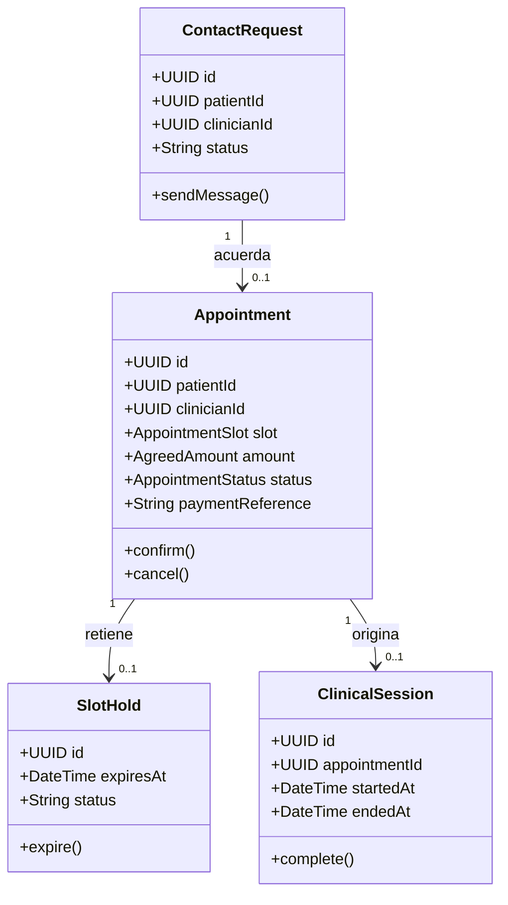
```mermaid
classDiagram
    class ContactRequest {
        +UUID id
        +UUID patientId
        +UUID clinicianId
        +String status
        +sendMessage()
    }
    class Appointment {
        +UUID id
        +UUID patientId
        +UUID clinicianId
        +AppointmentSlot slot
        +AgreedAmount amount
        +AppointmentStatus status
        +String paymentReference
        +confirm()
        +cancel()
    }
    class SlotHold {
        +UUID id
        +DateTime expiresAt
        +String status
        +expire()
    }
    class ClinicalSession {
        +UUID id
        +UUID appointmentId
        +DateTime startedAt
        +DateTime endedAt
        +complete()
    }
    ContactRequest "1" --> "0..1" Appointment : acuerda
    Appointment "1" --> "0..1" SlotHold : retiene
    Appointment "1" --> "0..1" ClinicalSession : origina
```

##### 2.6.7.6.2. Bounded Context Database Design Diagram

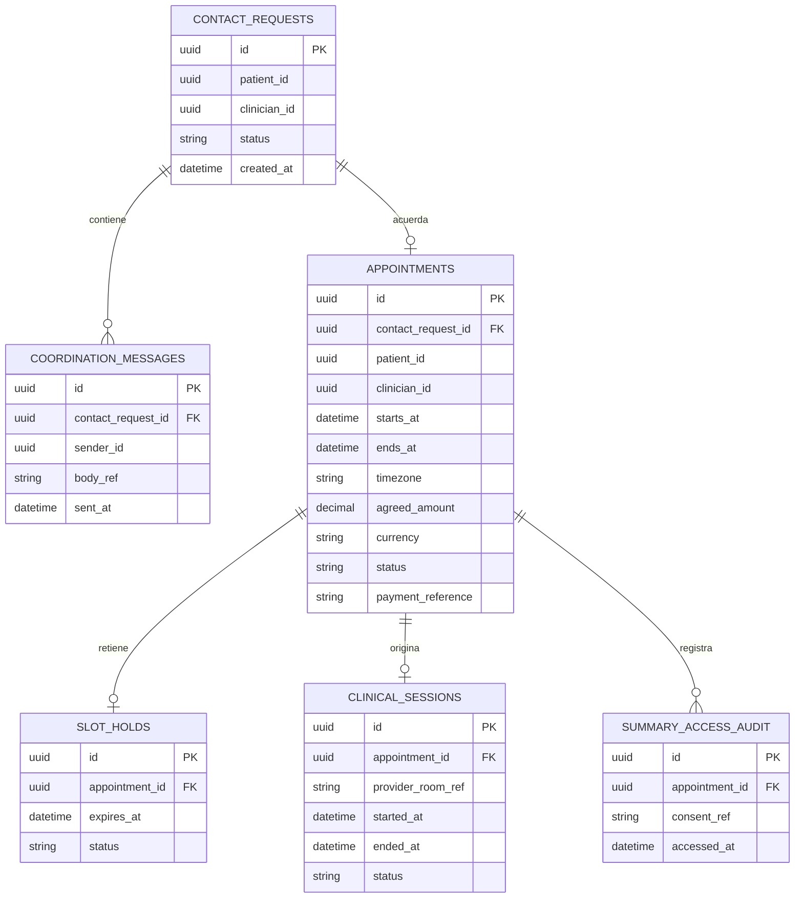
```mermaid
erDiagram
    CONTACT_REQUESTS {
        uuid id PK
        uuid patient_id
        uuid clinician_id
        string status
        datetime created_at
    }
    COORDINATION_MESSAGES {
        uuid id PK
        uuid contact_request_id FK
        uuid sender_id
        string body_ref
        datetime sent_at
    }
    APPOINTMENTS {
        uuid id PK
        uuid contact_request_id FK
        uuid patient_id
        uuid clinician_id
        datetime starts_at
        datetime ends_at
        string timezone
        decimal agreed_amount
        string currency
        string status
        string payment_reference
    }
    SLOT_HOLDS {
        uuid id PK
        uuid appointment_id FK
        datetime expires_at
        string status
    }
    CLINICAL_SESSIONS {
        uuid id PK
        uuid appointment_id FK
        string provider_room_ref
        datetime started_at
        datetime ended_at
        string status
    }
    SUMMARY_ACCESS_AUDIT {
        uuid id PK
        uuid appointment_id FK
        string consent_ref
        datetime accessed_at
    }
    CONTACT_REQUESTS ||--o{ COORDINATION_MESSAGES : contiene
    CONTACT_REQUESTS ||--o| APPOINTMENTS : acuerda
    APPOINTMENTS ||--o| SLOT_HOLDS : retiene
    APPOINTMENTS ||--o| CLINICAL_SESSIONS : origina
    APPOINTMENTS ||--o{ SUMMARY_ACCESS_AUDIT : registra
```

### 2.6.8. Bounded Context: Payments & Payouts

**Payments & Payouts** administra los cobros de citas y del plan Premium como operaciones diferentes, además de comprobantes, comisiones, balance e ingresos y retiros del psicólogo (EP-07; US-037, US-047, US-051, US-052 y US-053). La pasarela confirma resultados; el contexto no almacena tarjetas completas. Care Scheduling conserva la cita, mientras Payments & Payouts es dueño del pago y de la vigencia de la suscripción.

#### 2.6.8.1. Domain Layer

**Entities y Aggregates**

* **PaymentIntent (Aggregate Root):** propósito APPOINTMENT o SUBSCRIPTION, referencia de reserva o plan, importe, moneda, clave idempotente, referencia de pasarela y estado.
* **Subscription (Aggregate Root):** paciente, plan Básico/Premium, vigencia y estado; Premium se activa solo con un pago de suscripción aprobado.
* **ProfessionalLedger (Aggregate Root):** movimientos de ingresos de citas, comisión de plataforma, saldo disponible y retiros comprometidos.
* **PayoutRequest (Aggregate Root):** psicólogo, importe, método tokenizado, estado y referencia de pasarela.
* **Receipt (Entity):** comprobante emitido para un cobro aprobado, vinculado a su PaymentIntent.

**Value Objects**

* **Money:** importe no negativo y moneda.
* **PaymentPurpose:** APPOINTMENT o SUBSCRIPTION.
* **PaymentStatus:** CREATED, PENDING, APPROVED, FAILED o REFUNDED.
* **PayoutStatus:** REQUESTED, PROCESSING, COMPLETED o REJECTED.
* **IdempotencyKey:** evita cargos duplicados para una misma operación.

**Domain Events**

* PaymentIntentCreated, PaymentApproved, PaymentFailed, ReceiptIssued, SubscriptionActivated, ProfessionalIncomeRecorded, PayoutRequested, PayoutCompleted, PayoutRejected.

**Commands y Queries**

* CreateAppointmentChargeCommand, SelectPremiumPlanCommand, CreateSubscriptionChargeCommand, ConfirmChargeResultCommand, RegisterPayoutMethodCommand, RequestPayoutCommand, ConfirmPayoutResultCommand.
* GetPaymentStatusQuery, GetReceiptQuery, GetSubscriptionQuery, GetProfessionalBalanceQuery, GetPaymentMovementsQuery, GetPayoutsQuery.

**Business Decisions**

* Una reserva genera a lo sumo un cobro aprobado; reintentos y notificaciones repetidas reutilizan la misma clave idempotente.
* PaymentApproved de una cita incluye reservationId para Care Scheduling; un cobro de Premium nunca confirma una cita.
* Solo una confirmación válida de la pasarela activa Premium y emite comprobante.
* Las suscripciones no se suman al saldo retirable del psicólogo. Solo el ingreso neto por sesiones elegibles integra su balance.
* El retiro no supera el saldo disponible y su resultado se aplica una sola vez tras confirmación de la pasarela de retiro.

#### 2.6.8.2. Interface Layer

* **PaymentsController:** inicia cobros y consulta estados y comprobantes.
* **SubscriptionsController:** muestra planes y consulta la suscripción vigente.
* **ProfessionalBalanceController:** muestra ingresos, comisiones y saldo retirable.
* **PayoutsController:** registra método tokenizado y solicita o consulta retiros.
* **ProviderNotificationsController:** recibe y valida resultados firmados de pasarelas de cobro y retiro.
* **Resources:** PaymentIntentResource, PaymentResultResource, ReceiptResource, SubscriptionResource, BalanceResource, PayoutMethodResource y PayoutResource.

#### 2.6.8.3. Application Layer

* **CreatePaymentIntentHandler:** valida propósito e importe y crea un intento idempotente para cita o Premium.
* **ConfirmPaymentHandler:** comprueba firma y referencia de pasarela, actualiza estado una sola vez, emite recibo y publica PaymentApproved o PaymentFailed.
* **ActivateSubscriptionHandler:** activa Premium solo después de aprobarse el cobro específico de suscripción y publica SubscriptionActivated a Profiles y AssistantAI.
* **RecordProfessionalIncomeHandler:** ante un cobro de cita aprobado, registra ingreso y comisión sin mezclar ingresos de suscripciones.
* **RequestPayoutHandler:** valida saldo, reserva el importe y solicita el retiro.
* **ConfirmPayoutHandler:** aplica de forma idempotente el resultado firmado de la pasarela de retiro.
* **PaymentQueries:** responde estados, recibos, plan, movimientos y balance según el rol.

#### 2.6.8.4. Infrastructure Layer

* **PaymentIntentRepository, SubscriptionRepository, LedgerRepository, PayoutRepository y ReceiptRepository:** persistencia exclusiva de Payments & Payouts.
* **PaymentGatewayAdapter y PayoutGatewayAdapter:** integración con pasarelas externas; verifican firma y evitan procesar duplicados.
* **CareReservationClient:** comprueba referencia, vigencia e importe de la reserva antes de crear el cobro.
* **IamIdentityClient:** identifica al titular del pago o del balance, sin duplicar credenciales.
* **PaymentsEventPublisher:** publica resultados de cobro, cambios de plan y retiro con identificadores de correlación.

#### 2.6.8.5. Bounded Context Software Architecture Component Level Diagrams

**Diagrama C4 de componentes en Structurizr DSL:**

```text
workspace "SafeDiary - Payments and Payouts" "C4 Component Diagram del bounded context Payments & Payouts" {
    model {
        patient = person "Paciente" "Paga citas, consulta comprobantes y administra su plan Premium."
        psychologist = person "Psicólogo" "Consulta sus ingresos, registra método y solicita retiros."

        safeDiary = softwareSystem "SafeDiary" {
            paymentsApi = container "Payments & Payouts Service" "Cobros, suscripciones, comprobantes, comisiones, balance y retiros." "Servicio de API" {
                paymentsController = component "PaymentsController" "Inicia cobros de citas y consulta su estado." "Interface"
                subscriptionsController = component "SubscriptionsController" "Consulta planes y suscripción vigente." "Interface"
                balanceController = component "ProfessionalBalanceController" "Consulta ingresos, comisiones y saldo retirable." "Interface"
                payoutsController = component "PayoutsController" "Registra método tokenizado y solicita retiros." "Interface"
                providerController = component "ProviderNotificationsController" "Recibe resultados firmados de cobro y retiro." "Interface"
                intentService = component "PaymentIntentApplicationService" "Crea intentos idempotentes para cita o suscripción." "Application"
                confirmationService = component "PaymentConfirmationApplicationService" "Valida y aplica el resultado de cobro una sola vez." "Application"
                subscriptionService = component "SubscriptionApplicationService" "Activa Premium tras confirmar el cobro de plan." "Application"
                ledgerService = component "ProfessionalLedgerApplicationService" "Registra el neto de sesiones y la comisión." "Application"
                payoutService = component "PayoutApplicationService" "Valida saldo y tramita retiros profesionales." "Application"
                idempotencyPolicy = component "PaymentIdempotencyPolicy" "Evita cargos duplicados por reintentos o avisos repetidos." "Domain"
                intentRepo = component "PaymentIntentRepository" "Persiste intentos y referencias de pasarela." "Repository"
                subscriptionRepo = component "SubscriptionRepository" "Persiste plan y vigencia." "Repository"
                ledgerRepo = component "ProfessionalLedgerRepository" "Persiste movimientos y saldo disponible." "Repository"
                payoutRepo = component "PayoutRepository" "Persiste métodos tokenizados y solicitudes de retiro." "Repository"
                receiptRepo = component "ReceiptRepository" "Persiste referencias de comprobantes." "Repository"
                careClient = component "CareReservationClient" "Valida reserva, vigencia e importe acordado." "ACL"
                iamClient = component "IamIdentityClient" "Valida titular, identidad y rol." "ACL"
                paymentGatewayAdapter = component "PaymentGatewayAdapter" "Procesa pagos y valida confirmaciones firmadas." "Infrastructure"
                payoutGatewayAdapter = component "PayoutGatewayAdapter" "Procesa retiros y valida confirmaciones firmadas." "Infrastructure"
                eventPublisher = component "PaymentsEventPublisher" "Publica resultado de cobro, plan y retiro." "Integration"
            }
            paymentsDb = container "Payments & Payouts Database" "Intentos, suscripciones, comprobantes, movimientos y retiros." "PostgreSQL" "Database"
            eventBus = container "Event Bus" "Eventos de integración." "RabbitMQ" "Queue"
        }
        care = softwareSystem "Care Scheduling" "Provee referencia e importe de reservas temporales." "External System"
        iam = softwareSystem "IAM" "Provee identidad autenticada y rol." "External System"
        paymentGateway = softwareSystem "Pasarela de pago" "Procesa pagos de citas y suscripciones." "External System"
        payoutGateway = softwareSystem "Pasarela de retiro" "Transfiere fondos al psicólogo." "External System"
        profiles = softwareSystem "Profiles" "Consume estado de plan para presentarlo al usuario." "External System"
        assistant = softwareSystem "AssistantAI" "Consume estado de plan para aplicar beneficios." "External System"

        patient -> paymentsController "Inicia cobro y consulta comprobante" "HTTPS"
        patient -> subscriptionsController "Consulta o contrata Premium" "HTTPS"
        psychologist -> balanceController "Consulta balance profesional" "HTTPS"
        psychologist -> payoutsController "Registra método y solicita retiro" "HTTPS"
        providerController -> confirmationService "Entrega resultado firmado"
        paymentsController -> intentService
        subscriptionsController -> intentService
        balanceController -> ledgerService
        payoutsController -> payoutService
        intentService -> careClient
        intentService -> idempotencyPolicy
        intentService -> intentRepo
        intentService -> paymentGatewayAdapter
        confirmationService -> intentRepo
        confirmationService -> subscriptionService
        confirmationService -> ledgerService
        confirmationService -> receiptRepo
        confirmationService -> eventPublisher
        subscriptionService -> subscriptionRepo
        ledgerService -> ledgerRepo
        payoutService -> payoutRepo
        payoutService -> payoutGatewayAdapter
        intentService -> iamClient
        payoutService -> iamClient
        careClient -> care "Valida reserva e importe" "HTTPS"
        iamClient -> iam "Valida identidad y rol" "HTTPS"
        paymentGatewayAdapter -> paymentGateway "Solicita cobro" "HTTPS"
        paymentGateway -> providerController "Confirma resultado de cobro" "Notificación firmada"
        payoutGatewayAdapter -> payoutGateway "Solicita retiro" "HTTPS"
        payoutGateway -> providerController "Confirma resultado de retiro" "Notificación firmada"
        eventPublisher -> eventBus "Publica eventos de pago" "AMQP"
        eventBus -> profiles "SubscriptionActivated" "AMQP"
        eventBus -> assistant "SubscriptionActivated" "AMQP"
        intentRepo -> paymentsDb "Lee y escribe" "SQL"
        subscriptionRepo -> paymentsDb "Lee y escribe" "SQL"
        ledgerRepo -> paymentsDb "Lee y escribe" "SQL"
        payoutRepo -> paymentsDb "Lee y escribe" "SQL"
        receiptRepo -> paymentsDb "Lee y escribe" "SQL"
    }
    views {
        component paymentsApi "PaymentsPayoutsComponents" {
            include *
            autoLayout
        }
        styles {
            element "Person" {
                shape Person
                background #08427b
                color #ffffff
            }
            element "Software System" {
                background #1168bd
                color #ffffff
            }
            element "Container" {
                background #438dd5
                color #ffffff
            }
            element "Component" {
                background #85bbf0
                color #000000
            }
            element "Database" {
                shape Cylinder
                background #2a6f97
                color #ffffff
            }
            element "Queue" {
                shape Pipe
                background #014f86
                color #ffffff
            }
            element "External System" {
                background #6c757d
                color #ffffff
            }
        }
    }
}
```

#### 2.6.8.6. Bounded Context Software Architecture Code Level Diagrams

##### 2.6.8.6.1. Bounded Context Domain Layer Class Diagrams

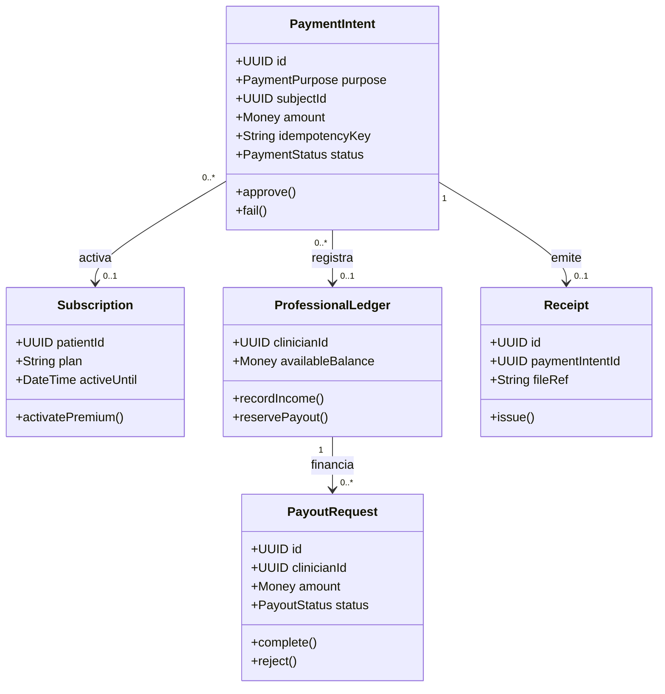
```mermaid
classDiagram
    class PaymentIntent {
        +UUID id
        +PaymentPurpose purpose
        +UUID subjectId
        +Money amount
        +String idempotencyKey
        +PaymentStatus status
        +approve()
        +fail()
    }
    class Subscription {
        +UUID patientId
        +String plan
        +DateTime activeUntil
        +activatePremium()
    }
    class ProfessionalLedger {
        +UUID clinicianId
        +Money availableBalance
        +recordIncome()
        +reservePayout()
    }
    class PayoutRequest {
        +UUID id
        +UUID clinicianId
        +Money amount
        +PayoutStatus status
        +complete()
        +reject()
    }
    class Receipt {
        +UUID id
        +UUID paymentIntentId
        +String fileRef
        +issue()
    }
    PaymentIntent "1" --> "0..1" Receipt : emite
    PaymentIntent "0..*" --> "0..1" Subscription : activa
    PaymentIntent "0..*" --> "0..1" ProfessionalLedger : registra
    ProfessionalLedger "1" --> "0..*" PayoutRequest : financia
```

##### 2.6.8.6.2. Bounded Context Database Design Diagram

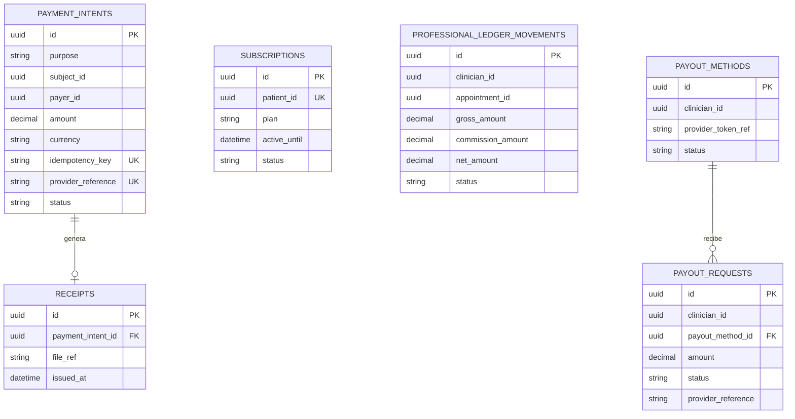
```mermaid
erDiagram
    PAYMENT_INTENTS {
        uuid id PK
        string purpose
        uuid subject_id
        uuid payer_id
        decimal amount
        string currency
        string idempotency_key UK
        string provider_reference UK
        string status
    }
    SUBSCRIPTIONS {
        uuid id PK
        uuid patient_id UK
        string plan
        datetime active_until
        string status
    }
    RECEIPTS {
        uuid id PK
        uuid payment_intent_id FK
        string file_ref
        datetime issued_at
    }
    PROFESSIONAL_LEDGER_MOVEMENTS {
        uuid id PK
        uuid clinician_id
        uuid appointment_id
        decimal gross_amount
        decimal commission_amount
        decimal net_amount
        string status
    }
    PAYOUT_METHODS {
        uuid id PK
        uuid clinician_id
        string provider_token_ref
        string status
    }
    PAYOUT_REQUESTS {
        uuid id PK
        uuid clinician_id
        uuid payout_method_id FK
        decimal amount
        string status
        string provider_reference
    }
    PAYMENT_INTENTS ||--o| RECEIPTS : genera
    PAYOUT_METHODS ||--o{ PAYOUT_REQUESTS : recibe
```
