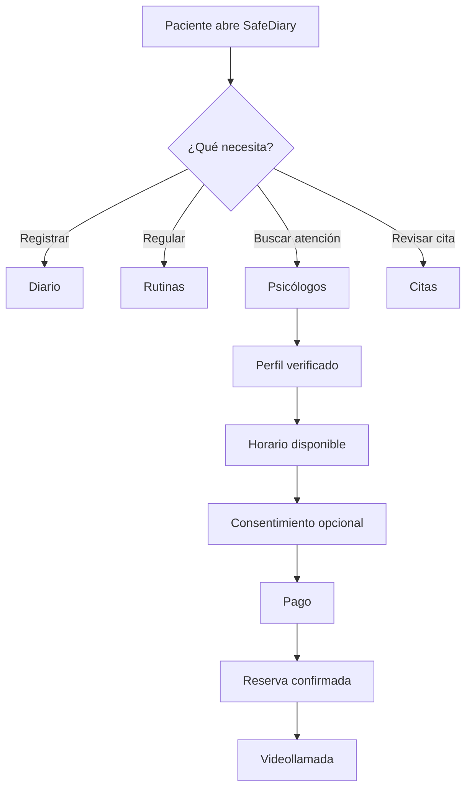

# Capítulo III: Solution UI/UX Design

> **Plantilla para TB1.** Reemplazar los textos entre corchetes por decisiones y evidencias propias de SafeDiary. Cada artefacto debe incluir una imagen legible, una explicación de las decisiones y la relación con las historias de usuario.

## 3.1. Product design

En esta sección se explica cómo el diseño de SafeDiary transforma los requisitos priorizados del Capítulo II en una experiencia coherente para pacientes jóvenes y, cuando corresponda, profesionales de salud mental.

**Alcance de esta entrega:** [indicar qué pantallas y flujos se presentan en TB1 y cuáles quedan para los siguientes sprints].

**Historias de usuario cubiertas:** [US-xxx, US-xxx].

**Criterios transversales:** privacidad por defecto, consentimiento explícito, lenguaje no diagnóstico, accesibilidad y estados de error.

### 3.1.1. Style Guidelines

#### 3.1.1.1. General Style Guidelines

##### Branding

- **Nombre y propuesta de valor:** SafeDiary como puente seguro entre reflexión privada, hábitos de autocuidado y atención profesional.
- **Personalidad de marca:** [serena / cercana / no sentenciosa / clínicamente responsable].
- **Logo y usos permitidos:** [insertar logo, área de protección y usos incorrectos].

##### Typography

| Uso | Familia | Peso | Tamaño | Ejemplo |
|---|---|---:|---:|---|
| Título principal | [fuente] | [peso] | [px] | [texto] |
| Encabezado de sección | [fuente] | [peso] | [px] | [texto] |
| Texto de cuerpo | [fuente] | [peso] | [px] | [texto] |
| Etiqueta / ayuda | [fuente] | [peso] | [px] | [texto] |

##### Colors

| Token | Valor | Uso | Contraste validado |
|---|---|---|---|
| `color.background` | [hex] | Fondo principal | [AA/AAA] |
| `color.surface` | [hex] | Tarjetas y formularios | [AA/AAA] |
| `color.primary` | [hex] | Acciones principales | [AA/AAA] |
| `color.secondary` | [hex] | Acciones secundarias | [AA/AAA] |
| `color.text` | [hex] | Texto principal | [AA/AAA] |
| `color.danger` | [hex] | Estados de riesgo o error | [AA/AAA] |

##### Spacing, grid and components

- **Grid:** [número de columnas / márgenes / ancho base del dispositivo].
- **Escala de espaciado:** [4, 8, 12, 16, 24, 32 ...].
- **Radio y elevación:** [valores definidos].
- **Componentes reutilizables:** [botones, tarjetas, campos, chips emocionales, navegación, tarjetas de especialistas, estados vacíos].
- **Estados:** default, pressed, disabled, loading, success, error, offline y contenido no disponible.

##### Voice and tone

SafeDiary utiliza microcopy claro, cálido y no diagnóstico. No promete monitoreo permanente ni reemplazo de terapia. Ante una señal de crisis, ofrece recursos humanos y de emergencia locales sin ejecutar contactos automáticos.

### 3.1.2. Information Architecture

#### 3.1.2.1. Organization Systems

Describir cómo se agrupa la información para cada rol.

| Rol | Necesidad principal | Secciones accesibles |
|---|---|---|
| Paciente | Registrar, comprender y buscar apoyo | Home, Rutinas, Diario, Psicólogos, Citas |
| Psicólogo | Gestionar perfil, disponibilidad y citas | [portal o vista por rol pendiente de definir] |
| Administrador | Revisar verificaciones profesionales | [fuera del alcance móvil si corresponde] |

**Decisión de alcance:** [confirmar si la navegación de cinco pantallas es exclusivamente para pacientes. Si se implementan historias del rol Psicólogo, agregar un flujo o declarar esas historias como alcance futuro].

#### 3.1.2.2. Labelling Systems

| Término visible | Definición | Evitar |
|---|---|---|
| Diario | Registro privado de experiencias y emociones | Historial clínico, diagnóstico |
| Psicólogos | Directorio de profesionales verificados | Terapia garantizada |
| Citas | Reservas, pagos y sesiones profesionales | Agenda pública |
| Compartir con mi psicólogo | Autorización limitada y revocable | Compartir historial completo |

#### 3.1.2.3. SEO Tags and Meta Tags

Completar para la landing page.

| Página | Title | Description | Keywords |
|---|---|---|---|
| Inicio | [texto] | [texto] | [palabras clave] |
| Psicólogos / soporte | [texto] | [texto] | [palabras clave] |
| Privacidad | [texto] | [texto] | [palabras clave] |

#### 3.1.2.4. Searching Systems

Describir la búsqueda del directorio de psicólogos y sus filtros. Incluir especialidad, disponibilidad, tarifa, seguro aceptado y estado de verificación, además de estados sin resultados y error de red.

**Evidencia:** [captura del flujo de búsqueda y filtros].

#### 3.1.2.5. Navigation Systems

Documentar la navegación principal y las rutas críticas.

```text
Paciente
  Home -> Rutinas -> Diario -> Psicólogos -> Citas
  Diario -> Compartir con psicólogo -> Consentimiento -> Resumen autorizado
  Psicólogos -> Perfil verificado -> Horario -> Reserva -> Pago -> Videollamada
  Citas -> Reserva pendiente -> Pago -> Cita confirmada -> Videollamada
```

**Regla:** el usuario siempre puede volver sin perder una entrada, una selección de consentimiento ni el estado de una reserva.

### 3.1.3. Landing Page UI Design

#### 3.1.3.1. Landing Page Wireframe

**Objetivo:** [explicar qué debe comprender y hacer un visitante].

> **Insertar aquí:** imagen legible del Landing Page Wireframe.

**Explicación del wireframe:** [secciones, jerarquía, CTA, prueba social, privacidad y responsive behavior].

#### 3.1.3.2. Landing Page Mock-up

> **Insertar aquí:** imagen legible del Landing Page Mock-up.

**Decisiones visuales y funcionales:** [explicar cómo el mock-up aplica las guías de estilo y cómo enlaza con el registro o descarga].

### 3.1.4. Mobile Applications UX/UI Design

#### 3.1.4.1. Mobile Applications Wireframes

Presentar wireframes de las pantallas de la vista del paciente y especialista:

1. Home.
2. Rutinas.
3. Diario.
4. Psicólogos.
5. Citas.

También incluir las vistas auxiliares imprescindibles: detalle de psicólogo, reserva, consentimiento, pago, videollamada y estados de error.

| Pantalla | Historias relacionadas | Estado cubierto | Evidencia |
|---|---|---|---|
| Home | [US-xxx] | [normal / vacío / offline] | [imagen] |
| Rutinas | US-007, US-024, US-030 | [normal / recordatorio fallido] | [imagen] |
| Diario | US-008, US-010, US-011 | [normal / transcripción fallida] | [imagen] |
| Psicólogos | US-002, US-009, US-014, US-037 | [sin resultados / horario ocupado / pago fallido] | [imagen] |
| Citas | US-014, US-037, US-038 | [reserva vencida / pago fallido] | [imagen] |

6. Perfiles

Estas pantallas corresponden a los perfiles y datos que pueden configurar los usuarios de Safe Diary, tanto pacientes como psicólogos.

| Pantalla | Historias relacionadas |
|---|---|
| Perfil del paciente (Edición de datos) | US-006 |
| Suscripción y Plan Premium (Terra mensual o Astrum anual) (Paciente) | US-051 |
| Solicitud de verificación (Psicólogo) | US-041, US-054 |
| Ficha profesional y tarifas (Psicólogo) | US-036 |
| Balance e ingresos profesionales (Psicólogo) | US-047 |
| Registro de método de retiro (Psicólogo) | US-052 |
| Solicitud y seguimiento de retiro (Psicólogo) | US-053 |

**Pacientes:**

<table style="width:100%; border:none; border-collapse:collapse; text-align:center;">
  <tr>
    <td align="center" style="width:33.33%; vertical-align:top; border:none;">
      <br>
      <sub><strong>Perfil y Privacidad</strong></sub>
    </td>
    <td align="center" style="width:33.33%; vertical-align:top; border:none;">
      <br>
      <sub><strong>Edición de Correo</strong></sub>
    </td>
    <td align="center" style="width:33.33%; vertical-align:top; border:none;">
      <br>
      <sub><strong>Contacto de Soporte Seguro</strong></sub>
    </td>
  </tr>
</table>

**Psicólogos:**

<table style="width:100%; border:none; border-collapse:collapse; text-align:center;">
  <tr>
    <td align="center" style="width:33.33%; vertical-align:top; border:none;">
      <br>
      <sub><strong>Perfil Profesional</strong></sub>
    </td>
    <td align="center" style="width:33.33%; vertical-align:top; border:none;">
      <br>
      <sub><strong>Enfoque Terapéutico</strong></sub>
    </td>
    <td align="center" style="width:33.33%; vertical-align:top; border:none;">
      <br>
      <sub><strong>Tarifas y Modalidades</strong></sub>
    </td>
  </tr>
  <tr>
    <td align="center" style="width:33.33%; vertical-align:top; border:none;">
      <br>
      <sub><strong>Credenciales Clínicas</strong></sub>
    </td>
    <td style="width:33.33%; border:none;"></td>
    <td style="width:33.33%; border:none;"></td>
  </tr>
</table>

7. Payments

Estas pantallas refieren al procesamiento de pagos dentro de la plataforma, lo cuales incluyen a las suscripciones, historial de pagos en ambos segmentos, y los retiros en el segmento de los psicólogos. 

| Pantalla | Historias relacionadas |
|---|---|
| Pago seguro de sesión | US-037 |
| Billetera digital e historial de pagos | US-037, US-051 |
| Suscripción y Plan Premium (Terra mensual o Astrum anual) | US-051 |
| Balance e ingresos profesionales | US-047 |
| Registro de método de retiro | US-052 |
| Solicitud y seguimiento de retiro | US-053 |

**Pacientes:**

<table style="width:100%; border:none; border-collapse:collapse; text-align:center;">
  <tr>
    <td align="center" style="width:50%; vertical-align:top; border:none;">
      <br>
      <sub><strong>Billetera Digital e Historial de Pagos</strong></sub>
    </td>
    <td align="center" style="width:50%; vertical-align:top; border:none;">
      <br>
      <sub><strong>Pago de Sesión Profesional</strong></sub>
    </td>
  </tr>
</table>

**Psicólogos:**

<table style="width:100%; border:none; border-collapse:collapse; text-align:center;">
  <tr>
    <td align="center" style="width:100%; vertical-align:top; border:none;">
      <br>
      <sub><strong>Panel de Pagos, Balance y Retiros</strong></sub>
    </td>
  </tr>
</table>


#### 3.1.4.2. Mobile Applications Wireflow Diagrams

Los Wireflows se elaboraron en Figma a partir de los wireframes de la sección 3.1.4.1. Cubren un recorrido por cada User goal prioritario de los dos User Persona: María (paciente) y la Dra. Laura Gómez (psicóloga verificada).

En cada diagrama:

- **Flecha y recuadro verdes:** la acción del usuario en la pantalla de origen (happy path).
- **Flechas naranjas:** rutas alternas y unhappy paths.
- **Paso nuevo:** cuando una interacción cambia el estado de una pantalla, el nuevo estado se representa como un paso adicional con su propio wireframe.

##### Wireflow 1: Registro emocional → reflexión → guardado

**User Persona:** María (paciente).
**User goal:** Registrar cómo me siento hoy y recibir una reflexión que me ayude a entenderlo.


**Explicación del flujo:**

1. María abre SafeDiary al final del día. En Home registra su ánimo con un toque y entra a «Write in My Diary» para describir lo que pasó.
2. Al guardar, la entrada queda en su diario (Diary) y su racha aumenta.
3. Luego abre Diarito desde la barra inferior, elige una sugerencia o escribe, y Diarito responde con una reflexión empática, en su idioma y sin diagnosticar (AssistantAI).
4. Si se equivocó, puede editar su mensaje y Diarito vuelve a responder (ruta alterna).
5. Al deslizar a la derecha o tocar ☰ ve el historial, donde la conversación queda guardada para retomarla después.

Si el mensaje indica riesgo, Diarito muestra la Línea 113 en lugar de una respuesta libre.

##### Wireflow 2: Búsqueda de psicólogo → reserva → consentimiento → pago

**User Persona:** María (paciente).
**User goal:** Encontrar un psicólogo verificado que me inspire confianza, acordar un horario y pagar la sesión.


**Explicación del flujo:**

1. En el directorio (Clinician Directory), María filtra por especialidad y abre la ficha de una psicóloga verificada, con sus credenciales, tarifa y reseñas.
2. Envía una solicitud de contacto y coordinan por chat (Care Scheduling) hasta que la psicóloga propone un horario.
3. Al aceptarlo, el horario queda retenido durante 60 minutos como reserva temporal, lo que evita conflictos de agenda.
4. María paga la sesión (Payments & Payouts). Solo con el pago aprobado la cita pasa a confirmada.
5. En la cita confirmada puede elegir, de forma opcional, qué contexto de su diario compartir con la especialista. Es un consentimiento explícito que valida IAM.

**Unhappy paths:**

- Si la pasarela rechaza el pago, la reserva sigue vigente y María puede reintentar o volver a Mis citas.
- Si cancela la reserva, el horario se libera para otros pacientes.

##### Wireflow 3: Reserva temporal → pago → confirmación → acceso a la sesión

**User Persona:** María (paciente).
**User goal:** Asistir a mi sesión con la psicóloga de forma privada y a la hora acordada.


**Explicación del flujo:**

1. En Mis citas, María ve sus citas próximas y pendientes. Si una reserva temporal sigue sin pagar, la paga desde la misma tarjeta y la cita pasa a confirmada (ruta alterna).
2. A la hora de la cita, el botón «Ingresar» solo se habilita dentro de la ventana de acceso de una cita confirmada.
3. En la sala de espera revisa la cámara y el audio y entra a la videollamada. La videollamada usa un proveedor externo con una sala privada y un token temporal; Care Scheduling no hospeda el video.
4. Al terminar, la especialista cierra la atención. María ve el recorrido completo de su cita y puede calificar la sesión de forma anónima.

**Unhappy path:** si intenta entrar fuera de horario o sin conexión estable, el sistema no permite el acceso y ofrece reintentar o escribir a la especialista (US-038).

##### Wireflow 4: Solicitud de paciente → propuesta de horario → cita agendada

**User Persona:** Dra. Laura Gómez (psicóloga verificada).
**User goal:** Responder rápido a una nueva solicitud y acordar un horario sin conflictos en mi agenda.


**Explicación del flujo:**

1. La Dra. Laura recibe una nueva solicitud en Pacientes y solicitudes, con el motivo y la preferencia horaria del paciente.
2. Al aceptarla abre la propuesta de horario. La agenda distingue los espacios libres, retenidos, confirmados y ocupados, y ella propone uno disponible.
3. La coordinación continúa por chat (Care Scheduling).
4. Cuando el paciente acepta y su pago es aprobado (Payments & Payouts), la cita aparece confirmada en la Agenda clínica.

**Unhappy path:** si la solicitud no corresponde a su especialidad, la rechaza y el paciente recibe la notificación para buscar otra opción en el directorio.

##### Wireflow 5: Atención de la sesión → cierre → ingreso registrado

**User Persona:** Dra. Laura Gómez (psicóloga verificada).
**User goal:** Atender a mi paciente de forma segura, registrar el cierre de la sesión y ver mi ingreso.


**Explicación del flujo:**

1. Desde la Agenda clínica, la Dra. Laura inicia la sesión confirmada. La videollamada usa una sala privada con acceso temporal solo para ella y su paciente.
2. Al terminar registra el resultado operativo de la cita y cierra la atención (Care Scheduling). El cierre habilita la reseña del paciente.
3. El pago de la sesión, aprobado antes de la cita, aparece en su Billetera como ingreso menos la comisión de la plataforma (Payments & Payouts).
4. Desde la Billetera puede solicitar un retiro a su cuenta (ruta alterna).

Si necesita volver a la llamada antes de cerrar, «Volver a la sesión» la retoma.

#### 3.1.4.3. Mobile Applications Mock-ups

> **Insertar aquí:** imagen legible de los Mobile Applications Mock-ups.

Explicar cada mock-up y relacionarlo con sus User Stories y criterios de aceptación.

#### 3.1.4.4. Mobile Applications User Flow Diagrams



**Reglas de seguridad del flujo:** [describir consentimiento, revocación, acceso mínimo y qué ocurre si falla el pago o la conexión].

#### 3.1.4.5. Mobile Applications Prototyping

**Enlace al prototipo:** [URL pública de Figma].

**Alcance interactivo:** [pantallas navegables y limitaciones conocidas].

**Prueba rápida:** [participantes, tareas, hallazgos y cambios realizados].

**Criterios de entrega:** el prototipo debe permitir demostrar el flujo principal del Sprint 1 y mantener consistencia con las historias y el Product Backlog.
