# Capítulo III: Solution UI/UX Design

>

## 3.1. Product design

### 3.1.1. Style Guidelines

#### 3.1.1.1. General Style Guidelines

Esta guía normaliza los patrones visuales observados en los seis wireflows: registro y Diarito (Wireflow 1), directorio y reserva (Wireflow 2), sesión por videollamada (Wireflow 3), vistas del psicólogo (Wireflows 4 y 5) y reseñas (Wireflow 6). Los colores se tomaron como referencia de las capturas y se consolidaron en un conjunto de tokens para las siguientes pantallas. La lámina resume su aplicación:

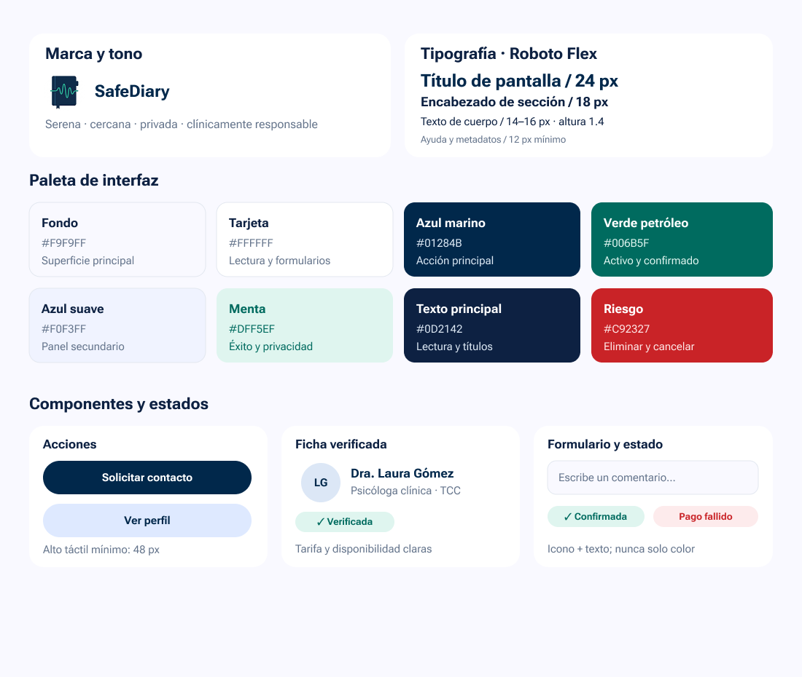

##### Branding

- **Nombre y propuesta de valor:** SafeDiary como puente seguro entre reflexión privada, hábitos de autocuidado y atención profesional.
- **Personalidad de marca:** serena, cercana, respetuosa de la privacidad y clínicamente responsable. Los mensajes invitan a decidir sin juzgar ni prometer resultados terapéuticos.
- **Identificador:** icono del diario azul marino con onda verde petróleo y palabra «SafeDiary». En la aplicación se coloca sobre una cabecera blanca, con una separación mínima de 8 px entre icono y texto. El icono conserva una altura mínima de 24 px para ser reconocible.
- **Uso correcto:** mantener proporciones, contraste y espacio libre alrededor del identificador; usar la versión completa en encabezados y el icono solo en espacios pequeños. Evitar estirar el símbolo, ponerlo sobre fondos visualmente recargados o usarlo como indicador de verificación profesional.


##### Typography

La interfaz móvil usa **Roboto Flex**. La jerarquía combina títulos compactos, cuerpo legible y etiquetas breves; las cifras de tarifas, horarios y temporizadores usan un peso mayor para facilitar la lectura rápida.

| Uso | Familia | Peso | Tamaño / interlineado | Ejemplo |
| --- | --- | ---: | --- | --- |
| Título de pantalla | Roboto Flex | 700 | 24 / 30 px | «Mis citas» |
| Encabezado de sección | Roboto Flex | 700 | 18 / 24 px | «Valoraciones» |
| Título de tarjeta | Roboto Flex | 600 | 15 / 21 px | «Dra. Laura Gómez» |
| Texto de cuerpo | Roboto Flex | 400 | 14 / 20 px | «Tu horario está reservado» |
| Botón y control | Roboto Flex | 600 | 14 / 20 px | «Confirmar horario» |
| Etiqueta y ayuda | Roboto Flex | 400–600 | 12 / 16 px | «Reserva temporal» |

Se permite ampliar el texto hasta 200 % sin ocultar acciones ni cifras. Las etiquetas pequeñas de los wireflows se normalizan a un mínimo de 12 px en las pantallas finales.

##### Colors

| Token | Valor | Uso | Contraste del par indicado |
| --- | --- | --- | --- |
| `color.background` | `#F9F9FF` | Fondo lavanda muy claro de páginas móviles | Con `color.text`: **15.25:1** (AAA) |
| `color.surface` | `#FFFFFF` | Tarjetas, formularios y cabeceras | Con `color.text`: **15.99:1** (AAA) |
| `color.surface.soft` | `#F0F3FF` | Paneles secundarios y disponibilidad | Con `color.text`: **14.44:1** (AAA) |
| `color.primary` | `#01284B` | Botones principales, títulos y estados de sesión | Con blanco: **14.93:1** (AAA) |
| `color.accent` | `#006B5F` | Selección, navegación activa, progreso y verificación | Con blanco: **6.43:1** (AA) |
| `color.accent.soft` | `#DFF5EF` | Confirmaciones, privacidad y badges positivos | Con `color.accent`: **5.64:1** (AA) |
| `color.text` | `#0D2142` | Texto principal | Sobre fondo: **15.25:1** (AAA) |
| `color.text.muted` | `#64748B` | Ayudas y metadatos | Sobre fondo: **4.54:1** (AA) |
| `color.border` | `#E3E8F0` | Límites de tarjetas y campos | Decorativo; no usar como texto |
| `color.danger` | `#C92327` | Eliminar, cancelar y errores que requieren atención | Sobre blanco: **5.60:1** (AA) |
| `color.focus` | `#5366D6` | Contorno de foco visible | Sobre fondo: **4.72:1** |
| `color.video` | `#0B192A` | Fondo de la videollamada privada | Con blanco: **17.70:1** (AAA) |

Los ratios se calcularon para los pares indicados. El verde de las flechas y el naranja de las rutas alternas pertenecen a la **anotación de los wireflows**; dentro de la aplicación los estados siempre incluyen texto e icono, además de color.

##### Spacing, grid and components

- **Grid móvil:** una columna flexible sobre una referencia de 393 × 852 px, márgenes laterales de 16 px y contenido que respeta las áreas seguras del dispositivo. Las tarjetas principales ocupan el ancho disponible.
- **Escala de espaciado:** base de 4 px; usar 8 px entre icono y texto, 12 px entre elementos relacionados, 16 px dentro de tarjetas y 24–32 px entre secciones.
- **Forma:** tarjetas con radio de 16–20 px, campos con 12–14 px y botones o chips tipo píldora con radio completo. Borde de 1 px `color.border` y elevación suave (`0 4px 16px` con azul marino al 8 %) solo para distinguir capas.
- **Botones:** acción principal de altura mínima 48 px en azul marino con texto blanco; acción secundaria en azul suave con texto marino. Las acciones destructivas usan `color.danger`, explicación de la consecuencia y confirmación. Un botón deshabilitado mantiene su etiqueta y comunica por qué no está disponible.
- **Tarjetas de especialistas:** avatar, nombre, credencial verificada, especialidad, calificación, disponibilidad y tarifa agrupados de forma estable. «Solicitar contacto» indica que inicia una conversación; una cita se muestra «Confirmada» solo después del pago aprobado.
- **Campos y selección:** etiqueta visible, ayuda breve, borde neutro y foco `color.focus`. Las opciones elegidas combinan borde o relleno, icono y texto. Las estrellas de calificación muestran visual y verbalmente la puntuación seleccionada.
- **Navegación por rol:** el paciente usa cinco destinos —Diario, Rutinas, Inicio, Psicólogos y Agenda—; el profesional usa Agenda, Pacientes y Pagos. La sección activa combina icono, etiqueta y verde petróleo. La barra inferior conserva una altura aproximada de 72 px.
- **Estados:** diseñar default, pressed, focus, selected, disabled, loading, success, error, offline y vacío. Las reservas temporales muestran un contador; los fallos de pago muestran la acción para reintentar y el estado real de la cita. La videollamada usa `color.video` y una acción de colgar claramente destructiva.

Los controles táctiles ofrecen una zona de al menos **48 × 48 px**. Los textos normales mantienen un contraste mínimo de 4.5:1; los iconos y contornos relevantes, 3:1. Las pantallas admiten lector de pantalla, navegación por foco y reducción de movimiento.

##### Voice and tone

SafeDiary utiliza microcopy claro, cálido y no diagnóstico. La interfaz dirigida a pacientes de Perú usa español, fechas legibles, hora de 24 horas y precios en soles (`S/ 120.00`). Evita culpar al usuario por un error: «No se completó el pago. Puedes reintentar» informa el estado y ofrece una salida.

La privacidad aparece junto a la decisión: «Tu diario sigue privado» antes de compartir, «Solo los participantes pueden ingresar» antes de la videollamada y «Tu reseña se muestra de forma anónima» antes de publicar. Las confirmaciones nombran el resultado real: «Horario reservado» durante la retención y «Cita confirmada» tras el pago aprobado. SafeDiary no promete monitoreo permanente ni reemplazo de terapia. Ante una señal de crisis, ofrece recursos humanos y de emergencia locales sin ejecutar contactos automáticos.

### 3.1.2. Information Architecture

La arquitectura de información organiza SafeDiary según las tareas de María (paciente) y la Dra. Laura Gómez (psicóloga), identificadas en la sección 2.3.2. Separa el espacio personal del paciente, la atención profesional y el contenido público de la landing page. Los seis wireflows de la sección 3.1.4.2 muestran cómo se pasa de una sección a otra; las pantallas de consentimiento, pago, videollamada y reseñas son pasos contextuales de esos recorridos, no destinos principales adicionales.

#### 3.1.2.1. Organization Systems

La información se agrupa por **tarea y rol**. La navegación persistente contiene las áreas de uso frecuente; los pasos que dependen de una cita o de una reseña aparecen dentro de su contexto. La cuenta y la privacidad se abren desde el avatar, para que no compitan con las cinco tareas principales del paciente.

| Espacio | Organización del contenido | Acceso |
|---|---|---|
| Sitio público | Propuesta de valor, funcionamiento, atención profesional, planes, privacidad y acceso a la aplicación | Visitantes; sin datos de pacientes ni citas |
| Paciente | Inicio, Diario, Rutinas, Psicólogos y Agenda; Perfil y privacidad desde el avatar | Cuenta de paciente autenticada |
| Psicólogo | Agenda clínica, Pacientes y solicitudes, Pagos; Perfil profesional y verificación desde el avatar | Cuenta profesional; la ficha pública se habilita tras la verificación |
| Verificación | Solicitudes de credenciales y decisión de revisión | Personal autorizado; fuera de la navegación de pacientes y psicólogos |

**Mapa jerárquico de la aplicación:**

```text
SafeDiary
├─ Acceso y cuenta
│  ├─ Crear cuenta / Iniciar sesión / Recuperar acceso
│  └─ Perfil y privacidad → Datos personales / Plan / Permisos de acceso
├─ Paciente
│  ├─ Inicio → Registro rápido del ánimo / Próxima cita / Accesos a tareas
│  ├─ Diario → Nueva entrada (texto o voz) / Historial / Diarito / Resúmenes
│  │             └─ Compartir contexto → Elegir datos → Confirmar o revocar consentimiento
│  ├─ Rutinas → Actividades / Recordatorios / Ejercicios breves
│  ├─ Psicólogos → Buscar y filtrar → Ficha verificada → Valoraciones y reseñas
│  │                 ├─ Solicitar contacto → Chat de coordinación → Propuesta de horario
│  │                 └─ Reseña → Marcar útil / Denunciar / Eliminar si es propia
│  └─ Agenda → Solicitudes / Reservas temporales / Citas confirmadas / Historial
│               ├─ Reserva temporal → Pago → Confirmación → Consentimiento opcional
│               └─ Cita confirmada → Sala de espera → Videollamada → Sesión completada
│                                      └─ Calificar sesión → Reseña publicada
└─ Psicólogo
   ├─ Agenda clínica → Disponibilidad / Citas / Sala de espera / Cierre de sesión
   ├─ Pacientes y solicitudes → Solicitud / Chat / Proponer horario
   │                            └─ Contexto emocional autorizado, si existe permiso
   ├─ Pagos → Ingresos / Comisiones / Método de retiro / Solicitar retiro
   └─ Perfil profesional → Verificación / Ficha pública / Especialidades / Tarifa
```

Una ficha, reseña o disponibilidad se muestra solo si el profesional está verificado y su ficha sigue publicada (US-002, US-054). El diario, los resúmenes y el chat son espacios privados. El psicólogo solo ve el contexto emocional que el paciente autorizó de forma explícita y vigente (US-009, US-045 y US-046). El pago de una sesión y la suscripción Premium pertenecen a recorridos distintos (US-037 y US-051).

#### 3.1.2.2. Labelling Systems

Los rótulos son verbos concretos para las acciones y sustantivos conocidos para los destinos. Se usa **Agenda** en la barra inferior del paciente y **Mis citas** como título de la vista; la barra del profesional distingue **Agenda clínica** de **Pacientes y solicitudes**. El mismo estado conserva el mismo nombre en tarjetas, avisos y detalle.

| Rótulo visible | Significado y ubicación | Regla de uso |
|---|---|---|
| Inicio | Resumen y accesos rápidos del paciente | No mostrar aquí contenido emocional compartido con terceros |
| Diario | Entradas privadas de texto o voz, historial y acceso a Diarito | Evitar «historial clínico» o «diagnóstico» |
| Diarito | Conversación de reflexión asistida | Presentarlo como apoyo, no como terapeuta |
| Rutinas | Actividades y recordatorios de autocuidado | Distinguir una rutina de una cita clínica |
| Psicólogos | Directorio de profesionales con ficha verificada | No prometer resultados terapéuticos |
| Ficha profesional | Credenciales, enfoque, tarifa, disponibilidad y reseñas | Mostrar el estado de verificación junto a la identidad |
| Solicitar contacto | Inicia la coordinación por chat | No llamarlo «Reservar» antes de acordar un horario |
| Agenda / Mis citas | Solicitudes, reservas temporales, citas y sesiones anteriores | Usar «Agenda clínica» para la vista profesional |
| Reserva temporal | Horario retenido mientras se completa el pago | Mostrar vencimiento y aclarar que aún no es una cita confirmada |
| Cita confirmada | Horario aceptado con pago aprobado | Habilita el acceso a la sesión dentro de su ventana de entrada |
| Compartir contexto | Selección opcional y revocable de datos del diario | Indicar destinatario, contenido y duración antes de confirmar |
| Calificar sesión | Valoración posterior a una sesión completada | La reseña se publica de forma anónima; una por cita |
| Me gusta / Denunciar / Eliminar reseña | Acciones sobre una reseña publicada | «Eliminar» solo para la autora; «Denunciar» no la retira automáticamente |
| Pagos e ingresos | Balance y retiros del profesional | Diferenciar ingreso por sesión de pago de suscripción |

Las etiquetas de estado usan «Pendiente», «Reserva temporal», «Cita confirmada», «Sesión completada», «Pago fallido» y «Cancelada» según el evento real. Color e icono acompañan el texto; no son la única forma de comunicar el estado.

#### 3.1.2.3. SEO Tags and Meta Tags

Esta sección sigue la organización por página pública del [informe de CcaritaTech](https://github.com/CcaritaTech/Report/blob/develop/README.md#3123-seo-tags-and-meta-tags), adaptada a las rutas que existen en la landing de SafeDiary. El SEO web describe la propuesta de valor sin exponer contenido emocional de pacientes. La aplicación móvil, el diario, Diarito, las citas y el chat no son páginas públicas para indexar.

**1. Inicio (`index.html`).** Presenta el registro emocional, las rutinas, el control de privacidad y el acceso a profesionales. El documento declara `lang="es"`; su `<head>` actual incluye codificación UTF-8, vista adaptable, título, descripción, color del navegador e icono de marca:

```html
<meta charset="UTF-8">
<meta name="viewport" content="width=device-width, initial-scale=1.0">
<title>SafeDiary — Diario emocional y atención profesional</title>
<meta name="description" content="Registra emociones, explora tus cambios y conoce psicólogos verificados. En SafeDiary tú decides qué información compartir.">
<meta name="theme-color" content="#01284B">
<link rel="icon" type="image/jpeg" href="assets/images/safediary-logo.jpeg">
```

El H1 visible, «Entiende cómo te sientes. Decide qué hacer después.», comunica la misma propuesta que el título y la descripción. Los términos **diario emocional**, **rutinas**, **privacidad** y **psicólogos verificados** se incorporan en contenido y encabezados pertinentes. «Funciones» (`#respirar`), «Privacidad» (`#privacidad`) y «Planes» (`#planes`) son secciones de esta página, no páginas HTML independientes; comparten sus metadatos.

**2. Términos y Condiciones (`pages/terms.html`).** Esta página informa sobre el uso del servicio y dispone de título y descripción propios:

```html
<meta charset="UTF-8">
<meta name="viewport" content="width=device-width, initial-scale=1.0">
<title>SafeDiary • Términos y Condiciones</title>
<meta name="description" content="Consulta las condiciones de uso de SafeDiary, tus derechos y las responsabilidades del servicio.">
<meta name="theme-color" content="#01284B">
<link rel="icon" type="image/jpeg" href="../assets/images/safediary-logo.jpeg">
```

Su H1 visible es «Términos y Condiciones de SafeDiary». El título y la descripción distinguen esta ruta legal de Inicio sin presentar condiciones de uso como beneficios clínicos.

Para cada página principal se definen **Title, Description, Keywords y Author**. Los dos primeros ya aparecen en los extractos anteriores. Los valores de `keywords` y `author` que se asignarán son:

| Página | `meta keywords` propuesto | `meta author` propuesto |
|---|---|---|
| Inicio (`index.html`) | `diario emocional, autocuidado, rutinas de bienestar, psicólogos verificados, SafeDiary` | `MindCluster` |
| Términos (`pages/terms.html`) | `SafeDiary, términos y condiciones, condiciones de uso, privacidad` | `MindCluster` |

Estos dos metadatos son una **propuesta documental** y todavía no aparecen en el HTML. La elección de términos también debe reflejarse en el contenido visible, sin tratar la etiqueta `keywords` como garantía de posicionamiento. No se documentan metadatos para una Web Application independiente porque el producto contemplado aquí es una aplicación móvil y la landing solo contiene las dos rutas HTML anteriores.

Para la publicación futura de la app móvil, se proponen los siguientes elementos **ASO (App Store Optimization)**. Son textos para la ficha de la tienda, no etiquetas `<meta>` de la landing:

| Elemento ASO | Valor propuesto |
|---|---|
| App Title | `SafeDiary` |
| App keywords | `diario emocional, bienestar, autocuidado, rutinas, psicólogos, citas` |
| App subtitle | `Diario emocional y autocuidado` |
| App description | `Registra cómo te sientes en un diario personal, organiza rutinas de autocuidado y conoce psicólogos verificados. Si decides buscar atención profesional, revisa perfiles y coordina una cita. Tú eliges qué información compartir.` |

La ficha final se ajustará a los límites de texto y políticas de la tienda elegida. No debe prometer diagnóstico, atención de emergencia ni acceso del profesional al diario sin consentimiento.

| Elemento | Estado en la landing | Criterio de evolución |
|---|---|---|
| `<title>` y `meta description` | Implementados con texto distinto en las dos páginas | Mantenerlos fieles al contenido visible y revisarlos cuando cambie la propuesta o el texto legal. |
| Idioma, UTF-8 y `viewport` | Implementados en ambas páginas | Mantener `lang="es"` y una lectura adaptable en móvil. |
| URL canónica (`rel="canonical"`) | Pendiente | Añadir una URL absoluta distinta por página cuando se defina el dominio público definitivo. |
| Open Graph y Twitter Card | Pendientes | Usar título, descripción, URL e imagen de marca públicos por página; excluir datos de usuarios, reseñas individuales y capturas con información personal. |
| `meta keywords` y `meta author` | Valores propuestos arriba; aún no implementados | Incorporarlos al HTML cuando se cierre la implementación web, conservando los valores documentados por página. |
| Rutas privadas | Fuera de la landing pública | Si se crean páginas web de cuenta, impedir su indexación y protegerlas mediante autenticación y controles de acceso. |

Una futura vista web pública de atención profesional necesitaría contenido, URL, H1, título y descripción propios. Su metadato no debe anunciar una página que aún no existe. Las imágenes informativas del sitio deben conservar textos alternativos acordes con su función; los mockups de la aplicación se muestran como ejemplos del producto, sin datos privados.

#### 3.1.2.4. Searching Systems

El sistema especifica **cómo se encuentran los datos, qué filtros se ofrecen y cómo se presentan los resultados**. SafeDiary combina localización por secciones en el sitio público con búsqueda y filtros dentro de los espacios privados de la aplicación. No se propone una búsqueda global que mezcle información pública con datos personales.

| Espacio y opción de localización | Entrada y filtros | Presentación después de buscar o filtrar |
|---|---|---|
| Landing pública | Menú por secciones y preguntas frecuentes desplegables; no hay búsqueda de texto libre. | Desplazamiento a la sección elegida o respuesta abierta dentro de Preguntas. «Ver la app» muestra el carrusel de mockups. |
| Directorio de Psicólogos (US-002) | Nombre o especialidad; filtros por especialidad, disponibilidad y rango de tarifa. Verificación aprobada y ficha publicada son condiciones obligatorias. | Tarjetas con nombre, especialidad, distintivo de verificación, valoración, próxima disponibilidad y tarifa; cada tarjeta abre la ficha detallada. |
| Historial del Diario (US-008) | Consulta de entradas propias en orden cronológico; filtros propuestos por rango de fechas, emoción predominante y etiquetas, según el modelo de Diary del Capítulo II. | Lista privada con fecha, emoción o etiquetas, fragmento de texto o indicador de audio; la entrada completa se abre por separado. Las entradas de la bóveda no aparecen en el historial ordinario. |
| Mis citas (Wireflow 3) | Pestañas **Próximas**, **Pendientes** e **Historial** para acotar por estado; no se requiere texto libre. | Tarjetas con profesional, fecha, hora, estado y acción pertinente, como «Ver detalle», pagar una reserva vigente o ingresar a una cita confirmada dentro de su ventana de acceso. |

En la landing y en Mis citas, el menú, el acordeón y las pestañas ayudan a **localizar** contenido; no se presentan como motores de búsqueda textual. Los filtros del Diario describen la propuesta móvil sustentada en el modelo de datos y consultas del Capítulo II, no una función de la landing.

**Aplicación móvil.** El sistema de búsqueda definido para el paciente es el directorio de **Psicólogos** (US-002; Wireflow 2). La entrada acepta nombre o especialidad y los filtros ayudan a acotar las fichas antes de abrir un perfil. La interfaz muestra qué filtros están activos y permite volver desde la ficha sin perder la consulta.

| Control o dato | Función en la búsqueda | Regla de origen |
|---|---|---|
| Nombre y especialidad | Encontrar profesionales acordes con la necesidad expresada | Clinician Directory consulta las fichas publicadas. |
| Disponibilidad | Acotar por horario ofrecido | Care Scheduling aporta los horarios; abrir una tarjeta no los reserva. |
| Rango de tarifa | Comparar costos antes de solicitar contacto | Filtrar con la tarifa vigente de cada ficha profesional. |
| Verificación | Excluir fichas no elegibles | Solo aparecen profesionales con verificación aprobada y ficha publicada (US-054). No es un filtro que el paciente pueda desactivar. |
| Valoraciones y reseñas | Ayudar a evaluar una ficha abierta | Se muestran puntuaciones y reseñas vigentes; el texto de las reseñas no es un campo de búsqueda. |

| Estado del directorio | Respuesta de la interfaz |
|---|---|
| Inicio | Mostrar profesionales elegibles y permitir abrir una ficha sin escribir una consulta. |
| Consulta o filtros activos | Mantener texto y selección al entrar en una ficha y volver; ofrecer limpiar un filtro o todos. |
| Sin coincidencias | Explicar que no hay resultados y ofrecer modificar la consulta o limpiar filtros. |
| Profesional sin horario | Informar que no hay disponibilidad y no presentar una franja como reservable. |
| Carga o error de red | Indicar que no se pudo completar la búsqueda y permitir reintentar sin borrar la consulta. |
| Ficha retirada o verificación perdida | Retirar el resultado o impedir el contacto y regresar al directorio. |

La ficha reúne credenciales, enfoque, tarifa, disponibilidad y valoraciones antes de «Solicitar contacto». Esa acción inicia la coordinación por chat; la cita solo se confirma tras acordar un horario y aprobar el pago. El directorio no busca en el diario, las conversaciones, los motivos de consulta ni la identidad de quien escribió una reseña. El filtro «seguro aceptado» queda fuera de esta versión porque las historias y los wireflows no definen convenios ni reglas de cobertura.

Si el historial del Diario o una pestaña de Mis citas no contiene elementos, la vista muestra un estado vacío específico y una salida útil: cambiar filtros, registrar una entrada o volver a la lista de citas. Los resultados privados se consultan solo con la cuenta autorizada; la búsqueda pública nunca revela entradas, conversaciones ni citas.

#### 3.1.2.5. Navigation Systems

**Landing page.** El encabezado compartido agrupa la marca, los enlaces a secciones, el selector ES/EN y el botón «Ver la app». En pantallas estrechas, los enlaces aparecen en un menú desplegable. El sitio usa anclas dentro de `index.html`; la ruta `pages/terms.html` reutiliza el encabezado y devuelve esos enlaces a la sección correspondiente de Inicio. El pie lleva a Términos y Condiciones. La navegación del sitio no comparte destinos con la barra inferior de la aplicación.

| Enlace visible | Destino real | Propósito |
|---|---|---|
| Marca SafeDiary / Inicio | `index.html` / `#espacio` | Volver al comienzo de la landing. |
| La app / Ver la app | `#app` | Mostrar el carrusel de cinco pantallas de ejemplo; no abre el inicio de sesión. |
| Funciones | `#respirar` | Explicar diario, reflexión, rutinas y atención. |
| Privacidad | `#privacidad` | Explicar el control de los datos compartidos. |
| Planes | `#planes` | Comparar las opciones presentadas en la landing. |
| Equipo | `#equipo` | Presentar a MindCluster. |
| Preguntas | `#faq` | Consultar respuestas en el acordeón. |
| Términos y Condiciones | `pages/terms.html` | Leer la página legal y volver a Inicio desde su enlace de retorno. |

La sección activa se diferencia visualmente en el menú de escritorio; el menú móvil se cierra al elegir un destino. El selector de idioma cambia los rótulos sin cambiar la estructura de secciones. Los enlaces y botones conservan nombres textuales reconocibles además de iconos.

El visitante puede recorrer **Inicio → Funciones → Privacidad → La app → Planes → Preguntas → Términos**, o saltar directamente a cualquier sección desde el encabezado. El carrusel permite avanzar o retroceder entre mockups; el acordeón de Preguntas muestra una respuesta sin abandonar la página. Estos son mecanismos de exploración del contenido, no pasos obligatorios ni un proceso de contratación.

**Aplicación móvil.** El paciente tiene cinco destinos persistentes, en el orden **Diario, Rutinas, Inicio, Psicólogos y Agenda**. Cada uno usa icono y etiqueta; el activo se señala visualmente. Perfil y notificaciones se abren desde la cabecera. Las pantallas de pago, consentimiento, videollamada y calificación se abren desde su cita o ficha correspondiente; no agregan opciones a la barra inferior. Los wireflows del profesional organizan sus tareas en **Agenda clínica**, **Pacientes y solicitudes** y **Pagos e ingresos**, con perfil y verificación como accesos de cuenta.

| Técnica de navegación | Aplicación en SafeDiary | Señal para orientarse o continuar |
|---|---|---|
| Global | Encabezado de la landing y barra inferior por rol en la app. | Etiqueta e icono en el destino; sección o pestaña activa visible. |
| Contextual | Tarjetas, fichas, reseñas, próximas citas y controles del carrusel. | Acciones nombradas según el objeto: «Solicitar contacto», «Ver detalle», «Calificar sesión». |
| Secuencial | Coordinación de horario, reserva temporal, pago, consentimiento opcional y acceso a la sesión. | Cada pantalla comunica el estado real y la siguiente acción; el pago aprobado precede a «Cita confirmada». |
| Retorno y recuperación | Volver a una ficha, al directorio, a Mis citas o al paso anterior tras cancelar o encontrar un error. | Se conserva la selección válida y se muestra una salida concreta para reintentar o continuar. |

| Recorrido | Punto de entrada | Ruta y salida |
|---|---|---|
| Reflexión personal (Wireflow 1) | Inicio | Registrar ánimo → Diario → Guardar entrada → Diarito → Historial; volver al Diario o a Inicio |
| Elección y reserva (Wireflow 2) | Psicólogos | Buscar → Ficha → Solicitar contacto → Chat → Aceptar propuesta → Reserva temporal → Pago → Cita confirmada; desde allí, compartir contexto es opcional |
| Asistir a la cita (Wireflow 3) | Agenda / Mis citas | Cita confirmada → Sala de espera → Videollamada → Sesión completada; la calificación se ofrece al finalizar |
| Coordinación profesional (Wireflow 4) | Pacientes y solicitudes | Solicitud → Chat → Proponer horario → Agenda clínica; el rechazo devuelve al paciente una salida hacia Psicólogos |
| Atención y cobro (Wireflow 5) | Agenda clínica | Cita confirmada → Videollamada → Cerrar sesión → Pagos e ingresos → Retiro opcional |
| Reseñas (Wireflow 6) | Sesión completada o ficha profesional | Calificar sesión → Reseña en ficha; desde cada reseña elegible: Me gusta, Denunciar o Eliminar si es propia |

Los pasos de pago, consentimiento y eliminación de reseña muestran el efecto de confirmar o cancelar antes de ejecutar la acción. Volver conserva borradores de diario y formulario, consulta y filtros del directorio, selección de consentimiento y el estado real de la reserva; nunca convierte una reserva temporal en cita confirmada sin pago aprobado. Al revocar un consentimiento, la ruta del profesional hacia los datos compartidos deja de estar disponible. Los errores de pago, horario vencido, acceso fuera de hora y conexión ofrecen un regreso concreto al paso anterior o a Mis citas, como muestran los wireflows 2 y 3.

### 3.1.3. Landing Page UI Design

#### 3.1.3.1. Landing Page Wireframe

**Objetivo:**  
El objetivo de la landing page es presentar de manera transparente, empática y atractiva la propuesta de valor de SafeDiary a los nuevos visitantes (principalmente pacientes jóvenes y personas interesadas en su bienestar emocional), cumpliendo los siguientes propósitos:
1. **Comprender el valor diferencial:** Explicar cómo SafeDiary actúa como un puente entre la introspección privada (diario asistido por IA y rutinas de autocuidado) y la atención clínica profesional con especialistas colegiados y verificados.
2. **Transmitir confianza y control de la privacidad:** Aclarando que el diario es privado por defecto y que compartir información con un psicólogo es una decisión 100% voluntaria, selectiva y revocable en cualquier momento.
3. **Claridad en la oferta y precios:** Presentar con total transparencia el modelo Freemium (Plan Básico Gratuito y suscripciones Premium Terra y Astrum), especificando explícitamente que los honorarios de las consultas con psicólogos se abonan por separado del acceso a la plataforma.
4. **Fomentar la conversión y adopción:** Guiar al visitante a través de llamados a la acción (CTA) directos para probar la aplicación móvil, explorar las funcionalidades clave a través del carrusel interactivo y consultar las políticas éticas y legales del servicio.

**Landing Page y T&C:**

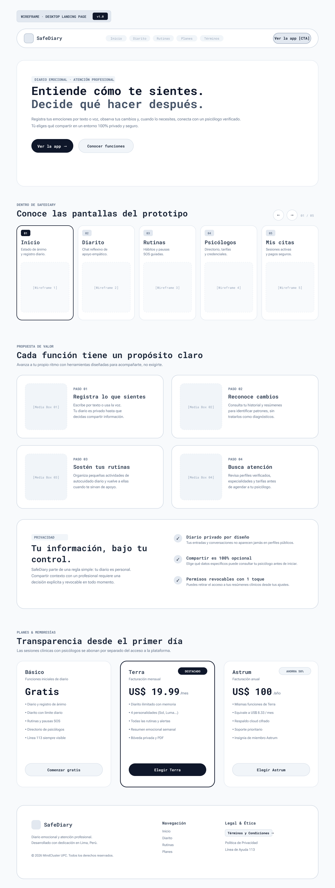

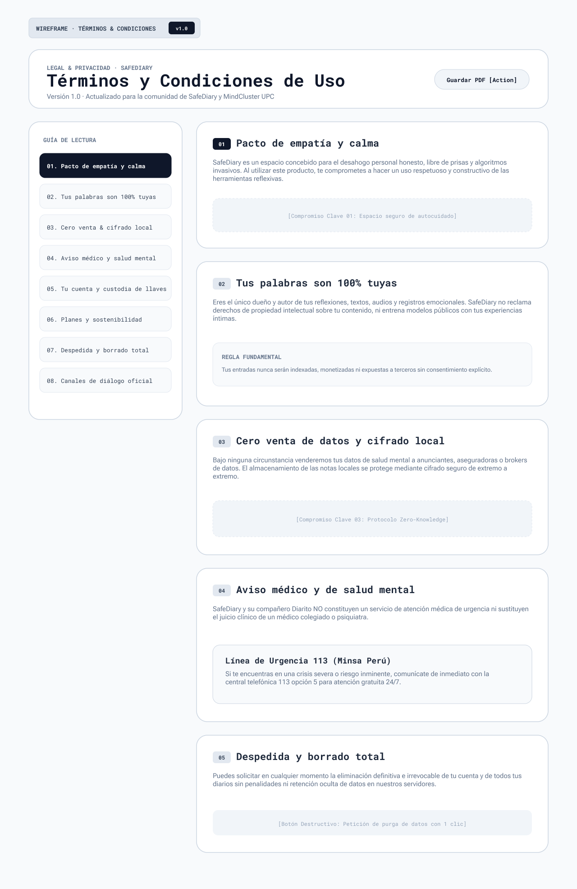

**Explicación del wireframe:**

1. **Header y Navegación Superior:**
   * **Identidad de marca:** Logotipo de SafeDiary situado en la esquina superior izquierda como ancla visual.
   * **Menú de navegación:** Enlaces de ancla directos a secciones clave (`Inicio`, `Diarito`, `Rutinas`, `Planes`, `Términos`).
   * **CTA primario en barra:** Botón `Ver la app [CTA]` persistente que facilita el acceso inmediato al prototipo o descarga sin forzar al usuario a desplazarse hasta el final de la página.

2. **Hero Section (Propuesta de Valor Principal):**
   * **Etiqueta temática superior:** `DIARIO EMOCIONAL · ATENCIÓN PROFESIONAL`, sintetizando el núcleo del producto.
   * **Titular de impacto (H1):** *"Entiende cómo te sientes. Decide qué hacer después."*, enfatizando la autonomía del paciente frente a su salud mental.
   * **Subtítulo descriptivo:** Resalta la facilidad de registro por texto o voz, la identificación de patrones y la opción de conectar con psicólogos verificados en un espacio seguro.
   * **Doble llamado a la acción (CTA):** Botón principal contrastado (*"Ver la app →"*) y botón secundario de exploración (*"Conocer funciones"*).

3. **Showcase del Prototipo Móvil ("Conoce las pantallas del prototipo"):**
   * **Carrusel secuencial (01 a 05):** Muestra las vistas neurálgicas de la aplicación móvil para anticipar la experiencia real al visitante:
     * *01. Inicio:* Monitoreo cotidiano del estado de ánimo y accesos directos.
     * *02. Diarito:* Chat reflexivo asistido por IA para desahogo seguro y empático.
     * *03. Rutinas:* Biblioteca de hábitos y ejercicios SOS guiados.
     * *04. Psicólogos:* Catálogo de especialistas verificados con tarifas visibles.
     * *05. Mis citas:* Gestión de reservas, videollamadas y comprobantes de pago.
   * **Controles de desplazamiento:** Botones de navegación (`←` / `→`) con paginador para una visualización dinámica.

4. **Guía Funcional Paso a Paso ("Cada función tiene un propósito claro"):**
   * **Paso 01 (Registra lo que sientes):** Demuestra el desahogo por voz o texto manteniendo la privacidad absoluta.
   * **Paso 02 (Reconoce cambios):** Visualización de patrones e insights emocionales sin emitir etiquetas diagnósticas clínicas.
   * **Paso 03 (Sostén tus rutinas):** Hábitos breves y pausas de respiración para acompañar el día a día.
   * **Paso 04 (Busca atención):** Transición fluida para elegir y contactar al especialista adecuado.

5. **Bloque de Privacidad y Consentimiento ("Tu información, bajo tu control"):**
   * **Privacidad por diseño:** Declaración de que las entradas íntimas jamás formarán parte de perfiles públicos ni entrenarán modelos de IA comerciales.
   * **Consentimiento informado:** La opción de compartir contexto con el psicólogo es 100% opcional y controlada por el usuario.
   * **Revocación inmediata:** Capacidad de anular el acceso del psicólogo al resumen clínico con un solo toque desde los ajustes de la cuenta.

6. **Planes, Precios y Transparencia Financiera:**
   * **Aviso de transparencia:** Se informa con claridad que las sesiones clínicas individuales con especialistas se pagan por separado del uso de la app.
   * **Estructura de precios:**
     * *Plan Básico (Gratis):* Diario emocional, pausas SOS, directorio de especialistas y acceso a la línea de ayuda 113.
     * *Plan Terra (US$ 19.99/mes - Destacado):* Asistente Diarito ilimitado con memoria continua, 4 personalidades reflexivas, resúmenes semanales y bóveda privada con exportación a PDF.
     * *Plan Astrum (US$ 100/año - Ahorro del 58%):* Todos los beneficios de Terra con respaldo cloud cifrado prioritario y distinción de miembro.

7. **Wireframe de Términos y Condiciones de Uso (T&C):**
   * **Navegación e índice lateral:** Guía de lectura rápida con 8 cláusulas numeradas para facilitar la auditoría legal por parte del usuario.
   * **Compromisos de ética digital:**
     * *Pacto de empatía:* Entorno de desahogo libre de algoritmos invasivos.
     * *Propiedad intelectual:* Las notas y audios pertenecen al 100% al usuario; SafeDiary no comercializa ni reclama derechos sobre el contenido personal.
     * *Cero venta de datos:* Protocolo *Zero-Knowledge* y cifrado seguro de extremo a extremo.
     * *Aviso médico y salud mental:* Advertencia estricta de que la plataforma no sustituye la atención médica de urgencias ni diagnósticos psiquiátricos, enlazando directamente con la Línea 113 (Minsa Perú).
     * *Derecho al olvido:* Mecanismo de purga y eliminación definitiva de cuenta y registros en un solo clic.

8. **Comportamiento Adaptativo (Responsive Behavior):**
   * **Versión Desktop:** Disposición estructurada en cuadrícula de 3 a 4 columnas con navegación superior fija y amplias áreas de visualización de medios.
   * **Versión Mobile:** Colapso fluido a una sola columna vertical, menú hamburguesa táctil, botones de acción de ancho completo (*full-width*) y tipografía escalada para facilitar la lectura y pulsación táctil en teléfonos móviles.

#### 3.1.3.2. Landing Page Mock-up

Tras revisar el wireframe, se realizaron los mockups para las paginas que corresponden a Landing Page y Terminos y Condiciones, esto con el fin de afianzar el diseño de la interfaz del visitante para convencerlo de usar la plataforma.

**Landing Page y T&C:**

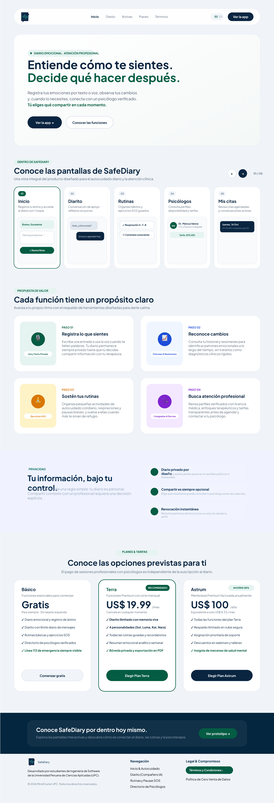

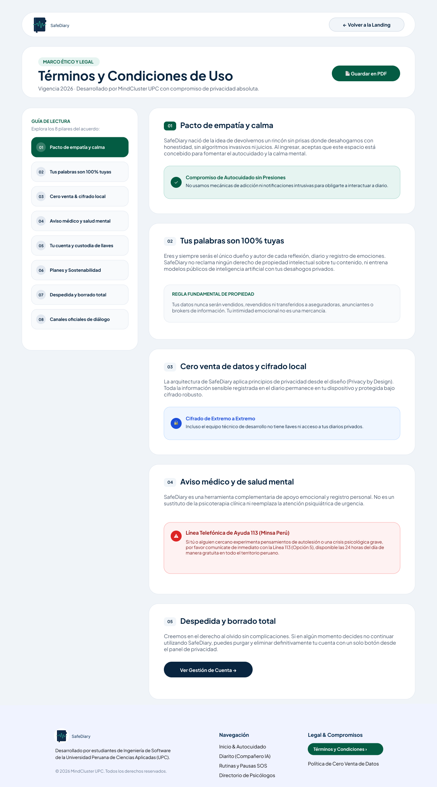

**Decisiones visuales y funcionales:**

**1. Aplicación del sistema de diseño y paleta cromática:**
   * **Color primario y autoridad de marca (`color.primary`):** Se emplea el azul marino profundo (`#01284B`) en la barra de navegación, botones de acción primordial (*«Ver la app»*, *«Elegir Plan Astrum»*), tarjetas de estado de sesión y el banner de cierre pre-footer. Este tono evoca estabilidad, confianza institucional y seguridad técnica en el tratamiento de datos sensibles.
   * **Color secundario y bienestar emocional (`color.secondary`):** Se incorpora el verde petróleo / verde esmeralda suave (`#0F766E` / `#044E42`) para elementos de éxito, badges temáticos (*«DIARIO EMOCIONAL»*, *«RECOMENDADO»*), micro-interacciones, botones de acción positiva (*«Ver prototipo →»*, *«Elegir Plan Terra»*) y el botón de descarga *«Guardar en PDF»* en los términos legales. Aporta calidez y serenidad sin caer en estéticas clínicas impersonales.
   * **Superficies y fondos limpios:** El fondo general utiliza un blanco puro con transiciones hacia un gris neutro muy suave (`#F8FAFC`). Las tarjetas y contenedores (`#FFFFFF`) delimitan sus capas mediante un borde tenue de 1 px (`#E3E8F0`) y sombras difusas (`0 4px 16px rgba(1, 40, 75, 0.08)`), otorgando tridimensionalidad sutil sin recargar visualmente.
   * **Acentos de apoyo temático y alertas:** Se asignan pasteles armónicos a las cuatro etapas de autocuidado (verde menta para registro libre, azul cielo para patrones, amarillo cálido para ejercicios SOS y lila tenue para especialistas). En la página legal, se utiliza el color de advertencia sobrio (`color.danger`) exclusivamente para resaltar la caja de emergencia de la Línea 113 del Minsa, preservando la jerarquía visual de riesgo.
   
**2. Tipografía y jerarquía de lectura:**
   * Se utiliza una fuente geométrica sans-serif moderna de alta legibilidad en pantalla (Inter / Plus Jakarta Sans).
   * **Encabezados (H1, H2):** Titulares en gran escala con peso semibold/bold, estructurados con saltos intencionales para guiar el ojo hacia la promesa central (*«Entiende cómo te sientes. Decide qué hacer después.»*).
   * **Eyebrows (Micro-etiquetas):** Etiquetas superiores en mayúsculas compactas con tracking ampliado (`DENTRO DE SAFEDIARY`, `PROPUESTA DE VALOR`, `PRIVACIDAD`, `PLANES & TARIFAS`, `MARCO ÉTICO Y LEGAL`) que anticipan el propósito de cada sección antes de la lectura del bloque principal.
   * **Precios destacados:** Tratamiento de números en escala display (`US$ 19.99`, `US$ 100`) acompañados de chips de beneficio psicológico (*«AHORRA 58%»*, *«RECOMENDADO»*).
   
**3. Materialización de componentes funcionales:**
   * **Barra de navegación fija:** Integra el logotipo con isotipo de pulso emocional, menú central con estados hover/active, selector de idioma interactivo (`ES | EN`) y botón de llamado a la acción destacado.
   * **Showcase móvil interactivo:** Representa de manera fidedigna la interfaz móvil que encontrará el usuario dentro de SafeDiary (chips de ánimo como *«Ánimo: Excelente»*, botón de registro rápido *«+ Nueva Nota»*, burbujas del chat de Diarito, tarjeta de ejercicio respiratorio *«Respiración 4-7-8»* y la ficha médica del Dr. Marcus Vance con tarifa visible de *$75 USD*).
   * **Módulo de Términos y Condiciones:** Diseñado con un panel lateral interactivo tipo índice (*Guía de Lectura*) con 8 cláusulas accesibles que marcan el estado activo, acompañado de tarjetas modulares que transforman el texto legal árido en compromisos legibles con sellos de verificación, candados de cifrado y accesos directos de gestión de cuenta.
   
**4. Estrategia de conversión y enlace con el registro/descarga:**
   * **Múltiples embudos de acceso (Funnels):** El visitante cuenta con oportunidades de conversión directas a lo largo de todo su recorrido visual:
     * *Arriba del pliegue (Above the fold):* Botón *«Ver la app →»* en el Hero y botón persistente en la barra de navegación para usuarios con alta intención de prueba.
     * *Exploración funcional:* Botón secundario *«Conocer las funciones»* que realiza un desplazamiento suave (*smooth scroll*) hacia el carrusel de pantallas y la explicación paso a paso.
     * *Planes de precios:* Botón *«Comenzar gratis»* en el Plan Básico para eliminación total de fricción (sin requerir tarjeta de crédito), y botones directos *«Elegir Plan Terra»* / *«Elegir Plan Astrum»* para adopción inmediata del servicio Premium.
     * *Cierre pre-footer:* Banner de ancho completo en azul marino con alto contraste que formula una invitación final (*«Conoce SafeDiary por dentro hoy mismo»*) hacia el botón *«Ver prototipo →»*, dirigiendo al prototipo navegable o tienda de aplicaciones.
   * **Reducción de barreras de adopción:** La inclusión visible del compromiso de *Cero venta de datos*, *Cancelación en cualquier momento* y *Transparencia en tarifas médicas* despeja las dudas del visitante, incentivando el registro seguro y sin presiones.


### 3.1.4. Mobile Applications UX/UI Design

#### 3.1.4.1. Mobile Applications Wireframes

Presentar wireframes de las pantallas de la vista del paciente y especialista:

1. Home.
2. Rutinas.
3. Diario.
4. Psicólogos.
5. Citas.

También incluir las vistas auxiliares imprescindibles: detalle de psicólogo, reserva, consentimiento, pago, videollamada y estados de error.

| Pantalla | Historias relacionadas | Estado cubierto | Evidencia |
|---|---|---|---|
| Home | [US-xxx] | [normal / vacío / offline] | [imagen] |
| Rutinas | US-007, US-024, US-030 | [normal / recordatorio fallido] | [imagen] |
| Diario | US-008, US-010, US-011 | [normal / transcripción fallida] | [imagen] |
| Psicólogos | US-002, US-009, US-014, US-037 | [sin resultados / horario ocupado / pago fallido] | [imagen] |
| Citas | US-014, US-037, US-038 | [reserva vencida / pago fallido] | [imagen] |


#### 3.1.4.2. Mobile Applications Wireflow Diagrams

Los Wireflows se elaboraron en Figma a partir de los wireframes de la sección 3.1.4.1. Cubren un recorrido por cada User goal prioritario de los dos User Persona: María (paciente) y la Dra. Laura Gómez (psicóloga verificada).

En cada diagrama:

- **Flecha y recuadro verdes:** la acción del usuario en la pantalla de origen (happy path).
- **Flechas naranjas:** rutas alternas y unhappy paths.
- **Paso nuevo:** cuando una interacción cambia el estado de una pantalla, el nuevo estado se representa como un paso adicional con su propio wireframe.

##### Wireflow 1: Registro emocional → reflexión → guardado

**User Persona:** María (paciente).
**User goal:** Registrar cómo me siento hoy y recibir una reflexión que me ayude a entenderlo.

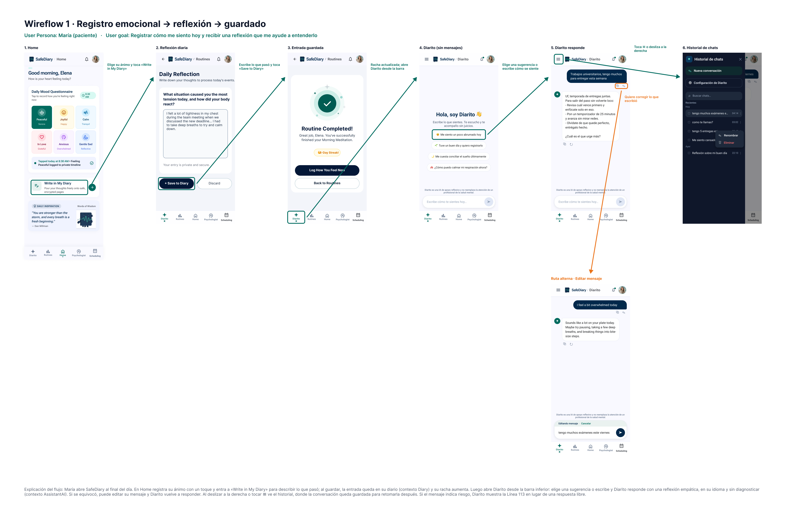

**Explicación del flujo:**

1. María abre SafeDiary al final del día. En Home registra su ánimo con un toque y entra a «Write in My Diary» para describir lo que pasó.
2. Al guardar, la entrada queda en su diario (Diary) y su racha aumenta.
3. Luego abre Diarito desde la barra inferior, elige una sugerencia o escribe, y Diarito responde con una reflexión empática, en su idioma y sin diagnosticar (AssistantAI).
4. Si se equivocó, puede editar su mensaje y Diarito vuelve a responder (ruta alterna).
5. Al deslizar a la derecha o tocar ☰ ve el historial, donde la conversación queda guardada para retomarla después.

Si el mensaje indica riesgo, Diarito muestra la Línea 113 en lugar de una respuesta libre.

##### Wireflow 2: Búsqueda de psicólogo → reserva → consentimiento → pago

**User Persona:** María (paciente).
**User goal:** Encontrar un psicólogo verificado que me inspire confianza, acordar un horario y pagar la sesión.

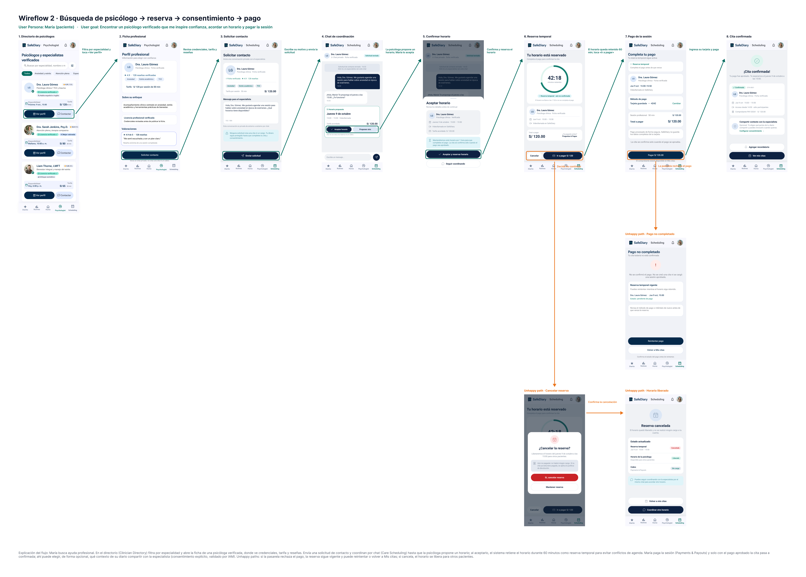

**Explicación del flujo:**

1. En el directorio (Clinician Directory), María filtra por especialidad y abre la ficha de una psicóloga verificada, con sus credenciales, tarifa y reseñas.
2. Envía una solicitud de contacto y coordinan por chat (Care Scheduling) hasta que la psicóloga propone un horario.
3. Al aceptarlo, el horario queda retenido durante 60 minutos como reserva temporal, lo que evita conflictos de agenda.
4. María paga la sesión (Payments & Payouts). Solo con el pago aprobado la cita pasa a confirmada.
5. En la cita confirmada puede elegir, de forma opcional, qué contexto de su diario compartir con la especialista. Es un consentimiento explícito que valida IAM.

**Unhappy paths:**

- Si la pasarela rechaza el pago, la reserva sigue vigente y María puede reintentar o volver a Mis citas.
- Si cancela la reserva, el horario se libera para otros pacientes.

##### Wireflow 3: Reserva temporal → pago → confirmación → acceso a la sesión

**User Persona:** María (paciente).
**User goal:** Asistir a mi sesión con la psicóloga de forma privada y a la hora acordada.

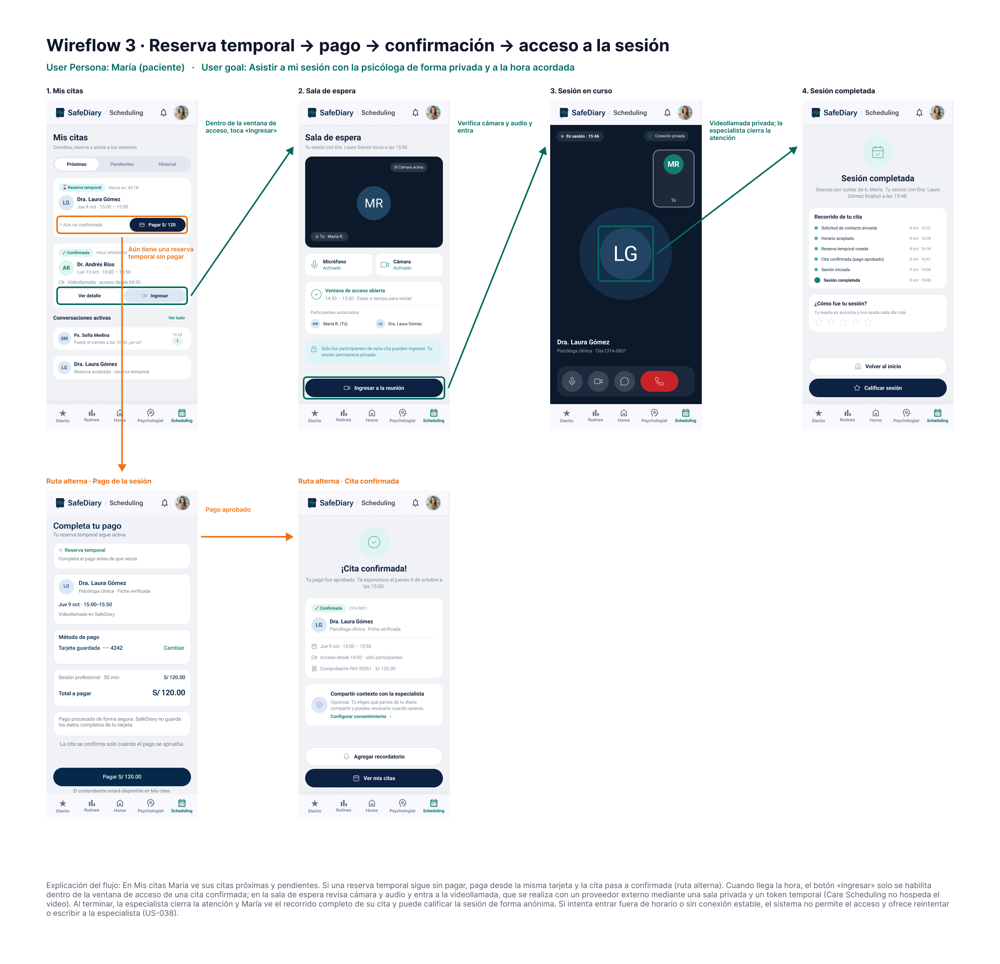

**Explicación del flujo:**

1. En Mis citas, María ve sus citas próximas y pendientes. Si una reserva temporal sigue sin pagar, la paga desde la misma tarjeta y la cita pasa a confirmada (ruta alterna).
2. A la hora de la cita, el botón «Ingresar» solo se habilita dentro de la ventana de acceso de una cita confirmada.
3. En la sala de espera revisa la cámara y el audio y entra a la videollamada. La videollamada usa un proveedor externo con una sala privada y un token temporal; Care Scheduling no hospeda el video.
4. Al terminar, la especialista cierra la atención. María ve el recorrido completo de su cita y puede calificar la sesión de forma anónima.

**Unhappy path:** si intenta entrar fuera de horario o sin conexión estable, el sistema no permite el acceso y ofrece reintentar o escribir a la especialista (US-038).

##### Wireflow 4: Solicitud de paciente → propuesta de horario → cita agendada

**User Persona:** Dra. Laura Gómez (psicóloga verificada).
**User goal:** Responder rápido a una nueva solicitud y acordar un horario sin conflictos en mi agenda.

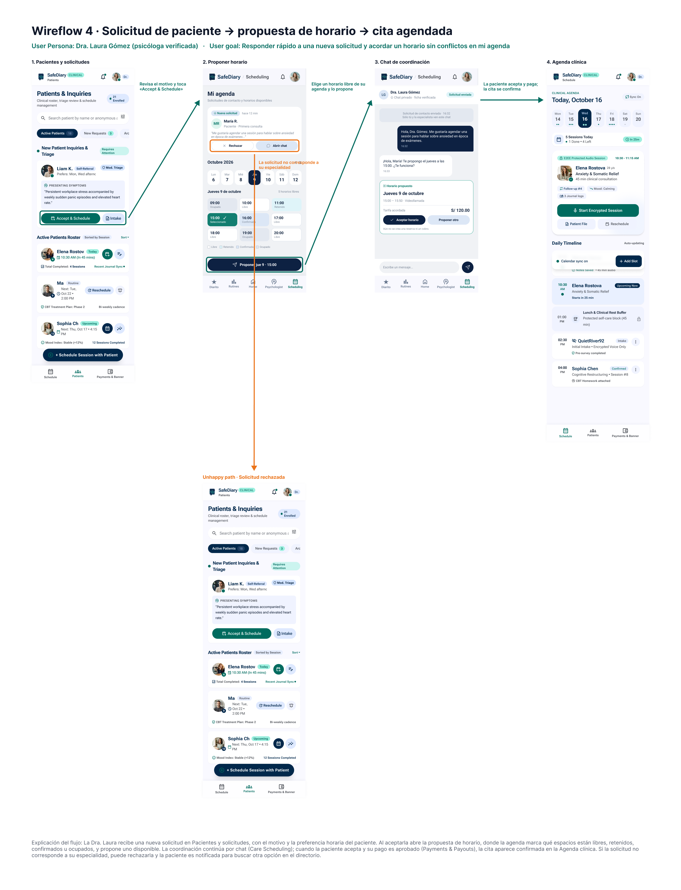

**Explicación del flujo:**

1. La Dra. Laura recibe una nueva solicitud en Pacientes y solicitudes, con el motivo y la preferencia horaria del paciente.
2. Al aceptarla abre la propuesta de horario. La agenda distingue los espacios libres, retenidos, confirmados y ocupados, y ella propone uno disponible.
3. La coordinación continúa por chat (Care Scheduling).
4. Cuando el paciente acepta y su pago es aprobado (Payments & Payouts), la cita aparece confirmada en la Agenda clínica.

**Unhappy path:** si la solicitud no corresponde a su especialidad, la rechaza y el paciente recibe la notificación para buscar otra opción en el directorio.

##### Wireflow 5: Atención de la sesión → cierre → ingreso registrado

**User Persona:** Dra. Laura Gómez (psicóloga verificada).
**User goal:** Atender a mi paciente de forma segura, registrar el cierre de la sesión y ver mi ingreso.

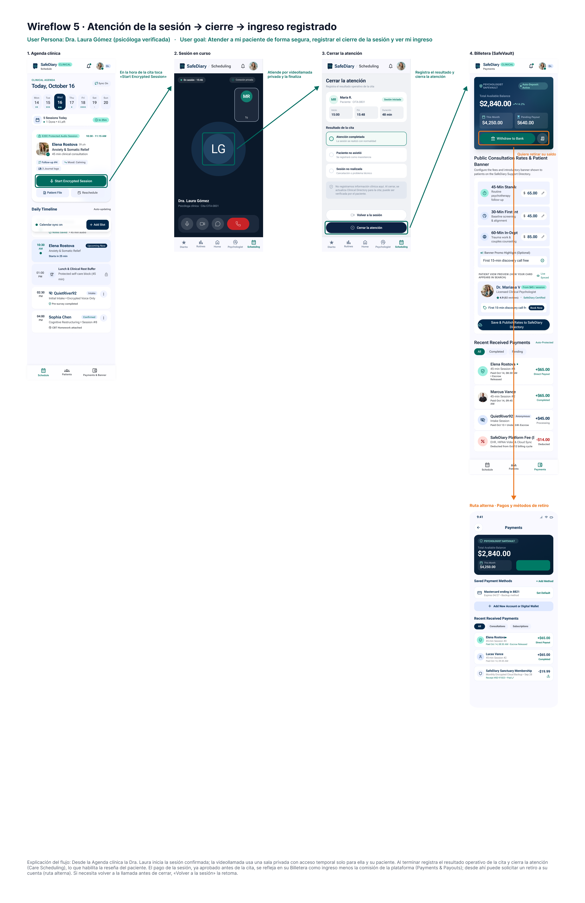

**Explicación del flujo:**

1. Desde la Agenda clínica, la Dra. Laura inicia la sesión confirmada. La videollamada usa una sala privada con acceso temporal solo para ella y su paciente.
2. Al terminar registra el resultado operativo de la cita y cierra la atención (Care Scheduling). El cierre habilita la reseña del paciente.
3. El pago de la sesión, aprobado antes de la cita, aparece en su Billetera como ingreso menos la comisión de la plataforma (Payments & Payouts).
4. Desde la Billetera puede solicitar un retiro a su cuenta (ruta alterna).

Si necesita volver a la llamada antes de cerrar, «Volver a la sesión» la retoma.

##### Wireflow 6: Calificación de la sesión y gestión de reseñas

**User Persona:** María (paciente).
**User goal:** Compartir su experiencia después de una sesión y ayudar a mantener reseñas confiables, conservando su privacidad.

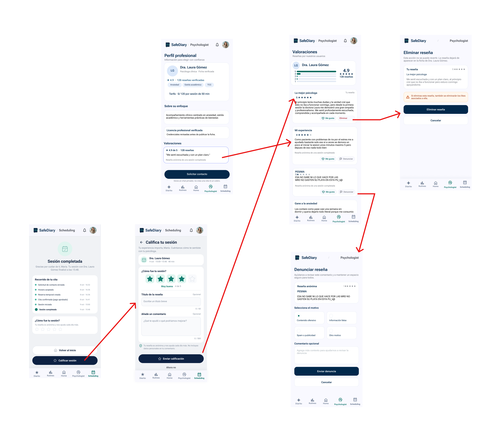

**Explicación del flujo:**

1. Al cerrar una sesión completada, María puede abrir «Califica tu sesión». Selecciona de una a cinco estrellas y puede añadir un título y un comentario opcionales (US-039).
2. Al enviar la calificación, Clinician Directory la vincula a la cita completada, muestra la reseña de forma anónima en el perfil profesional y actualiza el promedio y el número de reseñas.
3. Desde el perfil puede consultar la valoración agregada y las reseñas. Puede marcar una reseña ajena como útil; el contador no revela quién votó ni modifica el promedio o el puntaje de confianza (US-055).
4. Si encuentra contenido que podría incumplir las normas, puede denunciarlo con un motivo y contexto opcional. La denuncia queda pendiente de revisión y no elimina automáticamente la reseña (US-056).
5. La autora puede retirar su propia reseña después de confirmar que la acción es irreversible. Se quitan la puntuación, el comentario y los likes asociados; se recalculan los agregados afectados y la cita no vuelve a ser elegible para otra reseña (US-057).

**Unhappy paths:** solo se puede calificar una sesión completada y publicar una reseña por cita (US-039). Las reseñas ajenas no se pueden eliminar y los intentos duplicados de marcar utilidad o denunciar se rechazan.

#### 3.1.4.3. Mobile Applications Mock-ups

1. Home.
2. Rutinas.
3. Diario.
4. Psicólogos.
5. Citas.

> **Insertar aquí:** imagen legible de los Mobile Applications Mock-ups.

Explicar cada mock-up y relacionarlo con sus User Stories y criterios de aceptación.

6. Perfiles

Estas pantallas corresponden a los perfiles y datos que pueden configurar los usuarios de Safe Diary, tanto pacientes como psicólogos.

| Pantalla | Historias relacionadas |
|---|---|
| Perfil del paciente (Edición de datos) | US-006 |
| Suscripción y Plan Premium (Terra mensual o Astrum anual) (Paciente) | US-051 |
| Solicitud de verificación (Psicólogo) | US-041, US-054 |
| Ficha profesional y tarifas (Psicólogo) | US-036 |
| Balance e ingresos profesionales (Psicólogo) | US-047 |
| Registro de método de retiro (Psicólogo) | US-052 |
| Solicitud y seguimiento de retiro (Psicólogo) | US-053 |

**Pacientes:**

<table style="width:100%; border:none; border-collapse:collapse; text-align:center;">
  <tr>
    <td align="center" style="width:33.33%; vertical-align:top; border:none;">
      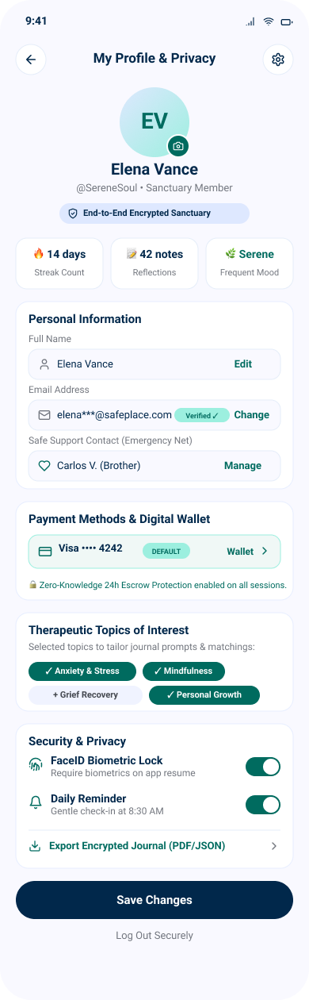<br>
      <sub><strong>Perfil y Privacidad</strong></sub>
    </td>
    <td align="center" style="width:33.33%; vertical-align:top; border:none;">
      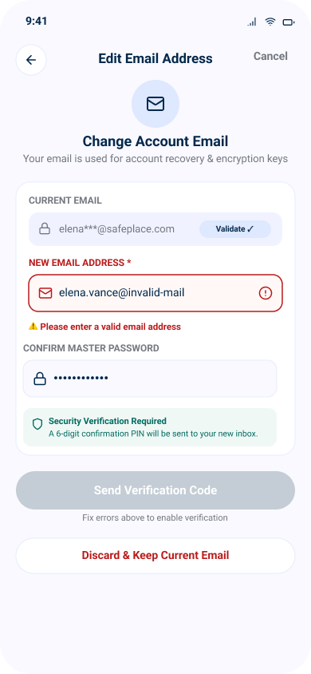<br>
      <sub><strong>Edición de Correo</strong></sub>
    </td>
    <td align="center" style="width:33.33%; vertical-align:top; border:none;">
      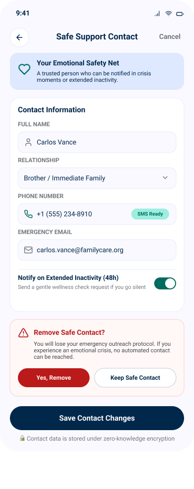<br>
      <sub><strong>Contacto de Soporte Seguro</strong></sub>
    </td>
  </tr>
</table>

**Psicólogos:**

<table style="width:100%; border:none; border-collapse:collapse; text-align:center;">
  <tr>
    <td align="center" style="width:33.33%; vertical-align:top; border:none;">
      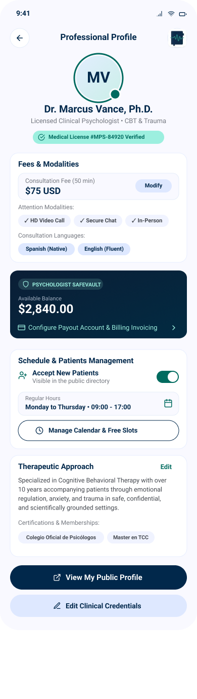<br>
      <sub><strong>Perfil Profesional</strong></sub>
    </td>
    <td align="center" style="width:33.33%; vertical-align:top; border:none;">
      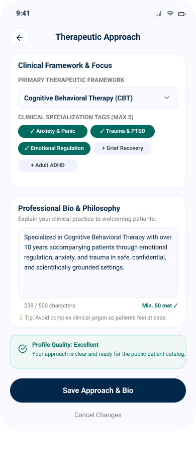<br>
      <sub><strong>Enfoque Terapéutico</strong></sub>
    </td>
    <td align="center" style="width:33.33%; vertical-align:top; border:none;">
      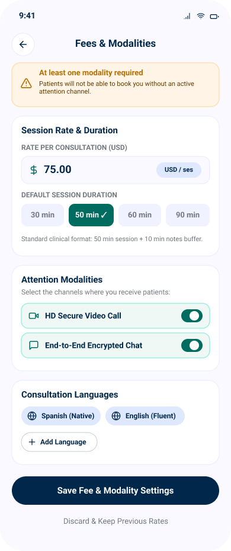<br>
      <sub><strong>Tarifas y Modalidades</strong></sub>
    </td>
  </tr>
  <tr>
    <td align="center" style="width:33.33%; vertical-align:top; border:none;">
      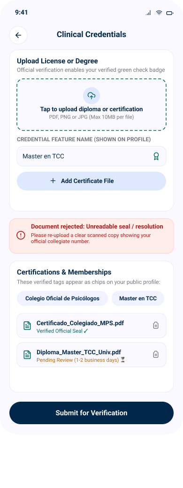<br>
      <sub><strong>Credenciales Clínicas</strong></sub>
    </td>
    <td style="width:33.33%; border:none;"></td>
    <td style="width:33.33%; border:none;"></td>
  </tr>
</table>

7. Payments

Estas pantallas refieren al procesamiento de pagos dentro de la plataforma, lo cuales incluyen a las suscripciones, historial de pagos en ambos segmentos, y los retiros en el segmento de los psicólogos. 

| Pantalla | Historias relacionadas |
|---|---|
| Pago seguro de sesión | US-037 |
| Billetera digital e historial de pagos | US-037, US-051 |
| Suscripción y Plan Premium (Terra mensual o Astrum anual) | US-051 |
| Balance e ingresos profesionales | US-047 |
| Registro de método de retiro | US-052 |
| Solicitud y seguimiento de retiro | US-053 |

**Pacientes:**

<table style="width:100%; border:none; border-collapse:collapse; text-align:center;">
  <tr>
    <td align="center" style="width:50%; vertical-align:top; border:none;">
      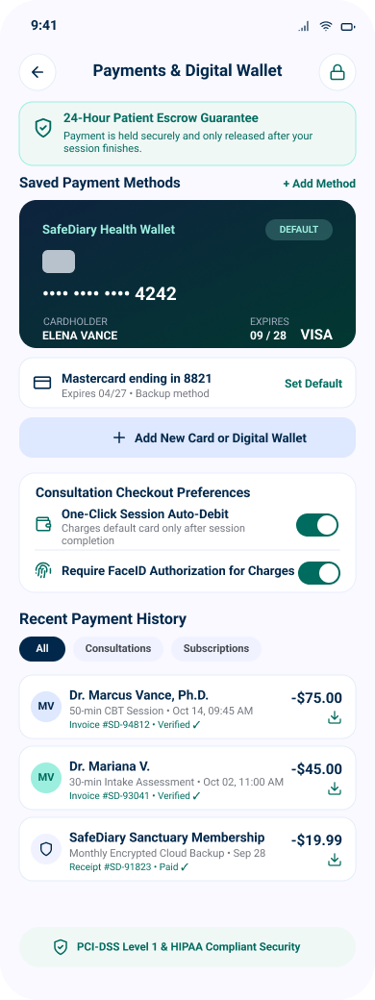<br>
      <sub><strong>Billetera Digital e Historial de Pagos</strong></sub>
    </td>
    <td align="center" style="width:50%; vertical-align:top; border:none;">
      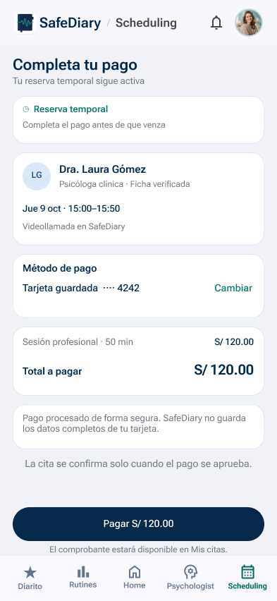<br>
      <sub><strong>Pago de Sesión Profesional</strong></sub>
    </td>
  </tr>
</table>

**Psicólogos:**

<table style="width:100%; border:none; border-collapse:collapse; text-align:center;">
  <tr>
    <td align="center" style="width:100%; vertical-align:top; border:none;">
      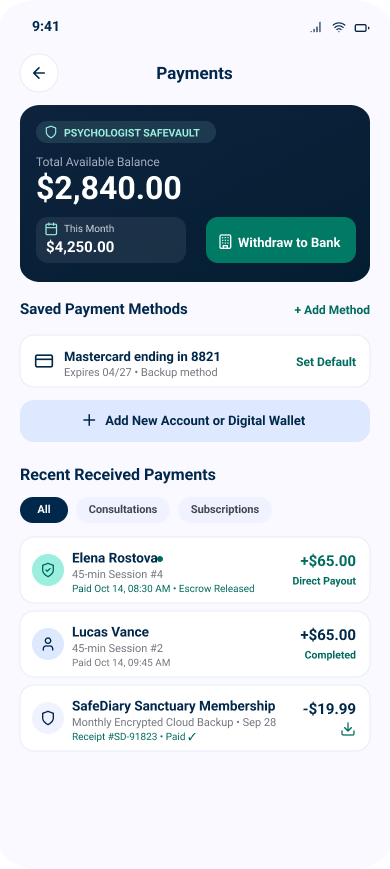<br>
      <sub><strong>Panel de Pagos, Balance y Retiros</strong></sub>
    </td>
  </tr>
</table>

#### 3.1.4.4. Mobile Applications User Flow Diagrams

Los User Flow Diagrams describen la secuencia de decisiones y estados de cada User goal definido en los Wireflows (3.1.4.2), incluyendo el happy path y los unhappy paths. La notación es la siguiente:

- **Rectángulos:** pantallas o acciones.
- **Rombos:** decisiones del usuario o del sistema.
- **Nodos rojos:** finales o desvíos por error.
- **Nodos verdes:** cumplimiento del objetivo.

##### User Flow 1: Registro emocional → reflexión → guardado (María)

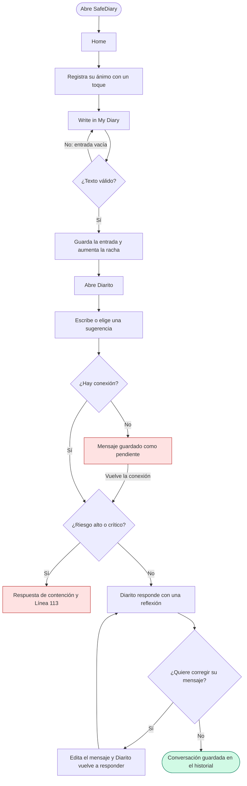
```mermaid
flowchart TD
    A([Abre SafeDiary]) --> B[Home]
    B --> C[Registra su ánimo con un toque]
    C --> D[Write in My Diary]
    D --> E{¿Texto válido?}
    E -->|No: entrada vacía| D
    E -->|Sí| F[Guarda la entrada y aumenta la racha]
    F --> G[Abre Diarito]
    G --> H[Escribe o elige una sugerencia]
    H --> I{¿Hay conexión?}
    I -->|No| J[Mensaje guardado como pendiente]:::bad
    J -->|Vuelve la conexión| K
    I -->|Sí| K{¿Riesgo alto o crítico?}
    K -->|Sí| L[Respuesta de contención y Línea 113]:::bad
    K -->|No| M[Diarito responde con una reflexión]
    M --> N{¿Quiere corregir su mensaje?}
    N -->|Sí| O[Edita el mensaje y Diarito vuelve a responder] --> M
    N -->|No| P([Conversación guardada en el historial]):::ok
    classDef ok fill:#d1fae5,stroke:#047857;
    classDef bad fill:#fee2e2,stroke:#b91c1c;
```

##### User Flow 2: Búsqueda de psicólogo → reserva → consentimiento → pago (María)

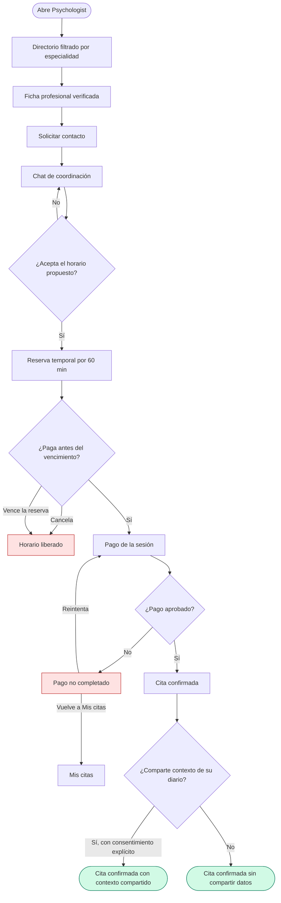
```mermaid
flowchart TD
    A([Abre Psychologist]) --> B[Directorio filtrado por especialidad]
    B --> C[Ficha profesional verificada]
    C --> D[Solicitar contacto]
    D --> E[Chat de coordinación]
    E --> F{¿Acepta el horario propuesto?}
    F -->|No| E
    F -->|Sí| G[Reserva temporal por 60 min]
    G --> H{¿Paga antes del vencimiento?}
    H -->|Cancela| I[Horario liberado]:::bad
    H -->|Vence la reserva| I
    H -->|Sí| J[Pago de la sesión]
    J --> K{¿Pago aprobado?}
    K -->|No| L[Pago no completado]:::bad
    L -->|Reintenta| J
    L -->|Vuelve a Mis citas| M[Mis citas]
    K -->|Sí| N[Cita confirmada]
    N --> O{¿Comparte contexto de su diario?}
    O -->|Sí, con consentimiento explícito| P([Cita confirmada con contexto compartido]):::ok
    O -->|No| Q([Cita confirmada sin compartir datos]):::ok
    classDef ok fill:#d1fae5,stroke:#047857;
    classDef bad fill:#fee2e2,stroke:#b91c1c;
```

##### User Flow 3: Reserva temporal → pago → acceso a la sesión (María)

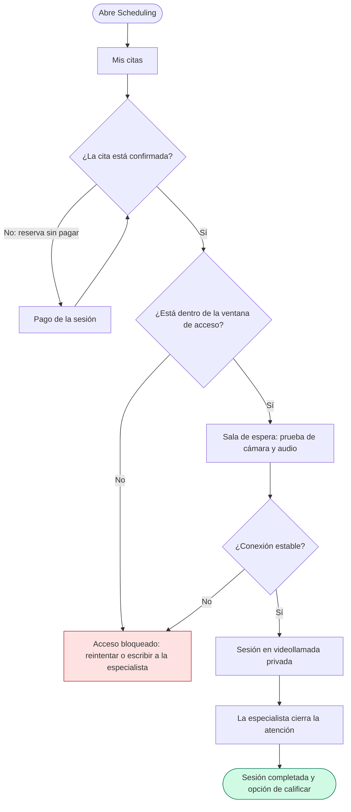
```mermaid
flowchart TD
    A([Abre Scheduling]) --> B[Mis citas]
    B --> C{¿La cita está confirmada?}
    C -->|No: reserva sin pagar| D[Pago de la sesión] --> C
    C -->|Sí| E{¿Está dentro de la ventana de acceso?}
    E -->|No| F[Acceso bloqueado: reintentar o escribir a la especialista]:::bad
    E -->|Sí| G[Sala de espera: prueba de cámara y audio]
    G --> H{¿Conexión estable?}
    H -->|No| F
    H -->|Sí| I[Sesión en videollamada privada]
    I --> J[La especialista cierra la atención]
    J --> K([Sesión completada y opción de calificar]):::ok
    classDef ok fill:#d1fae5,stroke:#047857;
    classDef bad fill:#fee2e2,stroke:#b91c1c;
```

##### User Flow 4: Solicitud de paciente → propuesta de horario → cita agendada (Dra. Laura)

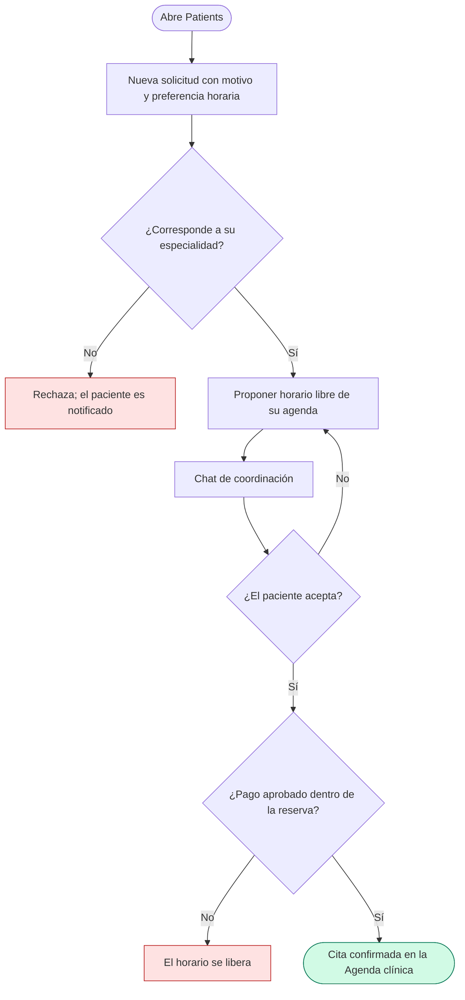
```mermaid
flowchart TD
    A([Abre Patients]) --> B[Nueva solicitud con motivo y preferencia horaria]
    B --> C{¿Corresponde a su especialidad?}
    C -->|No| D[Rechaza; el paciente es notificado]:::bad
    C -->|Sí| E[Proponer horario libre de su agenda]
    E --> F[Chat de coordinación]
    F --> G{¿El paciente acepta?}
    G -->|No| E
    G -->|Sí| H{¿Pago aprobado dentro de la reserva?}
    H -->|No| I[El horario se libera]:::bad
    H -->|Sí| J([Cita confirmada en la Agenda clínica]):::ok
    classDef ok fill:#d1fae5,stroke:#047857;
    classDef bad fill:#fee2e2,stroke:#b91c1c;
```

##### User Flow 5: Atención de la sesión → cierre → ingreso registrado (Dra. Laura)

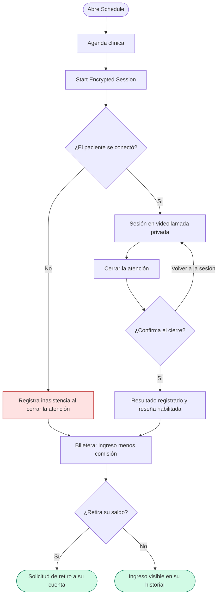
```mermaid
flowchart TD
    A([Abre Schedule]) --> B[Agenda clínica]
    B --> C[Start Encrypted Session]
    C --> D{¿El paciente se conectó?}
    D -->|No| E[Registra inasistencia al cerrar la atención]:::bad
    D -->|Sí| F[Sesión en videollamada privada]
    F --> G[Cerrar la atención]
    G --> H{¿Confirma el cierre?}
    H -->|Volver a la sesión| F
    H -->|Sí| I[Resultado registrado y reseña habilitada]
    E --> J
    I --> J[Billetera: ingreso menos comisión]
    J --> K{¿Retira su saldo?}
    K -->|Sí| L([Solicitud de retiro a su cuenta]):::ok
    K -->|No| M([Ingreso visible en su historial]):::ok
    classDef ok fill:#d1fae5,stroke:#047857;
    classDef bad fill:#fee2e2,stroke:#b91c1c;
```

##### User Flow 6: Calificación de la sesión y gestión de reseñas (María)

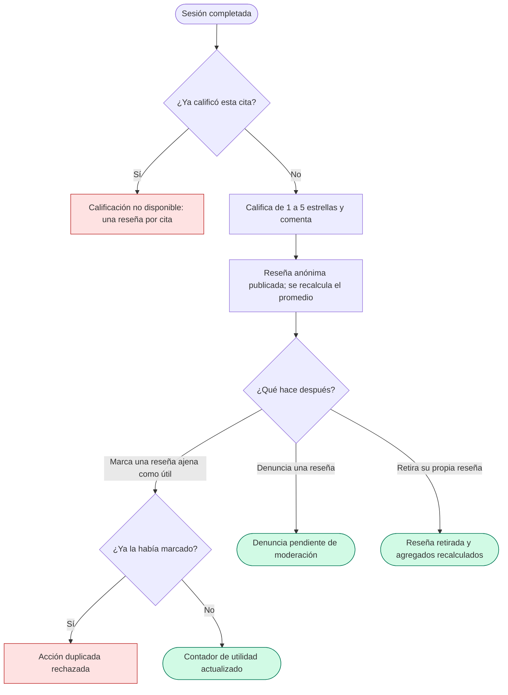
```mermaid
flowchart TD
    A([Sesión completada]) --> B{¿Ya calificó esta cita?}
    B -->|Sí| C[Calificación no disponible: una reseña por cita]:::bad
    B -->|No| D[Califica de 1 a 5 estrellas y comenta]
    D --> E[Reseña anónima publicada; se recalcula el promedio]
    E --> F{¿Qué hace después?}
    F -->|Marca una reseña ajena como útil| G{¿Ya la había marcado?}
    G -->|Sí| H[Acción duplicada rechazada]:::bad
    G -->|No| I([Contador de utilidad actualizado]):::ok
    F -->|Denuncia una reseña| J([Denuncia pendiente de moderación]):::ok
    F -->|Retira su propia reseña| K([Reseña retirada y agregados recalculados]):::ok
    classDef ok fill:#d1fae5,stroke:#047857;
    classDef bad fill:#fee2e2,stroke:#b91c1c;
```

**Reglas de seguridad del flujo:**

- **Consentimiento:** compartir el contexto del diario con una especialista es opcional y explícito. Se elige en la cita confirmada y lo valida IAM. Sin consentimiento vigente, la especialista no accede a ninguna entrada.
- **Revocación:** el paciente puede revocar el consentimiento en cualquier momento desde su perfil. A partir de ese momento las lecturas se bloquean y las proyecciones locales no conservan copias.
- **Acceso mínimo:**
  - La especialista solo ve las entradas autorizadas y el resumen semanal permitido, nunca las conversaciones con Diarito.
  - Las entradas de la bóveda privada nunca se comparten.
- **Falla del pago:** el horario sigue retenido mientras la reserva temporal esté vigente. La cita no se confirma sin un pago aprobado; si la reserva vence o el paciente cancela, el horario se libera y no se generan cobros duplicados.
- **Falla de conexión:**
  - Los mensajes a Diarito se guardan como pendientes y se envían al volver la conexión.
  - La videollamada solo se habilita dentro de la ventana de acceso; si la conexión falla, se ofrece reintentar o contactar a la especialista.
- **Riesgo:** ante un riesgo alto o crítico, Diarito no genera una respuesta libre y muestra recursos de ayuda inmediata (Línea 113, opción 5, y SAMU 106).

#### 3.1.4.5. Mobile Applications Prototyping

El prototipo interactivo se elaboró en Figma con las mismas pantallas de los Wireframes y Wireflows. Se presenta en un marco de dispositivo Android compacto y está organizado en dos flujos navegables, uno por cada User Persona.

| Flujo | Página en Figma | Punto de inicio | Enlace |
|---|---|---|---|
| SafeDiary · paciente | Prototipo Cliente | Inicio de sesión | [Abrir prototipo del paciente](https://www.figma.com/proto/MLDzy0eLPVfy9dQKYsYkKw/safeDiary?node-id=214-4&starting-point-node-id=214%3A4&scaling=scale-down) |
| SafeDiary · psicólogo | Prototipo Psico | Inicio de sesión | [Abrir prototipo del psicólogo](https://www.figma.com/proto/MLDzy0eLPVfy9dQKYsYkKw/safeDiary?node-id=237-3&starting-point-node-id=237%3A3&scaling=scale-down) |

**Prototipo del paciente:**

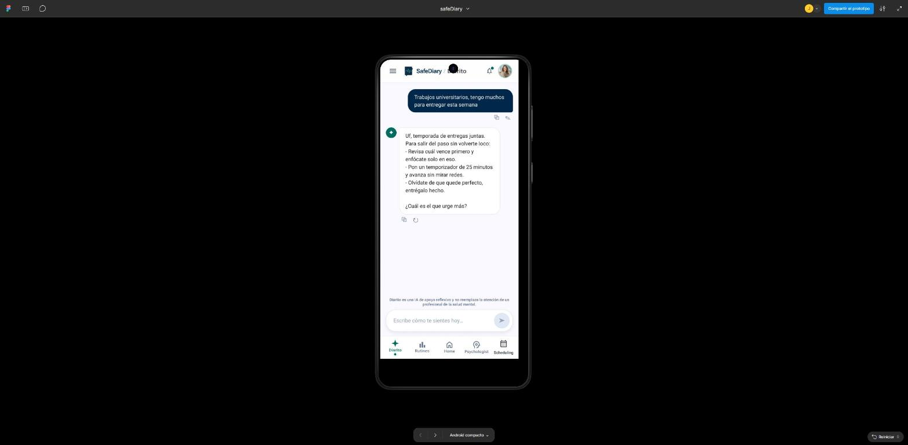

**Prototipo del psicólogo:**

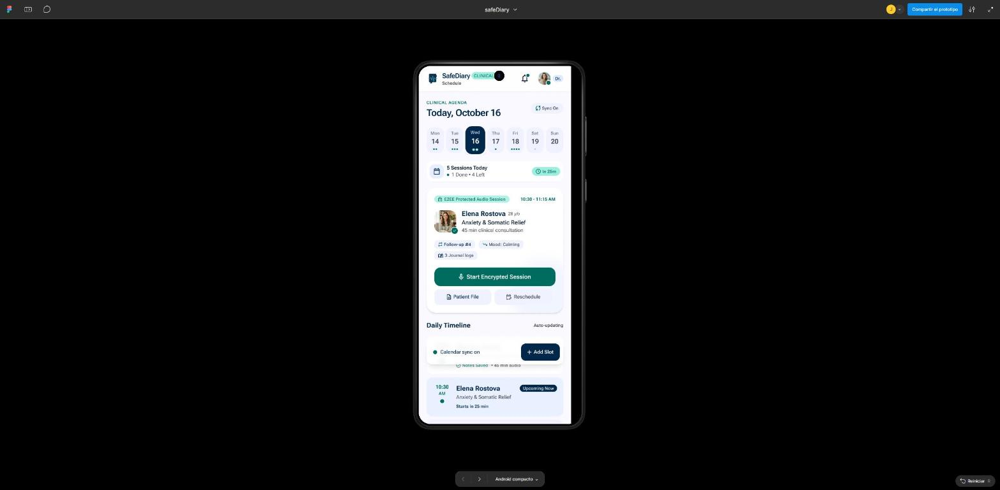

**Alcance interactivo:**

- **Paciente:**
  - **Acceso:** inicio de sesión, registro y recuperación de contraseña.
  - **Barra inferior:** navegación entre Diarito, Rutines, Home, Psychologist y Scheduling.
  - **Diarito:** historial lateral, edición de mensajes y configuración de las personalidades.
  - **Home:** registro del diario.
  - **Rutines:** rutinas guiadas.
  - **Psychologist:** búsqueda en el directorio, solicitud de contacto, coordinación, reserva temporal, pago, cita confirmada, sala de espera y sesión.
  - **Perfil del usuario:** edición del correo, contacto de apoyo, foto y recordatorio diario.
- **Psicólogo:**
  - **Acceso:** inicio de sesión y solicitud de verificación profesional.
  - **Barra inferior:** navegación entre Agenda clínica, Pacientes y Billetera.
  - **Citas:** propuesta de horario, chat de coordinación, sesión y cierre de la atención.
  - **Perfil profesional:** tarifas, horario, enfoque terapéutico, credenciales, perfil público y retiros.
- **Transiciones:** deslizamiento lateral para avanzar, disolución para cambiar de pestaña y regreso con la flecha o con los botones de cancelar y guardar.

**Limitaciones conocidas:**

- **Conservación de datos:** los formularios no guardan datos. Los textos de chat y de pago son estáticos.
- **Barra inferior en las pantallas de citas del psicólogo:** las pantallas de citas que comparten ambos roles (proponer horario, chat y sesión) conservan la barra inferior del paciente.
- **Ficha del paciente:** la «Patient File» de la agenda todavía no tiene una pantalla de destino.

**Prueba rápida:** pendiente de realizar con usuarios del segmento. Los participantes, tareas, hallazgos y cambios se registrarán en la sección 4.3 (Validation Interviews).

**Criterios de entrega:** el prototipo permite demostrar el flujo principal del Sprint 1 y mantiene consistencia con las historias y el Product Backlog.
