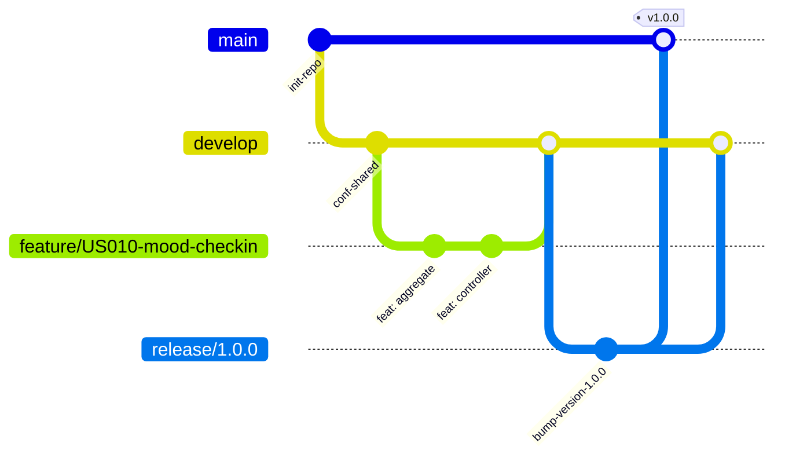

# Capítulo IV: Product Implementation & Validation

---

## 4.1. Software Configuration Management

Para garantizar un proceso de ingeniería de software estructurado, colaborativo y sin fricciones durante el desarrollo del ecosistema **SafeDiary**, el equipo **MindCluster** ha definido la estrategia de Gestión de Configuración del Software (SCM). Este marco establece la homologación del entorno de desarrollo, la administración distribuida del código fuente bajo el flujo de trabajo GitFlow, las guías de estilo para asegurar la mantenibilidad del código base y la configuración de los despliegues en entornos de producción en la nube.

---

### 4.1.1. Software Development Environment Configuration

Con la finalidad de optimizar la productividad y garantizar la compatibilidad entre todos los miembros del equipo a lo largo del ciclo de vida del proyecto, se seleccionaron herramientas especializadas de nivel industrial. La elección responde a criterios de compatibilidad multiplataforma, soporte a estándares abiertos y alineación con metodologías ágiles (Scrum/Kanban).

| Categoría | Herramienta | Versión / Plataforma | Propósito en el Proyecto | Enlace Oficial / Acceso |
| :--- | :--- | :--- | :--- | :--- |
| **Project Management** | Trello | Web / Cloud | Gestión y seguimiento del Product Backlog y Sprint Backlog mediante tablero Kanban (`To Do`, `In Process`, `To Review`, `Done`). | [Trello Backlog](https://trello.com/b/Q2UsNz3t/product-backlog) |
| **Requirements & Needfinding** | UXPressia / Miro | Web / Cloud | Construcción y documentación colaborativa de User Personas, Empathy Maps, Journey Maps y EventStorming de Dominio. | [Miro Platform](https://miro.com/) |
| **UX/UI Design & Prototyping** | Figma | Cloud Desktop v124+ | Diseño del Design System, Style Guidelines, Wireframes, Wireflows y Prototipo Interactivo de Alta Fidelidad para Mobile y Landing Page. | [Figma SafeDiary](https://figma.com) |
| **Architecture Modeling** | Structurizr / Mermaid | Web DSL / Markdown | Modelado de diagramas de arquitectura C4 (Context, Container, Component, Deployment) y diagramas ER de persistencia relacional. | [Structurizr](https://structurizr.com/) |
| **Mobile Development** | Android Studio / VS Code | Iguana / Hedgehog | Entorno de desarrollo para la aplicación móvil cliente en Flutter/Dart y Android nativo, emuladores y profiling. | [Android Studio](https://developer.android.com/studio) |
| **Backend Development** | IntelliJ IDEA Ultimate | 2024.1+ / Community | Desarrollo del backend RESTful API en Java 21 con Spring Boot 4.x / 3.x, Maven y soporte para arquitectura Domain-Driven Design (DDD). | [JetBrains IntelliJ](https://www.jetbrains.com/idea/) |
| **Database Engine & GUI** | PostgreSQL 15 & pgAdmin 4 | v15.4+ / Cloud | Motor de base de datos relacional para persistencia de cuentas, registros de humor, entradas íntimas y catalogo de rutinas. | [PostgreSQL](https://www.postgresql.org/) |
| **API Testing & Verification** | Postman / Bruno | Desktop v11+ | Diseño de colecciones de pruebas automatizadas, validación de contratos JSON, endpoints REST y autenticación por tokens JWT. | [Postman](https://www.postman.com/) |
| **Version Control & Collaboration** | GitHub | Git v2.50+ | Alojamiento distribuido del código fuente, revisiones por pares (Peer Code Reviews), Pull Requests y seguimiento de incidencias. | [GitHub MindCluster](https://github.com/MindClusterUPC) |
| **Docs-as-Code** | Markdown & Pandoc | GFM / Pandoc 3+ | Redacción y versionado del informe técnico del proyecto bajo filosofía Docs-as-Code con exportación automatizada a PDF. | [SafeDiary_Doc Repo](https://github.com/MindClusterUPC/SafeDiary_Doc) |

---

### 4.1.2. Source Code Management

El código fuente de SafeDiary se encuentra descentralizado y organizado en **cuatro repositorios independientes** dentro de la organización oficial de GitHub del equipo, permitiendo el desacoplamiento de despliegues y la asignación eficiente de responsabilidades:

<div align="center">

| Producto Digital | Repositorio Oficial en GitHub | Tecnología y Propósito |
| :--- | :--- | :--- |
| **Documentación del Proyecto** | [MindClusterUPC/SafeDiary_Doc](https://github.com/MindClusterUPC/SafeDiary_Doc) | Docs-as-Code (Markdown / Pandoc). Alberga el informe técnico del proyecto, actas y evidencias. |
| **Landing Page Web App** | [MindClusterUPC/safediary-landing-page](https://github.com/MindClusterUPC/safediary-landing-page) | HTML5, CSS3, JavaScript y Tailwind CSS. Sitio web público orientado a la adquisición y presentación de valor. |
| **Backend RESTful API** | [MindClusterUPC/safediary-platform](https://github.com/MindClusterUPC/safediary-platform) | Java 21, Spring Boot y PostgreSQL. API de microservicios modulares DDD para lógica de negocio y persistencia. |
| **Mobile Client Application** | [MindClusterUPC/safediary-mobile](https://github.com/MindClusterUPC/safediary-mobile) | Flutter / Dart con Material Design 3. Aplicación móvil multiplataforma para pacientes y especialistas. |

</div>

#### Modelo de Ramificación: GitFlow Workflow

Para coordinar el trabajo paralelo y garantizar la estabilidad continua del código en producción, el equipo implementa el flujo **GitFlow**:



- **`main`**: Rama protegida que contiene únicamente código estable, auditado y listo para producción. Cada merge en `main` se asocia a un tag de versión oficial.
- **`develop`**: Rama base para el desarrollo diario e integración continua. Todas las nuevas funcionalidades convergen aquí mediante Pull Requests validados por el equipo.
- **`feature/<id-historia>-<nombre-descriptivo>`**: Ramas temporales creadas a partir de `develop` para implementar una historia de usuario o historia técnica específica (ej. `feature/US010-mood-checkin`, `feature/US001-account-registration`).
- **`release/<major.minor.patch>`**: Ramas de estabilización previas a una entrega oficial para ajustar detalles de configuración, documentación y pruebas finales.
- **`hotfix/<descripcion-parche>`**: Ramas de corrección urgente derivadas directamente de `main` para resolver bugs críticos detectados en producción.

#### Versionado Semántico (Semantic Versioning 2.0.0)

Se adopta el estándar `MAJOR.MINOR.PATCH` para etiquetar los lanzamientos del producto:
- **MAJOR (`X.0.0`):** Cambios que rompen la compatibilidad hacia atrás en APIs o contratos de datos.
- **MINOR (`0.X.0`):** Nuevas funcionalidades completas asociadas al cierre de un Sprint o la inclusión de un Bounded Context.
- **PATCH (`0.0.X`):** Correcciones menores de errores, refactorizaciones internas o ajustes de documentación.

#### Estándar de Mensajes de Commit (Conventional Commits 1.0.0)

Los commits deben redactarse obligatoriamente siguiendo la convención:
```text
<tipo>(<alcance opcional>): <descripción concisa en imperativo y minúsculas>

[cuerpo explicativo opcional sobre el motivo de la modificación]

[referencia a historia de usuario: Closes US-010]
```

Tipos admitidos:
- **`feat`**: Incorporación de una nueva funcionalidad técnica o de usuario.
- **`fix`**: Corrección de un defecto o fallo detectado.
- **`docs`**: Modificaciones exclusivas a la documentación o archivos Markdown.
- **`style`**: Ajustes de formato, espaciado o indentación sin alteración en la lógica.
- **`refactor`**: Reestructuración interna de código que no añade funcionalidades ni repara errores.
- **`test`**: Incorporación o ajuste de pruebas unitarias o de integración.
- **`chore`**: Tareas de mantenimiento, actualización de dependencias (`pom.xml`) o ajustes en el build.

---

### 4.1.3. Source Code Style Guide & Conventions

Para garantizar que el código fuente sea homogéneo, legible y fácil de mantener entre todos los integrantes, se establecieron lineamientos formales basados en las guías más reconocidas de la industria:

#### Referencias Oficiales de Estilo
- **Java:** [Google Java Style Guide](https://google.github.io/styleguide/javaguide.html) y [Spring Framework Architecture Best Practices](https://docs.spring.io/spring-boot/docs/current/reference/htmlsingle/).
- **Dart / Flutter:** [Effective Dart: Style Guide](https://dart.dev/guides/language/effective-dart/style) y lineamientos de [Material Design 3 (M3)](https://m3.material.io/).
- **Web / Frontend:** [Google HTML/CSS Style Guide](https://google.github.io/styleguide/htmlcssguide.html) y [Airbnb JavaScript Style Guide](https://github.com/airbnb/javascript).

#### Estructura de Código DDD (Domain-Driven Design) en Backend
En `safediary-platform`, el código fuente se divide modularmente por Bounded Contexts (`iam`, `profiles`, `diary`, `rutines`, etc.) con una separación estricta en 4 capas hexagonales:
- **`domain`**: Entidades, agregados, Value Objects y contratos de repositorios sin dependencias de infraestructura ni frameworks.
- **`application`**: Casos de uso divididos bajo el patrón CQRS (`internal/commandservices`, `internal/queryservices`).
- **`infrastructure`**: Adaptadores técnicos de persistencia JPA, configuración de OpenAPI/Swagger, hashing de contraseñas y manejadores de eventos.
- **`interfaces.rest`**: Controladores REST (`@RestController`), recursos/DTOs de transferencia y clases `Assembler` para transformación de modelos.

#### Convenciones de Nomenclatura

| Elemento Técnico | Convención | Ejemplo en SafeDiary |
| :--- | :--- | :--- |
| **Clases Java** | PascalCase | `MoodCheckIn`, `DiaryEntriesController` |
| **Métodos y Atributos Java** | camelCase | `calculateStreakDays()`, `patientId` |
| **Constantes Java** | UPPER_SNAKE_CASE | `MAX_CHECKIN_COMMENT_LENGTH` |
| **Paquetes Java** | minúsculas continuas | `com.mindcluster.safediary.diary` |
| **Clases y Widgets Dart** | PascalCase | `MoodCheckInScreen`, `EmotionCard` |
| **Archivos y Directorios Dart** | snake_case | `mood_check_in_screen.dart` |
| **Tablas PostgreSQL** | snake_case pluralizado | `mood_check_ins`, `diary_entries`, `user_accounts` |
| **Columnas PostgreSQL** | snake_case | `created_at`, `sentiment_score` |
| **Endpoints RESTful** | kebab-case pluralizado | `/api/v1/mood-check-ins`, `/api/v1/diary-entries` |

#### Lineamientos por Lenguaje
- **Java (Spring Boot):**
  - Inyección de dependencias exclusivamente por constructor (evitando `@Autowired` en atributos).
  - Reducción de código repetitivo mediante Lombok (`@Getter`, `@Setter`, `@Builder`, `@NoArgsConstructor`).
  - Validación declarativa de datos de entrada en DTOs con Bean Validation (`@NotNull`, `@NotBlank`, `@Size`).
  - Documentación de clases públicas y controladores mediante anotaciones Swagger (`@Tag`, `@Operation`).
- **Dart (Flutter):**
  - Tipado estricto en todas las variables, evitando el uso indiscriminado de `dynamic`.
  - Construcción de widgets modulares y reutilizables con longitud máxima recomendada de 100 líneas por build method.
  - Implementación de componentes nativos de Material 3 (`ColorScheme`, `Card`, `FilledButton`, `NavigationRail`).
- **HTML / CSS (Landing Page):**
  - Maquetación 100% semántica utilizando etiquetas HTML5 (`<header>`, `<nav>`, `<main>`, `<section>`, `<footer>`).
  - Enfoque *Mobile-First* en CSS con diseño responsive garantizado para pantallas móviles, tablets y monitores desktop.

---

### 4.1.4. Software Deployment Configuration

El proceso de despliegue asegura que cada pieza del sistema esté disponible en entornos cloud con alta disponibilidad, seguridad TLS/SSL y monitoreo constante:

#### 1. Despliegue de la Landing Page (`safediary-landing-page`)
- **Plataforma de Hosting:** Vercel / GitHub Pages.
- **Pipeline de Despliegue:** Integración continua automática (CI/CD) vinculada al branch `main`. Cada pull request aprobado e integrado desencadena un nuevo build y publicación.
- **URL Pública:** `https://safediary-landing.vercel.app/`
- **Características:** Certificados SSL/TLS gestionados automáticamente, compresión gzip/brotli y distribución a través de CDN global.

#### 2. Despliegue del Backend RESTful API (`safediary-platform`)
- **Plataforma Cloud:** Render Cloud Platform / Railway PaaS.
- **Base de Datos:** Instancia gestionada de PostgreSQL 15 en la nube con pooling de conexiones HikariCP y soporte SSL.
- **Estrategia de Ejecución:**
  - Empaquetado en artefacto ejecutable `.jar` mediante Maven (`mvn clean package -DskipTests`).
  - El contenedor en la nube arranca el servicio mediante `java -jar app.jar` asignando dinámicamente el puerto expuesto por la variable `PORT`.
  - Gestión segura de credenciales sensibles (cadenas de conexión JDBC, usuario y contraseña de base de datos) a través de variables de entorno seguras en el panel cloud.
- **Documentación Interactiva Pública:** Interfaz Swagger UI activa en `/swagger-ui/index.html` para pruebas de endpoints por parte del equipo móvil y evaluadores.

#### 3. Despliegue de la Aplicación Móvil (`safediary-mobile`)
- **Empaquetado Release:** Compilación de binarios APK optimizados para arquitectura ARM64 (`flutter build apk --release --split-per-abi`).
- **Canal de Distribución:** Publicación del instalable APK en la sección **Releases** del repositorio oficial de GitHub de SafeDiary y distribución complementaria mediante Firebase App Distribution.
- **Integración con Backend:** Configuración del cliente HTTP móvil (`dio` / `http`) apuntando de forma segura mediante HTTPS al dominio público del backend desplegado en Render.

## 4.2. Landing Page & Mobile Application Implementation

> **Plantilla para TB1.** Esta sección debe completarse con evidencias reales del Sprint 1. No declarar una funcionalidad como implementada si no existe commit, prueba y evidencia de ejecución.

### 4.2.1. Sprint 1

#### 4.2.1.1. Sprint Planning 1

| Campo | Valor |
|---|---|
| Sprint | Sprint 1 |
| Fecha | [YYYY-MM-DD] |
| Hora | [HH:MM] |
| Ubicación | [presencial / virtual] |
| Preparado por | [nombre] |
| Asistentes | [nombres] |
| Sprint Goal | [objetivo medible] |
| Velocity | [story points] |
| Story Points incluidos | [suma] |

**Resumen del sprint anterior:** [si aplica].

**Retrospectiva del sprint anterior:** [si aplica].

#### 4.2.1.2. Aspect Leaders and Collaborators

| Integrante | Aspecto / responsabilidad | User Stories o tareas relacionadas | Evidencia |
|---|---|---|---|
| [nombre] | [responsabilidad] | [US-xxx / task] | [enlace o commit] |

#### 4.2.1.3. Sprint Backlog 1

El Sprint Backlog 1 se gestiona en Trello. Contiene las 12 historias de prioridad alta seleccionadas del Product Backlog, que suman **32 Story Points**. Cada tarjeta incluye la historia de usuario, sus criterios de aceptación, los Story Points y una etiqueta por épica. El tablero tiene las listas `Sprint 1 Backlog`, `To Do`, `In Process`, `To Review` y `Done`, y las tarjetas avanzan entre ellas según su estado.

| User Story ID | Título | Épica | Story Points | Criterios de aceptación | Estado |
|---|---|---|---:|---|---|
| US-001 | Registro de cuenta | EP-01 Cuenta, Seguridad y Privacidad | 3 | Registro exitoso con inicio de sesión y bienvenida; validación de correo duplicado o contraseña débil sin borrar los campos válidos. | Sprint 1 Backlog |
| US-003 | Acceso con Google o Apple | EP-01 Cuenta, Seguridad y Privacidad | 3 | Autenticación federada que crea o recupera la cuenta; manejo seguro de la cancelación o falla del proveedor. | Sprint 1 Backlog |
| US-006 | Edición del perfil personal | EP-01 Cuenta, Seguridad y Privacidad | 2 | Perfil y foto actualizados; validación de tamaño o formato de imagen no admitido. | Sprint 1 Backlog |
| US-015 | Desbloqueo biométrico | EP-01 Cuenta, Seguridad y Privacidad | 3 | Biometría habilitada; contraseña tradicional si la biometría falla. | Sprint 1 Backlog |
| US-016 | Recuperación de contraseña | EP-01 Cuenta, Seguridad y Privacidad | 3 | Enlace temporal enviado al correo; enlaces caducados manejados sin revelar si la cuenta existe. | Sprint 1 Backlog |
| US-008 | Registro de entrada de diario | EP-02 Diario Emocional e IA | 3 | Almacenamiento cifrado en orden cronológico; bloqueo de entradas vacías. | Sprint 1 Backlog |
| US-010 | Registro rápido del estado emocional | EP-02 Diario Emocional e IA | 3 | Emoción guardada con timestamp; prevención de registros duplicados inmediatos. | Sprint 1 Backlog |
| US-011 | Reflexión guiada por voz con IA | EP-02 Diario Emocional e IA | 8 | Transcripción, reflexión no clínica y etiqueta emocional; parada segura ante límites de tiempo o fallas de red sin perder el audio. | Sprint 1 Backlog |
| US-017 | Presentación de la propuesta de valor | EP-05 Landing Page y Adquisición | 1 | Hero section con mensaje central y botón de descarga o prueba en el primer pliegue. | Sprint 1 Backlog |
| US-018 | Presentación de funcionalidades principales | EP-05 Landing Page y Adquisición | 1 | Tarjetas de funciones con icono y descripción; scroll suave desde el menú. | Sprint 1 Backlog |
| US-019 | Consulta de testimonios | EP-05 Landing Page y Adquisición | 1 | Reseñas anonimizadas con calificación; estado alternativo si no hay testimonios aprobados. | Sprint 1 Backlog |
| US-020 | Consulta de planes y precios | EP-05 Landing Page y Adquisición | 1 | Tres tarjetas comparables (Básico Gratis, Terra US$ 19.99/mes y Astrum US$ 100/año); enlaces a registro o contratación. | Sprint 1 Backlog |

**URL del tablero:** [Sprint Backlog 1 en Trello](https://trello.com/b/UgUM8rrn/sprint-backlog-1).

#### 4.2.1.4. Development Evidence for Sprint Review

Describir los incrementos logrados en Landing Page, aplicación móvil y servicios.

| Repositorio | Rama | Commit | Mensaje | Fecha | Relación con User Story |
|---|---|---|---|---|---|
| [owner/repo] | [feature/...] | [sha] | [conventional commit] | [YYYY-MM-DD] | [US-xxx] |

**Capturas:** [insertar capturas de implementación y explicar qué se evidencia].

#### 4.2.1.5. Testing Suite Evidence for Sprint Review

| Tipo de prueba | User Story | Caso / clase | Resultado | Commit / ruta |
|---|---|---|---|---|
| Unit | [US-xxx] | [caso] | [passed/failed] | [enlace] |
| Integration | [US-xxx] | [endpoint / adaptador] | [resultado] | [enlace] |
| Acceptance / BDD | [US-xxx] | [archivo .feature] | [resultado] | [enlace] |

**Criterios de prueba y datos utilizados:** [describir sin exponer datos personales reales].

#### 4.2.1.6. Execution Evidence for Sprint Review

| Funcionalidad demostrada | Dispositivo / entorno | Resultado | Evidencia |
|---|---|---|---|
| [flujo] | [modelo, versión] | [resultado] | [captura / video] |

**Video de demostración:** [URL].

#### 4.2.1.7. Services Documentation Evidence for Sprint Review

| Servicio / Endpoint | Método | Ruta | Parámetros | Response esperado | Documentación |
|---|---|---|---|---|---|
| [servicio] | GET/POST/... | `/api/v1/...` | [detalle] | [ejemplo JSON] | [Swagger / URL] |

#### 4.2.1.8. Software Deployment Evidence for Sprint Review

Describir configuración y evidencias del despliegue del Landing Page, backend al 70 % y los entornos de prueba móvil.

| Producto | Plataforma | URL / versión | Fecha | Evidencia |
|---|---|---|---|---|
| Landing Page | [Vercel / otra] | [URL] | [fecha] | [captura] |
| Backend | [Render / otra] | [URL Swagger] | [fecha] | [captura] |
| Mobile | [emulador / dispositivo] | [versión] | [fecha] | [video] |

#### 4.2.1.9. Team Collaboration Insights during Sprint

Explicar cómo se distribuyó el trabajo y adjuntar capturas de commits, tablero, pull requests y revisiones. Los datos deben coincidir con el Registro de Versiones del Informe y el Participant Performance Report.

## 4.3. Validation Interviews

### 4.3.1. Diseño de Entrevistas

**Objetivo:** [validar facilidad de uso, comprensión, confianza y cumplimiento del flujo seleccionado].

**Participantes:** [segmento, cantidad y criterios de selección].

**Tareas evaluadas:** [tareas concretas del prototipo o aplicación].

**Guion:** [preguntas y orden].

### 4.3.2. Registro de Entrevistas

| Participante | Segmento | Fecha | Tareas ejecutadas | Hallazgos principales | Evidencia |
|---|---|---|---|---|---|
| [P01] | [paciente / psicólogo] | [fecha] | [tareas] | [hallazgos] | [enlace] |

### 4.3.3. Evaluaciones según heurísticas

| # | Problema | Severidad (1-4) | Heurística / principio | Recomendación | Estado |
|---:|---|---:|---|---|---|
| 1 | [problema] | [1-4] | [heurística] | [recomendación] | [pendiente / corregido] |

**Capturas de problemas:** [insertar una captura por problema relevante].


---
