# Capítulo IV: Product Implementation & Validation

---

## 4.1. Software Configuration Management

Para garantizar un proceso de ingeniería de software estructurado, colaborativo y sin fricciones durante el desarrollo del ecosistema **SafeDiary**, el equipo **MindCluster** ha definido la estrategia de Gestión de Configuración del Software (SCM). Este marco establece la homologación del entorno de desarrollo, la administración distribuida del código fuente bajo el flujo de trabajo GitFlow, las guías de estilo para asegurar la mantenibilidad del código base y la configuración de los despliegues en entornos de producción en la nube.

---

### 4.1.1. Software Development Environment Configuration

Con la finalidad de optimizar la productividad y garantizar la compatibilidad entre todos los miembros del equipo a lo largo del ciclo de vida del proyecto, se seleccionaron herramientas especializadas de nivel industrial. La elección responde a criterios de compatibilidad multiplataforma, soporte a estándares abiertos y alineación con metodologías ágiles (Scrum/Kanban).

| Categoría | Herramienta | Versión / Plataforma | Propósito en el Proyecto | Enlace Oficial / Acceso |
| :--- | :--- | :--- | :--- | :--- |
| **Project Management** | Trello | Web / Cloud | Gestión y seguimiento del Product Backlog y Sprint Backlog mediante tablero Kanban (`To Do`, `In Process`, `To Review`, `Done`). | [Trello Backlog](https://trello.com/b/Q2UsNz3t/product-backlog) |
| **Requirements & Needfinding** | UXPressia / Miro | Web / Cloud | Construcción y documentación colaborativa de User Personas, Empathy Maps, Journey Maps y EventStorming de Dominio. | [Miro Platform](https://miro.com/) |
| **UX/UI Design & Prototyping** | Figma | Cloud Desktop v124+ | Diseño del Design System, Style Guidelines, Wireframes, Wireflows y Prototipo Interactivo de Alta Fidelidad para Mobile y Landing Page. | [Figma SafeDiary](https://figma.com) |
| **Architecture Modeling** | Structurizr / Mermaid | Web DSL / Markdown | Modelado de diagramas de arquitectura C4 (Context, Container, Component, Deployment) y diagramas ER de persistencia relacional. | [Structurizr](https://structurizr.com/) |
| **Mobile Development** | Android Studio / VS Code | Iguana / Hedgehog | Entorno de desarrollo para la aplicación móvil cliente en Flutter/Dart y Android nativo, emuladores y profiling. | [Android Studio](https://developer.android.com/studio) |
| **Backend Development** | IntelliJ IDEA Ultimate | 2024.1+ / Community | Desarrollo del backend RESTful API en Java 21 con Spring Boot 4.x / 3.x, Maven y soporte para arquitectura Domain-Driven Design (DDD). | [JetBrains IntelliJ](https://www.jetbrains.com/idea/) |
| **Database Engine & GUI** | PostgreSQL 15 & pgAdmin 4 | v15.4+ / Cloud | Motor de base de datos relacional para persistencia de cuentas, registros de humor, entradas íntimas y catalogo de rutinas. | [PostgreSQL](https://www.postgresql.org/) |
| **API Testing & Verification** | Postman / Bruno | Desktop v11+ | Diseño de colecciones de pruebas automatizadas, validación de contratos JSON, endpoints REST y autenticación por tokens JWT. | [Postman](https://www.postman.com/) |
| **Version Control & Collaboration** | GitHub | Git v2.50+ | Alojamiento distribuido del código fuente, revisiones por pares (Peer Code Reviews), Pull Requests y seguimiento de incidencias. | [GitHub MindCluster](https://github.com/MindClusterUPC) |
| **Docs-as-Code** | Markdown & Pandoc | GFM / Pandoc 3+ | Redacción y versionado del informe técnico del proyecto bajo filosofía Docs-as-Code con exportación automatizada a PDF. | [SafeDiary_Doc Repo](https://github.com/MindClusterUPC/SafeDiary_Doc) |

---

### 4.1.2. Source Code Management

El código fuente de SafeDiary se encuentra descentralizado y organizado en **cuatro repositorios independientes** dentro de la organización oficial de GitHub del equipo, permitiendo el desacoplamiento de despliegues y la asignación eficiente de responsabilidades:

<div align="center">

| Producto Digital | Repositorio Oficial en GitHub | Tecnología y Propósito |
| :--- | :--- | :--- |
| **Documentación del Proyecto** | [MindClusterUPC/SafeDiary_Doc](https://github.com/MindClusterUPC/SafeDiary_Doc) | Docs-as-Code (Markdown / Pandoc). Alberga el informe técnico del proyecto, actas y evidencias. |
| **Landing Page Web App** | [MindClusterUPC/safediary-landing-page](https://github.com/MindClusterUPC/safediary-landing-page) | HTML5, CSS3, JavaScript y Tailwind CSS. Sitio web público orientado a la adquisición y presentación de valor. |
| **Backend RESTful API** | [MindClusterUPC/safediary-platform](https://github.com/MindClusterUPC/safediary-platform) | Java 21, Spring Boot y PostgreSQL. API de microservicios modulares DDD para lógica de negocio y persistencia. |
| **Mobile Client Application** | [MindClusterUPC/safediary-mobile](https://github.com/MindClusterUPC/safediary-mobile) | Flutter / Dart con Material Design 3. Aplicación móvil multiplataforma para pacientes y especialistas. |

</div>

#### Modelo de Ramificación: GitFlow Workflow

Para coordinar el trabajo paralelo y garantizar la estabilidad continua del código en producción, el equipo implementa el flujo **GitFlow**:

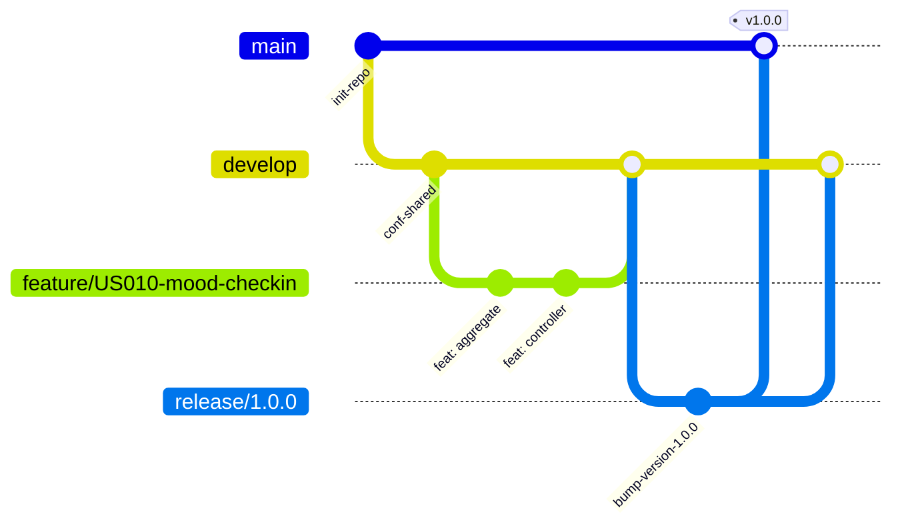

- **`main`**: Rama protegida que contiene únicamente código estable, auditado y listo para producción. Cada merge en `main` se asocia a un tag de versión oficial.
- **`develop`**: Rama base para el desarrollo diario e integración continua. Todas las nuevas funcionalidades convergen aquí mediante Pull Requests validados por el equipo.
- **`feature/<id-historia>-<nombre-descriptivo>`**: Ramas temporales creadas a partir de `develop` para implementar una historia de usuario o historia técnica específica (ej. `feature/US010-mood-checkin`, `feature/US001-account-registration`).
- **`release/<major.minor.patch>`**: Ramas de estabilización previas a una entrega oficial para ajustar detalles de configuración, documentación y pruebas finales.
- **`hotfix/<descripcion-parche>`**: Ramas de corrección urgente derivadas directamente de `main` para resolver bugs críticos detectados en producción.

#### Versionado Semántico (Semantic Versioning 2.0.0)

Se adopta el estándar `MAJOR.MINOR.PATCH` para etiquetar los lanzamientos del producto:
- **MAJOR (`X.0.0`):** Cambios que rompen la compatibilidad hacia atrás en APIs o contratos de datos.
- **MINOR (`0.X.0`):** Nuevas funcionalidades completas asociadas al cierre de un Sprint o la inclusión de un Bounded Context.
- **PATCH (`0.0.X`):** Correcciones menores de errores, refactorizaciones internas o ajustes de documentación.

#### Estándar de Mensajes de Commit (Conventional Commits 1.0.0)

Los commits deben redactarse obligatoriamente siguiendo la convención:
```text
<tipo>(<alcance opcional>): <descripción concisa en imperativo y minúsculas>

[cuerpo explicativo opcional sobre el motivo de la modificación]

[referencia a historia de usuario: Closes US-010]
```

Tipos admitidos:
- **`feat`**: Incorporación de una nueva funcionalidad técnica o de usuario.
- **`fix`**: Corrección de un defecto o fallo detectado.
- **`docs`**: Modificaciones exclusivas a la documentación o archivos Markdown.
- **`style`**: Ajustes de formato, espaciado o indentación sin alteración en la lógica.
- **`refactor`**: Reestructuración interna de código que no añade funcionalidades ni repara errores.
- **`test`**: Incorporación o ajuste de pruebas unitarias o de integración.
- **`chore`**: Tareas de mantenimiento, actualización de dependencias (`pom.xml`) o ajustes en el build.

---

### 4.1.3. Source Code Style Guide & Conventions

Para garantizar que el código fuente sea homogéneo, legible y fácil de mantener entre todos los integrantes, se establecieron lineamientos formales basados en las guías más reconocidas de la industria:

#### Referencias Oficiales de Estilo
- **Java:** [Google Java Style Guide](https://google.github.io/styleguide/javaguide.html) y [Spring Framework Architecture Best Practices](https://docs.spring.io/spring-boot/docs/current/reference/htmlsingle/).
- **Dart / Flutter:** [Effective Dart: Style Guide](https://dart.dev/guides/language/effective-dart/style) y lineamientos de [Material Design 3 (M3)](https://m3.material.io/).
- **Web / Frontend:** [Google HTML/CSS Style Guide](https://google.github.io/styleguide/htmlcssguide.html) y [Airbnb JavaScript Style Guide](https://github.com/airbnb/javascript).

#### Estructura de Código DDD (Domain-Driven Design) en Backend
En `safediary-platform`, el código fuente se divide modularmente por Bounded Contexts (`iam`, `profiles`, `diary`, `rutines`, etc.) con una separación estricta en 4 capas hexagonales:
- **`domain`**: Entidades, agregados, Value Objects y contratos de repositorios sin dependencias de infraestructura ni frameworks.
- **`application`**: Casos de uso divididos bajo el patrón CQRS (`internal/commandservices`, `internal/queryservices`).
- **`infrastructure`**: Adaptadores técnicos de persistencia JPA, configuración de OpenAPI/Swagger, hashing de contraseñas y manejadores de eventos.
- **`interfaces.rest`**: Controladores REST (`@RestController`), recursos/DTOs de transferencia y clases `Assembler` para transformación de modelos.

#### Convenciones de Nomenclatura

| Elemento Técnico | Convención | Ejemplo en SafeDiary |
| :--- | :--- | :--- |
| **Clases Java** | PascalCase | `MoodCheckIn`, `DiaryEntriesController` |
| **Métodos y Atributos Java** | camelCase | `calculateStreakDays()`, `patientId` |
| **Constantes Java** | UPPER_SNAKE_CASE | `MAX_CHECKIN_COMMENT_LENGTH` |
| **Paquetes Java** | minúsculas continuas | `com.mindcluster.safediary.diary` |
| **Clases y Widgets Dart** | PascalCase | `MoodCheckInScreen`, `EmotionCard` |
| **Archivos y Directorios Dart** | snake_case | `mood_check_in_screen.dart` |
| **Tablas PostgreSQL** | snake_case pluralizado | `mood_check_ins`, `diary_entries`, `user_accounts` |
| **Columnas PostgreSQL** | snake_case | `created_at`, `sentiment_score` |
| **Endpoints RESTful** | kebab-case pluralizado | `/api/v1/mood-check-ins`, `/api/v1/diary-entries` |

#### Lineamientos por Lenguaje
- **Java (Spring Boot):**
  - Inyección de dependencias exclusivamente por constructor (evitando `@Autowired` en atributos).
  - Reducción de código repetitivo mediante Lombok (`@Getter`, `@Setter`, `@Builder`, `@NoArgsConstructor`).
  - Validación declarativa de datos de entrada en DTOs con Bean Validation (`@NotNull`, `@NotBlank`, `@Size`).
  - Documentación de clases públicas y controladores mediante anotaciones Swagger (`@Tag`, `@Operation`).
- **Dart (Flutter):**
  - Tipado estricto en todas las variables, evitando el uso indiscriminado de `dynamic`.
  - Construcción de widgets modulares y reutilizables con longitud máxima recomendada de 100 líneas por build method.
  - Implementación de componentes nativos de Material 3 (`ColorScheme`, `Card`, `FilledButton`, `NavigationRail`).
- **HTML / CSS (Landing Page):**
  - Maquetación 100% semántica utilizando etiquetas HTML5 (`<header>`, `<nav>`, `<main>`, `<section>`, `<footer>`).
  - Enfoque *Mobile-First* en CSS con diseño responsive garantizado para pantallas móviles, tablets y monitores desktop.

---

### 4.1.4. Software Deployment Configuration

El proceso de despliegue asegura que cada pieza del sistema esté disponible en entornos cloud con alta disponibilidad, seguridad TLS/SSL y monitoreo constante:

#### 1. Despliegue de la Landing Page (`safediary-landing-page`)
- **Plataforma de Hosting:** GitHub Pages.
- **Pipeline de Despliegue:** Integración continua automática (CI/CD) vinculada al branch `main`. Cada pull request aprobado e integrado desencadena un nuevo build y publicación.
- **URL Pública:** [https://mindclusterupc.github.io/SafeDiary_Landing_Page/](https://mindclusterupc.github.io/SafeDiary_Landing_Page/index.html)
- **Características:** Certificados SSL/TLS gestionados automáticamente, compresión gzip/brotli y distribución a través de CDN global.

#### 2. Despliegue del Backend RESTful API (`safediary-platform`)
- **Plataforma Cloud:** Render (servicio web Docker definido en `render.yaml`, despliegue automático desde `main`).
- **Base de Datos:** PostgreSQL externo (filess.io) con pool de conexiones HikariCP; perfil `prod` de Spring.
- **Estrategia de Ejecución:**
  - Imagen Docker construida con el `Dockerfile` del repositorio (build Maven `package -DskipTests` y ejecución del `.jar`).
  - El servicio lee el puerto de la variable `PORT` y verifica su salud con `/v3/api-docs`.
  - Gestión segura de credenciales sensibles (cadenas de conexión JDBC, usuario y contraseña de base de datos) a través de variables de entorno seguras en el panel cloud.
- **Documentación Interactiva Pública:** [Swagger UI](https://safediary-platform.onrender.com/swagger-ui/index.html) para pruebas de endpoints por parte del equipo móvil y evaluadores.

#### 3. Despliegue de la Aplicación Móvil (`safediary-mobile`)
- **Tecnología:** aplicación nativa Android en Kotlin con Jetpack Compose (minSdk 24, targetSdk 37).
- **Empaquetado Release:** APK firmado generado con Gradle (`./gradlew assembleRelease`); la firma se lee de un archivo local fuera del repositorio.
- **Canal de Distribución:** instalación del APK en dispositivos y emuladores Android del equipo para las pruebas del sprint.
- **Integración con Backend:** la URL base se define por tipo de build en `BuildConfig.API_BASE_URL`: el build debug apunta al backend local y el release al backend desplegado en Render por HTTPS.

## 4.2. Landing Page & Mobile Application Implementation

> **Plantilla para TB1.** Esta sección debe completarse con evidencias reales del Sprint 1. No declarar una funcionalidad como implementada si no existe commit, prueba y evidencia de ejecución.

### 4.2.1. Sprint 1

#### 4.2.1.1. Sprint Planning 1

| Campo | Valor |
|---|---|
| Sprint | Sprint 1 |
| Fecha | 2026-09-26 |
| Hora | 17:00 |
| Ubicación | Virtual - Discord |
| Preparado por | Kamil Diaz |
| Asistentes | Marcelo Cuadros, Andres Torres, Juan Wang, Santiago Vargas |
| Sprint Goal | **Nuestro foco está en** desplegar la Landing Page pública informativa y la infraestructura base del Backend en el entorno de producción. <br><br> **Creemos que esto habilitará** un canal inicial de captación para pacientes jóvenes y dejará operativa la arquitectura de servicios necesaria para procesar y gestionar la información de la plataforma con total privacidad. <br><br> **Esto se confirmará cuando** las pruebas técnicas verifiquen el procesamiento y la persistencia correcta de datos en la Base de Datos en producción, y la Landing Page comience a captar y registrar a los primeros usuarios interesados. |
| Velocity | 35 |
| Story Points incluidos | 32 |

#### 4.2.1.2. Aspect Leaders and Collaborators

| Team Member (Last Name, First Name) | GitHub Username | IAM Leader (L) / Collaborator (C) | Profile Leader (L) / Collaborator (C) | Diary Leader (L) / Collaborator (C) | AssistantAI Leader (L) / Collaborator (C) | Clinician Directory Leader (L) / Collaborator (C) | Care Scheduling Leader (L) / Collaborator (C) | Payment and Payouts Leader (L) / Collaborator (C) | Rutines Leader (L) / Collaborator (C) |
|---|---|:---:|:---:|:---:|:---:|:---:|:---:|:---:|:---:|
| Cuadros Villanueva, Marcelo Fabio | Marcelo-alt-lab | C | L | C | C | C | C | L | C |
| Diaz Martinez, Alexther Kamil | kamil-tron | C | C | C | C | L | C | C | C |
| Torres Lavandera, Andres Rodrigo | AndresTorres202312557 | L | C | C | C | C | L | C | C |
| Vargas Alarcon, Santiago Enrique | SanVargasAl | C | C | C | C | C | C | C | L |
| Wang Chen, Juan Sung Jau | jwd3t | C | C | L | L | C | C | C | C |

#### 4.2.1.3. Sprint Backlog 1

El Sprint Backlog 1 se gestiona en Trello. Contiene las 12 historias de prioridad alta seleccionadas del Product Backlog, que suman **32 Story Points**. Cada tarjeta incluye la historia de usuario, sus criterios de aceptación, los Story Points y una etiqueta por épica. El tablero tiene las listas `Sprint 1 Backlog`, `To Do`, `In Process`, `To Review` y `Done`, y las tarjetas avanzan entre ellas según su estado. Al cierre del sprint, las cuatro historias de la Landing Page están en `Done`, la edición del perfil (US-006) en `To Review`, la reflexión con IA (US-011) en `In Process` y las historias de IAM y Diary en `To Do`.

| User Story ID | Título | Épica | Story Points | Criterios de aceptación | Estado |
|---|---|---|---:|---|---|
| US-001 | Registro de cuenta | EP-01 Cuenta, Seguridad y Privacidad | 3 | Registro exitoso con inicio de sesión y bienvenida; validación de correo duplicado o contraseña débil sin borrar los campos válidos. | To Do |
| US-003 | Acceso con Google o Apple | EP-01 Cuenta, Seguridad y Privacidad | 3 | Autenticación federada que crea o recupera la cuenta; manejo seguro de la cancelación o falla del proveedor. | To Do |
| US-006 | Edición del perfil personal | EP-01 Cuenta, Seguridad y Privacidad | 2 | Perfil y foto actualizados; validación de tamaño o formato de imagen no admitido. | To Review |
| US-015 | Desbloqueo biométrico | EP-01 Cuenta, Seguridad y Privacidad | 3 | Biometría habilitada; contraseña tradicional si la biometría falla. | To Do |
| US-016 | Recuperación de contraseña | EP-01 Cuenta, Seguridad y Privacidad | 3 | Enlace temporal enviado al correo; enlaces caducados manejados sin revelar si la cuenta existe. | To Do |
| US-008 | Registro de entrada de diario | EP-02 Diario Emocional e IA | 3 | Almacenamiento cifrado en orden cronológico; bloqueo de entradas vacías. | To Do |
| US-010 | Registro rápido del estado emocional | EP-02 Diario Emocional e IA | 3 | Emoción guardada con timestamp; prevención de registros duplicados inmediatos. | To Do |
| US-011 | Reflexión guiada por voz con IA | EP-02 Diario Emocional e IA | 8 | Transcripción, reflexión no clínica y etiqueta emocional; parada segura ante límites de tiempo o fallas de red sin perder el audio. | In Process |
| US-017 | Presentación de la propuesta de valor | EP-05 Landing Page y Adquisición | 1 | Hero section con mensaje central y botón de descarga o prueba en el primer pliegue. | Done |
| US-018 | Presentación de funcionalidades principales | EP-05 Landing Page y Adquisición | 1 | Tarjetas de funciones con icono y descripción; scroll suave desde el menú. | Done |
| US-019 | Consulta de testimonios | EP-05 Landing Page y Adquisición | 1 | Reseñas anonimizadas con calificación; estado alternativo si no hay testimonios aprobados. | Done |
| US-020 | Consulta de planes y precios | EP-05 Landing Page y Adquisición | 1 | Tres tarjetas comparables (Básico Gratis, Terra US$ 19.99/mes y Astrum US$ 100/año); enlaces a registro o contratación. | Done |

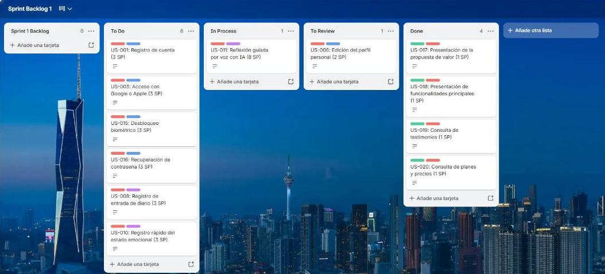

**URL del tablero:** [Sprint Backlog 1 en Trello](https://trello.com/b/UgUM8rrn/sprint-backlog-1).

#### 4.2.1.4. Development Evidence for Sprint Review

Durante el Sprint 1 se implementaron incrementos en los tres repositorios de código. Los cambios se integran en `develop` mediante ramas `feature/*` (GitFlow) y los mensajes siguen Conventional Commits. La tabla resume los commits más representativos.

| Repositorio | Rama | Commit | Mensaje | Fecha | Relación con User Story |
|---|---|---|---|---|---|
| SafeDiary_Landing_Page | feature | [`7a1779f`](https://github.com/MindClusterUPC/SafeDiary_Landing_Page/commit/7a1779f) | feat(pages): add accessible landing page and terms & conditions views | 2026-10-04 | US-017, US-018 |
| SafeDiary_Landing_Page | feature | [`fdd6311`](https://github.com/MindClusterUPC/SafeDiary_Landing_Page/commit/fdd6311) | feat(i18n-js): add reactive i18n engine and interactive UI modules | 2026-10-04 | US-017, US-018 |
| SafeDiary_Landing_Page | feature/pricing | [`3eeb6f7`](https://github.com/MindClusterUPC/SafeDiary_Landing_Page/commit/3eeb6f7) | feat: add pricing plans section | 2026-10-07 | US-020 |
| SafeDiary_Landing_Page | main | [`a5cdb7e`](https://github.com/MindClusterUPC/SafeDiary_Landing_Page/commit/a5cdb7e) | feat: refresh landing and interactive screen carousel | 2026-10-08 | US-018, US-019 |
| safediary-platform | feature | [`24b01e5`](https://github.com/MindClusterUPC/safediary-platform/commit/24b01e5) | feat(assistantai): support regenerating the last assistant reply | 2026-10-04 | US-011 |
| safediary-platform | feature | [`1c89084`](https://github.com/MindClusterUPC/safediary-platform/commit/1c89084) | build: add dockerfile and render blueprint for deployment | 2026-10-04 | Despliegue |
| safediary-platform | feature/Profile | [`0e63f5f`](https://github.com/MindClusterUPC/safediary-platform/commit/0e63f5f) | Merge branch 'feature/Profile' into develop | 2026-10-08 | US-006 |
| safediary-platform | feature/clinician-directory | [`df1a0d8`](https://github.com/MindClusterUPC/safediary-platform/commit/df1a0d8) | feat(cliniciandirectory): expose rest endpoints and development iam integration | 2026-10-09 | Directorio de psicólogos |
| safediary-platform | feature/rutines | [`b8789ae`](https://github.com/MindClusterUPC/safediary-platform/commit/b8789ae) | Rutines interface layer implementation | 2026-10-09 | Rutinas |
| safediary-platform | feature/payments | [`31337c1`](https://github.com/MindClusterUPC/safediary-platform/commit/31337c1) | feat(payments): expose REST controllers, ACL facade, and add automated tests | 2026-10-09 | US-020 (planes) |
| safediary-platform | feature/care-scheduling | [`0f6fe75`](https://github.com/MindClusterUPC/safediary-platform/commit/0f6fe75) | feat(care-scheduling): expose REST controllers and development payment simulation | 2026-10-09 | Citas |
| SafeDiary-Android | feature | [`8ea54d4`](https://github.com/MindClusterUPC/SafeDiary-Android/commit/8ea54d4) | feat(assistantai): persist personality and include in prompt request | 2026-10-04 | US-011 |
| SafeDiary-Android | feature | [`5d03796`](https://github.com/MindClusterUPC/SafeDiary-Android/commit/5d03796) | feat(assistantai): show crisis support card with local hotlines in the chat | 2026-10-04 | US-011 |
| SafeDiary-Android | feature | [`800ef71`](https://github.com/MindClusterUPC/SafeDiary-Android/commit/800ef71) | feat: match chat, drawer and navigation to the design | 2026-10-06 | US-011 |
| SafeDiary-Android | feature | [`13f92e6`](https://github.com/MindClusterUPC/SafeDiary-Android/commit/13f92e6) | feat: add offline cache and swipe navigation | 2026-10-06 | US-011 |

**Incrementos logrados:**

- **Landing Page:** hero, funcionalidades, carrusel de pantallas de la app, testimonios, planes (Básico, Terra y Astrum), preguntas frecuentes, equipo y Términos y Condiciones, en español e inglés.
- **Backend:** AssistantAI (chat con Diarito, historial, edición y regeneración de mensajes, evaluación de riesgo y recursos de crisis), Profiles, Rutines, Clinician Directory, Care Scheduling y Payments, desplegados en Render con la versión v0.2.0.
- **Aplicación móvil:** chat con Diarito conectado al backend, personalidades, historial lateral, tarjeta de crisis con la Línea 113, caché offline y navegación por deslizamiento.

#### 4.2.1.5. Testing Suite Evidence for Sprint Review

La suite de pruebas del Sprint 1 combina tres niveles. Las pruebas unitarias usan **JUnit 5** y **Mockito** (repositorios y servicios externos simulados), las de integración levantan el contexto de Spring Boot con **MockMvc** sobre una base H2 en memoria, y las de aceptación se escriben en Gherkin con **Karate**, que llama a la API real en un puerto aleatorio. **JaCoCo** mide la cobertura y un **Jenkinsfile** ejecuta todo en integración continua.

**Resultado de la ejecución (`./mvnw clean verify`, rama `develop`):** 121 pruebas en el backend, 0 fallos, 0 errores; cobertura de líneas de 58,9 %. En la aplicación móvil (`./gradlew testDebugUnitTest`): 19 pruebas, 0 fallos.

| Tipo de prueba | User Story / contexto | Caso / clase | Resultado | Ruta |
|---|---|---|---|---|
| Unit (Mockito) | US-006 · Profiles | `ProfileCommandServiceImplTest` (7), `ProfileQueryServiceImplTest` (6) | 13 passed | [profiles](https://github.com/MindClusterUPC/safediary-platform/tree/develop/src/test/java/com/mindcluster/safediary/profiles) |
| Unit (Mockito) | Rutines | `RoutineCommandServiceImplTest` (7), `RoutineQueryServiceImplTest` (6) | 13 passed | [rutines](https://github.com/MindClusterUPC/safediary-platform/tree/develop/src/test/java/com/mindcluster/safediary/rutines) |
| Unit (Mockito) | US-011 · AssistantAI | `ConversationCommandServiceImplTest` (6), `ConversationQueryServiceImplTest` (5) | 11 passed | [assistantai](https://github.com/MindClusterUPC/safediary-platform/tree/develop/src/test/java/com/mindcluster/safediary/assistantai/application) |
| Unit (dominio) | US-011 · AssistantAI | `ConversationSessionTest`, `RiskPolicyServiceTest`, `RiskAssessmentTest`, `EmotionClassifierServiceTest`, `CognitiveDistortionServiceTest`, `ClinicalSummaryTest`, `ClinicalSummarySynthesizerServiceTest`, assembler | 37 passed | [assistantai/domain](https://github.com/MindClusterUPC/safediary-platform/tree/develop/src/test/java/com/mindcluster/safediary/assistantai/domain) |
| Unit (dominio) | Care Scheduling · Payments | `AppointmentTest`, `BookableSlotCalculatorTest`, `SubscriptionTest`, `SubscriptionCommandServiceTest` | 20 passed | [carescheduling](https://github.com/MindClusterUPC/safediary-platform/tree/develop/src/test/java/com/mindcluster/safediary/carescheduling), [payments](https://github.com/MindClusterUPC/safediary-platform/tree/develop/src/test/java/com/mindcluster/safediary/payments) |
| Integration | Clinician Directory | `DirectoryApiIntegrationTest`, `DevelopmentIamRoleClientTest` | 15 passed | [cliniciandirectory](https://github.com/MindClusterUPC/safediary-platform/tree/develop/src/test/java/com/mindcluster/safediary/cliniciandirectory) |
| Integration | Care Scheduling | `CareSchedulingApiIntegrationTest` | 4 passed | [carescheduling](https://github.com/MindClusterUPC/safediary-platform/tree/develop/src/test/java/com/mindcluster/safediary/carescheduling) |
| Acceptance / BDD (Karate) | US-006 · Profiles | `patients.feature`: registrar paciente, consultar por id y actualizar contacto de emergencia; id inexistente | 2 passed | [patients.feature](https://github.com/MindClusterUPC/safediary-platform/tree/develop/src/test/resources/karate/profiles/patients.feature) |
| Acceptance / BDD (Karate) | Rutines | `daily-routines.feature`: crear, listar por paciente y activar o desactivar; payload inválido | 2 passed | [daily-routines.feature](https://github.com/MindClusterUPC/safediary-platform/tree/develop/src/test/resources/karate/rutines/daily-routines.feature) |
| Acceptance / BDD (Karate) | US-011 · seguridad | `crisis-resources.feature`: líneas de ayuda con la Línea 113 | 1 passed | [crisis-resources.feature](https://github.com/MindClusterUPC/safediary-platform/tree/develop/src/test/resources/karate/assistantai/crisis-resources.feature) |
| Acceptance / BDD (Karate) | Clinician Directory | `clinicians.feature`: búsqueda y psicólogo inexistente | 2 passed | [clinicians.feature](https://github.com/MindClusterUPC/safediary-platform/tree/develop/src/test/resources/karate/cliniciandirectory/clinicians.feature) |
| Unit (móvil) | US-011 · Diarito | `AiConversationAggregateTest` (10), `DiaritoPersonalityTest` (5), `OfflineChatTest` (3) | 18 passed | [app/src/test](https://github.com/MindClusterUPC/SafeDiary-Android/tree/develop/app/src/test) |

**Pipeline de integración continua:** el `Jenkinsfile` del backend define las etapas *Compile*, *Unit Tests* (excluye los runners de Karate), *Acceptance Tests* (Karate), *Coverage* (reporte y umbral de JaCoCo) y *Package*. Publica los reportes de Surefire, el sitio de JaCoCo y el reporte HTML de Karate.

**Criterios de prueba y datos utilizados:** se usan datos ficticios (nombres, correos `@example.com` y teléfonos de prueba) en una base H2 en memoria que se crea en cada ejecución; el proveedor de IA se reemplaza por un doble de prueba, por lo que ninguna prueba llama a servicios externos ni usa datos personales reales. Las historias US-001, US-003, US-015 y US-016 (IAM) y US-008 y US-010 (Diary) aún no tienen endpoints en el backend; sus escenarios de aceptación son los criterios en Gherkin del capítulo 2 y se automatizarán cuando esos contextos se implementen.

#### 4.2.1.6. Execution Evidence for Sprint Review

En el Sprint 1 la aplicación móvil alcanzó el flujo principal del asistente Diarito conectado al backend desplegado en Render. El usuario puede iniciar una conversación desde sugerencias o texto libre, recibir una reflexión no clínica, copiar, editar o regenerar mensajes, consultar y renombrar su historial, elegir la personalidad de Diarito y acceder a la Línea 113 desde la configuración. Las conversaciones se guardan en caché local (Room) para consultarlas sin conexión. Las pestañas Rutines, Home, Psychologist y Scheduling ya forman parte de la navegación inferior, pero sus pantallas se implementarán en los siguientes sprints junto con IAM y Diary.

| Funcionalidad demostrada | Dispositivo / entorno | Resultado | Evidencia |
|---|---|---|---|
| Inicio de Diarito con sugerencias y navegación inferior | Emulador Pixel 10 Pro, Android 17 · APK release 1.0 | Correcto | Captura 1 |
| Conversación con Diarito: respuesta del backend en Render con acciones de copiar, editar y regenerar | Emulador Pixel 10 Pro, Android 17 · APK release 1.0 | Correcto | Captura 2 |
| Historial de conversaciones sincronizado con el backend, con búsqueda y opciones de renombrar y eliminar | Emulador Pixel 10 Pro, Android 17 · APK release 1.0 | Correcto | Captura 3 |
| Configuración: personalidades Sol, Luma, Kai y Nara, idioma y botón de la Línea 113 | Emulador Pixel 10 Pro, Android 17 · APK release 1.0 | Correcto | Captura 4 |

<table>
<tr>
<td align="center">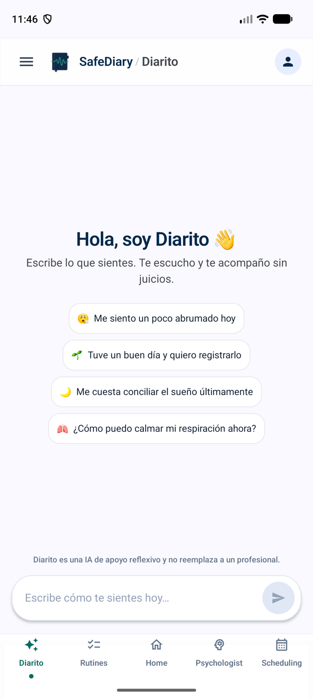<br>Captura 1. Inicio de Diarito</td>
<td align="center">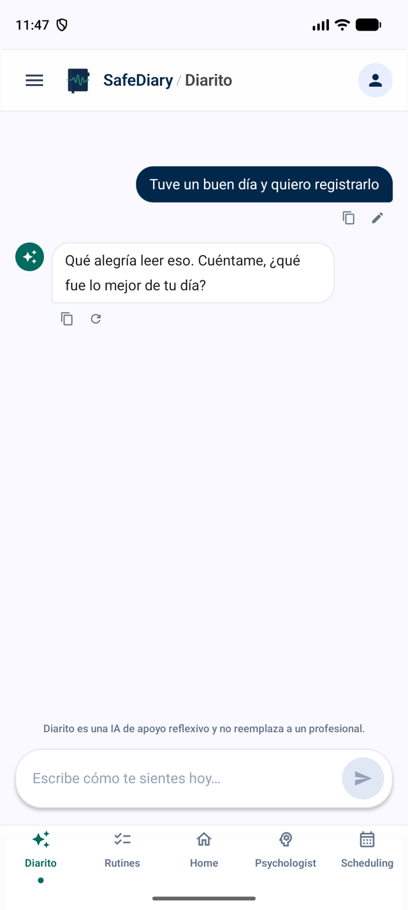<br>Captura 2. Respuesta de Diarito</td>
<td align="center">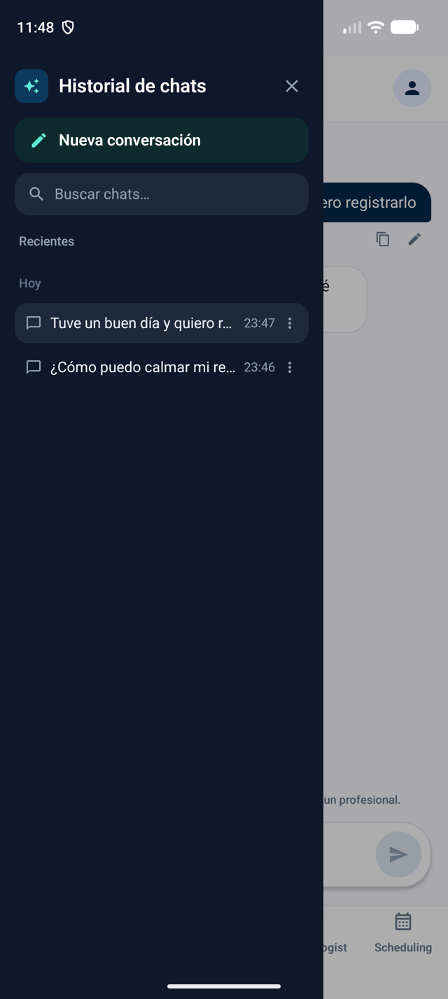<br>Captura 3. Historial</td>
<td align="center">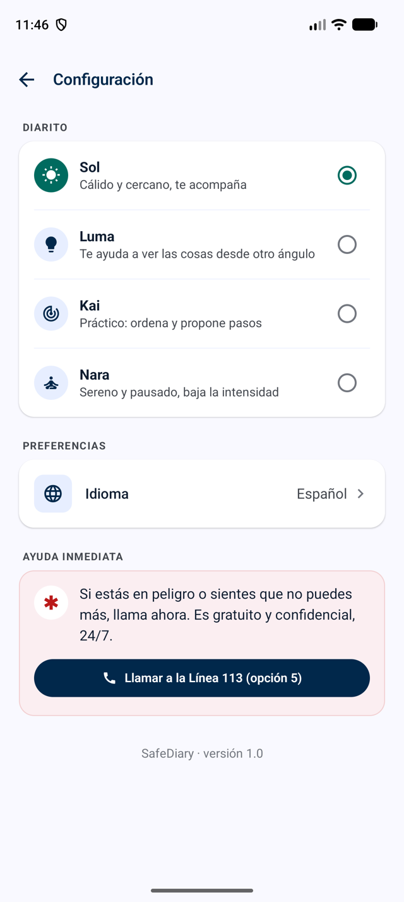<br>Captura 4. Configuración</td>
</tr>
</table>

#### 4.2.1.7. Services Documentation Evidence for Sprint Review

Los servicios del backend se documentan con OpenAPI (springdoc). La documentación interactiva está publicada en [Swagger UI](https://safediary-platform.onrender.com/swagger-ui/index.html) y cada bounded context describe sus endpoints en la carpeta `docs/` del repositorio [safediary-platform](https://github.com/MindClusterUPC/safediary-platform).

| Servicio | Método | Ruta | Parámetros | Response esperado | Estado |
|---|---|---|---|---|---|
| Assistant Chat | POST | `/api/v1/assistant/chat` | body: mensaje, `conversationId` opcional, idioma y personalidad | 200: respuesta de Diarito, nivel de riesgo y recursos de crisis | Desplegado |
| Assistant Chat | GET | `/api/v1/assistant/conversations` | — | 200: conversaciones de la cuenta, más recientes primero | Desplegado |
| Assistant Chat | GET / PATCH / DELETE | `/api/v1/assistant/conversations/{conversationId}` | path: `conversationId`; body PATCH: título | 200: conversación con mensajes / renombrada / eliminada | Desplegado |
| Assistant Chat | PUT | `/api/v1/assistant/conversations/{conversationId}/messages/{messageId}` | body: nuevo contenido | 200: mensaje editado y diálogo regenerado | Desplegado |
| Assistant Chat | POST | `/api/v1/assistant/conversations/{conversationId}/regenerate` | path: `conversationId` | 200: nueva respuesta de Diarito | Desplegado |
| Conversation Sessions | POST / GET | `/api/v1/conversation-sessions`, `/active`, `/{sessionId}` | cuenta y `sessionId` | 200: sesión de conversación | Desplegado |
| Crisis Alerts | GET | `/api/v1/crisis-resources` | — | 200: líneas de ayuda (Línea 113, SAMU 106) | Desplegado |
| Clinical Summaries | POST / GET | `/api/v1/clinical-summaries` | cuenta y semana | 200: resumen emocional semanal | Desplegado |
| Profiles | POST / GET | `/api/v1/patients`, `/api/v1/patients/{id}` | body: datos del paciente | 201 / 200: perfil del paciente | Desplegado |
| Profiles | PUT | `/api/v1/patients/{id}/emergency-contact` | body: contacto de apoyo | 200: contacto actualizado | Desplegado |
| Rutines | POST / GET / PUT / PATCH | `/api/v1/daily-routines`, `/patient/{patientId}`, `/{id}/toggle-active` | body: rutina y recordatorio | 201 / 200: rutina | Desplegado |
| Clinician Directory | GET | `/api/v1/clinicians/{id}`, `/{id}/reviews`, `/{id}/rating` | path: `id` | 200: ficha, reseñas y calificación | Desplegado |
| Care Scheduling | GET / POST | `/api/v1/schedule/clinicians/{clinicianId}/slots`, `/proposals`, `/proposals/{appointmentId}/acceptance` | horario propuesto | 200: horarios libres / reserva temporal | Desplegado |
| Payments | POST / GET | `/api/v1/payments/subscriptions/checkout`, `/current`, `/cancel` | body: plan (Terra o Astrum) | 200: sesión de pago y suscripción vigente | Desplegado |

**Interacción con la documentación desplegada (datos de muestra):**

Las siguientes capturas muestran la ejecución de endpoints desde Swagger UI sobre el backend en Render (v0.2.1), usando datos ficticios.

1. **`GET /api/v1/crisis-resources`:** sin parámetros. Responde `200` con las líneas de ayuda que la app muestra ante un riesgo alto: Línea 113 (opción 5) y SAMU 106.

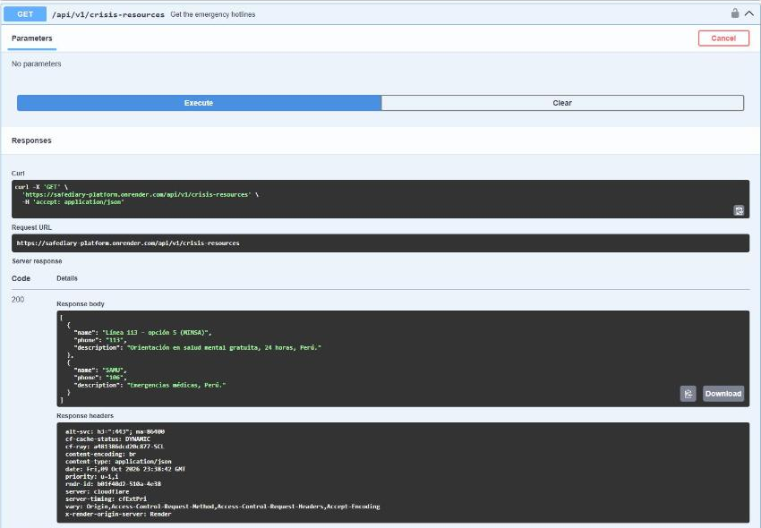

2. **`POST /api/v1/daily-routines`:** el body indica el paciente, el título de la rutina, los días de la semana y si se activan los recordatorios. Responde `201` con la rutina creada, su id y el estado de notificación `ENABLED`.

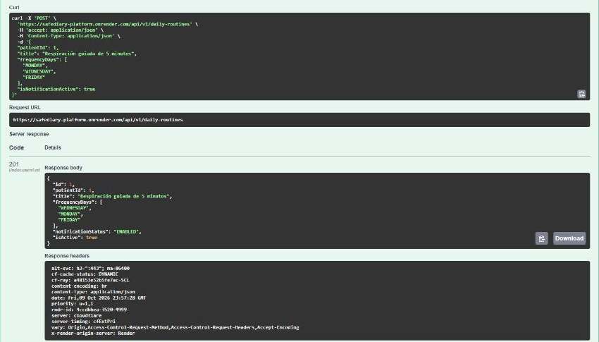

3. **`GET /api/v1/patients/{id}`:** con el parámetro de ruta `id = 1`. Responde `200` con el perfil del paciente y su contacto de apoyo.

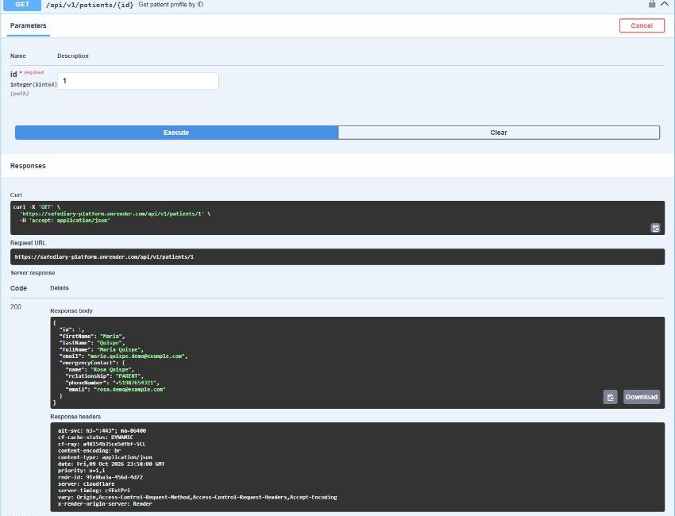

#### 4.2.1.8. Software Deployment Evidence for Sprint Review

La configuración de cada despliegue se describe en la sección 4.1.4. La Landing Page se publica en GitHub Pages desde `main`; el backend se despliega en Render como servicio Docker desde `main`. La versión v0.1.0 (5 de octubre) publicó AssistantAI y la versión v0.2.0 (9 de octubre) integró Profiles, Rutines, Clinician Directory, Care Scheduling y Payments, de modo que los endpoints del sprint están disponibles en Swagger. La versión v0.2.1 corrigió la creación de los schemas de cada contexto en PostgreSQL; la aplicación móvil se prueba como APK en emuladores y dispositivos Android apuntando al backend de Render.

| Producto | Plataforma | URL / versión | Fecha | Evidencia |
|---|---|---|---|---|
| Landing Page | GitHub Pages | [https://mindclusterupc.github.io/SafeDiary_Landing_Page/](https://mindclusterupc.github.io/SafeDiary_Landing_Page/index.html) | 2026-10-08 | 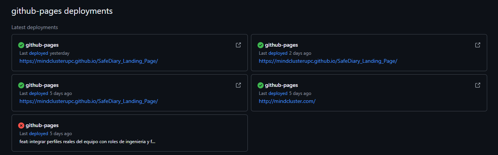 |
| Backend | Render (Docker) | [Swagger UI](https://safediary-platform.onrender.com/swagger-ui/index.html) · v0.2.0 | 2026-10-09 | 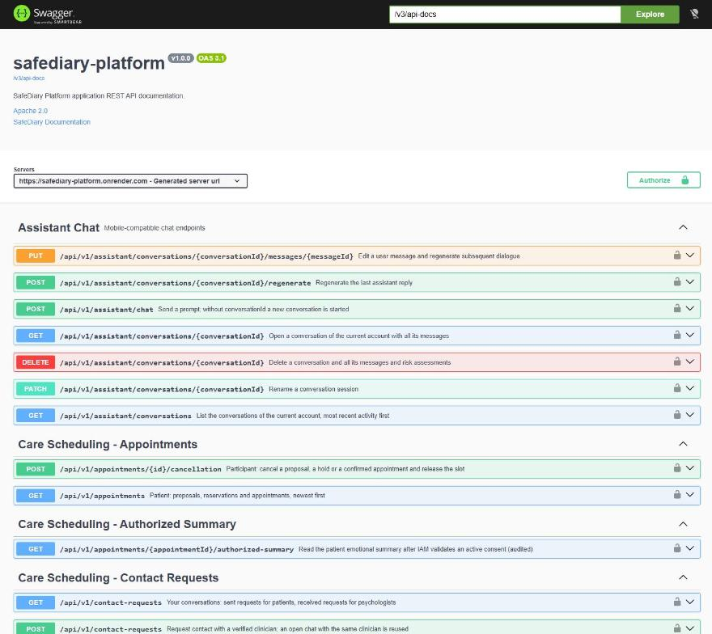 |
| Mobile | Emulador y dispositivo Android | APK release 1.0 | 2026-10-06 | Build firmado apuntando a Render |

**Despliegue del backend en Render:** el servicio `safediary-platform` (Docker, rama `main`) está en estado *Live* con el commit `da151c7`, correspondiente al merge de la versión v0.2.0.

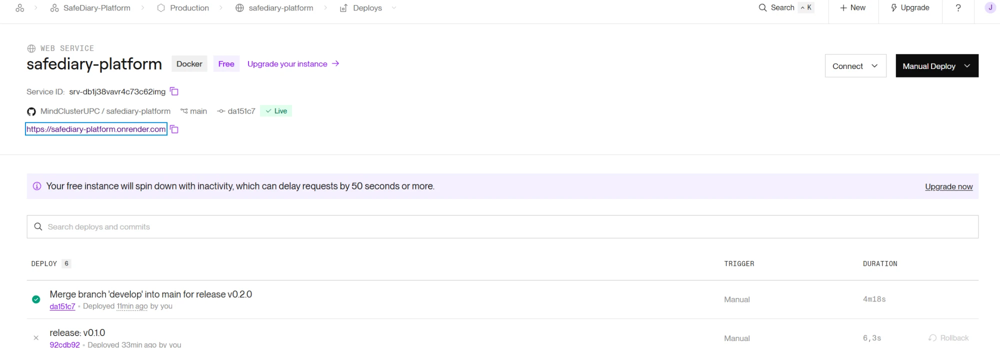

#### 4.2.1.9. Team Collaboration Insights during Sprint

Durante el desarrollo del Sprint 1, el equipo implementó una dinámica de trabajo colaborativa, transparente y continua a través de los repositorios que conforman la solución en la organización de GitHub. La asignación y avance de actividades se gestionó de forma sincronizada mediante el tablero del sprint, manteniendo una correspondencia directa entre los ítems priorizados y los incrementos de software desarrollados para la Landing Page, la aplicación móvil y la plataforma de servicios backend.

Para asegurar la calidad y estabilidad de la base de código, se adoptó el flujo de trabajo GitFlow, organizando el desarrollo en ramas por funcionalidad (*feature branches*). Cada componente o bounded context fue abordado de forma modular, permitiendo el avance simultáneo de los diferentes módulos del sistema sin generar bloqueos mutuos. La integración hacia las ramas compartidas se realizó mediante *Pull Requests* y revisiones entre pares (*code reviews*), verificando la consistencia arquitectural, el cumplimiento de pruebas automatizadas y el seguimiento de estándares de codificación y *Conventional Commits*.

##### Resumen de Actividad y Flujo de Integración (Pulse)

El seguimiento de actividad refleja un ciclo de desarrollo activo y coordinado a lo largo del periodo del sprint. La gestión de ramas y solicitudes de extracción permitió incorporar los cambios validados de manera progresiva, asegurando que las entregas funcionales y configuraciones de despliegue se consolidaran de forma continua y ordenada.

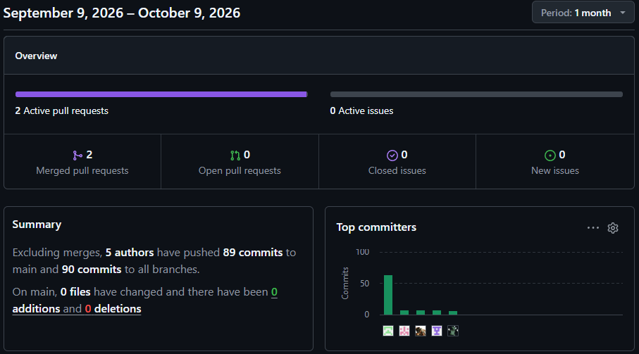

##### Distribución de Contribuciones en el Repositorio (Contributions)

Las métricas de contribución evidencian una participación distribuida y complementaria a lo largo del sprint, con aportes continuos enfocados en la implementación de nuevas funcionalidades, la refactorización arquitectural y la estabilización de los componentes previo al cierre del ciclo. Las curvas de adición y ajuste de código reflejan el esfuerzo conjunto en la construcción de los servicios de backend, las interfaces de usuario y la documentación técnica, garantizando una propiedad colectiva del código y el cumplimiento integral de los objetivos del sprint.

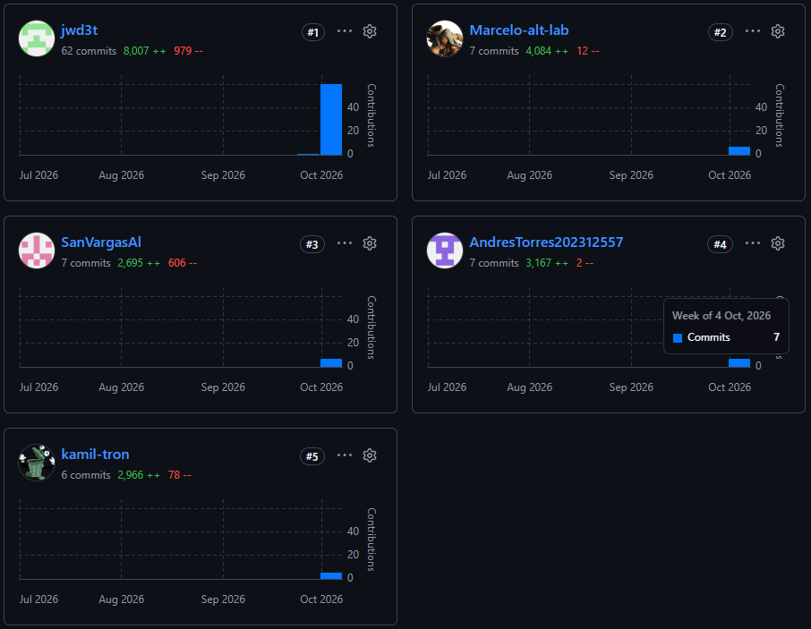


---
