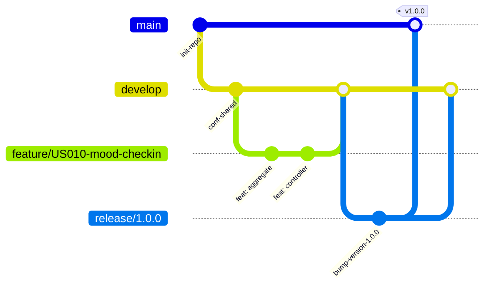

# Capítulo IV: Product Implementation & Validation

---

## 4.1. Software Configuration Management

Para garantizar un proceso de ingeniería de software estructurado, colaborativo y sin fricciones durante el desarrollo del ecosistema **SafeDiary**, el equipo **MindCluster** ha definido la estrategia de Gestión de Configuración del Software (SCM). Este marco establece la homologación del entorno de desarrollo, la administración distribuida del código fuente bajo el flujo de trabajo GitFlow, las guías de estilo para asegurar la mantenibilidad del código base y la configuración de los despliegues en entornos de producción en la nube.

---

### 4.1.1. Software Development Environment Configuration

Con la finalidad de optimizar la productividad y garantizar la compatibilidad entre todos los miembros del equipo a lo largo del ciclo de vida del proyecto, se seleccionaron herramientas especializadas de nivel industrial. La elección responde a criterios de compatibilidad multiplataforma, soporte a estándares abiertos y alineación con metodologías ágiles (Scrum/Kanban).

| Categoría | Herramienta | Versión / Plataforma | Propósito en el Proyecto | Enlace Oficial / Acceso |
| :--- | :--- | :--- | :--- | :--- |
| **Project Management** | Trello | Web / Cloud | Gestión y seguimiento del Product Backlog y Sprint Backlog mediante tablero Kanban (`To Do`, `In Process`, `To Review`, `Done`). | [Trello Backlog](https://trello.com/b/Q2UsNz3t/product-backlog) |
| **Requirements & Needfinding** | UXPressia / Miro | Web / Cloud | Construcción y documentación colaborativa de User Personas, Empathy Maps, Journey Maps y EventStorming de Dominio. | [Miro Platform](https://miro.com/) |
| **UX/UI Design & Prototyping** | Figma | Cloud Desktop v124+ | Diseño del Design System, Style Guidelines, Wireframes, Wireflows y Prototipo Interactivo de Alta Fidelidad para Mobile y Landing Page. | [Figma SafeDiary](https://figma.com) |
| **Architecture Modeling** | Structurizr / Mermaid | Web DSL / Markdown | Modelado de diagramas de arquitectura C4 (Context, Container, Component, Deployment) y diagramas ER de persistencia relacional. | [Structurizr](https://structurizr.com/) |
| **Mobile Development** | Android Studio / VS Code | Iguana / Hedgehog | Entorno de desarrollo para la aplicación móvil cliente en Flutter/Dart y Android nativo, emuladores y profiling. | [Android Studio](https://developer.android.com/studio) |
| **Backend Development** | IntelliJ IDEA Ultimate | 2024.1+ / Community | Desarrollo del backend RESTful API en Java 21 con Spring Boot 4.x / 3.x, Maven y soporte para arquitectura Domain-Driven Design (DDD). | [JetBrains IntelliJ](https://www.jetbrains.com/idea/) |
| **Database Engine & GUI** | PostgreSQL 15 & pgAdmin 4 | v15.4+ / Cloud | Motor de base de datos relacional para persistencia de cuentas, registros de humor, entradas íntimas y catalogo de rutinas. | [PostgreSQL](https://www.postgresql.org/) |
| **API Testing & Verification** | Postman / Bruno | Desktop v11+ | Diseño de colecciones de pruebas automatizadas, validación de contratos JSON, endpoints REST y autenticación por tokens JWT. | [Postman](https://www.postman.com/) |
| **Version Control & Collaboration** | GitHub | Git v2.50+ | Alojamiento distribuido del código fuente, revisiones por pares (Peer Code Reviews), Pull Requests y seguimiento de incidencias. | [GitHub MindCluster](https://github.com/MindClusterUPC) |
| **Docs-as-Code** | Markdown & Pandoc | GFM / Pandoc 3+ | Redacción y versionado del informe técnico del proyecto bajo filosofía Docs-as-Code con exportación automatizada a PDF. | [SafeDiary_Doc Repo](https://github.com/MindClusterUPC/SafeDiary_Doc) |

---

### 4.1.2. Source Code Management

El código fuente de SafeDiary se encuentra descentralizado y organizado en **cuatro repositorios independientes** dentro de la organización oficial de GitHub del equipo, permitiendo el desacoplamiento de despliegues y la asignación eficiente de responsabilidades:

<div align="center">

| Producto Digital | Repositorio Oficial en GitHub | Tecnología y Propósito |
| :--- | :--- | :--- |
| **Documentación del Proyecto** | [MindClusterUPC/SafeDiary_Doc](https://github.com/MindClusterUPC/SafeDiary_Doc) | Docs-as-Code (Markdown / Pandoc). Alberga el informe técnico del proyecto, actas y evidencias. |
| **Landing Page Web App** | [MindClusterUPC/safediary-landing-page](https://github.com/MindClusterUPC/safediary-landing-page) | HTML5, CSS3, JavaScript y Tailwind CSS. Sitio web público orientado a la adquisición y presentación de valor. |
| **Backend RESTful API** | [MindClusterUPC/safediary-platform](https://github.com/MindClusterUPC/safediary-platform) | Java 21, Spring Boot y PostgreSQL. API de microservicios modulares DDD para lógica de negocio y persistencia. |
| **Mobile Client Application** | [MindClusterUPC/safediary-mobile](https://github.com/MindClusterUPC/safediary-mobile) | Flutter / Dart con Material Design 3. Aplicación móvil multiplataforma para pacientes y especialistas. |

</div>

#### Modelo de Ramificación: GitFlow Workflow

Para coordinar el trabajo paralelo y garantizar la estabilidad continua del código en producción, el equipo implementa el flujo **GitFlow**:



- **`main`**: Rama protegida que contiene únicamente código estable, auditado y listo para producción. Cada merge en `main` se asocia a un tag de versión oficial.
- **`develop`**: Rama base para el desarrollo diario e integración continua. Todas las nuevas funcionalidades convergen aquí mediante Pull Requests validados por el equipo.
- **`feature/<id-historia>-<nombre-descriptivo>`**: Ramas temporales creadas a partir de `develop` para implementar una historia de usuario o historia técnica específica (ej. `feature/US010-mood-checkin`, `feature/US001-account-registration`).
- **`release/<major.minor.patch>`**: Ramas de estabilización previas a una entrega oficial para ajustar detalles de configuración, documentación y pruebas finales.
- **`hotfix/<descripcion-parche>`**: Ramas de corrección urgente derivadas directamente de `main` para resolver bugs críticos detectados en producción.

#### Versionado Semántico (Semantic Versioning 2.0.0)

Se adopta el estándar `MAJOR.MINOR.PATCH` para etiquetar los lanzamientos del producto:
- **MAJOR (`X.0.0`):** Cambios que rompen la compatibilidad hacia atrás en APIs o contratos de datos.
- **MINOR (`0.X.0`):** Nuevas funcionalidades completas asociadas al cierre de un Sprint o la inclusión de un Bounded Context.
- **PATCH (`0.0.X`):** Correcciones menores de errores, refactorizaciones internas o ajustes de documentación.

#### Estándar de Mensajes de Commit (Conventional Commits 1.0.0)

Los commits deben redactarse obligatoriamente siguiendo la convención:
```text
<tipo>(<alcance opcional>): <descripción concisa en imperativo y minúsculas>

[cuerpo explicativo opcional sobre el motivo de la modificación]

[referencia a historia de usuario: Closes US-010]
```

Tipos admitidos:
- **`feat`**: Incorporación de una nueva funcionalidad técnica o de usuario.
- **`fix`**: Corrección de un defecto o fallo detectado.
- **`docs`**: Modificaciones exclusivas a la documentación o archivos Markdown.
- **`style`**: Ajustes de formato, espaciado o indentación sin alteración en la lógica.
- **`refactor`**: Reestructuración interna de código que no añade funcionalidades ni repara errores.
- **`test`**: Incorporación o ajuste de pruebas unitarias o de integración.
- **`chore`**: Tareas de mantenimiento, actualización de dependencias (`pom.xml`) o ajustes en el build.

---

### 4.1.3. Source Code Style Guide & Conventions

Para garantizar que el código fuente sea homogéneo, legible y fácil de mantener entre todos los integrantes, se establecieron lineamientos formales basados en las guías más reconocidas de la industria:

#### Referencias Oficiales de Estilo
- **Java:** [Google Java Style Guide](https://google.github.io/styleguide/javaguide.html) y [Spring Framework Architecture Best Practices](https://docs.spring.io/spring-boot/docs/current/reference/htmlsingle/).
- **Dart / Flutter:** [Effective Dart: Style Guide](https://dart.dev/guides/language/effective-dart/style) y lineamientos de [Material Design 3 (M3)](https://m3.material.io/).
- **Web / Frontend:** [Google HTML/CSS Style Guide](https://google.github.io/styleguide/htmlcssguide.html) y [Airbnb JavaScript Style Guide](https://github.com/airbnb/javascript).

#### Estructura de Código DDD (Domain-Driven Design) en Backend
En `safediary-platform`, el código fuente se divide modularmente por Bounded Contexts (`iam`, `profiles`, `diary`, `rutines`, etc.) con una separación estricta en 4 capas hexagonales:
- **`domain`**: Entidades, agregados, Value Objects y contratos de repositorios sin dependencias de infraestructura ni frameworks.
- **`application`**: Casos de uso divididos bajo el patrón CQRS (`internal/commandservices`, `internal/queryservices`).
- **`infrastructure`**: Adaptadores técnicos de persistencia JPA, configuración de OpenAPI/Swagger, hashing de contraseñas y manejadores de eventos.
- **`interfaces.rest`**: Controladores REST (`@RestController`), recursos/DTOs de transferencia y clases `Assembler` para transformación de modelos.

#### Convenciones de Nomenclatura

| Elemento Técnico | Convención | Ejemplo en SafeDiary |
| :--- | :--- | :--- |
| **Clases Java** | PascalCase | `MoodCheckIn`, `DiaryEntriesController` |
| **Métodos y Atributos Java** | camelCase | `calculateStreakDays()`, `patientId` |
| **Constantes Java** | UPPER_SNAKE_CASE | `MAX_CHECKIN_COMMENT_LENGTH` |
| **Paquetes Java** | minúsculas continuas | `com.mindcluster.safediary.diary` |
| **Clases y Widgets Dart** | PascalCase | `MoodCheckInScreen`, `EmotionCard` |
| **Archivos y Directorios Dart** | snake_case | `mood_check_in_screen.dart` |
| **Tablas PostgreSQL** | snake_case pluralizado | `mood_check_ins`, `diary_entries`, `user_accounts` |
| **Columnas PostgreSQL** | snake_case | `created_at`, `sentiment_score` |
| **Endpoints RESTful** | kebab-case pluralizado | `/api/v1/mood-check-ins`, `/api/v1/diary-entries` |

#### Lineamientos por Lenguaje
- **Java (Spring Boot):**
  - Inyección de dependencias exclusivamente por constructor (evitando `@Autowired` en atributos).
  - Reducción de código repetitivo mediante Lombok (`@Getter`, `@Setter`, `@Builder`, `@NoArgsConstructor`).
  - Validación declarativa de datos de entrada en DTOs con Bean Validation (`@NotNull`, `@NotBlank`, `@Size`).
  - Documentación de clases públicas y controladores mediante anotaciones Swagger (`@Tag`, `@Operation`).
- **Dart (Flutter):**
  - Tipado estricto en todas las variables, evitando el uso indiscriminado de `dynamic`.
  - Construcción de widgets modulares y reutilizables con longitud máxima recomendada de 100 líneas por build method.
  - Implementación de componentes nativos de Material 3 (`ColorScheme`, `Card`, `FilledButton`, `NavigationRail`).
- **HTML / CSS (Landing Page):**
  - Maquetación 100% semántica utilizando etiquetas HTML5 (`<header>`, `<nav>`, `<main>`, `<section>`, `<footer>`).
  - Enfoque *Mobile-First* en CSS con diseño responsive garantizado para pantallas móviles, tablets y monitores desktop.

---

### 4.1.4. Software Deployment Configuration

El proceso de despliegue asegura que cada pieza del sistema esté disponible en entornos cloud con alta disponibilidad, seguridad TLS/SSL y monitoreo constante:

#### 1. Despliegue de la Landing Page (`safediary-landing-page`)
- **Plataforma de Hosting:** Vercel / GitHub Pages.
- **Pipeline de Despliegue:** Integración continua automática (CI/CD) vinculada al branch `main`. Cada pull request aprobado e integrado desencadena un nuevo build y publicación.
- **URL Pública:** `https://safediary-landing.vercel.app/`
- **Características:** Certificados SSL/TLS gestionados automáticamente, compresión gzip/brotli y distribución a través de CDN global.

#### 2. Despliegue del Backend RESTful API (`safediary-platform`)
- **Plataforma Cloud:** Render Cloud Platform / Railway PaaS.
- **Base de Datos:** Instancia gestionada de PostgreSQL 15 en la nube con pooling de conexiones HikariCP y soporte SSL.
- **Estrategia de Ejecución:**
  - Empaquetado en artefacto ejecutable `.jar` mediante Maven (`mvn clean package -DskipTests`).
  - El contenedor en la nube arranca el servicio mediante `java -jar app.jar` asignando dinámicamente el puerto expuesto por la variable `PORT`.
  - Gestión segura de credenciales sensibles (cadenas de conexión JDBC, usuario y contraseña de base de datos) a través de variables de entorno seguras en el panel cloud.
- **Documentación Interactiva Pública:** Interfaz Swagger UI activa en `/swagger-ui/index.html` para pruebas de endpoints por parte del equipo móvil y evaluadores.

#### 3. Despliegue de la Aplicación Móvil (`safediary-mobile`)
- **Empaquetado Release:** Compilación de binarios APK optimizados para arquitectura ARM64 (`flutter build apk --release --split-per-abi`).
- **Canal de Distribución:** Publicación del instalable APK en la sección **Releases** del repositorio oficial de GitHub de SafeDiary y distribución complementaria mediante Firebase App Distribution.
- **Integración con Backend:** Configuración del cliente HTTP móvil (`dio` / `http`) apuntando de forma segura mediante HTTPS al dominio público del backend desplegado en Render.

---
